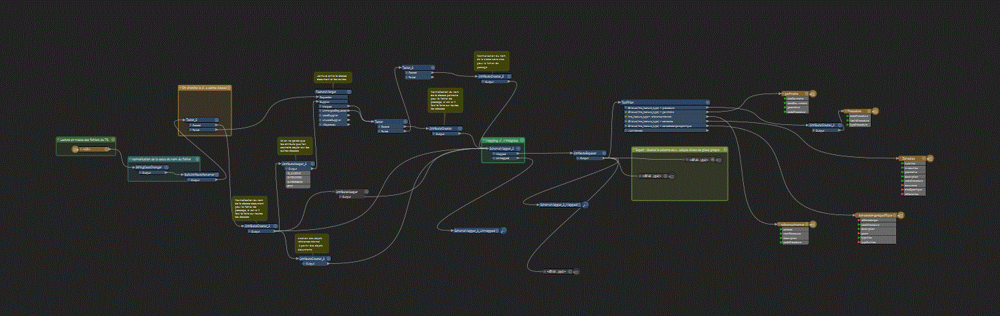

# Traduction PPR vers nouveaux standards

Ce dossier expose un workbench [FME](https://www.veremes.com/produits/fme/fme-desktop) ([demo_mapping.fmw](./demo_mapping.fmw)) permettant d'expérimenter le passage de jeux tests PPR vers les nouveaux standards. 

Le workbench prend en entrée :
* un jeu de donnée PPR conforme à l'ancien standard COVADIS ([PPRN du bassin de la Scie](./76DDTM20120001.zip))
* un fichier de règles de passages au format CSV ([mapping.csv](./mapping.csv))

Il génère en sortie un jeu de données selon le nouveau standard ([PPRN_result.gpkg](./PPRN_result.gpkg)) au format Geopackage (choix de format par défaut pour l'instant).

Ce workbench a été réalisé avec la version 2022.0.0.2 de FME. Il n'est pas garanti qu'il fonctionne avec les versions précédentes.

Ce script FME implémente les règles de passage détaillées ci-dessous pour chaque classe du nouveau standard : 

## Procedure

La classe "Procedure" permet de faire le lien entre un jeu de données du Standard et le système GASPAR. Un objet de cette classe correspond à une procédure unique identifiée dans GASPAR.

|Nom Attribut|Description|Exemple de valeur|Classe ancien PPRN| Attribut ancien PPRN|
|-|:-:|:-:|:-:|:-:|
|codeProcedure|Identifiant de la procédure dans GASPAR|44DDTM20110017|n_document_pprn_s_xxx|ID_GASPAR|
|libelleProcedure|Description de textuelle de la procédure (cf. Libellé procédure dans GASPAR)|PPRL-Baie Bourgneuf Nord|n_document_pprn_s_xxx|NOM|
|typeProcedure|Type de procédure (selon les modèles identifiés dans GASPAR)|PPRN-L|N/A|N/A|

## ReferenceInternet

La classe ReferenceInternet permet de décrire des ressources accessibles sur internet, qu'il sagisse d'une page html, d'une arborescence d'un site web ou de documents téléchargeables. Un objet de cette classe représente un telle ressource, caractérisée de manière unique par son adresse sur internet (URL).

|Nom Attribut|Description|Exemple de valeur|Classe ancien PPRN| Attribut ancien PPRN|
|-|:-:|:-:|:-:|:-:|
|codeProcedure|Lien vers la table procédure |44DDTM20110017|n_document_pprn_s_xxx|ID_GASPAR|
|adresse| Url d'accès à la ressource url|https://www.loire-atlantique.gouv.fr/Politiques-publiques/Risques-naturels-et-technologiques/Prevention-des-risques-naturels/Plans-Prevention-Risques-Naturels-Previsibles/Les-Plans-de-Prevention-des-Risques-Littoraux-en-Loire-Atlantique/Le-PPRL-Baie-de-Bourgneuf-Nord |n_document_pprn_x_xxx|site_web|
|nomRessource |Nom de la ressource|Le PPRL Baie de Bourgneuf Nord |N/A|N/A|
|description|Description de la ressource|Page web d'accès au dossier du PPRL sur le site de la préfecture de la Loire Atlantique|N/A|N/A|
|typeReference|Indique le type de document auquel on fait référence|Réglement signé | N/A|N/A|

## Perimetre

La classe Perimetre permet de décrire l'état d'avancement d'une procédure sur une zone géographique donnée. Pour une même procédure donnée à un instant donné, plusieurs périmètres peuvent exister dans des états d'avancement différents.

|Nom Attribut|Description|Exemple de valeur|Classe ancien PPRN| Attribut ancien PPRN|
|-|:-:|:-:|:-:|:-:|
|codeProcedure|Lien vers la table procédure |44DDTM20110017|n_document_pprn_s_xxx|ID_GASPAR|
|etatProcedure |Etat d'avancement de la procédure sur le périmètre|APPROUVE|n_document_pprn_s_xxx|"APPROUVE si etat= ""Approuvé"" (02); PRECRIT si etat=""Prescrit"" (01); ABROGE si etat =""Abrogé"" (03); ANTICIPE si etat = ""Anticipe"" (04)"|
|dateEtatPerimetre|Date|Date du début de l'état de la procédure sur le périmètre|13/07/2016|n_document_pprn_x_xxx|DateAppro (si Approuvé) ; DatePrescrit (si Prescrit)|
|geometrie|Geometry (MultiPolygon)|Géométrie du Périmètre|N/A|n_perimetre_pprn_xxxx_x_xxx|

## ZoneAlea

La classe Zone d'aléa permet de décrire des zones géographiques soumises à des aléas et d'en préciser le type d'aléa, son niveau, et sa probabilité d'occurence.

## ZoneAleaReference

La classe Zone d'aléa de référence permet de décrire des zones géographiques soumises à des aléas de type naturels déterminéés à partir de l'aléa de référence et d'en préciser le type d'aléa, son niveau, et sa probabilité d'occurence. Elle a les mêmes propriétés de que la classe ZoneAlea.

## ZoneAleaEcheance100ans

La classe Zone d'aléa à échéance 100 ans permet de décrire des zones géographiques soumises à des aléas de type naturels déterminéés à partir de l'aléa à échéance 100 ans et d'en préciser le type d'aléa, son niveau, et sa probabilité d'occurence. Elle a les mêmes propriétés de que la classe ZoneAlea.

|Nom Attribut|Description|Exemple de valeur|Classe ancien PPRN| Attribut ancien PPRN|
|-|:-:|:-:|:-:|:-:|
|idZoneAlea|Identifiant de la zone alea|RNATA000000000607190|n_zone_alea_pprn_x_xxx|id_zone|
|codeProcedure|Identifiant de la procédure dans GASPAR|44DDTM20110017|n_document_pprn_s_xxx|ID_GASPAR|
|typeAlea|Type de l'aléa selon la nomenclature GASPAR|112|n_zone_alea_pprn_x_xxx|coderisque|
|niveauAlea|Niveau d'aléa|01|n_zone_alea_pprn_x_xxx|nivalea_st|
|description|Description de l'aléa|N/A|n_zone_alea_pprn_x_xxx|descript|
|occurence|ce champ permet d'indiquer l'occurence de survenue de l'aléa. Selon son type, il pourra s'agir d'une probabilité (par exemple période de retour) ou d'un autre indicateur à définir dans les profils applicatifs.|Q100|N/A|N/A|
|geometrie|Multipolygone mais restreint à la géométrie la plus élémentaire de l'aléa|N/A|n_zone_alea_pprn_x_xxx|geom|

## ZoneProtegee

La classe Zone Protégée permet de décrire les zones protégées par un ouvrage de protection (OuvrageProtection) lorsque le niveau de protection de ce dernier est au moins égal à l'aléa de référence. Ces zones sont superposables aux zones d'aléas. Elles sont caractérisées par le type d'aléa (TypeAlea), un niveau de protection et une période de retour relatifs à l'ouvrage de protection.

|Nom Attribut|Description|Exemple de valeur|Classe ancien PPRN| Attribut ancien PPRN|
|-|:-:|:-:|:-:|:-:|
|idZoneProtegee|Identifiant de la zone alea protegee|N/A|N/A|N/A|
|codeProcedure|Identifiant de la procédure dans GASPAR|44DDTM20110017|n_document_pprn_s_xxx|ID_GASPAR|
|typeAlea|Type de l'aléa selon la nomenclature GASPAR|112|n_zone_alea_pprn_x_xxx|coderisque|
|occurence|ce champ permet d'indiquer l'occurence de survenue de l'aléa. Selon son type, il pourra s'agir d'une probabilité (par exemple période de retour) ou d'un autre indicateur à définir dans les profils applicatifs.|Q100|N/A|N/A|
|description|Description de l'aléa|N/A|n_zone_alea_pprn_x_xxx|descript|
|niveauProtection|Indique le niveau de protection en application des articles R214-119-1 et R 562-13 du code de l'environnement|N/A|N/A|N/A|
|geometrie|Multipolygone mais restreint à la géométrie la plus élémentaire de l'aléa|N/A|n_zone_alea_pprn_x_xxx|geom|

## ZoneDangerSpecifique

La classe Zone de danger spécifique permet de représenter des zones de danger particulières superposables aux zones d'aléas. Ces zones de danger particulières peuvent être de deux types : les bandes de précaution à l'arrière des systèmes d'endiguement et les bandes particulières liées aux chocs mécaniques des vagues et projection des matériaux telles que définies dans le Decret PPRI:2019 et le Guide PPRL:2014. Elles sont aussi caractérisées par le type d'aléa (TypeAlea) et son niveau (TypeNiveauAlea) et rattachées à une procédure donnée. Elles peuvent être aussi liées à un ouvrage de protection (OuvrageProtection), notamment lorsqu'il sagit d'une bande de protection.

|Nom Attribut|Description|Exemple de valeur|Classe ancien PPRN| Attribut ancien PPRN|
|-|:-:|:-:|:-:|:-:|
|idZoneDanger|Identifiant unique d'un objet zone de danger spécifique|N/A|N/A|N/A|
|codeProcedure|Identifiant de la procédure pour laquelle la zone de danger spécifique a été calculée. Ce champ permet de faire le lien avec l'objet correspondant de la classe Procedure|44DDTM20110017|n_document_pprn_s_xxx|ID_GASPAR|
|typeAlea|Type de l'alea associé à la zone de danger spécifique, selon la nomenclature définie dans GASPAR et reprise par l'énumération TypeAlea|112|n_zone_alea_pprn_x_xxx|coderisque||description|Description de l'aléa|N/A|n_zone_alea_pprn_x_xxx|descript|
|niveauAlea|Niveau d'aléa|01|n_zone_alea_pprn_x_xxx|nivalea_st|
|typeSuralea|Ce champ permet d'indiquer le type de zone de danger spécifique.|01|N/A|N/A|
|geometrie|Multipolygone mais restreint à la géométrie la plus élémentaire de l'aléa|N/A|n_zone_alea_pprn_x_xxx|geom|

## ElementCaracterisationAlea

La classe Element de caractérisation d'aléa est une classe générique (abstraite) qui permet de lier des objets spécifiques (issus d'études hydrauliques par exemple) ayant permis de définir une zone d'aléa. Elle a vocation à être spécialisée en fonction de l'application de ce modèle.

|Nom Attribut|Description|Exemple de valeur|Classe ancien PPRN| Attribut ancien PPRN|
|-|:-:|:-:|:-:|:-:|
