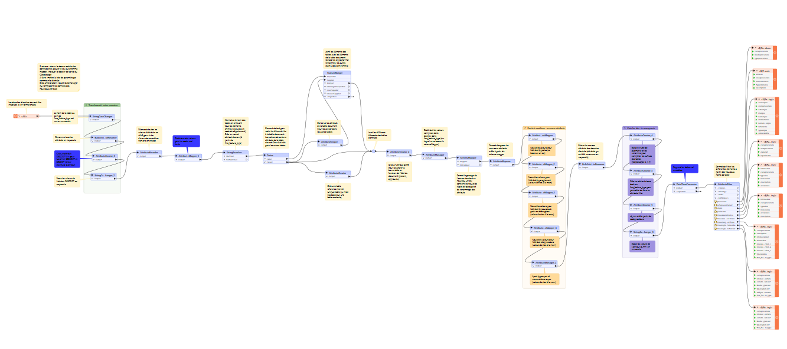

# Traduction PPR vers nouveaux standards

Ce dossier expose un workbench [FME](https://www.veremes.com/produits/fme/fme-desktop) ([demo_mapping.fmw](./demo_mapping.fmw)) permettant d'expérimenter le passage d'un jeu de données tests PPR vers le profil applicatif PPR des nouveaux Géostandards Risques. 

Le workbench prend en entrée :
* un jeu de donnée PPR conforme à l'ancien standard COVADIS ([PPRN du bassin de la Scie](./76DDTM20120001.zip))
* un fichier de règles de passages au format CSV ([mapping.csv](./mapping.csv)) dont le principe est documenté [ci-dessous](#r%C3%A8gles-de-passage)

Il génère en sortie un jeu de données selon le nouveau standard ([PPRN_result.gpkg](./PPRN_result.gpkg)) au format Geopackage (choix de format par défaut pour l'instant).

Ce workbench a été réalisé avec la version 2022.0.0.2 de FME. Il n'est pas garanti qu'il fonctionne avec les versions précédentes.

## Règles de passage

Les règles de passage ci-dessous détaillent la façon dont les objets des classes du nouveau standard sont créés et renseignés à partir des objets provenant des classes du modèle de conceptuel de données de l'ancien standard COVADIS PPRN (DocumentPPR, PerimetrePPR, ZonePPR, ZoneAleaPPR, EnjeuPPR et OrigineRisque).

Ce classes sont implémentées de la manière suivante dans le jeu de données Shapefile représentant le PPRN du bassin de la Scie

| Classe modèle Covadis | Table(s) Shapefile |
|-|-|
| DocumentPPR | n_document_pprn_s_DDD |
| PerimetrePPR | n_perimetre_pprn_AAAANNNN_s_DDD |
| ZonePPR | n_zone_reg_pprn_AAAANNNN_s_DDD, n_zone_reg_pprn_AAAANNNN_l_DDD, n_zone_reg_pprn_AAAANNNN_p_DDD |
| ZoneAleaPPR | n_zone_alea_pprn_AAAANNNN_s_DDD |
| EnjeuPPR | n_enjeu_pprn_AAAANNNN_s_DDD, n_enjeu_pprn_AAAANNNN_l_DDD, n_enjeu_pprn_AAAANNNN_p_DDD |
| OrigineRisque | n_orig_risq_pprn_AAAANNNN_s_DDD, n_orig_risq_pprn_AAAANNNN_l_DDD, n_orig_risq_pprn_AAAANNNN_p_DDD |

où :

* DDD représent le département (ici : "076")
* AAAANNNN représente les 8 derniers caractères de l'identifiant GASPAR du PPRN (ici : "20120001" )
* le caractère _s_, _l_ ou _p_ représente la primitive géométrique associée à la classe shapefile (surfacique, linéaire ou ponctuel)

### Remplissage des objets de la classe Procedure

La classe "Procedure" permet de faire le lien entre un jeu de données du Standard et le système GASPAR. Un objet de cette classe correspond à une procédure unique identifiée dans GASPAR.

Les objets de la classe "Procedure" sont créés à partir de ceux de la classe "DocumentPPR" avec une correspondance exacte : un objet de la classe DocumentPPR génère un objet de la classe Procédure. 

Les attributs sont renseignés selon les correspondances suivantes :

|Nom Attribut|Description|Exemple de valeur|Classe ancien PPRN| Attribut ancien PPRN (implémentation) |
|-|:-:|:-:|:-:|:-:|
|codeProcedure|Identifiant de la procédure dans GASPAR|76DDTM20120001|DocumentPPR| idGASPAR (ID_GASPAR) |
|libelleProcedure|Description textuelle de la procédure (cf. Libellé procédure dans GASPAR)|Plan de Prévention des Risques Naturels du bassin versant  de la Scie|DocumentPPR|nomDocPPR (NOM) |
|typeProcedure|Type de procédure (selon les modèles identifiés dans GASPAR)|PPRN-I|N/A|N/A|

### Remplissage des objets de la classe ReferenceInternet

La classe ReferenceInternet permet de décrire des ressources accessibles sur internet, qu'il sagisse d'une page html, d'une arborescence d'un site web ou de documents téléchargeables. Un objet de cette classe représente un telle ressource, caractérisée de manière unique par son adresse sur internet (URL).

Cette classe n'existait pas dans l'ancien standard, elle a été créé pour les besoins du nouveau standard. La génération de ses objets est effectuée à partir des objets de l'ancienne classe Document avec une correspondance exacte : un objet de la classe DocumentPPR génère un objet de la classe ReferenceInternet. 

|Nom Attribut|Description|Exemple de valeur|Classe ancien PPRN| Attribut ancien PPRN|
|-|:-:|:-:|:-:|:-:|
|codeProcedure|Lien vers la table procédure |76DDTM20120001|DocumentPPR| idGASPAR (ID_GASPAR)|
|adresse| Url d'accès à la ressource url|http://www.seine-maritime.gouv.fr/Publications/Information-des-acquereurs-et-locataires-sur-les-risques-majeurs/Recherche-par-Plan-de-Prevention-des-Risques-PPR/PPRN-Bassin-versant-de-la-SCIE | DocumentPPR | serviceInternet (SITE_WEB) |
|nomRessource |Nom de la ressource| - |N/A|N/A|
|description|Description de la ressource| - |N/A|N/A|
|typeReference|Indique le type de document auquel on fait référence| - | N/A|N/A|

### Remplissage des objets de la classe Perimetre

La classe Perimetre permet de décrire l'état d'avancement d'une procédure sur une zone géographique donnée. Pour une même procédure donnée à un instant donné, plusieurs périmètres peuvent exister dans des états d'avancement différents.

Les objets de la classe Perimetre sont créés à partir ceux de la classe PerimetrePPR avec une correspondance exacte : un objet de la classe PerimetrePPR génère un objet de classe Perimetre.

A noter que dans l'ancien standard, l'avancement de la procédure était porté par la classe DocumentPPR (attribut "etat") et non le périmètre. Pour la traduction des données de l'ancien standard, la valeur de l'attribut "etat" de l'objet DocumentPPR rattaché au perimetre sera donc utilisée pour les périmètres générés pour le nouveau standard.

Les attributs de la classe Perimetre sont renseignés selon les correspondances suivantes :

|Nom Attribut|Description|Exemple de valeur|Classe ancien PPRN| Attribut ancien PPRN (implémentation) |
|-|:-:|:-:|:-:|:-:|
|codeProcedure|Lien vers la table procédure | 76DDTM20120001 | PerimetrePPR | idGASPAR (ID_GASPAR)|
|etatProcedure |Etat d'avancement de la procédure sur le périmètre|"APPROUVE" si etat= "Approuvé" (02); PRECRIT si etat="Prescrit" (01); ABROGE si etat ="Abrogé" (03); ANTICIPE si etat = "Anticipe" (04)" |DocumentPPR | etat (ETAT) |
|dateEtatPerimetre|Date du début de l'état de la procédure sur le périmètre|29/05/2020|DocumentPPR|dateApprobation (DATEAPPRO), si Approuvé |
|geometrie|Géométrie du Périmètre| MultiPolygone |PerimetrePPR|geometry|

### Remplissage des objets de la classe ZoneAlea

La classe Zone d'aléa permet de décrire des zones géographiques soumises à des aléas et d'en préciser le type d'aléa, son niveau, et sa probabilité d'occurence. 

Dans le cadre du profil applicatif PPR des nouveaux standards, elle est spécialisée par des classes spécifiques en fonction du type de zone d'aléa que l'on veut renseigner : ZoneAleaReference, ZoneAleaEcheance100ans. Ce sont ces classes qui seront remplies à partir des objets de la classe ZoneAleaPPR de l'ancien standard. 

### Remplissage des objets de la classe ZoneAleaReference

La classe Zone d'aléa de référence permet de décrire des zones géographiques soumises à des aléas de type naturels déterminés à partir de l'aléa de référence et d'en préciser le type d'aléa, son niveau, et sa probabilité d'occurence. Elle a les mêmes propriétés de que la classe ZoneAlea.

L'ancien standard ne définissait qu'une classe pour les zones d'aléas. Par défaut, on considère que les objets de la classe ZoneAleaPPR décrivent l'aléa de référence et un objet de l'ancienne classe ZoneAleaPPR sera converti en un objet de la classe ZoneAleaReference. Les exceptions seront précisées pour chacune des classes du nouveau standard.

Les attributs sont renseignés selon les correspondances suivantes :

 |Nom Attribut|Description|Exemple de valeur|Classe ancien PPRN| Attribut ancien PPRN (implementation)|
|-|:-:|:-:|:-:|:-:|
|idZoneAlea|Identifiant de la zone alea|20120001R000003|ZoneAleaPPR|idZoneAlea (ID_ZONE)|
|codeProcedure|Identifiant de la procédure dans GASPAR|76DDTM20120001|ZoneAleaPPR|(ID_GASPAR)|
|typeAlea|Type de l'aléa selon la nomenclature GASPAR|112|ZoneAleaPPR|codeRisque (CODERISQUE)|
|niveauAlea|Niveau d'aléa|06 (Très fort) |ZoneAleaPPR|niveauleaStandard (NIVALEA_ST)|
|description|Description de l'aléa|Inondation - Par submersion marine|ZoneAleaPPR|descriptionZone (DESCRIPT)|
|occurence|ce champ permet d'indiquer l'occurence de survenue de l'Inondation - ar submersion marinealéa. Selon son type, il pourra s'agir d'une probabilité (par exemple période de retour) ou d'un autre indicateur à définir dans les profils applicatifs.| - |N/A|N/A|
|geometrie|Géométrie de la zone|Multipolygone|ZoneAleaPPR|geometry|

### Remplissage des objets de la classe ZoneAleaEcheance100ans

La classe Zone d'aléa à échéance 100 ans permet de décrire des zones géographiques soumises à des aléas de type naturels déterminéés à partir de l'aléa à échéance 100 ans et d'en préciser le type d'aléa, son niveau, et sa probabilité d'occurence. Elle a les mêmes propriétés de que la classe ZoneAlea.

L'ancien Standard COVADIS PPR n'identifie pas en tant que telles les zones d'aléas relatives à l'aléa à échéance 100 ans. Cette table ne sera donc pas générée lors de la transposition d'un ancien PPR vers le nouveau modèle si rien n'indique que les objets de la classe ZoneAleaPPR décrivent en particulier cet aléa.

### Remplissage des objets de la classe ZoneProtegee

La classe Zone Protégée permet de décrire les zones protégées par un ouvrage de protection (OuvrageProtection) lorsque le niveau de protection de ce dernier est au moins égal à l'aléa de référence. Ces zones sont superposables aux zones d'aléas. Elles sont caractérisées par le type d'aléa (TypeAlea), un niveau de protection et une période de retour relatifs à l'ouvrage de protection.

Dans l'ancien standard PPR, les zones protégées n'étaient pas représentées. Cette table ne sera donc pas générée à lors de la transposition d'un ancien PPR vers le nouveau modèle. 

### Remplissage des objets de la classe ZoneDangerSpecifique

La classe Zone de danger spécifique permet de représenter des zones de danger particulières superposables aux zones d'aléas. Ces zones de danger particulières peuvent être de deux types : les bandes de précaution à l'arrière des systèmes d'endiguement et les bandes particulières liées aux chocs mécaniques des vagues et projection des matériaux telles que définies dans le Decret PPRI:2019 et le Guide PPRL:2014. Elles sont aussi caractérisées par le type d'aléa (TypeAlea) et son niveau (TypeNiveauAlea) et rattachées à une procédure donnée. Elles peuvent être aussi liées à un ouvrage de protection (OuvrageProtection), notamment lorsqu'il s'agit d'une bande de protection.

L'ancien Standard COVADIS PPR n'identifie pas en tant que telles les zones de danger spécifiques. Cependant, certains objets de la classe ZoneAleaPPR peuvent représenter de telles zones avec une indication en ce sens dans le champs description de la table. Lorsque c'est le cas, ces objets particuliers de la classe ZoneAleaPPR permettront de générer les objets de la classe ZoneDangerSpecifique. 

Dans le jeu de données PPRN du Bassin versant de la Scie, de telles zones d'aléas existent et sont identifiables grace au champ description lorsqu'il comprend les valeurs : "Bande de precaution" ou "Secteur soumis aux chocs de vagues et de projection".

Les attributs sont renseignés selon les correspondances suivantes :

|Nom Attribut|Description|Exemple de valeur|Classe ancien PPRN| Attribut ancien PPRN|
|-|:-:|:-:|:-:|:-:|
|idZoneDanger|Identifiant unique d'un objet zone de danger spécifique|20120001R000002|ZoneAleaPPR|idZoneAlea (ID_ZONE)|
|codeProcedure|Identifiant de la procédure pour laquelle la zone de danger spécifique a été calculée. Ce champ permet de faire le lien avec l'objet correspondant de la classe Procedure|76DDTM20120001|ZoneAleaPPR|(ID_GASPAR)|
|typeAlea|Type de l'alea associé à la zone de danger spécifique, selon la nomenclature définie dans GASPAR et reprise par l'énumération TypeAlea|117 (Inondation par submersion marine) |ZoneAleaPPR|codeRisque (CODERISQUE)|
|description|Secteur soumis aux chocs de vagues et de projecti (02) on|N/A|ZoneAleaPPR|descriptionZone (DESCRIPT)|
|niveauAlea|Niveau d'aléa|06 (Très fort) |ZoneAleaPPR|niveauleaStandard (NIVALEA_ST)|
|typeSuralea|Ce champ permet d'indiquer le type de zone de danger spécifique.| bande particulière (02) |N/A|N/A|
|geometrie|Géométrie de la zone|Multipolygone|ZoneAleaPPR|geometry|

### Remplissage des objets de la classe ZoneReglementaire

L'interface ZoneRéglementaire permet de décrire les zones sur lesquelles s'appliquent des réglements dufait de la procédure à laquelle elles sont rattachées. Les implémentations de cette classe vont dépendre du type de procédure concernée et du cadre réglementaire dans lequel elle s'inscrit.
Dans le cadre du profil applicatif PPR des nouveaux standards, elle est spécialisée par des classes spécifiques en fonction du type du réglement que l'on veut renseigner : ZoneReglementaireUrba, ZoneRegelementaireFoncier et ZoneObligationTravaux. Ce sont ces classes qui seront remplies à partir des objets de la classe ZonePPR de l'ancien standard. 

### Remplissage des objets de la classe ZoneReglementaireUrba

La classe ZoneReglementaireUrba définit les zones sur lesquelles s'applique un réglement particulier dans le cadre des Plans de prévention des Risques en matière d'Urbanisme. Elle implémente l'interface ZoneReglementaire et spécialise les valeurs possibles pour l'attribut typeReglement.Elle a les mêmes propriétés de que la classe ZoneReglementaire.

L'ancien standard ne définissait qu'une classe pour les zones réglementaires. Les objets de la classe ZoneReglementaireUrba seront créés à partir des objets de la classe ZonePPR dont l'attribut typeReglementStandardise porte une valeur représentant une réglementation en matière d'urbanisme, à savoir : 'Interdiction stricte", "Interdiction", "Prescriptions" ou "Prescriptions hors zone d'aléa".

Les attributs sont renseignés selon les correspondances suivantes :

|Nom Attribut|Description|Exemple de valeur|Classe ancien PPRN| Attribut ancien PPRN|
|-|:-:|:-:|:-:|:-:|
|codeProcedure|Lien vers la table procédure |76DDTM20120001|ZonePPR|ID_GASPAR|
|idZoneReglementaire|Identifiant unique de la zone réglementaire|18|ZonePPR|idZonePPR ("id_zone")|
|codeZoneReglement|Code attribué à la zone dans le cadre du réglement qui s'applique|Bir|ZonePPR|codeZoneReglement ("codeZone")|
|libelleZoneReglement|Libellé correspondant au code de la zone dans le cadre du réglement qui s'applique|prescription - Inondation par remontee de nappe|ZonePPR|libelleZone ("nom")|
|typeReglement|Nature du règlement en matière d'urbanisme s'appliquant sur la zone. Le type de valeur pour cet attribut sera spécialisé en fonction du type de procédure.|Interdiction stricte, Interdiction, Prescriptions ou Prescriptions hors zone d'aléa.|ZonePPR|typeReglementStandardise ("typereg")|
|geometrie|Geometrie de la zone. Celle-ci peut être de tout type : (Multi)Polygone, polyligne ou point. Par exemple, certaines zones réglementées peuvent être relatives à des cavités (ponctuel) ou des axes de ruissellement (linéaire).|(Multi)Polygone, polyligne ou point.|ZonePPR|geometry|

### Remplissage des objets de la classe ZoneReglementaireFoncier

La classe ZoneReglementaireFoncier définit les zones sur lesquelles s'applique un réglement particulier dans le cadre des Plans de prévention des Risques en matière de mesures foncières. Elle implémente l'interface ZoneReglementaire et spécialise les valeurs possibles pour l'attribut typeReglement.Elle a les mêmes propriétés de que la classe ZoneReglementaire.

Les objets de la classe ZoneReglementaireUrba seront créés à partir des objets de la classe ZonePPR dont l'attribut typeReglementStandardise porte une valeur représentant une réglementation en matière d'urbanisme, à savoir : "Délaissement possible" ou "Expropriation possible".

Nom Attribut|Description|Exemple de valeur|Classe ancien PPRN| Attribut ancien PPRN|
|-|:-:|:-:|:-:|:-:|
|codeProcedure|Lien vers la table procédure |76DDTM20120001|ZonePPR|ID_GASPAR|
|idZoneReglementaire|Identifiant unique de la zone réglementaire|18|ZonePPR|idZonePPR ("id_zone")|
|codeZoneReglement|Code attribué à la zone dans le cadre du réglement qui s'applique|Bir|ZonePPR|codeZoneReglement ("codeZone")|
|libelleZoneReglement|Libellé correspondant au code de la zone dans le cadre du réglement qui s'applique|prescription - Inondation par remontee de nappe|ZonePPR|libelleZone ("nom")|
|typeReglement|Nature du règlement en matière d'urbanisme s'appliquant sur la zone. Le type de valeur pour cet attribut sera spécialisé en fonction du type de procédure.|Délaissement possible ou Expropriation possible.|ZonePPR|typeReglementStandardise ("typereg")|
|geometrie|Geometrie de la zone. Celle-ci peut être de tout type : (Multi)Polygone, polyligne ou point. Par exemple, certaines zones réglementées peuvent être relatives à des cavités (ponctuel) ou des axes de ruissellement (linéaire).|(Multi)Polygone, polyligne ou point.|ZonePPR|geometry|

### Remplissage des objets de la classe ZoneObligationTravaux

'La classe ZoneObligationTravaux définit les zones sur lesquelles s'appliquent des obligations de travaux dans le cadre des Plans de prévention des Risques. Elle implémente l'interface ZoneReglementaire, spécialise les valeurs possibles pour l'attribut typeReglement et permet de préciser les types de biens concernés par ces obligations de travaux.

Dans l'ancien standard PPR, les obligations de réalisation de travaux n'étaient pas représentées. Cette table ne sera donc pas générée à lors de la transposition d'un ancien PPR vers le nouveau modèle. 
