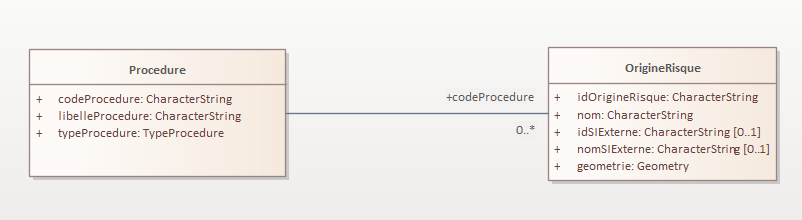
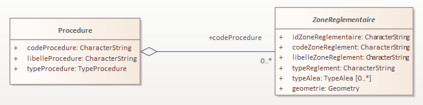

| | |
|-|-|
| |  |

 Conseil national de l'information Géolocalisée

 Géostandards Risques - Modèle Commun

Groupe de travail refonte des Géostandards Risques

*Version 0.1 - Date*

#  Fiche analytique

| | |
|-|-|
| **Titre** | Géostandards Risques |
| **Sous-titre** | Modèle Commun |
| **Version du document** | *0.1 - jj mois aaaa (date de publication)*  |
| **Résumé** | La famille des Géostandards Risques a pour objectif de standardiser les données numériques géographiques relatives aux procédures réglementaires de prévention des risques. Elle a été développée dans le but de moderniser et succéder aux standards COVADIS dédiés à cette thématique tels que les standards Plan de Prévention des Risques (PPR) Naturels, Technologiques et Miniers ou Directive Inondation (DI). Ce document constitue le socle commun de ces Géostandards en définissant les concepts communs qui sont ensuite précisés dans les profils applicatifs dédiés aux procédures particulières. |
| **Etendue d'application** | Territoire national français. |
| **Resolution spatiale** | entre le 1:5000 et le 1:25000 |
| **Statut du document** | Projet - ~~Appel à commentaires~~ - ~~Proposé à la commission des Standards du CNIG~~ - ~~Validé~~ |
| **Licence** | Le présent document est sous [Licence Ouverte (Open Licence) Etalab](https://www.etalab.gouv.fr/licence-ouverte-open-licence/) |
| **Diffusion** | *A venir : PDF sur internet  (site du CNIG)* |
| **Formats disponibles** |  HTML/Markdown sur le [dépot Github du Groupe de travail Géostandards Risques](https://github.com/cnigfr/Geostandards-Risques/blob/main/standards/Geostandards-risques-commun/Document.md#classe-dobjets-procedure) |
| **Thèmes** | (INSPIRE) "Usage des sols", "Lieux de production et sites industriels", "Zones de gestion, de restriction ou de réglementation et unités de déclaration", "Zones de risque naturel" |
| **Mots-clés** | "Usage des sols" ; "prévention" ; "risque" ; "aléa" ; "aménagement" ; "urbanisme" ; "prescription" ; "servitude" |
| **Contact** | geostandards-risques-gt-cnig@framalistes.org |

#  Sommaire

> *A générer*

#  Préface

##  Historique du document

| Version | Date | Raison |
| - | - | - |
| 0.1 | *xx* | Première rédaction en cours |

##  Participation à l'écriture

Ce standard est le fruit des travaux du groupe de travail CNIG sur la refonte des Géostandards risques. Ce dernier rassemble les acteurs impliqués dans l’élaboration, la gestion et la diffusion des données de prévention des risques relatives à ces standards ainsi que des utilisateurs amenés à exploiter ces données. Il est animé par l’IGN pour le compte de la Direction Générale de la Prévention des Risques (DGPR). 

Ce standard a été rédigé par Gilles Cébélieu (IGN) et Alison Lenain (IGN) avec les contributions majeures et les relectures des membres du Groupe de travail listés ci-dessous.

| Nom |Affiliation 
| - | - |
| Besson Stanislas | DDT de l'Isère (38) |
| Bonnin Nicolas | MTE / DGPR / DAGSI |
| Bouffier Jacques | MTE / DGPR / BRIL |
| Boudesseul Nicolas | DREAL Pays de la Loire |
| Chrétien Guillaume | DDTM de la Seine Maritime (76) |
| Coignon Bastien | MTE / DGPR / BRIL |
| Di Salvo Magali | DREAL Auvergne Rhone Alpes |
| Evain Yohan | Cerema |

> *liste à compléter et actualiser*

#  Présentation du document

##  Objectif et raison d'être du standard

La famille des Géostandards Risques a pour objectif de standardiser les données numériques géographiques relatives aux procédures réglementaires de prévention des risques. Elle a été développée dans le but de moderniser et succéder aux standards COVADIS dédiés à cette thématique tels que les standards Plan de Prévention des Risques (PPR) Naturels, Technologiques et Miniers ou Directive Inondation (DI).

Ce document constitue le socle commun de ces Géostandards en définissant les concepts communs qui sont ensuite précisés dans les profils applicatifs dédiés aux procédures particulières.

##  A qui s'adresse ce document ?

Ce document s'adresse :

- aux services de l'Etat ou assimilés, chargés de produire ces données, les entretenir les diffuser.
- aux utilisateurs de ces données : collectivités locales, bureaux d'études, ou grand public.

##  Comment lire le document

Les parties [Préface](#préface) et [Présentation du document](#présentation-du-document) donnent les éléments nécessaires à la compréhension du document. 

Les parties [Contenu et structure de la donnée](#contenu-et-structure-de-la-donnée) et [Systèmes de référence](#syst%C3%A8mes-de-r%C3%A9f%C3%A9rence) sont le coeur du document. Elles définissent le modèle conceptuel commun, le catalogue de données associé et les systèmes de référence de coordonnées applicables aux Géostandards risques.

L'[annexe A](#annexe-a---correspondances-inspire), informative, établit les correspondances du modèle de données des Géostandards avec ceux des thématiques INSPIRE qui les concernent.

L'[annexe B](#annexe-b---correspondances-avec-le-modèle-de-données-gaspar), informative, décrit les correspondances du modèle de données des Géostandards avec celui de la base nationale de gestion assistée des procédures administratives relatives aux risques (GASPAR) dont est dérivée une partie des informations décrites dans ce document.

## Références

Cette partie cite les références documentaires et réglementaires sur lesquelles s'appuie ce standard.

### Références à d'autres documents

Ce document s’appuie ou nécessite la lecture des normes et documents référencées ci-dessous. 

| Accronyme | Titre | Auteur | Année |
|-|-|-|-|
| [CNIG_RISQUES_PPR:2024] | Géostandards Risques - Profil Applicatif Plan de Prévention des Risques (PPR) | Conseil National de l'Information Géolocalisée (CNIG) | 2024 |
| [ROE 1.2:2014](https://www.sandre.eaufrance.fr/notice-doc/description-des-ouvrages-faisant-obstacle-%C3%A0-l%E2%80%99%C3%A9coulement) | Description des ouvrages faisant obstacle à l’écoulement v1.2 | SANDRE | 2014 |
| [Decret PPRI:2019](https://www.legifrance.gouv.fr/jorf/id/JORFTEXT000038730841) | Décret n° 2019-715 du 5 juillet 2019 relatif aux plans de prévention des risques concernant les « aléas débordement de cours d’eau et submersion marine » | Journal Officiel de la République Française | 2019 | 
| [Guide PPRL:2014](https://www.ecologie.gouv.fr/sites/default/files/Guide%20PPRL%20-%20version%20finale%20mai%202014.pdf) | Guide méthodologique : Plan de prévention des risques littoraux | DGPR / SRNH | 2014 |
| [UNISDR:2009](https://reliefweb.int/attachments/a0ed6b9c-713e-349f-ae9f-d3d8ff336b1f/Rapport_complet.pdf) | Terminologie pour la Prévention des risques de catastrophe | Stratégie internationale de prévention des catastrophes des Nations Unies (UNISDR) | 2009 | 
| [INSPIRE NZ:2013](https://inspire.ec.europa.eu/documents/Data_Specifications/INSPIRE_DataSpecification_NZ_v3.0.pdf) | INSPIRE D2.8.III.12 Data Specification on Natural Risk Zones – Technical Guidelines | European Commission Joint Research Centre | 2013 |

####  Cadre réglementaire des Géostandards risques

#### Cadre réglementaire pour les systèmes de référence de coordonnées

Le cadre réglementaire pour les systèmes de référence de coordonnées est établi par le [décret du 5 mars 2019](https://www.legifrance.gouv.fr/loda/id/JORFTEXT000038203565) relatif au système national de référence de coordonnées et son [arrêté du 5 mars 2019](https://www.legifrance.gouv.fr/loda/id/JORFTEXT000038203601) portant application du décret n° 2000-1276 du 26 décembre 2000 modifié portant application de l'[article 89 de la loi n° 95-115 du 4 février 1995](https://www.legifrance.gouv.fr/loda/article_lc/LEGIARTI000006340167) modifiée d'orientation pour l'aménagement et le développement durable du territoire relatif aux conditions d'exécution et de publication des levés de plans entrepris par les services publics.

####  Cadre réglementaire des Plans de Prévention des Risques

Le cadre réglementaire de la mise en oeuvre des Plans de Prévention des Risques (PPR) est décrit dans le profil applicatif Plan de Prévention des Risques (PPR) des Géostandards [CNIG_RISQUES_PPR:2024].

####  Cadre réglementaire des Territoires à Risque Important d'Inondation

La mise en oeuvre des Territoires à Risque Important d'Inondation est définie dans le code de l'environnement par :

* Les [articles L566-1 à L566-13](https://www.legifrance.gouv.fr/codes/section_lc/LEGITEXT000006074220/LEGISCTA000022479454/#LEGISCTA000022479454) pour la partie législative ;
* Les [articles R566-5 à R566-9](https://www.legifrance.gouv.fr/codes/section_lc/LEGITEXT000006074220/LEGISCTA000023655627/#LEGISCTA000023655627) pour la partie réglementaire ;

##  Compréhension du document

###  Termes spécifiques et définitions

| Terme | Définition|
|-|-|
| Risque | ([INSPIRE NZ:2013](https://inspire.ec.europa.eu/documents/Data_Specifications/INSPIRE_DataSpecification_NZ_v3.0.pdf) reprise de ISO 31010 - Management du risque) : Un risque est la combinaison d'un événement (Aléa) et la probabilité de son occurence.  |
| Aléa | ([INSPIRE NZ:2013](https://inspire.ec.europa.eu/documents/Data_Specifications/INSPIRE_DataSpecification_NZ_v3.0.pdf) reprise de [UNISDR:2009](https://reliefweb.int/attachments/a0ed6b9c-713e-349f-ae9f-d3d8ff336b1f/Rapport_complet.pdf)) Un phénomène dangereux, une substance, activité humaine ou condition pouvant causer des pertes de vies humaines, des blessures ou d’autres effets sur la santé, des dommages aux biens, des pertes de moyens de subsistance et des services, des perturbations socio-économiques, ou des dommages à l’environnement.  |
| Aléa de référence | ([Article R562-11-3 du Code de l'environnement](https://www.legifrance.gouv.fr/codes/article_lc/LEGIARTI000038733751)) Dans le cas des aléas de débordement de cours d'eau et submersion marine, l'aléa de référence est l'aléa déterminé à partir de l'évènement le plus important connu et documenté ou d'un évènement théorique de fréquence centennale, si ce dernier est plus important.   |
| Opposable | Un document juridique est opposable aux tiers quand tout le monde doit le respecter, même les personnes qui ne l'ont pas signé. Dans le cadre de la prévention des risques, ce terme s'applique a des périmètres géographiques associés à une procédure lorsqu'elle est validée par une autorité publique et sur lesquels s'appliquent des contraintes réglementaires notamment en terme d'urbanisme. |
| Enjeux | ([INSPIRE NZ:2013](https://inspire.ec.europa.eu/documents/Data_Specifications/INSPIRE_DataSpecification_NZ_v3.0.pdf) reprise de [UNISDR:2009](https://reliefweb.int/attachments/a0ed6b9c-713e-349f-ae9f-d3d8ff336b1f/Rapport_complet.pdf)) : Personnes, biens, systèmes, ou autres éléments présents dans les zones de risque et qui sont ainsi soumis à des pertes potentielles. *Commentaire : L’exposition peut inclure le nombre de personnes ou les types de bien dans une région. Elle peut être combinée avec la vulnérabilité spécifique des éléments exposés pour un risque particulier, afin d’estimer le risque associé en cette zone.* |
| Vulnérabilité | ([INSPIRE NZ:2013](https://inspire.ec.europa.eu/documents/Data_Specifications/INSPIRE_DataSpecification_NZ_v3.0.pdf) reprise de [UNISDR:2009](https://reliefweb.int/attachments/a0ed6b9c-713e-349f-ae9f-d3d8ff336b1f/Rapport_complet.pdf)) : Les caractéristiques et les circonstances d’une communauté ou d’un système qui le rendent susceptible de subir les effets d’un danger. *Commentaire: Il existe de nombreux aspects de la vulnérabilité, découlant de divers facteurs physiques, sociaux, économiques et environnementaux. Par exemple, il peut s’agir de la mauvaise conception et construction de bâtiments, de l’insuffisance de la protection de l’actif, du manque d’information du public et de sa sensibilisation, de la reconnaissance officielle de limiter les risques et des mesures de préparation, ou du mépris de sage gestion de l’environnement. La vulnérabilité varie sensiblement au sein d’une communauté et dans le temps. Cette définition identifie la vulnérabilité comme une caractéristique de l’élément d’intérêt (de la communauté ou du système) qui est indépendante de son exposition. Toutefois, dans l’usage commun, le mot est souvent utilisé plus largement pour inclure l’élément de l’exposition.* |

###  Abréviations

**BRIL** Bureau des risques d'inondation et littoraux

**BRIEC** Bureau des risques des industries de l’énergie et de la chimie 

**Cerema** Centre d’études et d’expertises sur les risques, l’environnement, la mobilité et l’aménagement

**CNIG** Comité national de l'information géolocalisée

**DAGSI** Département des affaires générales et des systèmes d’information

**DDT(M)** Direction départementale des territoires (et de la mer) 

**DGPR** Direction générale de la prévention des risques

**DREAL** Direction régionale de l'environnement, de l'aménagement et du logement

**GASPAR** Base nationale de gestion assistée des procédures administratives relatives aux risques

**IGN** Institut national de l'information géographique et forestière

**MTE** Ministère de la transition écologique et de la cohésion des territoires 

**PPRM** Plan de Prévention des Risques Miniers

**PPRN** Plan de Prévention des Risques Naturels

**PPRT** Plan de Prévention des Risques Technologiques

**SIOuH** Système d'Information sur les Ouvrages Hydrauliques

**TRI** Territoire à risque important d'inondation

#  Concepts généraux

## Périmètre d'application

Le périmètre d'application couvert par les Géostandards risques peut varier selon les différentes procédures de préventions des risques référencées dans la [partie introductive du document](#objectif-et-raison-dêtre-du-standard) et sera détaillé dans les profils applicatifs attachés à chacune d'elles.

Au niveau du modèle commun décrit par ce document, le périmètre d'application est assez générique et concerne la production des jeux de données numériques correspondant à la mise en oeuvre de ces procédures pour la diffusion aux utilisateurs (notamment collectivités, bureaux d'études, grand public, ...).

Les données représentées couvrent le territoire national français susceptible de faire l'objet de telles procédures : 

- Territoire européen de la France
- France d'outre mer, plus précisément :
  - Guadeloupe
  - Saint-Martin
  - Saint-Barthélemy
  - Martinique
  - Guyane
  - La Réunion
  - Mayotte
  - Saint-Pierre-et-Miquelon

Les types de risques couverts par ce standard et ses profils applicatifs sont ceux de la nomenclature GASPAR (Gestion assistée des procédures administratives relatives aux risques naturels et technologiques), décrite en [Annexe B](#nomenclature-des-risques-et-de-leurs-codes-dans-gaspar)

##  Les acteurs et rôles concernés 

Les acteurs concernés peuvent varier selon les différentes procédures de préventions des risques référencées dans la [partie introductive du document](#objectif-et-raison-dêtre-du-standard). De manière générale, on va retrouver cependant le shéma suivant :

| Nom du rôle | Caractéristiques |
|-|-|
| Producteur | Organisme en charge de produire le jeu de données conformément à ce Standard : Services de l'Etat (DDTM, DREAL) |
| Diffuseur | Organisme en charge de mettre à disposition le jeu de données : Services de l'Etat (DDTM), Organismes mandatés par l'Etat (BRGM), IGN, ...  |
| Utilisateur | Consommateur de la donnée : Collectivité territoriale, Organismes privés, Bureaux d'étude, Services de l'Etat, Grand public, ... |

#  Contenu et structure de la donnée

Cette section définit le [modèle conceptuel de données](#modèle-conceptuel-de-données) commun aux données relatives à la prévention des risques couvertes par la famille des Géostandards risques à l'aide du langage UML. Le [catalogue d'objets](#catalogue-dobjets) fournit la sémantique des entités décrites dans le modèle.

##  Modèle conceptuel de données

Les données décrites dans le cadre de ce standard se répartissent dans cinq grandes thématiques :

- La thématique [procédures et périmètres](#thématique-procédures-et-périmètres) relate de l'aspect administratif et de l'état d'avancement de la procédure en lien avec le système GASPAR (gestion assistée des procédures administratives relatives aux risques) du MTE dans lequel elles sont recensées. Toutes les entités des autres thématiques y sont rattachées ;

- La thématique [aléas](#thématique-aléas) comprend les entités permettant de décrire les phénomènes objets du risque à l'origine de la procédure, leur localisation, leurs probabilités et leurs intensités ;

- La thématique [enjeux](#thématique-enjeux) traite des biens, personnes, activités, éléments de patrimoine culturel ou environnemental, menacés par les aléa. 

- La thématique [origine du risque](#thématique-origine-du-risque) permet de faire référence aux entités génératrices du risque à l'origine de la procédure de prévention.

- La thématique [zonage réglementaire](#thématique-zonage-réglementaire) permet de décrire le zonage réglementaire déduit du croisement des objets de la thématique aléa et de ceux de la thématique enjeux.

Selon les procédures et les profils applicatifs associés, ces thématiques ne sont pas toujours toutes implémentées.

Le schéma suivant représente les liens entre chacune de ces thématiques. Les liens en pointillés illustrent pour information une relation de cause à effet entre deux thématiques mais ne sont pas implémentées dans le modèle qui suit.

**Fig. *xx* Relations entre les différentes thématiques.**

### Thématique Procédures et périmètres

La thématique "Procédures et périmètre" regroupe les informations relatives au suivi administratif des procédures de prévention des risques et aux différents types de périmètres qui précèdent l'établissement du zonage réglementaire. Ces informations de suivi sont saisies et gérées par les services déconcentrés de l'Etat dans l'application GASPAR du MTE.

Le modèle de données de ce standard ne reprend que les informations du système GASPAR qui permettent de faire le lien avec la procédure qui est concernée et de faire état de son actualité. Les correspondances entre les données de standard et le modèle de données du système GASPAR sont précisées dans le [paragraphe dédié](#correspondances-avec-le-mod%C3%A8le-de-donn%C3%A9es-gaspar).

La liste des types de procédures prises en charge par ce standard est établie par le type énuméré [TypeProcedure](#enumeration-typeprocedure) et correspond à des types de procédures gérés dans GASPAR. 

Un objet de la classe [Procedure](#classe-dobjets-procedure) correspond à une procédure saisie dans GASPAR. Le champs "codeProcedure" contient la valeur de l'identifiant de la procédure dans GASPAR et permet ainsi de faire le lien entre les données de ce système.

Une procédure peut être la révision d'une ou de plusieurs anciennes procédures. Elle peut aussi faire l'objet d'une ou plusieurs autres procédures de révision. Ce lien potentiel entre différentes procédures est réprésenté par l'association ["revise"](#associations-de-la-classe-procedure).

A une procédure donnée peuvent être associés plusieurs périmètres sur lesquels l'état d'avancement de la procédure peut être différent. La classe ["Perimetre"](#classe-dobjets-perimetre) permet de les décrire. La liste des états d'avancement possibles pour une procédure sur un périmètre est établie par le type énuméré [TypeEtatProcedure](#enumeration-etats-dune-procédure) et correspond aux différents états d'avancements d'une procédure identifiés dans GASPAR.

Les ressources internets liées à une procédure donnée (par exemple la publications d'un PPRI sur le site de la préfectue concernée) sont décrites l'aide d'objets de la classe [Reference Internet](#classe-dobjets-referenceinternet) qui permet d'indiquer l'adresse internet le nom et la description de la ressource.  

**Fig. *xx* Modèle UML des classes relatives aux procédures et périmètres.**

### Thématique Aléas

La thématique aléas porte sur la description des phénomènes, leur localisation, leurs probabilités et leurs intensités.

Dans cette thématique sont définies : 

* trois classes pour décrire des zones définies relativement aux aléas ([ZoneAlea](#classe-dobjets-zonealea), [ZoneDangerSpecifique](#classe-dobjets-zonedangerspecifique) et [ZoneProtegee](#classe-dobjets-zoneprotegee)) ;
* une classe pour décrire les ouvrages de protection [OuvrageProtection](#classe-dobjets-ouvrageprotection) ;
* une classe générique permettant de décrire les éléments de détermination et de caractérisation des aléas [ElementCaracterisationAlea](#classe-dobjets-elementcaracterisationalea) ;
* Trois énumérations permettant de classifier les Types d'aléas ([TypeAlea](#enumeration-typealea)), les niveaux d'aléas ([TypeNiveauAlea](#enumeration-typeniveaualea)) et les types de sur-aléas ([TypeSurAlea](#enumeration-typesuralea)) ;

La classe [ZoneAlea](#classe-dobjets-zonealea) permet de décrire les zones soumises à des aléas, en indiquant le type d'aléa (classifié à l'aide de l'énumération [TypeAlea](#enumeration-typealea)) qui la concerne, son niveau (classifié selon l'énumération [TypeNiveauAlea](#enumeration-typeniveaualea)) et sa probabilité d'occurence. Les zones d'aléas sont définies par rapport à une procédure donnée.

La classe [ZoneDangerSpecifique](#classe-dobjets-zonedangerspecifique) permet de représenter des zones de danger particulières superposables aux zones d'aléas décrites précédemment. Ces zones de danger particulières peuvent être de deux types : les **bandes de précaution** à l'arrière des systèmes d'endiguement et les **bandes particulières** liées aux chocs mécaniques des vagues et projection des matériaux telles que définies dans le [Decret PPRI:2019](https://www.legifrance.gouv.fr/jorf/id/JORFTEXT000038730841) et le [Guide PPRL:2014](https://www.ecologie.gouv.fr/sites/default/files/Guide%20PPRL%20-%20version%20finale%20mai%202014.pdf). Elles sont aussi caractérisées par le type d'aléa ([TypeAlea](#enumeration-typealea)) et son niveau ([TypeNiveauAlea](#enumeration-typeniveaualea)) et rattachées à une procédure donnée. Elles peuvent être aussi liées à un ouvrage de protection ([OuvrageProtection](#classe-dobjets-ouvrageprotection)), notamment lorsqu'il sagit d'une bande de protection. 

La classe ([ZoneProtegee](#classe-dobjets-zoneprotegee)) permet de décrire les zones protégées par un ouvrage de protection ([OuvrageProtection](#classe-dobjets-ouvrageprotection)) lorsque le niveau de protection de ce dernier est au moins égal à l'aléa de référence. Ces zones sont superposables aux zones d'aléas. Elles sont caractérisées par le type d'aléa ([TypeAlea](#enumeration-typealea)), un niveau de protection et une période de retour relatifs à l'ouvrage de protection.

Les ouvrages de protection sont déjà décrits dans d'autres référentiels plus ou moins normatifs (par exemple, le référentiel des obstacles à l'écoulement [ROE 1.2:2014](https://www.sandre.eaufrance.fr/notice-doc/description-des-ouvrages-faisant-obstacle-%C3%A0-l%E2%80%99%C3%A9coulement)). Ce Standard propose seulement une classe [OuvrageProtection](#classe-dobjets-ouvrageprotection) qui permet d'intégrer des objets de ces référentiels lorsqu'ils doivent être inclus dans une cartographie de prévention des risques.

Les zones d'aléas sont déterminées à partir d'éléments techniques, spécifiques aux types d'aléas décrits, par exemple les surfaces iso-hauteur d'eau permettant de déterminer les surfaces inondables. Ce standard ne définit pas spécifiquement chacun de ces éléments mais propose une classe générique [ElementCaracterisationAlea](#classe-dobjets-elementcaracterisationalea) qui pourra être spécialisée au besoin selon les profils applicatifs de façon à rattacher ces éléments aux zones d'aléas qu'ils permettent de déterminer et catactériser leur intensité et leur probabilité. 

**Fig. *xx* Modèle UML des classes relatives aux aléas.**

### Thématique Origine du Risque

La thématique Origine du risque permet de décrire les entités génératrices du risque à l'origine de la procédure de préventions.

Elle définit une classe [OrigineRisque](#classe-dobjets-originerisque) qui porte les informations minimales permettant d'intégrer les entités issues de référentiels externes variés dans une cartographie des risques.

**Fig. *xx* Modèle UML des classes relatives à lorigine du risque.**

### Thématique Enjeux

La thématique "Enjeux" permet de décrire les personnes, biens, activités, éléments de patrimoine culturel ou environnemental, menacés par un aléa et susceptibles d'être affectés et endommagés par celui-ci. Il peut notamment s'agir d'établissements, infrastructures et installations sensibles dont la réalisation de l'aléa peut aggraver ou compliquer la gestion de crise.

Les données d'enjeux sont de nature diverses et définies dans des référentiels externes, nationaux ou locaux. La nature et les caractéristiques de ces données à reporter dans les données de prévention des risques va dépendre des utilisations visées de ces données et de la procédure concernée.

Dans cadre du modèle commun, la thématique "Enjeux" définit une classe [Enjeu](#classe-dobjets-enjeu) qui porte les informations minimales permettant d'intégrer des données d'enjeux issues de référentiels externes, la date de collecte de ces données, une information sur leur(s) vulnérabilité(s) à l'aide du type de données [TypeVulnerabilite](#type-de-données-typevulnerabilite) ainsi qu'un rattachement de ces entités à une ou plusieurs nomenclatures d'enjeux à l'aide du type de données [TypeEnjeu](#type-de-données-typeenjeu).

La définition de ces nomenclatures sera proposée dans les profils applicatifs en fonction des besoins. Le modèle commun rappelle seulement la nomenclature des enjeux définie dans [INSPIRE NZ:2013](https://inspire.ec.europa.eu/documents/Data_Specifications/INSPIRE_DataSpecification_NZ_v3.0.pdf) au travers de la liste de codes [ExposedElementCategoryValue](#liste-de-codes-exposedelementcategoryvalue). 

**Fig. *xx* Modèle UML des classes relatives aux enjeux.**

### Thématique Zonage réglementaire

La thématique "Zonage reglementaire" permet de définir les zones sur lesquelles un réglement spécifique peut s'appliquer du fait de la présence d'un risque. Il peut s'agir de zones exposées aux risques ou de zones qui n'y sont pas directement exposées mais sur lesquelles des mesures peuvent être prévues pour éviter d'aggraver le risque.

Au niveau du modèle commun cette thématique définit une interface [ZoneReglementaire](#interface-zonereglementaire) qui permet de décrire les élements génériques d'une zone réglementaire. Cette interface sera implémentée spécifiquement selon les profils applicatifs.

Il est à noter que certaines procédures n'impliquent pas obligatoirement la mise en place d'un zonage réglementaire et cette interface pourra ne pas être implémentée dans certains profils applicatifs.

**Fig. *xx* Modèle UML des classes relatives au zonage réglementaire.**

##  Catalogue d'objets

### Thématique Procédures et périmètres

#### Classe d'objets *Procedure*

**Nom de la classe** : Procedure

**Titre** : Procédure Administrative

**Définition** : La classe "Procedure" permet de faire le lien entre un jeu de données du Standard et le système GASPAR. Un objet de cette classe correspond à une procédure unique identifiée dans GASPAR.

**Modélisation géométrique** : Cette classe n'a pas de géométrie.

**Propriétés** : 

| Nom de la propriété | Définition | Type | Valeurs possibles | Contraintes |
|-|-|-|-|-|
| codeProcedure | Identifiant de la procédure dans le système GASPAR. | CharacterString | La syntaxe d'un code de procédure est déterminée par le système GASPAR. | 1..1  |
| libelleProcedure | Nom de la procédure lisible par un être humain. | CharacterString | La syntaxe du libellé d'une procédure est déterminée par le système GASPAR. | 1..1  |
| typeProcedure | Type de procédure selon la classification dans le système GASPAR | Enumeration [TypeProcedure](#enumeration-typeprocedure) | Celles de l'énumération | 1..1 |

#### Associations de la classe procedure

| Nom de l'association | Type | Définition | Classe de départ | Classe d'arrivée |
|-|-|-|-|-|
| **revise** | Association | Relation sémantique permettant d'indiquer qu'une procédure est la révision de zéro ou plusieurs procédures existantes et inversement qu'une procédure peut être révisée par zéro ou plusieurs procédures GASPAR. | [Procedure](#classe-dobjets-procedure) (0..\*) | [Procedure](#classe-dobjets-procedure) (0..\*) |
| **est decrit par** | Association | Relation sémantique permettant d'indiquer qu'une procédure est documentée par une ou plusieurs référennces sur internet. | [Procedure](#classe-dobjets-procedure) (1..1) | [ReferenceInternet](#classe-dobjets-referenceinternet) (1..\*) |

#### Classe d'objets *Perimetre*

**Nom de la classe** : Perimetre

**Titre** : Périmètre

**Définition** : La classe Perimetre permet de décrire l'état d'avancement d'une procédure sur une zone géographique donnée. Pour une même procédure donnée à un instant donné, plusieurs périmètres peuvent exister dans des états d'avancement différents.

**Modélisation géométrique** : Multi-Polygone. Les éléments relatifs à l'origine de saisie de la géométrie, sa précision ou sa qualité sont précisés dans les [métadonnées](#métadonnées).

**Propriétés** : 

| Nom de la propriété | Définition | Type | Valeurs possibles | Contraintes |
|-|-|-|-|-|
| codeProcedure | Identifiant de la procédure décrite par le périmètre. Ce champ permet de faire le lien avec l'objet correspondant de la classe [Procedure](#classe-dobjets-procedure) | CharacterString | La valeur de ce champ doit aussi exister comme valeur de la propriété *codeProcedure* de la classe [Procedure](#classe-dobjets-procedure). | 1..1 |
| etatProcedure | Etat d'avancement de la procédure référencée par *codeProcedure* sur le périmètre | Enumeration [TypeEtatProcedure](#enumeration-etats-dune-procédure) | Celles de l'énumération | 1..1 |
| dateEtat | Date à partir de laquelle l'état d'avancement de la procédure sur ce périmètre est effectif. | Date | valeur représentant une date : jour(optionnel), mois(optionnel), année | 1..1 |

#### Classe d'objets *ReferenceInternet*

**Nom de la classe** : ReferenceInternet

**Titre** : Référence Internet

**Définition** : La classe ReferenceInternet permet de décrire des ressources accessibles sur internet, qu'il s'agisse d'une page html, d'une arborescence d'un site web ou de documents téléchargeables. Un objet de cette classe représente une telle ressource, caractérisée de manière unique par son adresse sur internet (URL).

**Modélisation géométrique** : Cette classe n'a pas de géométrie.

**Propriétés** : 

| Nom de la propriété | Définition | Type | Valeurs possibles | Contraintes |
|-|-|-|-|-|
| adresse | Adresse internet de la ressource (URL) | CharacterString | formalisme d'URL à respecter | 1..1 | 
| nomRessource | Nom de la ressource référencée sur Internet | CharacterString | Saisie Libre | 0..1 (Saisie recommandée) |
| typeReference | Catégorisation de la ressource référencée sur Internet. Ce champ permet d'indiquer le type de document référencé en fonction des procédures | Enumeration [TypeReference](#enumeration-typereference) | Celles de l'énumération | 1..1 |
| description | Description de la ressource référencée sur Internet. Ce champ peut permettre notamment d'indiquer le type de ressource (site web, page HTML, document PDF, ...) | CharacterString | Saisie libre | 0..1 |

#### Enumeration *TypeProcedure*

Le tableau suivant liste les différents types de procédures de prévention des risques pouvant être décrites. Les correspondances avec les types de procédures gérés dans GASPAR sont précisées dans le [paragraphe dédié](#types-de-procédures-gaspar).

| Libellé | Description |
|-|-|
| Plan de Prévention des Risques Naturels | Ce type de procédure couvre les risques naturels de manière générique. Il convient d'utiliser de préférence les types de procédures plus spécifiques qui suivent pour les risques naturels |
| Plan de Prévention des Risques Naturels Innondation | Ce type de procédure couvre les risques naturels liés aux inondations par ruissellement, par débordement de cours d'eau, par submersion marine et par remontée de nappe |
| Plan de Prévention des Risques Naturels Littoral | Ce type de procédure couvre les risques naturels liés aux retraits du trait de cote et la submersion marine |
| Plan de Prévention des Risques Naturels Mouvement de Terrain | Ce type de procédure couvre les risques naturels liés aux éboulements ou chutes de blocs rocheux, glissements de terrain, coulées boueuses, effondrements de cavités souterraines, l'érosion de berge et au retrait-gonflement des argiles |
| Plan de Prévention des Risques Naturels Multirisques | Ce type de procédure couvre plusieurs types de risques naturels |
| Plan de Prévention des Risques Naturels Séisme | Ce type de procédure couvre les risques naturels liés aux tsunamis, mouvements de terrain, et la liquéfaction des sols|
| Plan de Prévention des Risques Naturels Avalanches | Ce type de procédure couvre les risques naturels liés aux avalanches spontanées, avalanches provoquées naturellement, avalanches provoquées accidentellement, et aux avalanches provoquées artificiellement |
| Plan de Prévention des Risques Naturels Eruption volcanique |Ce type de procédure couvre les risques naturels liés aux glissements de terrain, modification du cours des rivières, tsunamis, et la destruction des réseaux d’eau, d’énergie ou de communication |
| Plan de Prévention des Risques Naturels Incendie de forêt | Ce type de procédure couvre les risques naturels liés aux incendies |
| Plan de Prévention des Risques Naturels Cyclone | Ce type de procédure couvre les risques naturels liés à l'activité cyclonique |
| Plan de Prévention des Risques Naturels Radon | Ce type de procédure couvre les risques naturels liés aux formations géologique, failles, ouvrages miniers, et aux sources hydrothermales |
| Plan de Prévention des Risques Technologiques | Ce type de procédure couvre les risques liés aux risques nucléaire, industriels, de transport de matières dangereuses et de rupture de barrage |
| Plan de Prévention des Risques Miniers | Ce type de procédure couvre les risques liés aux mouvements de terrains en lien avec les ouvrages souterrains ou les ouvrages de surface, l'échauffement / la combustion de terril , l'émission de gaz de mine , la pollution des sols et des eaux et l'inondation |
| Territoires à Risque Important d’Inondations |Ce type de procédure couvre le risque inondation. Il est lié à la mise en œuvre de la Directive Inondation |
| Porter à Connaissance | Ce type de procédure concerne le "Porter à Connaissance" (PAC) auprès des collectivités locales hors procédures TRI et PPR (couvertes par les précédentes) |

#### Enumeration *Etats d'une procédure*

Le tableau suivant liste les différents états possibles d'une procédure applicable sur un périmètre donné. Les correspondances de ces états avec les états possibles gérés dans GASPAR sont précisés dans le [paragraphe dédié](#etats-dune-procédure-gaspar).

| Libellé Etat | Description |
|-|-|
| Début programmation | Date de début de la programmation |
| Début montage | Date de début du montage |
| Prescrit | La procédure a été validée par le préfet, ce qui rend le périmètre opposable aux tiers |
| Porté à connaissance | La procédure a été portée à connaissance des collectivités |
| Prorogé | La durée de validité du périmètre est prolongée au delà de la date initialement fixée |
| Anticipé | Le périmètre peut être opposable avant sa publication grâce à un arrêté du préfet qui approuve par anticipation |
| Approuvé | Le périmètre est validé par l'autorité compétente et il est opposable |
| Déprescrit | Le périmètre n'est plus opposable *pour quelle raison (différence avec les états "Annulé" et "Abrogé") ?* |
| Annulé | Le périmètre n'est plus opposable avec effet rétroactif |
| Abrogé | Le périmètre n'est plus opposable sans effet rétroactif |

#### Enumeration *TypeReference*

Le tableau suivant liste les différents types de documents qui peuvent être référencés dans le cadre d'une procédure

| Libellé | Description |
|-|-|
| Règlement signé | (Utilisation dans le cdre d'un PPR) |
| Zonage réglementaire signé | (Utilisation dans le cdre d'un PPR) |
| Cartes signées | (Utilisation dans le cadre d'un PPR ou de la Directive Inondation) |
| Autres cartes | (Utilisation dans toutes les procédures) |
| Autres | Tout autre document (Utilisation dans toutes les procédures) |

### Thématique Aléas

#### Classe d'objets *ZoneAlea*

**Nom de la classe** : ZoneAlea

**Titre** : Zone d'aléa

**Définition** : La classe Zone d'aléa permet de décrire des zones géographiques soumises à des aléas et d'en préciser le type d'aléa, son niveau, et sa probabilité d'occurence.

**Modélisation géométrique** : Multi polygone de façon à pouvoir matérialiser des géométries complexes. Il est cependant recommandé de restreindre la géométrie à des surfaces élémentaires dans la mesure du possible de façon à éviter des objets avec un géométrie trop lourde et difficiles à manipuler en SIG.

**Propriétés** : 

| Nom de la propriété | Définition | Type | Valeurs possibles | Contraintes |
|-|-|-|-|-|
| idZoneAlea | Identifiant unique d'un objet zone d'aléa | CharacterString | Deux objets de la classe ZoneAlea ne peuvent pas avoir la même valeur pour cette propriété | 1..1 | 
| codeProcedure | Identifiant de la procédure pour laquelle la zone d'aléas a été calculée. Ce champ permet de faire le lien avec l'objet correspondant de la classe [Procedure](#classe-dobjets-procedure) | CharacterString | La valeur de ce champ doit aussi exister comme valeur de la propriété codeProcedure d'un objet de la classe [Procedure](#classe-dobjets-procedure) | 1..1 |
| typeAlea | Type de l'aléa associé à la zone d'aléa, selon la nomenclature définie dans GASPAR et reprise par l'énumération [TypeAlea](#enumeration-typealea) | Enumération [TypeAlea](#enumeration-typealea) | Celles de l'énumération | 1..1 |
| niveauAlea | Caractérisation du niveau de l'aléa selon la classification définie dans GASPAR et reprise par l'énumération [TypeNiveauAlea](#enumeration-typeniveaualea). Les régles de détermination d'un niveau d'aléa dépend du type d'aléa concerné et sont spécifiées dans des guides ad'hoc dont il doit être fait mention dans les métadonnées accompagnant le jeu de données de prévention des risques. | Enumération [TypeNiveauAlea](#enumeration-typeniveaualea) | Celles de l'énumération | 1..1 |
| occurence | Ce champ permet d'indiquer l'occurence de survenue de l'aléa. Selon le type d'aléa, il pourra s'agir d'une probabilité (par exemple période de retour) ou d'un autre indicateur, à définir dans les profils applicatifs. | CharacterString | Saisie libre, éventuellement contrainte selon le type d'aléa | 0..1 |
| description | Description textuelle de la zone d'aléa | CharacterString | Saisie libre | 0..1 |

#### Associations de la classe ZoneAlea

| Nom de l'association | Type | Définition | Classe de départ | Classe d'arrivée |
|-|-|-|-|-|
| **est déterminé par** | Association | Relation sémantique permettant de faire le lien entre une zone d'aléa et des éléments qui ont pu permettre de la calculer, décrits par la classe générique [ElementCaracterisationAlea](#classe-dobjets-elementcaracterisationalea).| [ZoneAlea](#classe-dobjets-zonealea) (0..1) | [ElementCaracterisationAlea](#classe-dobjets-elementcaracterisationalea) (0..\*) |

#### Classe d'objets *ZoneProtegee*

**Nom de la classe** : ZoneProtegee

**Titre** : Zone Protégée

**Définition** : La classe Zone Protégée permet de décrire les zones protégées par un ouvrage de protection ([OuvrageProtection](#classe-dobjets-ouvrageprotection)) lorsque le niveau de protection de ce dernier est au moins égal à l'aléa de référence. Ces zones sont superposables aux zones d'aléas. Elles sont caractérisées par le type d'aléa ([TypeAlea](#enumeration-typealea)), un niveau de protection et une période de retour relatifs à l'ouvrage de protection.

**Modélisation géométrique** : Multi polygone de façon à pouvoir matérialiser des géométries complexes. Il est cependant recommandé de restreindre la géométrie à des surfaces élémentaires dans la mesure du possible de façon à éviter des objets avec un géométrie trop lourde et difficiles à manipuler en SIG.

**Propriétés** : 

| Nom de la propriété | Définition | Type | Valeurs possibles | Contraintes |
|-|-|-|-|-|
| idZoneProtegee | Identifiant unique d'un objet zone protégée | CharacterString | Deux objets de la classe ZoneProtegee ne peuvent pas avoir la même valeur pour cette propriété | 1..1 | 
| codeProcedure | Identifiant de la procédure pour laquelle la zone protégée a été calculée. Ce champ permet de faire le lien avec l'objet correspondant de la classe [Procedure](#classe-dobjets-procedure) | CharacterString | La valeur de ce champ doit aussi exister comme valeur de la propriété codeProcedure d'un objet de la classe [Procedure](#classe-dobjets-procedure) | 1..1 |
| typeAlea | Type de l'aléa associé à la zone d'aléa, selon la nomenclature définie dans GASPAR et reprise par l'énumération [TypeAlea](#enumeration-typealea) | Enumération [TypeAlea](#enumeration-typealea) | Celles de l'énumération | 1..1 |
| niveauProtection | (Article R214-119-1 code de l'environnement) Pour un système d'endiguement au sens de l'article R. 562-13, le niveau de protection d'une zone exposée au risque d'inondation ou de submersion marine est déterminé par la hauteur maximale que peut atteindre l'eau sans que cette zone soit inondée en raison du débordement, du contournement ou de la rupture des ouvrages de protection quand l'inondation provient directement du cours d'eau ou de la mer. | Numérique (hauteur d'eau en mêtre) | valeur positive | 0..1 |
| occurence | Ce champ permet d'indiquer l'occurence de survenue de l'aléa correspondant au niveau de protection de l'ouvrage. | CharacterString | Saisie libre | 0..1 |
| description | Description textuelle de la zone protégée | CharacterString | Saisie libre | 0..1 |

#### Associations de la classe ZoneProtégée

| Nom de l'association | Type | Définition | Classe de départ | Classe d'arrivée |
|-|-|-|-|-|
| **est engendré par** | Association | Relation sémantique permettant d'associer une zone protégée avec l'ouvrage de protection qui la protège. | [ZoneProtegee](#classe-dobjets-zoneprotegee) (0..\*) |  [OuvrageProtection](#classe-dobjets-ouvrageprotection) (1..1) |

#### Classe d'objets *ZoneDangerSpecifique*

**Nom de la classe** : ZoneDangerSpecifique

**Titre** : Zone de danger spécifique

**Définition** : La classe Zone de danger spécifique permet de représenter des zones de danger particulières superposables aux zones d'aléas. Ces zones de danger particulières peuvent être de deux types : les **bandes de précaution** à l'arrière des systèmes d'endiguement et les **bandes particulières** liées aux chocs mécaniques des vagues et projection des matériaux telles que définies dans le [Decret PPRI:2019](https://www.legifrance.gouv.fr/jorf/id/JORFTEXT000038730841) et le [Guide PPRL:2014](https://www.ecologie.gouv.fr/sites/default/files/Guide%20PPRL%20-%20version%20finale%20mai%202014.pdf). Elles sont aussi caractérisées par le type d'aléa ([TypeAlea](#enumeration-typealea)) et son niveau ([TypeNiveauAlea](#enumeration-typeniveaualea)) et rattachées à une procédure donnée. Elles peuvent être aussi liées à un ouvrage de protection ([OuvrageProtection](#classe-dobjets-ouvrageprotection)), notamment lorsqu'il sagit d'une bande de protection.

**Modélisation géométrique** : Multi polygone de façon à pouvoir matérialiser des géométries complexes. Il est cependant recommandé de restreindre la géométrie à des surfaces élémentaires dans la mesure du possible de façon à éviter des objets avec un géométrie trop lourde et difficiles à manipuler en SIG.

**Propriétés** : 

| Nom de la propriété | Définition | Type | Valeurs possibles | Contraintes |
|-|-|-|-|-|
| idZoneDanger | Identifiant unique d'un objet zone de danger spécifique | CharacterString | Deux objets de la classe ZoneDangerSpecifique ne peuvent pas avoir la même valeur pour cette propriété | 1..1 | 
| codeProcedure | Identifiant de la procédure pour laquelle la zone de danger spécifique a été calculée. Ce champ permet de faire le lien avec l'objet correspondant de la classe [Procedure](#classe-dobjets-procedure) | CharacterString | La valeur de ce champ doit aussi exister comme valeur de la propriété codeProcedure d'un objet de la classe [Procedure](#classe-dobjets-procedure) | 1..1 |
| typeAlea | Type de l'aléa associé à la zone de danger spécifique, selon la nomenclature définie dans GASPAR et reprise par l'énumération [TypeAlea](#enumeration-typealea) | Enumération [TypeAlea](#enumeration-typealea) | Celles de l'énumération | 1..1 |
| niveauAlea | Caractérisation du niveau de l'aléa selon la classification définie dans GASPAR et reprise par l'énumération [TypeNiveauAlea](#enumeration-typeniveaualea). D'après le [Decret PPRI:2019](https://www.legifrance.gouv.fr/jorf/id/JORFTEXT000038730841) : pour les bandes de précautions, le niveau d'aléa est systématiquement "Très fort". Pour les bandes particulières, il est classé en zone d’aléa de référence modéré à très fort, en fonction de l’intensité du phénomène | Enumération [TypeNiveauAlea](#enumeration-typeniveaualea) | Celles de l'énumération | 1..1 |
| typeSuralea | Ce champ permet d'indiquer le type de zone de danger spécifique. | Enumération [TypeSuralea](#enumeration-typesuralea) | Celles de l'énumération | 0..1 |
| description | Description textuelle de la zone de danger spécifique | CharacterString | Saisie libre | 0..1 |

#### Associations de la classe ZoneDangerSpecifique

| Nom de l'association | Type | Définition | Classe de départ | Classe d'arrivée |
|-|-|-|-|-|
| **est engendré par** | Association | Relation sémantique permettant d'associer une zone de danger spécifique avec un ouvrage de protection qui la génère. | [ZoneDangerSpecifique](#classe-dobjets-zonedangerspecifique) (0..\*) |  [OuvrageProtection](#classe-dobjets-ouvrageprotection) (0..1) |

#### Classe d'objets *OuvrageProtection*

**Nom de la classe** : OuvrageProtection

**Titre** : Ouvrage de protection

**Définition** : La classe Ouvrage de protection permet de faire état des ouvrages de protection contre les aléas (par exemple des digues en prévention des risques d'inondation). La modélisation de ces ouvrages est décrite dans d'autres référentiels tels que, dans le cadre du risque inondation, le Référentiel des Obstacles à l'Ecoulement ([ROE 1.2:2014](https://www.sandre.eaufrance.fr/notice-doc/description-des-ouvrages-faisant-obstacle-%C3%A0-l%E2%80%99%C3%A9coulement)) ou le Système d'Information sur les Ouvrages Hydrauliques (SIOuH), cette classe permet de faire le lien avec des objets qui en sont issus sans avoir à en spécifier les caractéristiques. Elle impose cependant que ces objets soient porteurs d'une géométrie, de la référence au référentiel dont ils sont issus et d'une indication du type d'ouvrage qu'ils représentent.

**Modélisation géométrique** : Les objets de la classe ouvrage de protection peuvent porter tout type de géométrie selon le type d'ouvrage et la façon dont ils sont représentés dans leurs référentiels d'origine.

**Propriétés** : 

| Nom de la propriété | Définition | Type | Valeurs possibles | Contraintes |
|-|-|-|-|-|
| idRefExterne | Identifiant de l'objet dans le référentiel externe d'où il est extrait | CharacterString | Le formalisme de l'identifiant est déterminé par les spécifications du référentiel externe | 1..1 | 
| refExterne | Référentiel externe d'où est extrait l'objet | Enumération [TypeRefExterneOuvrage](#enumeration-typerefexterneouvrage) | Celles de l'énumération | 1..1 | 
| refExterneAutre | Nom du référentiel externe d'où est extrait l'objet si la valeur "autre" a été renseignée pour le champ refExterne. | CharacterString | La valeur doit désigner de manière non ambigue un nom et une version du référentiel utilisé. Saisie obligatoire si la valeur "autre" est renseignée pour refExterne.  | 0..1 | 
| typeOuvrageProtection | Désignation du type d'ouvrage que représente cet objet. | CharacterString | Saisie libre, cependant on veillera à s'appuyer sur des nomenclatures existantes, notamment celles des référentiels dont sont issus les objets. | 0..1 |

#### Classe d'objets *ElementCaracterisationAlea*

**Nom de la classe** : ElementCaracterisationAlea

**Titre** : Element de caractérisation d'aléa

**Définition** : La classe Element de caractérisation d'aléa est une classe générique (abstraite) qui permet de lier des objets spécifiques (issus d'études hydrauliques par exemple) ayant permis de définir une zone d'aléa. Elle a vocation à être spécialisée en fonction de l'application de ce modèle.

**Modélisation géométrique** : Classe générique ne portant pas de géométrie à priori. Ses classes dérivées peuvent en porter selon les cas.

**Propriétés** : 

| Nom de la propriété | Définition | Type | Valeurs possibles | Contraintes |
|-|-|-|-|-|
| idZoneAlea | Identifiant de la zone d'aléa qui a été déterminée par cet élément | CharacterString | Valeur d'un identifiant porté par un objet de classe zoneAlea | 1..1 | 

#### Enumeration *TypeAlea*

Le tableau suivant liste les différents types d'aléas applicables les zones d'aléas. Les correspondances avec la nomenclature définie dans GASPAR sont précisées dans le [paragraphe dédié](#nomenclature-des-risques-et-de-leurs-codes-dans-gaspar). A noter que les libellés intègrent la hiérarchisation à trois niveaux proposée par la nomenclature GASPAR.

| Libellé Aléa |
|-|
| Risque naturel ; Inondation ; Par une crue à débordement lent de cours d'eau |
| Risque naturel ; Inondation ; Par une crue torrentielle ou à montée rapide de cours d'eau |
| Risque naturel ; Inondation ; Par ruissellement et coulée de boue |
| Risque naturel ; Inondation ; Par lave torrentielle (torrent et talweg) |
| Risque naturel ; Inondation ; Par remontées de nappes naturelles |
| Risque naturel ; Inondation ; Par submersion marine |
| Risque naturel ; Mouvement de terrain ; Affaissement et effondrements (cavités souterraines hors mines) |
| Risque naturel ; Mouvement de terrain ; Eboulement ou chutes de pierres et de blocs |
| Risque naturel ; Mouvement de terrain; Glissement de terrain |
| Risque naturel ; Mouvement de terrain; Avancée dunaire |
| Risque naturel ; Mouvement de terrain; Recul du trait de côte et de falaises |
| Risque naturel ; Séisme |
| Risque naturel ; Avalanche |
| Risque naturel ; Eruption volcanique |
| Risque naturel ; Feu de forêt |
| Risque naturel ; Phénomène lié à l'atmosphère ; Cyclone / Ouragan |
| Risque naturel ; Phénomène lié à l'atmosphère ; Tempête et grains (vent) |
| Risque naturel ; Phénomène lié à l'atmosphère ; Foudre |
| Risque naturel ; Phénomène lié à l'atmosphère; Grêle |
| Risque naturel ; Phénomène lié à l'atmosphère; Neige et pluies verglaçantes |
| Risque naturel ; Radon  |
| Risque technologique ; Risque industriel ; Effet thermique |
| Risque technologique ; Risque industriel ; Effet de surpression |
| Risque technologique ; Risque industriel ; Effet toxique |
| Risque technologique ; Risque industriel ; Effet de projection |
| Risque technologique ; Nucléaire |
| Risque technologique ; Rupture de barrage |
| Risque technologique ; Transport de marchandises dangereuses |
| Risque technologique ; Engins de guerre |
| Risque minier ; Affaissement minier ; Effondrements généralisés |
| Risque minier ; Affaissement minier ; Effondrements localisés |
| Risque minier ; Affaissement minier ; Affaissements progressifs |
| Risque minier ; Affaissement minier ; Tassements |
| Risque minier ; Affaissement minier ; Glissements ou mouvements de pente |
| Risque minier ; Affaissement minier ; Coulées |
| Risque minier ; Affaissement minier ; Ecroulements rocheux |
| Risque minier ; Inondations de terrains miniers ; Pollution des eaux souterraines et de surface |
| Risque minier ; Inondations de terrains miniers ; Pollution des sédiments et des sols |
| Risque minier ; Emissions en surface de gaz de mine |
| Risque minier ; Echauffement des terrains de dépôts |

#### Enumeration *TypeNiveauAlea*

Le tableau suivant liste les valeurs possibles pour caractériser l'intensité des aléas. Elles représentent une gradation sur une échelle croissante d'intensité. Les règles de détermination du niveau varient en fonction de la zone et du type d'aléa et sont précisées dans des guides dédiés qui sont référencés dans les métadonnées associées au jeu de données.

| Code | Libellé Etat | 
|-|-|
| 01 | Faible |
| 02 | Moyen |
| 03 | Moyen plus |
| 04 | Fort |
| 05 | Fort plus |
| 06 | Très fort |
| 07 | Très fort plus |

#### Enumeration *TypeSurAlea*

Le tableau suivant liste les valeurs possibles permettant de caractériser les zones de danger spécifiques. 

| Libellé zone | Description |
|-|-|
| bande de précaution | Bande de précaution située à l'arrière d'un système d'endiguement, telle que définie dans le [Décret PPRI:2019](https://www.legifrance.gouv.fr/jorf/id/JORFTEXT000038730841) |
| bande particulière | Il s'agit de la zone décrivant les secteurs soumis aux chocs de vagues et aux projections tels que définis dans le [Guide PPRL:2014](https://www.ecologie.gouv.fr/sites/default/files/Guide%20PPRL%20-%20version%20finale%20mai%202014.pdf) |

#### Enumeration *TypeRefExterneOuvrage*

Le tableau suivant liste les valeurs possibles permettant de désigner un référentiel dont est issu un ouvrage de protection. 

| Libellé référentiel | Description |
|-|-|
| ROE | Référentiel des obstacles à l'écoulement - Thème : Ouvrages - Dernière version applicable version 1.2 - 2014|
| SIOUH | Système d'Information des Ouvrages Hydrauliques - dernière version applicable version 4 - 2017 |
| autre | Autre référentiel ne faisant pas partie de la liste des référentiels ci-dessus |

### Thématique Origine du Risque

#### Classe d'objets *OrigineRisque*

**Nom de la classe** : OrigineRisque

**Titre** : Origine du Risque

**Définition** : La classe Origine du Risque permet de faire état des objets qui engendrent les risques ayant motivé la procédure concernée. Elle permet d'intégrer des objets issus de référentiels externes spécifiques selon le type de risque ou d'objet en indiquant à minima un nom et une géométrie si on souhaite le faire figurer dans une cartographie et en précisant le nom du référentiel d'origine et l'identifiant de l'objet dans ce référentiel. 

**Modélisation géométrique** : Les objets de la classe origine du risque peuvent porter tout type de géométrie selon leurs types et la façon dont ils sont représentés dans leurs référentiels d'origine.

**Propriétés** : 

| Nom de la propriété | Définition | Type | Valeurs possibles | Contraintes |
|-|-|-|-|-|
| codeProcedure | Identifiant de la procédure pour laquelle l'objet origine du risque a été rapporté. Ce champ permet de faire le lien avec l'objet correspondant de la classe [Procedure](#classe-dobjets-procedure) | CharacterString | La valeur de ce champ doit aussi exister comme valeur de la propriété codeProcedure d'un objet de la classe [Procedure](#classe-dobjets-procedure) | 1..1 |
| idRefExterne | Identifiant de l'objet dans le référentiel externe d'où il est extrait | CharacterString | Le formalisme de l'identifiant est déterminé par les spécifications du référentiel externe. | 1..1 | 
| refExterne | Référentiel externe d'où est extrait l'objet. | CharacterString | Saisie Libre | 1..1 | 
| nom | Nom de l'objet origine du risque. | CharacterString | Saisie libre (si possible en fonction du nom de l'objet dans le référentiel d'où il est extrait). | 1..1 |

### Thématique Enjeux

#### Classe d'objets *Enjeu*

**Nom de la classe** : Enjeu

**Titre** : Enjeu

**Définition** : La classe Enjeu permet de faire état des objets d'enjeu qui sont à représenter dans le cadre de la procédure de prévention des risques. Elle permet d'intégrer des objets issus de référentiels externes ou saisis spécifiquement en indiquant à minima un nom, le rattachement à une ou plusieurs nomenclatures d'enjeu, une date de collecte, une plusieurs éventuelle(s) information(s) sur les vulnérabilités de l'enjeu et une géométrie, en précisant le cas échéant le nom du référentiel d'origine et l'identifiant de l'objet dans ce référentiel. 

**Modélisation géométrique** : Les objets de la classe Enjeu peuvent porter tout type de géométrie selon leurs types et la façon dont ils sont représentés.

**Propriétés** : 

| Nom de la propriété | Définition | Type | Valeurs possibles | Contraintes |
|-|-|-|-|-|
| idEnjeu | Identifiant de l'objet enjeu | CharacterString | Deux objets de la classe enjeu ne peuvent avoir la même valeur pour le champ idEnjeu. | 1..1 | 
| codeProcedure | Identifiant de la procédure pour laquelle l'objet enjeu a été renseigné. Ce champ permet de faire le lien avec l'objet correspondant de la classe [Procedure](#classe-dobjets-procedure) | CharacterString | La valeur de ce champ doit aussi exister comme valeur de la propriété codeProcedure d'un objet de la classe [Procedure](#classe-dobjets-procedure) | 1..1 |
| idRefExterne | Identifiant de l'objet dans le référentiel externe d'où il est extrait, si c'est le cas. | CharacterString | Le formalisme de l'identifiant est déterminé par les spécifications du référentiel externe. | 0..1 | 
| refExterne | Référentiel externe d'où est extrait l'objet, si c'est le cas. | CharacterString | Saisie Libre. Une restriction sur les référentiels à utiliser pourra être faite dans les profils applicatifs | 0..1 | 
| nomEnjeu | Nom de l'objet d'enjeu. | CharacterString | Saisie libre (si possible en fonction du nom de l'objet dans le référentiel d'où il est extrait). | 1..1 |
| typeEnjeu | classifications de l'enjeu dans une ou plusieurs nomenclatures d'enjeu. | [TypeEnjeu](#type-de-données-typeenjeu) | Valeurs déterminées par les nomenclatures disponibles. | 1..\* |
| vulnerabilite | Information sur les vulnérabilités de l'enjeu | [TypeVulnerabilite](#type-de-données-typevulnerabilite) | Valeurs selon les types de vulnérabilités dont on veut attester. | 0..\* |
| dateEnjeu | Date de collecte de l'objet d'enjeu. | Date | Valeur représentant une date : jour(optionnel), mois(optionnel), année. | 1..1 |

#### Type de données *TypeEnjeu*

**Nom du type de données** : TypeEnjeu

**Définition** : Le type de données TypeEnjeu permet de définir un type d'enjeu à l'aide d'un nom ("codeEnjeu" : identifiant ou libellé) faisant partie d'une nomenclature particulière identifiée grace au champ "nomenclatureEnjeu".

**Propriétés** : 

| Nom de la propriété | Définition | Type | Valeurs possibles | Contraintes |
|-|-|-|-|-|
| codeEnjeu | Désignation du type d'enjeu dans la nomenclature référencée par la propriété "nomenclatureEnjeu" | CharacterString | Les valeurs sont contraintes selon les valeurs possibles définies dans la nomenclature à laquelle appartient le code. | 1..1 | 
| nomenclatureEnjeu | Référence à une nomenclature établie définissant des types d'enjeux. | CharacterString | La référence à la nomenclature doit permettre d'identifier sans ambiguité cette dernière (par exemple l'URI d'un registre (Par exemple : "https://inspire.ec.europa.eu/codelist/ExposedElementCategoryValue" pour la classification INSPIRE des élémetns exposés). Une restriction sur les référentiels à utiliser pourra être faite dans les profils applicatifs | 1..1 | 

#### Type de données *TypeVulnerabilite*

**Nom du type de données** : TypeVulnerabilite

**Définition** : Le type de données TypeVulnerabilite permet de relater une vulnérabilité relative à un enjeu. Les champs nom et description permettent de qualifier le type de vulnérabilité dont il s'agit (par exemple au travers d'une nomenclature de types de mesures) et le champs valeur porte la valeur de la vulnérabilité (par exemple un nombre d'habitants ou une appréciation littérale).    

**Propriétés** : 

| Nom de la propriété | Définition | Type | Valeurs possibles | Contraintes |
|-|-|-|-|-|
| nom | nom de la vulnérabilité relatée | CharacterString | Saisie libre pouvant être restreinte par les profils applicatifs selon les types de vulnérabilité qui doivent y être représentées. | 1..1 | 
| description | Description de la vulnérabilité relatée. | CharacterString | Saisie libre pouvant être contrainte par les profils applicatifs selon les types de vulnérabilité qui doivent y être représentées. | 0..1 |
| valeur | valeur quantitative ou qualitative de la vulnérabilité | Tout type possible à ce stade | Saisie libre. Le type et les éventuelles restrictions de valeurs seront précisés en fonction des vulnérabilités que l'on souhaite représenter dans les profils applicatifs. | 

#### Liste de codes ExposedElementCategoryValue

**Nom de la liste de codes** : ExposedElementCategoryValue

**Titre français** : Catégorie de l'élément exposé

**Définition** : La liste de codes "ExposedElementCategoryValue" est la classification des enjeux définie par [INSPIRE NZ:2013](https://inspire.ec.europa.eu/documents/Data_Specifications/INSPIRE_DataSpecification_NZ_v3.0.pdf). Il s'agit d'une classification hiérarchique a deux niveaux qui peut être étendue à tous niveaux selon les besoins par les fournisseurs de données.  

Elle accessible dans le [Système de publication de registres pour INSPIRE](https://inspire.ec.europa.eu/codelist/ExposedElementCategoryValue) et propose les valeurs suivantes (rappelées ici à titre informatif) :

| Code | Code Parent | Définition |
|-|-|-|
| [environnemental](https://inspire.ec.europa.eu/codelist/ExposedElementCategoryValue/environmental) | - | Zone soumise à un niveau de protection donné, comme un parc naturel. |
| [eau de surface](http://inspire.ec.europa.eu/codelist/ExposedElementCategoryValue/waterBody) | [environnemental](https://inspire.ec.europa.eu/codelist/ExposedElementCategoryValue/environmental) | Toute accumulation importante d'eau. | 
| [source de pollution](http://inspire.ec.europa.eu/codelist/ExposedElementCategoryValue/pollutionSource) | [environnemental](https://inspire.ec.europa.eu/codelist/ExposedElementCategoryValue/environmental) | Objet qui contient des polluants. | 
| [zone protégée](http://inspire.ec.europa.eu/codelist/ExposedElementCategoryValue/protectedArea) | [environnemental](https://inspire.ec.europa.eu/codelist/ExposedElementCategoryValue/environmental) | Zone qui est protégée. | 
| [patrimoine](https://inspire.ec.europa.eu/codelist/ExposedElementCategoryValue/heritage) | - | Tout ce qui est lié à des objets présentant un intérêt du point de vue culturel ou du patrimoine. |
| [bien culturel](http://inspire.ec.europa.eu/codelist/ExposedElementCategoryValue/culturalAsset) | [patrimoine](https://inspire.ec.europa.eu/codelist/ExposedElementCategoryValue/heritage) | Tout objet considéré comme présentant un intérêt d'un point de vue culturel, comme un stade, un théâtre, un musée, etc. |
| [bien historique](http://inspire.ec.europa.eu/codelist/ExposedElementCategoryValue/historicalAsset) | [patrimoine](https://inspire.ec.europa.eu/codelist/ExposedElementCategoryValue/heritage) | Tout objet présentant un intérêt historique. |
| [site du patrimoine mondial](http://inspire.ec.europa.eu/codelist/ExposedElementCategoryValue/worldHeritageSite) | [patrimoine](https://inspire.ec.europa.eu/codelist/ExposedElementCategoryValue/heritage) | Lieu (forêt, montagne, lac, désert, monument, bâtiment, complexe ou ville par exemple) qui est répertorié par l'UNESCO comme présentant une valeur culturelle ou matérielle spéciale. |
| [social](http://inspire.ec.europa.eu/codelist/ExposedElementCategoryValue/social) | - |  |
| [communauté](http://inspire.ec.europa.eu/codelist/ExposedElementCategoryValue/community) | [social](http://inspire.ec.europa.eu/codelist/ExposedElementCategoryValue/social) | Relation complexe entre des êtres humains agissant en tant qu'ensemble ou en tant qu'unité. |
| [personnes](http://inspire.ec.europa.eu/codelist/ExposedElementCategoryValue/people) | [social](http://inspire.ec.europa.eu/codelist/ExposedElementCategoryValue/social) | Présence d'êtres humains. |
| [politique](https://inspire.ec.europa.eu/codelist/ExposedElementCategoryValue/political) | [social](http://inspire.ec.europa.eu/codelist/ExposedElementCategoryValue/social) | Tout objet concernant les affaires politiques. |
| [service social](https://inspire.ec.europa.eu/codelist/ExposedElementCategoryValue/socialService) | [social](http://inspire.ec.europa.eu/codelist/ExposedElementCategoryValue/social) | Tout service fourni à des personnes. |
| [economique](http://inspire.ec.europa.eu/codelist/ExposedElementCategoryValue/economic) | - | Tout objet concernant des biens ou lié à l'économie ou à la finance. |
| [activité économique](https://inspire.ec.europa.eu/codelist/ExposedElementCategoryValue/economicActivity) | [economique](http://inspire.ec.europa.eu/codelist/ExposedElementCategoryValue/economic) | Tout objet représentant une activité économique tel qu'une industrie. |
| [bien](https://inspire.ec.europa.eu/codelist/ExposedElementCategoryValue/property) | [economique](http://inspire.ec.europa.eu/codelist/ExposedElementCategoryValue/economic) | Tout objet susceptible d'appropriation, comme une maison. |
| [infrastructure](https://inspire.ec.europa.eu/codelist/ExposedElementCategoryValue/infrastructure) | [economique](http://inspire.ec.europa.eu/codelist/ExposedElementCategoryValue/economic) | Tout objet considéré comme une structure fournissant un service tel qu'une route, un pont, une installation militaire, etc. |
| [utilisation des terres rurales](https://inspire.ec.europa.eu/codelist/ExposedElementCategoryValue/ruralLandUse) | [economique](http://inspire.ec.europa.eu/codelist/ExposedElementCategoryValue/economic) | Tout objet non urbain destiné à une utilisation donnée, quelle qu’elle soit. |

### Thématique Zonage réglementaire

#### Interface ZoneReglementaire

**Nom de l'interface** : ZoneReglementaire

**Titre** : Zone réglementaire

**Définition** : L'interface Zone Réglementaire permet de décrire les zones sur lesquelles s'appliquent des réglements du fait de la procédure à laquelle elles sont rattachées. Les implémentations de cette classe vont dépendre du type de la procédure concernée et du cadre réglementaire dans lequel elle s'inscrit.

**Modélisation géométrique** : Les zones réglementaires peuvent être réprésentées par toutes les primitives classiques : (Multi)polygone, Polyligne, Point.

**Propriétés** : 

| Nom de la propriété | Définition | Type | Valeurs possibles | Contraintes |
|-|-|-|-|-|
| idZoneReglementaire | Identifiant unique d'un objet zone réglementaire | CharacterString | Deux objets d'une classe implémentant l'interface ZoneRéglementaire ne peuvent pas avoir la même valeur pour cette propriété | 1..1 | 
| codeProcedure | Identifiant de la procédure pour laquelle la zone réglementaire a été définie. Ce champ permet de faire le lien avec l'objet correspondant de la classe [Procedure](#classe-dobjets-procedure) | CharacterString | La valeur de ce champ doit aussi exister comme valeur de la propriété codeProcedure d'un objet de la classe [Procedure](#classe-dobjets-procedure) | 1..1 |
| codeZoneReglement | Code attribué à la zone dans le cadre du réglement qui s'applique. La définition du code est propre au réglement qui s'applique dans le cadre de la procédure. Ce réglement doit être référencé dans les métadonées qui accompagnent le jeu de données et aussi faire partie des [références internet](#classe-dobjets-referenceinternet) associées à la classe [Procédure](#classe-dobjets-procedure) | CharacterString | Celles définies dans le réglement associé | 1..1 |
| libelleZoneReglement | Libellé correspondant au code de la zone dans le cadre du réglement qui s'applique. La définition du libellé associé au code est propre au réglement qui s'applique dans le cadre de la procédure. Ce réglement doit être référencé dans les métadonnées qui accompagnent le jeu de données et aussi faire partie des [références internet](#classe-dobjets-referenceinternet) associées à la classe [Procédure](#classe-dobjets-procedure) | CharacterString | Celles définies dans le réglement associé | 1..1 |
| typeReglement | Type de réglement caractérisant la nature de la réglementation sur la zone selon le réglement concerné. Le type de valeur pour cet attribut sera spécialisé en fonction du type de procédure. | CharacterString | A définir en fonction du type de procédure | 1..1 |

#  Systèmes de référence

## Systèmes de référence spatiaux

Le [cadre réglementaire des systèmes de référence de coordonnées](#cadre-réglementaire-pour-les-systèmes-de-référence-de-coordonnées) détermine les systèmes de référence spatiaux à utiliser pour les données de prévention des risques selon les territoires français concernés. A savoir :

| Zone géographique | Système géodésique (acronyme IGN) | Système de référence terrestre associé | Projection (acronyme IGN)| Système altimétrique (acronyme IGN) |
|-|-|-|-|-|
| France métropolitaine (hors Corse) | Réseau géodésique français 1993 (RGF93) | ETRS89 | Lambert-93 (RGF93LAMB93) | NGF - IGN 1969 (IGN69) |
| Corse | Réseau géodésique français 1993 (RGF93) | ETRS89 | Lambert-93 (RGF93LAMB93) | NGF - IGN 1978 (IGN78C) |
| Corse - Conique Conforme Zone 1 | Réseau géodésique français 1993 (RGF93) | ETRS89 | Conique conforme zone 1 (RGF93CC42) | NGF - IGN 1978 (IGN78C) |
| France métropolitaine Conique Conforme Zone 2  | Réseau géodésique français 1993 (RGF93) | ETRS89 | Conique conforme zone 2 (RGF93CC43) | NGF - IGN 1969 (IGN69) |
| France métropolitaine Conique Conforme Zone 3  | Réseau géodésique français 1993 (RGF93) | ETRS89 | Conique conforme zone 3 (RGF93CC44) | NGF - IGN 1969 (IGN69) |
| France métropolitaine Conique Conforme Zone 4  | Réseau géodésique français 1993 (RGF93) | ETRS89 | Conique conforme zone 4 (RGF93CC45) | NGF - IGN 1969 (IGN69) |
| France métropolitaine Conique Conforme Zone 5  | Réseau géodésique français 1993 (RGF93) | ETRS89 | Conique conforme zone 5 (RGF93CC46) | NGF - IGN 1969 (IGN69) |
| France métropolitaine Conique Conforme Zone 6  | Réseau géodésique français 1993 (RGF93) | ETRS89 | Conique conforme zone 6 (RGF93CC47) | NGF - IGN 1969 (IGN69) |
| France métropolitaine Conique Conforme Zone 7  | Réseau géodésique français 1993 (RGF93) | ETRS89 | Conique conforme zone 7 (RGF93CC48) | NGF - IGN 1969 (IGN69) |
| France métropolitaine Conique Conforme Zone 8  | Réseau géodésique français 1993 (RGF93) | ETRS89 | Conique conforme zone 8 (RGF93CC49) | NGF - IGN 1969 (IGN69) |
| France métropolitaine Conique Conforme Zone 9  | Réseau géodésique français 1993 (RGF93) | ETRS89 | Conique conforme zone 9 (RGF93CC50) | NGF - IGN 1969 (IGN69) |
| Guadeloupe | Réseau géodésique des Antilles françaises 2009 (RGAF09) | ITRS | Universal transverse Mercator fuseau 20 nord (RGAF09UTM20) | IGN 1988 (GUAD88) |
| Saint-Martin | Réseau géodésique des Antilles françaises 2009 (RGAF09) | ITRS | Universal transverse Mercator fuseau 20 nord (RGAF09UTM20) | IGN 1988 SM (GUAD88SM) |
| Saint-Barthélemy | Réseau géodésique des Antilles françaises 2009 (RGAF09) | ITRS | Universal transverse Mercator fuseau 20 nord (RGAF09UTM20) | IGN 1988 SB (GUAD88SB) |
| Martinique | Réseau géodésique des Antilles françaises 2009 (RGAF09) | ITRS | Universal transverse Mercator fuseau 20 nord (RGAF09UTM20) | IGN 1987 (MART87) |
| Guyane | Réseau géodésique français de Guyane 1995 (RGFG95) | ITRS | Universal transverse Mercator fuseau 22 nord (RGFG95UTM22) | NGG 1977 (GUYA77) |
| La Réunion | Réseau géodésique de La Réunion 1992 (RGR92) | ITRS | Universal transverse Mercator fuseau 40 sud (RGR92UTM40S) | IGN 1989 (REUN89) |
| Mayotte | Réseau géodésique de Mayotte 2004 (RGM04) | ITRS | Universal transverse Mercator fuseau 38 sud (RGM04UTM38S) | IGN 1950 / SHOM 1953 (MAYO53) |
| Saint-Pierre-et-Miquelon | Réseau géodésique de St-Pierre-et-Miquelon 2006 (RGSPM06) | ITRS | Universal transverse Mercator fuseau 21 nord (RGSPM06U21) | Danger 1950 (STPM50) |

## Système de référence temporel

Le système de référence temporel est le calendrier grégorien. Les valeurs de temps sont référencées par rapport au temps local exprimé dans le système de temps universel UTC.

#  Métadonnées

##  Généralités

Chaque jeu de données doit obligatoirement être accompagné de ses métadonnées conformes INSPIRE afin de mettre en évidence les informations essentielles contenues, et ainsi permettre la réutilisation des données avec l'aide d'outils de catalogage.

La spécification des éléments de métadonnées qui accompagnent les jeu de données est faite dans les profils applicatifs.

# ANNEXE A - Correspondances INSPIRE

Cette partie fait le lien entre le modèle de données des Géostandards risques et les modèles de données des thématiques INSPIRE en lien avec les standards risquesi, à savoir :

- le [thème 4 "Usage des sols" de l'annexe III](#lien-avec-le-thème-4-usage-des-sols-de-lannexe-iii) ;
- le [thème 8 "Lieux de production et sites industriels" de l'Annexe III](#lien-avec-le-thème-8-lieux-de-production-et-sites-industriels-de-lannexe-iii) dans le cadre des risques technologiques ;
- le [thème 11 "Zones de gestion, de restriction ou de réglementation et unités de déclaration" de l'annexe III](#lien-avec-le-thème-11-zones-de-gestion-de-restriction-ou-de-réglementation-et-unités-de-déclaration-de-lannexe-iii) ;
- le [thème 12 Zones de risque naturel de l'annexe III de la directive INSPIRE](#lien-avec-le-thème-12-zones-de-risque-naturel-de-lannexe-iii-de-la-directive-inspire) Dans le cadre des risques naturels. 

Les tableaux présentés ici sont un résumé à un haut niveau des correspondances qui sont implémentées dans des tableaux spécifiques fournis par la commission européenne ("Mapping tables") référencés dans chacune des parties suivantes. 
 

## Lien avec le thème 4 Usage des sols de l'annexe III

Les tables de correspondances avec le thème 4 Usage des sols de l'annexe III sont accessibles ici : [https://github.com/cnigfr/Geostandards-Risques/blob/main/ressources/INSPIRE/Mapping%20Tables/LandUseMappingTable.xls](https://github.com/cnigfr/Geostandards-Risques/blob/main/ressources/INSPIRE/Mapping%20Tables/LandUseMappingTable.xls) 

## Lien avec le thème 8 Lieux de production et sites industriels de l'Annexe III 

Les tables de correspondances avec le thème 8 Lieux de production et sites industriels de l'Annexe III sont accessibles ici :  [https://github.com/cnigfr/Geostandards-Risques/blob/main/ressources/INSPIRE/Mapping%20Tables/ProductionAndIndustrialFacilitiesMappingTable.xls](https://github.com/cnigfr/Geostandards-Risques/blob/main/ressources/INSPIRE/Mapping%20Tables/ProductionAndIndustrialFacilitiesMappingTable.xls)

## Lien avec le thème 11 Zones de gestion, de restriction ou de réglementation et unités de déclaration de l'annexe III

Les tables de correspondances avec le thème 11 Zones de gestion, de restriction ou de réglementation et unités de déclaration de l'annexe III sont accessibles ici : [https://github.com/cnigfr/Geostandards-Risques/blob/main/ressources/INSPIRE/Mapping%20Tables/AreaManagementRestrictionandRegulationZonesMappingTable.xls](https://github.com/cnigfr/Geostandards-Risques/blob/main/ressources/INSPIRE/Mapping%20Tables/AreaManagementRestrictionandRegulationZonesMappingTable.xls)

## Lien avec le thème 12 Zones de risque naturel de l'annexe III de la directive INSPIRE.

Les tables de correspondances avec le thème 12 Zones de risque naturel de l'annexe III de la directive INSPIRE sont accessibles ici : [https://github.com/cnigfr/Geostandards-Risques/blob/main/ressources/INSPIRE/Mapping%20Tables/NaturalRiskZonesMappingTable.xls](https://github.com/cnigfr/Geostandards-Risques/blob/main/ressources/INSPIRE/Mapping%20Tables/NaturalRiskZonesMappingTable.xls)

# ANNEXE B - Correspondances avec le modèle de données GASPAR

### Nomenclature des identifiants dans GASPAR

Les données décrites par ce standard font référence à des procédures identifiées et suivies avec le système GASPAR. le lien entre ces données et la procédure concernée est assuré par la propriété `codeProcedure` qui porte la valeur de l'identifiant de cette dernière dans GASPAR.

Cet identifiant est constitué par une chaine de caractères qui concatène les informations suivantes :

- numéro de département [ddd]
- nom du service instructeur `PREF`, `DDT`, `DDTM` ou `DREAL`
- année de prescription : [AAAA]
- numéro incrémental à quatre chiffres remis à zéro chaque année [nnnn]

A titre d'exemple, la procédure PPRN du Bassin de la Scie instruite par la DDTM 76 et prescrite en 2012 porte l'identifiant suivant : `76DDTM20120001`

### Nomenclature des risques et de leurs codes dans GASPAR

GASPAR propose une nomenclature des risques hiérarchisée sur trois niveaux croissants de spécialisation du risque, avec une codification correspondante preséntée dans le tableau suivant. 

L'énumération [TypeAlea](#enumeration-typealea) définie dans ce standard, s'appuie sur cette nomenclature, __en utilisant uniquement les codes de niveau hiérarchique le plus haut__, comme c'est la règle dans l'application GASPAR. Les libellés de l'énumération correspondants aggrègent les libellés des niveaux hiérarchiques inférieurs lorsqu'il y en a. 

Par exemple, le libellé de l'énumération correspondant au code d'aléa "114" est : "Risque naturel ; Inondation ; Par ruissellement et coulée de boue" car il est hiérarchisé ainsi dans la nomenclature :

- niveau 1 : "Risque naturel"
- niveau 2 : "Inondation"
- niveau 3 : "Par ruissellement et coulée de boue"

| Code | Niveau | Libellé Risque
| - | - | - |
| 112 | 3 |  Risque Naturel ; Inondation ; Par une crue à débordement lent de cours d'eau |
| 113 | 3 |  Risque Naturel ; Inondation ; Par une crue torrentielle ou à montée rapide de cours d'eau |
| 114 | 3 |  Risque Naturel ; Inondation ; Par ruissellement et coulée de boue |
| 115 | 3 |  Risque Naturel ; Inondation ; Par lave torrentielle (torrent et talweg)  |
| 116 | 3 |  Risque Naturel ; Inondation ; Par remontées de nappes naturelles |
| 117 | 3 |  Risque Naturel ; Inondation ; Par submersion marine |
| 121 | 3 | Risque Naturel ; Mouvement de terrain ; Affaissement et effondrements (cavités souterraines hors mines) |
| 123 | 3 | Risque Naturel ; Mouvement de terrain ; Eboulement ou chutes de pierres et de blocs |
| 124 | 3 | Risque Naturel ; Mouvement de terrain ; Glissement de terrain |
| 125 | 3 | Risque Naturel ; Mouvement de terrain ; Avancée dunaire |
| 126 | 3 | Risque Naturel ; Mouvement de terrain ; Recul du trait de côte et de falaises |
| 127 | 3 | Risque Naturel ; Mouvement de terrain ; Tassement différentiels |
| 13 | 2 |  Risque Naturel ; Séisme |
| 14 | 2 |  Risque Naturel ; Avalanche |
| 15 | 2 |  Risque Naturel ; Eruption volcanique |
| 16 | 2 |  Risque Naturel ; Feu de forêt |
| 171 | 3 | Risque Naturel ; Phénomène lié à l'atmosphère ; Cyclone / Ouragan |
| 172 | 3 | Risque Naturel ; Phénomène lié à l'atmosphère ; Tempête et grains (vent) |
| 174 | 3 | Risque Naturel ; Phénomène lié à l'atmosphère ; Foudre |
| 175 | 3 | Risque Naturel ; Phénomène lié à l'atmosphère ; Grêle | 
| 176 | 3 | Risque Naturel ; Phénomène lié à l'atmosphère ; Neige et pluies verglaçantes |
| 18 | 2 | Risque Naturel ; Radon |
| 211	| 3 | Risque technologique ; Risque Industriel ; Effet thermique |
| 212	| 3 | Risque technologique ; Risque Industriel ; Effet de surpression | 
| 213	| 3 | Risque technologique ; Risque Industriel ; Effet toxique  |
| 214	| 3 | Risque technologique ; Risque Industriel ; Effet de projection |
| 22	| 2 | Risque technologique ; Nucléaire |
| 23	| 2 | Risque technologique ; Rupture de barrage |
| 24	| 2 | Risque technologique ; Transport de marchandises dangereuses |
| 25	| 2 | Risque technologique ; Engins de guerre |
| 311	| 3 | Risque minier ; Affaissement minier ; Effondrements généralisés | 
| 312	| 3 | Risque minier ; Affaissement minier ; Effondrements localisés | 
| 313	| 3 | Risque minier ; Affaissement minier ; Affaissements progressifs | 
| 314	| 3 | Risque minier ; Affaissement minier ; Tassements | 
| 315	| 3 | Risque minier ; Affaissement minier ; Glissements ou mouvements de pente | 
| 316	| 3 | Risque minier ; Affaissement minier ; Coulées | 
| 317	| 3 | Risque minier ; Affaissement minier ; Ecroulements rocheux | 
| 321	| 3 | Risque minier ; Inondations de terrains miniers ; Pollution des eaux souterraines et de surface |
| 322	| 3 | Risque minier ; Inondations de terrains miniers ; Pollution des sédiments et des sols |
| 33 | 2 | Risque minier ; Emissions en surface de gaz de mine |
| 34 | 2 | Risque minier ; Echauffement des terrains de dépôts |

### Types de procédures GASPAR

Le tableau suivant liste les différents types de procédures gérées dans GASPAR, en lien avec les Géostandards risques. Les codes et libellés sont réutilisés comme base pour l'énumération [TypeProcedure](#enumeration-typeprocedure) qui restreint les valeurs de la propriété `typeProcedure` de la classe d'objets [Procedure](#classe-dobjets-procedure).

| Code | Libellé |
|-|-|
| PPRN | Plan de Prévention des Risques Naturels |
| PPRN-I | Plan de Prévention des Risques Naturels Innondation |
| PPRN-L | Plan de Prévention des Risques Naturels Littoral |
| PPRN-Mvt | Plan de Prévention des Risques Naturels Mouvement de Terrain |
| PPRN-Multi | Plan de Prévention des Risques Naturels Multirisques |
| PPRN-S | Plan de Prévention des Risques Naturels Séisme |
| PPRN-Av | Plan de Prévention des Risques Naturels Avalanches |
| PPRN-Ev | Plan de Prévention des Risques Naturels Eruption volcanique |
| PPRN-If | Plan de Prévention des Risques Naturels Incendie de forêt |
| PPRN-Cy | Plan de Prévention des Risques Naturels Cyclone |
| PPRN-Rad | Plan de Prévention des Risques Naturels Radon |
| PPRT | Plan de Prévention des Risques Technologiques |
| PPRM | Plan de Prévention des Risques Miniers |
| TRI | Territoires à Risque Important d’Inondations |

### Etats d'une procédure GASPAR

Le tableau suivant liste les différents états et des sous-états d'une procédure administrative dans GASPAR.  Les codes et libellés des sous-états sont réutilisés comme base pour l'énumération [TypeEtatProcedure](#enumeration-typeetatprocedure) qui restreint les valeurs de la propriété `etatProcedure` de la classe d'objets [Perimetre](#classe-dobjets-perimetre).

| Code Etat | Libellé Etat | Code sous-état | Libellé sous-état |
|-|-|-|-|
| PRG_MTG | Programmation et montage | DEB_PRG | Début programmation |
| PRG_MTG | Programmation et montage | FIN_PRG |Fin programmation |
| PRG_MTG | Programmation et montage | DEB_MTG | Début montage |
| PRG_MTG| Programmation et montage | FIN_MTG | Fin montage |
| PRESCRIT | Prescrit | PRECRIT | Prescrit |
| PRESCRIT | Prescrit | PROROGE | Prorogé |
| OPPOSABLE | Opposable | ANTICIPE | Anticipé |
| OPPOSABLE | Opposable | APPROUVE | Approuvé |
| CADUQUE | Caduque | DEPRESCRIT | Déprescrit |
| CADUQUE | Caduque | ANNULE | Annulé |
| CADUQUE | Caduque | ABROGE | Abrogé |

 

