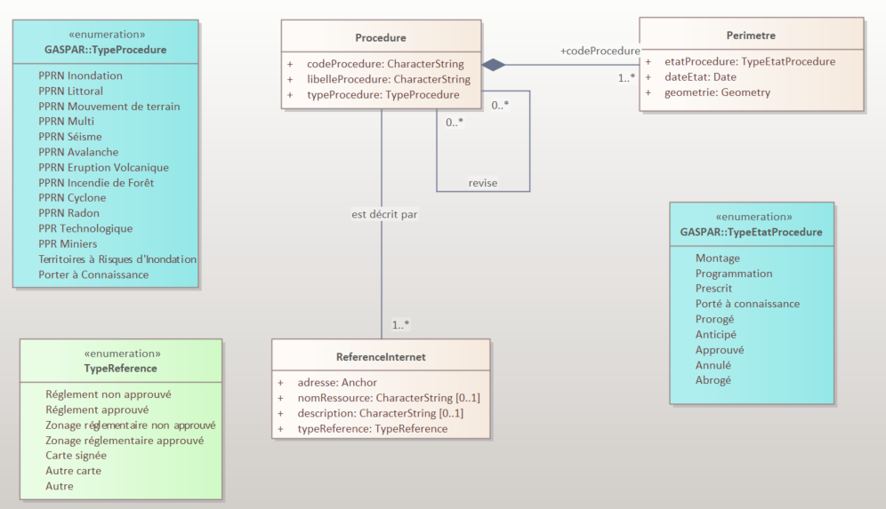
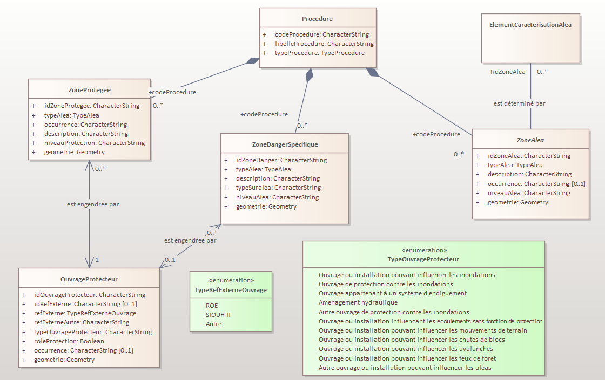

# Géostandards Risques - Modèle Commun

*Version 0.1 - Date*

---

> *Tableau de présentation du document à compléter...*

| | Conseil National de l'Information Géolocalisée |
|-|-|
| **Titre** | Géostandards Risques - Modèle Commun |
| **Sous-titre** | *à remplir si besoin* |
| **Description** | *à remplir* |
| **Date** | *xx/xx/xxxx* |
| **Versions** | *0.1* |
| **Résumé** | *à remplir* |
| **Statut juridique** | *à remplir si besoin* |
| **Sources** | *à remplir si besoin* |
| **Rapporteurs** | Gilles Cébélieu et Alison Lenain (IGN) |
| **Contributeurs** | Membres du Groupe de Travail CNIG Géostandards Risques |
| **Relecteurs** | Membres du Groupe de Travail CNIG Géostandards Risques |
| **Format** | *à remplir* |
| **Diffusion** | *à remplir* |
| **Organisme** | Conseil National de l'Information Géolocalisée ([CNIG](http://cnig.gouv.fr/)) |
| **Langue** | français |
| **Mots-clés** | *à remplir* |
| **Statut du document** | Projet - ~~Appel à commentaires~~ - ~~Proposé à la commission des Standards du CNIG~~ - ~~Validé~~ |
| **Licence** | Le présent document est sous [Licence Ouverte (Open Licence) Etalab](https://www.etalab.gouv.fr/licence-ouverte-open-licence/) |

---

### Historique du document

| Version | Date | Raison |
| - | - | - |
| 0.1 | *xx* | Première rédaction en cours |

### Objet du document

> *Résumé et objectif du document.*

### Contributeurs

> *Liste des contributeurs au document ici (précision par rapport au tableau du début)*

| Nom |Affiliation |
| - | - |
| Besson Stanislas | DDT de l'Isère (38) |
| Bonnin Nicolas | MTE / DGPR / DAGSI |
| Boudesseul Nicolas | DREAL Pays de la Loire |
| Cébélieu Gilles | IGN  | 
| Chrétien Guillaume | DDTM de la Seine Maritime (76) |
| Di Salvo Magali | DREAL Auvergne Rhone Alpes |
| Lenain Alison | IGN |
| Perehin Céline | Cerema |
| Tardivo Bénédicte | MTE / DGPR / BRIL |
| Teixeira Anthony | MTE / DGPR / BRIEC |

Le groupe de travail CNIG sur la refonte des Géostandards risques rassemble les acteurs impliqués dans l’élaboration, la gestion et la diffusion des données de prévention des risques relatives à ces standards ainsi que des utilisateurs amenés à exploiter ces données. Il est animé par l’IGN pour le compte de la Direction Générale de la Prévention des Risques (DGPR).

### Table des matières

> *A générer*

### Glossaire

| Terme | Définition|
|-|-|
| Risque | *défintion du terme "risque"* |
| Aléa | *définition du terme aléa* |
| Opposable | Un document juridique est opposable aux tiers quand tout le monde doit le respecter, même les personnes qui ne l'ont pas signé. Dans le cadre de la prévention des risques, ce terme s'applique a des périmètres géographiques associés à une procédure lorsqu'elle est validée par une autorité publique et sur lesquels s'appliquent des contraintes réglementaires notamment en terme d'urbanisme. |

### Acronymes et abréviations

**BRIL** Bureau des risques d'inondation et littoraux

**BRIEC** Bureau des risques des industries de l’énergie et de la chimie 

**Cerema** Centre d’études et d’expertises sur les risques, l’environnement, la mobilité et l’aménagement

**CNIG** Comité national de l'information géolocalisée

**DAGSI** Département des affaires générales et des systèmes d’information

**DDT(M)** Direction départementale des territoires (et de la mer) 

**DGPR** Direction générale de la prévention des risques

**DREAL** Direction régionale de l'environnement, de l'aménagement et du logement

**GASPAR** Base nationale de gestion assistée des procédures administratives relatives aux risques

**IGN** Institut national de l'information géographique et forestière

**MTE** Ministère de la transition écologique et de la cohésion des territoires 

**PPRN** Plan de Prévention des Risques Naturels

### Clés de lecture

> *Si besoin, présentation de la structure du document*

---

## Domaine d'application

> *Cette partie permet de préciser le contexte dans lequel s’inscrit le standard, ce que couvrent et décrivent les données et ce à quoi les données qu’il décrit sont amenées à servir. On y précisera notamment le cadre réglementaire des données de prévention des risques concernées, ainsi que le cycle de vie des données. Dans le domaine d’application on pourra aussi préciser l’étendue géographique couverte par les données (les territoires concernés).*

### Description et exigences générales

Ce standard propose une description de l'information géographique liée à une procédure de prévention des risques (*definir ou préciser "procédure de prévention des risques"*) et au cadre réglementaire dans lequel elle s'inscrit. Il définit un modèle conceptuel commun décrivant les concepts mis en oeuvre dans (cette liste pouvant être étendue par la suite):

* les plans de prévention des risques, naturels prévisibles, technologiques et miniers
* la description des Territoire à Risques d'Inondation (TRI) dans le cadre de l'application de la Directive Inondation
* les procédures de porter à connaissance

L'application de ce modèle dans le cadre de ces procédures est définie dans les profils applicatifs dédiés qui accompagnent ce standard (*références à fournir*).

Ce standard et les profils applicatifs dédiés se substituent et rendent obsolètes les dernières version des standards COVADIS suivants :

* Plan de prévention des risques naturels ou technologiques PPRN – PPRT, version 1.0, corrigée du 31/12/2012 ;
* Plan de prévention des risques miniers (PPRM), version 1.0 du 16 septembre 2015 ;
* Directive Inondation, version 2.1 – juillet 2019

### Cadre réglementaire des Géostandards

#### Cadre réglementaire des Plans de Prévention des Risques

##### Cadre réglementaire des Plans de Prévention des Risques Naturels Prévisibles

La mise en oeuvre des Plans de prevention des risques naturels et prévisibles est définie dans le code de l'environnement par :

* Les [articles L562-1 à L562-9 du code de l'environnement](https://www.legifrance.gouv.fr/codes/section_lc/LEGITEXT000006074220/LEGISCTA000006159296/#LEGISCTA000006159296) pour la partie législative ;
* Les [Articles R562-1 à R562-11-9](https://www.legifrance.gouv.fr/codes/section_lc/LEGITEXT000006074220/LEGISCTA000006177007/#LEGISCTA000006177007) pour la partie réglementaire.

Le [décret n° 2019-715 du 5 juillet 2019 relatif aux plans de prévention des risques concernant les « aléas débordement de cours d’eau et submersion marine »](https://www.legifrance.gouv.fr/jorf/id/JORFTEXT000038730841), dit « décret PPRi », précise les modalités de détermination, de qualification et de cartographie de l'aléa de référence et du zonage réglementaire pour l’élaboration des PPRN portant sur les aléas débordement de cours d’eau (à l’exclusion des débordements de cours d’eau torrentiel) et submersion marine.

##### Cadre réglementaire des Plans de Prévention des Risques Technologiques

> *à écrire*

##### Cadre réglementaire des Plans de Prévention des Risques Miniers

> *à écrire*

#### Cadre réglementaire des Territoires à Risques d'Inondation

> *à écrire*

#### Cadre réglementaire des Porter à Connaissance

> *à écrire*

### Cycle de vie des données de prévention des risques

#### Les différents états d'une procédure de Plan de Prévention des risques

> *à écrire : cf. les différents états d'une procédure GASPAR*
> *Notions de procédures révisantes et révisées dans GASPAR*

---

## Modèle commun de données

> *Description des thématiques, des classes,attributs, ...*
> *Cette partie constitue le cœur du standard de définition du modèle commun de donnée. Elle doit permettre de définir pour chacune des thématiques :*
> 
> *- Les classes d’objets, les relations entre elles et leurs attributs ;* 
> 
> *- Les définitions des attributs, leur type, leur cardinalité, leur caractère obligatoire ou non ;*
>
> *- Les contraintes sémantiques, géométriques et topologiques qui peuvent s’appliquer ;*
>
> *- Les attentes de qualité sur des données (exhaustivité, précision, …) ;*
>
> *- Les éléments de métadonnées au niveau général ou des jeux de données.*

> *Insérer un schéma global des thématiques ici*

### Thématique Procédures et périmètres

La thématique "Procédures et périmètre" regroupe les informations relatives au suivi administratif des procédures de prévention des risques et aux différents types de périmètres qui précèdent l'établissement du zonage réglementaire. Ces informations de suivi sont saisies et gérées par les services déconcentrés de l'Etat dans l'application GASPAR du MTE.

Le modèle de données de ce standard ne reprend que les informations du système GASPAR qui permettent de faire le lien avec la procédure qui est concernée et de faire état de son actualité. Les correspondances entre les données de standard et le modèle de données du système GASPAR sont précisées dans le [paragraphe dédié](#correspondances-avec-le-mod%C3%A8le-de-donn%C3%A9es-gaspar).

La liste des types de procédures prises en charge par ce standard est établie par le type énuméré [TypeProcedure](#enumeration-typeprocedure) et correspond à des types de procédures gérés dans GASPAR. 

Un objet de la classe [Procedure](#classe-dobjets-procedure) correspond à une procédure saisie dans GASPAR. Le champs "codeProcedure" contient la valeur de l'identifiant de la procédure dans GASPAR et permet ainsi de faire le lien entre les données de ce système.

Une procédure peut être la révision d'une ou de plusieurs anciennes procédures. Elle peut aussi faire l'objet d'une ou plusieurs autres procédures de révision. Ce lien potentiel entre différentes procédures est réprésenté par l'association ["revise"](*lien à rajouter*).

A une procédure donnée peuvent être associés plusieurs périmètres sur lesquels l'état d'avancement de la procédure peut être différent. La classe ["Perimetre"](*lien à rajouter*) permet de les décrire. La liste des états d'avancement possibles pour une procédure sur un périmètre est établie par le type énuméré [TypeEtatProcedure](*lien à rajouter*) et correspond aux différents états d'avancements d'une procédure identifiés dans GASPAR.

Les ressources internets liées à une procédure donnée (par exemple la publications d'un PPRI sur le site de la préfectue concernée) sont décrites l'aide d'objets de la classe [Reference Internet](#classe-dobjets-referenceinternet) qui permet d'indiquer l'adresse internet le nom et la description de la ressource.  

**Fig. *xx* Modèle UML des classes relatives aux procédeures et périmètres.**

#### Classe d'objets *Procedure*

**Nom de la classe** : Procedure

**Titre** : Procédure Administrative

**Définition** : La classe "Procedure" permet de faire le lien entre un jeu de données du Standard et le système GASPAR. Un objet de cette classe correspond à une procédure unique identifiée dans GASPAR.

**Modélisation géométrique** : Cette classe n'a pas de géométrie.

**Propriétés** : 

| Nom de la propriété | Définition | Type | Valeurs possibles | Contraintes |
|-|-|-|-|-|
| codeProcedure | Identifiant de la procédure dans le système GASPAR. | CharacterString | La syntaxe d'un code de procédure est déterminée par le système GASPAR. | 1..1  |
| libelleProcedure | Nom de la procédure lisible par un être humain. | CharacterString | La syntaxe du libellé d'une procédure est déterminée par le système GASPAR. *A noter une bonne pratique de nommage est la suivante : xxx* | 1..1  |
| typeProcedure | Type de procédure selon la classification dans le système GASPAR | Enumeration [TypeProcedure](#enumeration-typeprocedure) | Celles de l'énumération | 1..1 |

#### Associations de la classe procedure

| Nom de l'association | Type | Définition | Classe de départ | Classe d'arrivée |
|-|-|-|-|-|
| **revise** | Association | Relation sémantique permettant d'indiquer qu'une procédure est la révision de zéro ou plusieurs procédures existantes et inversement qu'une procédure peut être révisée par zéro ou plusieurs procédures GASPAR. | [Procedure](#classe-dobjets-procedure) (0..\*) | [Procedure](#classe-dobjets-procedure) (0..\*) |
| **est decrit par** | Association | Relation sémantique permettant d'indiquer qu'une procédure est documentée par une ou plusieurs référennces sur internet. | [Procedure](#classe-dobjets-procedure) (1..1) | [ReferenceInternet](#classe-dobjets-referenceinternet) (1..\*) |

#### Classe d'objets *Perimetre*

**Nom de la classe** : Perimetre

**Titre** : Périmètre

**Définition** : La classe Perimetre permet de décrire l'état d'avancement d'une procédure sur une zone géographique donnée. Pour une même procédure donnée à un instant donné, plusieurs périmètres peuvent exister dans des états d'avancement différents.

**Modélisation géométrique** : Multi-Polygone. Les éléments relatifs à l'origine de saisie de la géométrie, sa précision ou sa qualité sont précisés dans les [métadonnées](#métadonnées).

**Propriétés** : 

| Nom de la propriété | Définition | Type | Valeurs possibles | Contraintes |
|-|-|-|-|-|
| codeProcedure | Identifiant de la procédure décrite par le périmètre. Ce champ permet de faire le lien avec l'objet correspondant de la classe [Procedure](#classe-dobjets-procedure) | CharacterString | La valeur de ce champ doit aussi exister comme valeur de la propriété *codeProcedure* de la classe [Procedure](#classe-dobjets-procedure). | 1..1 |
| etatProcedure | Etat d'avancement de la procédure référencée par *codeProcedure* sur le périmètre | Enumeration [TypeEtatProcedure](#etats-dune-procédure) | Celles de l'énumération | 1..1 |
| dateEtat | Date à partir de laquelle l'état d'avancement de la procédure sur ce périmètre est effectif. | Date | valeur représentant une date : jour(optionnel), mois(optionnel), année | 1..1 |

#### Classe d'objets *ReferenceInternet*

**Nom de la classe** : ReferenceInternet

**Titre** : Référence Internet

**Définition** : La classe ReferenceInternet permet de décrire des ressources accessibles sur internet, qu'il sagisse d'une page html, d'une arborescence d'un site web ou de documents téléchargeables. Un objet de cette classe représente un telle ressource, caractérisée de manière unique par son adresse sur internet (URL).

**Modélisation géométrique** : Cette classe n'a pas de géométrie.

**Propriétés** : 

| Nom de la propriété | Définition | Type | Valeurs possibles | Contraintes |
|-|-|-|-|-|
| adresse | Adresse internet de la ressource (URL) | CharacterString | formalisme d'URL à respecter | 1..1 | 
| nomRessource | Nom de la ressource référencée sur Internet | CharacterString | Saisie Libre | 0..1 (Saisie recommandée) |
| description | Description de la ressource référencée sur Internet. Ce champ peut permettre notamment d'indiquer le type de ressource (site web, page HTML, document PDF, ...) | CharacterString | Saisie libre | 0..1 |

#### Enumeration *TypeProcedure*

Le tableau suivant liste les différents types de procédures de prévention des risques pouvant être décrites. Les correspondances avec les types de procédures gérés dans GASPAR sont précisées dans le [paragraphe dédié](#types-de-procédures-gaspar).

| Libellé | Description |
|-|-|
| Plan de Prévention des Risques Naturels | |
| Plan de Prévention des Risques Naturels Innondation | Ce type de procédure couvre les risques naturels liés aux inondations par ruissellement, par débordement de cours d'eau, par submersion marine et par remontée de nappe |
| Plan de Prévention des Risques Naturels Littoral | Ce type de procédure couvre les risques naturels liés aux retraits du trait de cote et la submersion marine |
| Plan de Prévention des Risques Naturels Mouvement de Terrain | Ce type de procédure couvre les risques naturels liés aux éboulements ou chutes de blocs rocheux, glissements de terrain, coulées boueuses, effondrements de cavités souterraines, l'érosion de berge et au retrait-gonflement des argiles |
| Plan de Prévention des Risques Naturels Multirisques | Ce type de procédure couvre plusieurs types de risques naturels |
| Plan de Prévention des Risques Naturels Séisme | Ce type de procédure couvre les risques naturels liés aux tsunamis, mouvements de terrain, et la liquéfaction des sols|
| Plan de Prévention des Risques Naturels Avalanches | Ce type de procédure couvre les risques naturels liés aux avalanches spontanées, avalanches provoquées naturellement, avalanches provoquées accidentellement, et aux avalanches provoquées artificiellement |
| Plan de Prévention des Risques Naturels Eruption volcanique |Ce type de procédure couvre les risques naturels liés aux glissements de terrain, modification du cours des rivières, tsunamis, et la destruction des réseaux d’eau, d’énergie ou de communication |
| Plan de Prévention des Risques Naturels Incendie de forêt | Ce type de procédure couvre les risques naturels liés aux incendies |
| Plan de Prévention des Risques Naturels Cyclone | Ce type de procédure couvre les risques naturels liés à l'activité cyclonique |
| Plan de Prévention des Risques Naturels Radon | Ce type de procédure couvre les risques naturels liés aux formations géologique, failles, ouvrages miniers, et aux sources hydrothermales |
| Plan de Prévention des Risques Technologiques | Ce type de procédure couvre les risques liés aux risques nucléaire, industriels, de transport de matières dangereuses et de rupture de barrage |
| Plan de Prévention des Risques Miniers | Ce type de procédure couvre les risques liés aux mouvements de terrains en lien avec les ouvrages souterrains ou les ouvrages de surface, l'échauffement / la combustion de terril , l'émission de gaz de mine , la pollution des sols et des eaux et l'inondation |
| Territoires à Risque Important d’Inondations |Ce type de procédure couvre le risque inondation. Il est lié à la mise en œuvre de la Directive Inondation |

#### Enumeration *Etats d'une procédure*

Le tableau suivant liste les différents états possibles d'une procédure applicable sur un périmètre donné. Les correspondances de ces états avec les états possibles gérés dans GASPAR sont précisés dans le [paragraphe dédié](#etats-dune-procédure-gaspar).

| Libellé Etat | Description |
|-|-|
| Début programmation | Date de début de la programmation |
| Début montage | Date de début du montage |
| Prescrit | La procédure a été validée par le préfet, ce qui rend le périmètre opposable aux tiers |
| Prorogé | La durée de validité du périmètre est prolongée au delà de la date initialement fixée |
| Anticipé | Le périmètre peut être opposable avant sa publication grâce à un arrêté du préfet qui approuve par anticipation |
| Approuvé | Le périmètre est validé par l'autorité compétente et il est opposable |
| Déprescrit | Le périmètre n'est plus opposable *pour quelle raison (différence avec les états "Annulé" et "Abrogé") ?* |
| Annulé | Le périmètre n'est plus opposable avec effet rétroactif |
| Abrogé | Le périmètren'est plus opposable sans effet rétroactif |

### Thématique Aléas

La thématique aléas porte sur la description des phénomènes, leur localisation, leurs probabilités et leurs intensités.

La classe [ZoneAlea](#classe-dobjets-zonealea) permet de décrire les zones soumises à des aléas, en indiquant le type d'aléa (classifié à l'aide l'énumération [TypeAlea](#enumeration-typealea)) qui la concerne, son intensité (classifiée selon l'énumération [TypeNiveauAlea](#enumeration-typeniveaualea)) et sa probabilité. Les zones d'aléas sont définies par rapport à une procédure donnée.

Dans certains cas (essentiellement issus du risque inondation) une zone d'aléa peut être liée à des ouvrages de protection et dans ce cas être caractérisées comme aléa spécifique (défini par l'énumération [TypeZoneAlea](#enumeration-typezonalea). Les ouvrages de protection sont déjà décrits dans d'autres référentiels plus ou moins normatifs (*références à inclure*). Ce Standard propose seulement une classe [OuvrageProtection](#classe-dobjets-ouvrageprotection) qui permet de pointer vers les objets de ces référentiels lorsqu'ils doivent être inclus dans une cartographie de prévention des risques.

Les zones d'aléas sont déterminées à partir d'éléments techniques, spécifiques aux types d'aléas décrits, par exemple les surfaces iso-hauteur d'eau permettant de déterminer les surfaces inondables. Ce standard ne définit pas spécifiquement chacun de ces éléments mais propose une classe générique [ElementDeterminationAlea](#classe-dobjets-elementdeterminationalea) qui pourra être spécialisée au besoin selon les profils applicatifs de façon à rattacher ces éléments aux zones d'aléas qu'ils permettent de déterminer.

**Fig. *xx* Modèle UML des classes relatives aux aléas.**

#### Classe d'objets *ZoneAlea*

**Nom de la classe** : ZoneAlea

**Titre** : Zone d'aléa

**Définition** : La classe Zone d'aléa permet de décrire des zones géographiques soumises à des aléas et d'en préciser le type d'aléa, son intensité, et sa probabilité d'occurence. Un objet de la classe représente une zone associée en particulier à un type d'aléa donné, avec une intensité et potentiellement une occurence. De ce fait, différentes zones d'aléas peuvent se recouvrir entre elles à partir du moment où certaines de ces propriétés sont différentes.

**Modélisation géométrique** : Multi polygone de façon à pouvoir matérialiser des géométries complexes. Il est cependant recommandé de restreindre la géométrie à des surfaces élémentaires dans la mesure du possible de façon à éviter des objets avec un géométrie trop lourde et difficiles à manipuler en SIG.

**Propriétés** : 

| Nom de la propriété | Définition | Type | Valeurs possibles | Contraintes |
|-|-|-|-|-|
| idZoneAlea | Identifiant unique d'un objet zone d'aléa | CharacterString | Deux objets de la classe ZoneAlea ne peuvent pas avoir la même valeur pour cette propriété | 1..1 | 
| codeProcedure | Identifiant de la procédure pour laquelle la zone d'aléas a été calculée. Ce champ permet de faire le lien avec l'objet correspondant de la classe [Procedure](#classe-dobjets-procedure) | CharacterString | La valeur de ce champ doit aussi exister comme valeur de la propriété codeProcedure d'un objet de la classe [Procedure](#classe-dobjets-procedure) | 1..1 |
| typeAlea | Type de l'alea associé à la zone d'aléa, selon la nomenclature définie dans GASPAR et reprise par l'énumération [TypeAlea](#enumeration-typealea) | Enumération [TypeAlea](#enumeration-typealea) | Celles de l'énumération | 1..1 |
| niveauAlea | Caractérisation du niveau d'intensité de l'aléa selon la classification définie dans GASPAR et reprise par l'énumération [TypeNiveauAlea](#enumeration-typeniveaualea). Les régles de détermination d'un niveau d'aléa dépend du type d'aléa concerné et sont spécifiées dans des guides ad'hoc dont il doit être fait mention dans les métadonnées accompagnant le jeu de données de prévention des risques. | Enumération [TypeNiveauAlea](#enumeration-typeniveaualea) | Celles de l'énumération | 1.1 |
| occurence | Ce champ permet d'indiquer l'occurence de survenue de l'aléa. Selon le type d'aléa, il pourra s'agir d'une probabilité (par exemple période de retour) ou d'un autre indicateur, à définir dans les profils applicatifs. | CharacterString | Saisie libre, éventuellement contrainte selon le type d'aléa | 0..1 |
| description | Description textuelle de la zone d'aléa | CharacterString | Saisie libre | 0..1 |
| aleaSpecifique | Cette propriété permet d'indiquer que la zone d'aléa correspond à un type d'aléa particulier listé parmi les valeurs possibles de l'énumération [TypeZoneAlea](#enumeration-typezonalea), en lien avec la présence d'un ouvrage de protection. Ce champ est facultatif. S'il n'est pas renseigné, alors la zone d'aléa est déterminée par un aléa non spécifique. | Enumération [TypeZoneAlea](#enumeration-typezonalea) | Celles de l'énumération ou non renseigné | 0..1 |

#### Associations de la classe ZoneAlea

| Nom de l'association | Type | Définition | Classe de départ | Classe d'arrivée |
|-|-|-|-|-|
| **est déterminé par** | Association | Relation sémantique permettant de faire le lien entre une zone d'aléa et des éléments qui ont pu permettre de la calculer, décrits par la classe générique [ElementDeterminationAlea](#classe-dobjets-elementdeterminationalea).| [ZoneAlea](#classe-dobjets-zonealea) (0..1) | [ElementDeterminationAlea](#classe-dobjets-elementdeterminationalea) (0..\*) |
| **est engendré par** | Association | Relation sémantique permettant d'associer une zone d'aléa qui serait la conséquence de d'un ouvrage de protection avec l'objet décrivant l'ouvrage en question. | [ZoneAlea](#classe-dobjets-zonealea) (0..1) |  [OuvrageProtection](#classe-dobjets-ouvrageprotection) (0..1) |

#### Classe d'objets *OuvrageProtection*

**Nom de la classe** : OuvrageProtection

**Titre** : Ouvrage de protection

**Définition** : La classe Ouvrage de protection permet de faire état des ouvrages de protection contre les aléas (par exemple des digues en prévention des risques d'inondation). La modélisation de ces ouvrages est décrite dans d'autres référentiels tels que le Référentiel des Obstacles à l'Ecoulement ou le Système d'Information sur les Ouvrages Hydrauliques (SIOuH), cette classe permet de faire le lien avec des objets qui en sont issus.

**Modélisation géométrique** : Pas de géométrie. La géométrie est portée par les objets vers lesquels cette classe permet de pointer.

**Propriétés** : 

| Nom de la propriété | Définition | Type | Valeurs possibles | Contraintes |
|-|-|-|-|-|
| refExterne | Nom du référentiel externe d'où est extrait l'objet | CharacterString | La valeur doit désigner de manière non ambigue un nom et une version du référentiel utilisé | 1..1 | 
| idRefExterne | Identifiant de l'objet dans le référentiel externe d'où il est extrait | CharacterString | Le formalisme de l'identifiant est déterminé par les spécifications du référentiel externe | 1..1 | 

#### Classe d'objets *ElementDeterminationAlea*

**Nom de la classe** : ElementDeterminationAlea

**Titre** : Element de détermination d'aléa

**Définition** : La classe Element de détermination d'aléa est une classe générique (abstraite) qui permet de lier des objets spécifiques (issus d'études hydrauliques par exemple) ayant permis de déterminer une zone d'aléa. Elle a vocation à être spécialisée en fonction de l'application de ce modèle.

**Modélisation géométrique** : Classe générique ne portant pas de géométrie à priori. Ses classes dérivées peuvent en porter selon les cas.

**Propriétés** : 

| Nom de la propriété | Définition | Type | Valeurs possibles | Contraintes |
|-|-|-|-|-|
| idZoneAlea | Identifiant de la zone d'aléa qui a été déterminée par cet élément | CharacterString | Valeur d'un identifiant porté par un objet de classe zoneAlea | 1..1 | 

#### Enumeration *TypeAlea*

Le tableau suivant liste les différents types d'aléas applicables les zones d'Aléas. Les correspondances avec la nomenclature définie dans GASPAR sont précisées dans le [paragraphe dédié](#nomenclature-des-risques-et-de-leurs-codes-dans-gaspar). A noter que Les libellés intègrent la hiérarchisation à trois niveau proposée par la nomenclature GASPAR.

| Libellé Aléa |
|-|
| Risque naturel ; Inondation ; Par une crue à débordement lent de cours d'eau |
| Risque naturel ; Inondation ; Par une crue torrentielle ou à montée rapide de cours d'eau |
| Risque naturel ; Inondation ; Par ruissellement et coulée de boue |
| Risque naturel ; Inondation ; Par lave torrentielle (torrent et talweg) |
| Risque naturel ; Inondation ; Par remontées de nappes naturelles |
| Risque naturel ; Inondation ; Par submersion marine |
| Risque naturel ; Mouvement de terrain ; Affaissement et effondrements (cavités souterraines hors mines) |
| Risque naturel ; Mouvement de terrain ; Eboulement ou chutes de pierres et de blocs |
| Risque naturel ; Mouvement de terrain; Glissement de terrain |
| Risque naturel ; Mouvement de terrain; Avancée dunaire |
| Risque naturel ; Mouvement de terrain; Recul du trait de côte et de falaises |
| Risque naturel ; Séisme |
| Risque naturel ; Avalanche |
| Risque naturel ; Eruption volcanique |
| Risque naturel ; Feu de forêt |
| Risque naturel ; Phénomène lié à l'atmosphère ; Cyclone / Ouragan |
| Risque naturel ; Phénomène lié à l'atmosphère ; Tempête et grains (vent) |
| Risque naturel ; Phénomène lié à l'atmosphère ; Foudre |
| Risque naturel ; Phénomène lié à l'atmosphère; Grêle |
| Risque naturel ; Phénomène lié à l'atmosphère; Neige et pluies verglaçantes |
| Risque naturel ; Radon  |
| Risque technologique ; Risque industriel ; Effet thermique |
| Risque technologique ; Risque industriel ; Effet de surpression |
| Risque technologique ; Risque industriel ; Effet toxique |
| Risque technologique ; Risque industriel ; Effet de projection |
| Risque technologique ; Nucléaire |
| Risque technologique ; Rupture de barrage |
| Risque technologique ; Transport de marchandises dangereuses |
| Risque technologique ; Engins de guerre |
| Risque minier ; Affaissement minier ; Effondrements généralisés |
| Risque minier ; Affaissement minier ; Effondrements localisés |
| Risque minier ; Affaissement minier ; Affaissements progressifs |
| Risque minier ; Affaissement minier ; Tassements |
| Risque minier ; Affaissement minier ; Glissements ou mouvements de pente |
| Risque minier ; Affaissement minier ; Coulées |
| Risque minier ; Affaissement minier ; Ecroulements rocheux |
| Risque minier ; Inondations de terrains miniers ; Pollution des eaux souterraines et de surface |
| Risque minier ; Inondations de terrains miniers ; Pollution des sédiments et des sols |
| Risque minier ; Emissions en surface de gaz de mine |
| Risque minier ; Echauffement des terrains de dépôts |

#### Enumeration *TypeNiveauAlea*

Le tableau suivant liste les valeurs possibles pour caractériser l'intensité des aléas. Elles représentent une gradation sur une échelle croissante d'intensité. Les règles de détermination du niveau varient en fonction de la zone et du type d'aléa et sont précisées dans des guides dédiés qui sont référencés dans les métadonnées associées au jeu de données.

| Code | Libellé Etat | 
|-|-|
| 01 | Faible |
| 02 | Moyen |
| 03 | Moyen plus |
| 04 | Fort |
| 05 | Fort plus |
| 06 | Très fort |
| 07 | Très fort plus |

#### Enumeration *TypeZoneAlea*

Le tableau suivant liste les valeurs possibles permettant de caractériser les zones d'aléas lorsqu'elles sont engendrées par des ouvrages de protection. 

| Libellé Etat | Description |
|-|-|
| zone de sur-aléa | Zone où le risque est plus important si l’ouvrage de protection cède que si l’ouvrage de protection n’avait pas existé |
| zone de projection | Il s'agit de la zone décrivant les secteurs soumis aux chocs de vagues et aux projections tels que définis dans le guide PPRL |

### Thématique Origine du Risque

### Thématique Enjeux

### Thématique Zone réglementaire

---

## Métadonnées

> *Elements de métadonnées relatifs aux series et dataset*

---

## Correspondances INSPIRE

> *Cette partie doit permettre de faire le lien entre le modèle de données et les modèles de données des thématiques INSPIRE en lien avec les standards risques, à savoir :*
 

### Lien avec le thème 4 Usage des sols de l'annexe III

> *classes concernées et mapping à écrire* 

### Lien avec le thème 8 Lieux de production et sites industriels de l'Annexe III 

> *classes concernées et mapping à écrire* 

### Lien avec le thème 11 Zones de gestion, de restriction ou de réglementation et unités de déclaration de l'annexe III*

> *classes concernées et mapping à écrire* 

### Lien avec le thème 12 Zones de risque naturel de l'annexe III de la directive INSPIRE.*

> *classes concernées et mapping à écrire* 

## Autres correspondances

> *D’autres correspondances pourront aussi être proposées dans ce document dans un but d’harmonisation et de cohérence, notamment avec le modèle de données de GASPAR et ceux des standards Vigilance crues et inondations, ou, sous forme de références, avec des standards dédiés à des types de risques particuliers.*

### Correspondances avec le modèle de données GASPAR

#### Nomenclature des identifiants dans GASPAR

> *Expliquer ici comment sont structurés les identifiants GASPAR*

#### Nomenclature des risques et de leurs codes dans GASPAR

GASPAR propose une nomenclature des risques hiérarchisée sur trois niveaux croissants de spécialisation du risque, avec une codification correspondante preséntée dans le tableau suivant. 

L'énumération [TypeAlea](#enumeration-typealea) présentée définie dans ce standard, s'appuie sur cette nomenclature, __en utilisant uniquement les codes de niveau hiérarchique le plus haut__, comme c'est la règle dans l'application GASPAR. Les aléas utilsés par le standard sont représentés en **gras** dans le tableau. Les libellés de l'énumération correspondants aggrègent les libellés des niveaux hiérarchiques inférieurs lorsqu'il y en a. 

Par exemple, le libellé de l'énumération correspondant au code d'aléa "114" est : "Risque naturel ; Inondation ; Par ruissellement et coulée de boue" car il est hiérarchisé ainsi dans la nomenclature :

- niveau 1 : "Risque naturel"
- niveau 2 : "Inondation"
- niveau 3 : "Par ruissellement ert coulée de boue"

| Code | Niveau | Libellé Risque
| - | - | - |
| 1 | 1 | Risque Naturel |
| 11 | 2 | Inondation |
| **112	| 3 | Par une crue à débordement lent de cours d'eau |
| 113	| 3 | Par une crue torrentielle ou à montée rapide de cours d'eau |
| 114	| 3 | Par ruissellement et coulée de boue |
| 115	| 3 | Par lave torrentielle (torrent et talweg)  |
| 116 | 3 | Par remontées de nappes naturelles |
| 117	| 3 | Par submersion marine** |
| 12 | 2 | Mouvement de terrain |
| **121	| 3 | Affaissement et effondrements (cavités souterraines hors mines) |
| 123	| 3 | Eboulement ou chutes de pierres et de blocs |
| 124	| 3 | Glissement de terrain |
| 125	| 3 | Avancée dunaire |
| 126	| 3 | Recul du trait de côte et de falaises |
| 127	| 3 | Tassement différentiels |
| 13 | 2 | Séisme |
| 14 | 2 | Avalanche |
| 15 | 2 | Eruption volcanique |
| 16 | 2 | Feu de forêt** |
| 17 | 2 | Phénomène lié à l'atmosphère |
| **171 |	3 | Cyclone / Ouragan |
| 172	| 3 | Tempête et grains (vent) |
| 174	| 3 | Foudre |
| 175	| 3 | Grêle | 
| 176	| 3 | Neige et pluies verglaçantes |
| 18 | 2 | Radon** |
| 2 | 1 | Risque technologique |
| 21	| 2 | Risque Industriel |
| **211	| 3 | Effet thermique |
| 212	| 3 | Effet de surpression | 
| 213	| 3 | Effet toxique  |
| 214	| 3 | Effet de projection |
| 22	| 2 | Nucléaire |
| 23	| 2 | Rupture de barrage |
| 24	| 2 | Transport de marchandises dangereuses |
| 25	| 2 | Engins de guerre** |
| 3 | 1 | Risque minier |
| 31 | 2 | Affaissement minier |
| **311	| 3 | Effondrements généralisés | 
| 312	| 3 | Effondrements localisés | 
| 313	| 3 | Affaissements progressifs | 
| 314	| 3 | Tassements | 
| 315	| 3 | Glissements ou mouvements de pente | 
| 316	| 3 | Coulées | 
| 317	| 3 | Ecroulements rocheux** | 
| 32 | 2 | Inondations de terrains miniers |
| **321	| 3 | Pollution des eaux souterraines et de surface |
| 322	| 3 | Pollution des sédiments et des sols |
| 33 | 2 | Emissions en surface de gaz de mine |
| 34 | 2 | Echauffement des terrains de dépôts** |

#### Types de procédures GASPAR

Le tableau suivant liste les différents types de procédures gérées dans GASPAR et en lien avec les Géostandards risques

> *Indiquer l'utilisation des cette classification dans le cadre des Géostandards*

| Code | Libellé |
|-|-|
| PPRN | Plan de Prévention des Risques Naturels |
| PPRN-I | Plan de Prévention des Risques Naturels Innondation |
| PPRN-L | Plan de Prévention des Risques Naturels Littoral |
| PPRN-Mvt | Plan de Prévention des Risques Naturels Mouvement de Terrain |
| PPRN-Multi | Plan de Prévention des Risques Naturels Multirisques |
| PPRN-S | Plan de Prévention des Risques Naturels Séisme |
| PPRN-Av | Plan de Prévention des Risques Naturels Avalanches |
| PPRN-Ev | Plan de Prévention des Risques Naturels Eruption volcanique |
| PPRN-If | Plan de Prévention des Risques Naturels Incendie de forêt |
| PPRN-Cy | Plan de Prévention des Risques Naturels Cyclone |
| PPRN-Rad | Plan de Prévention des Risques Naturels Radon |
| PPRT | Plan de Prévention des Risques Technologiques |
| PPRM | Plan de Prévention des Risques Miniers |
| TRI	| Territoires à Risque Important d’Inondations |

#### Etats d'une procédure GASPAR

Le tableau suivant liste les différents états et des sous-états d'une procédure administrative dans GASPAR.

> *Indiquer l'utilisation des cette classification dans le cadre des Géostandards*

| Code Etat | Libellé Etat | Code sous-état | Libellé sous-état |
|-|-|-|-|
| PRG_MTG	| Programmation et montage | DEB_PRG | Début programmation |
| PRG_MTG | Programmation et montage | FIN_PRG |Fin programmation |
| PRG_MTG | Programmation et montage | DEB_MTG | Début montage |
| PRG_MTG	| Programmation et montage | FIN_MTG | Fin montage |
| PRESCRIT | Prescrit | PRECRIT | Prescrit |
| PRESCRIT | Prescrit | PROROGE | Prorogé |
| OPPOSABLE | Opposable | ANTICIPE | Anticipé |
| OPPOSABLE | Opposable | APPROUVE | Approuvé |
| CADUQUE | Caduque | DEPRESCRIT | Déprescrit |
| CADUQUE | Caduque | ANNULE | Annulé |
| CADUQUE | Caduque | ABROGE | Abrogé |

 

