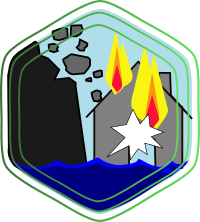
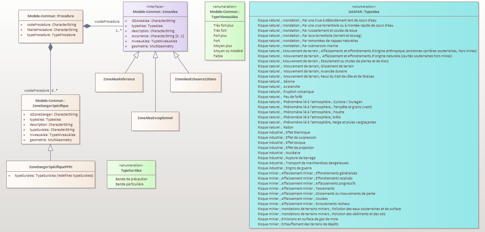
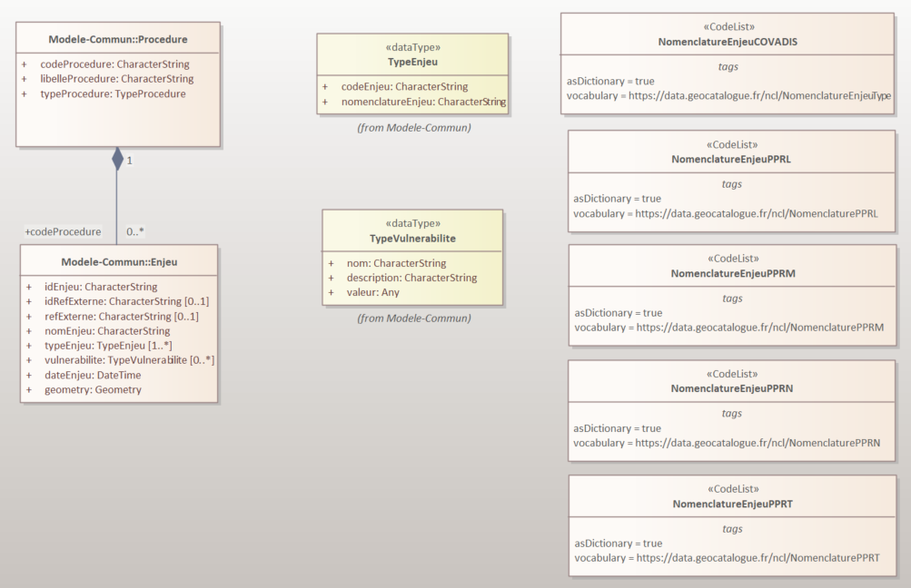
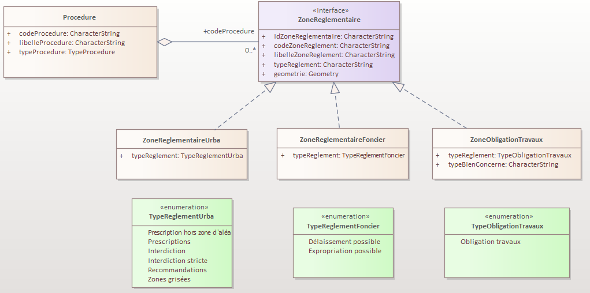

| | |
|-|-|
| |  |


 Conseil national de l'information Géolocalisée





 Géostandards Risques - Profil applicatif PPR


Groupe de travail refonte des Géostandards Risques

*Version 0.1 - Date*


---

---

#  Fiche analytique

> *Tableau de présentation du document à compléter...*

| | |
|-|-|
| **Titre** | Géostandards Risques |
| **Sous-titre** | Profil applicatif PPR |
| **Version du document** | *0.1 - jj mois aaaa (date de publication)*  |
| **Résumé** | *à remplir* |
| **Objectif** | *à remplir* |
| **Etendue d'application** | *à remplir : <Contient l'étendue de la ou les zones géographiques, temporelles ou verticales couvertes par le contenu>* |
| **Resolution spatiale** | *à remplir : <(facultatif) Contient un facteur fournissant une compréhension générale de la densité des données spatiales/du niveau de référence>* |
| **Statut du document** | Projet - ~~Appel à commentaires~~ - ~~Proposé à la commission des Standards du CNIG~~ - ~~Validé~~ |
| **Licence** | Le présent document est sous [Licence Ouverte (Open Licence) Etalab](https://www.etalab.gouv.fr/licence-ouverte-open-licence/) |
| **Diffusion** | *à remplir : <Contient le format de disponibilité et l’endroit où le trouver> Ex PDF sur internet  (site du CNIG)* |
| **Formats disponibles** | *à remplir* |
| **Restriction** | *à remplir* |
| **Thèmes** | *à remplir* |
| **Mots-clés** | *à remplir* |
| **Contact** | *à remplir* |
| **Informations complémentaires** | *à remplir : <(facultatif) Contient toute autre information descriptive sur le contenu et nécessaire à la fiche d’information>* |

---

#  Sommaire

> *A générer*


#  Préface

##  Historique du document

| Version | Date | Raison |
| - | - | - |
| 0.1 | *xx* | Première rédaction en cours |

##  Participation à l'écriture

Ce standard est le fruit des travaux du groupe de travail CNIG sur la refonte des Géostandards risques. Ce dernier rassemble les acteurs impliqués dans l’élaboration, la gestion et la diffusion des données de prévention des risques relatives à ces standards ainsi que des utilisateurs amenés à exploiter ces données. Il est animé par l’IGN pour le compte de la Direction Générale de la Prévention des Risques (DGPR). 

Ce standard a été rédigé par Gilles Cébélieu (IGN) et Alison Lenain (IGN) avec les contributions majeures et les relectures des membres du Groupe de travail listés ci-dessous.

| Nom |Affiliation 
| - | - |
| Besson Stanislas | DDT de l'Isère (38) |
| Bonnin Nicolas | MTE / DGPR / DAGSI |
| Bouffier Jacques | MTE / DGPR / BRIL |
| Boudesseul Nicolas | DREAL Pays de la Loire |
| Chrétien Guillaume | DDTM de la Seine Maritime (76) |
| Di Salvo Magali | DREAL Auvergne Rhone Alpes |
| Evain Yohan | Cerema |
| Perehin Céline | Cerema |

> *liste à compléter et actualiser*


#  Présentation du document


##  Objectif et raison d'être du standard

> *Résumé et objectif du document.*


##  A qui s'adresse ce document ?

> *à remplir* 


##  Comment lire le document

> *Si besoin, présentation de la structure du document*


##  Références à d'autres normes

Le document ci-présent s’appuie ou nécessite la lecture des normes référencées ci-dessous. Pour les références datées ou versionnées, seule l’édition citée compte. Pour les autres, la dernière édition de la norme s’applique.

> *Indiquer ici les documents auquel il est fait références (normes, guides, lois, ...)*


| Accronyme | Titre | Auteur | Année |
|-|-|-|-|
| [CNIG_RISQUES_COMMUN:2024](https://www.legifrance.gouv.fr/jorf/id/JORFTEXT000038730841) | Géostandards Risques - Modèle commun | Conseil National de l'Information Géolocalisée (CNIG) | 2024 | 
| [Decret PPRI:2019](https://www.legifrance.gouv.fr/jorf/id/JORFTEXT000038730841) | Décret n° 2019-715 du 5 juillet 2019 relatif aux plans de prévention des risques concernant les « aléas débordement de cours d’eau et submersion marine » | Journal Officiel de la République Française | 2019 | 
| [Guide PPRL:2014](https://www.ecologie.gouv.fr/sites/default/files/Guide%20PPRL%20-%20version%20finale%20mai%202014.pdf) | Guide méthodologique : Plan de prévention des risques littoraux | DGPR / SRNH | 2014 |
| [Guide PPRT:2007](https://www.ecologie.gouv.fr/sites/default/files/Guide_PPRT_tbd_complet.pdf) | Le plan de prévention des risques technologiques (PPRT) Guide méthodologique | Ministère de l'écologie, du développement et de l'aménagement durables (MEDAD) / Direction de la Prévention des Pollutions et des Risques (DPPR) - Direction Générale de l'Urbanisme de l'Habitat et de la Construction (DGUHC) | 2007 |
| [Guide PPRN:2016](https://www.actu-environnement.com/media/pdf/guide-pprn.pdf) | Plans de prévention des risques naturels prévisibles (PPRN) - Guide général | Direction Générale de la Prévention des Risques (DGPR) - Cerema | 2016 |
| [Guide PPRM:2019](http://www.ecologique-solidaire.gouv.fr/sites/default/files/Guide%20m%C3%A9thodologique%20d%27%C3%A9laboration%20des%20Plans%20de%20pr%C3%A9vention%20des%20risques%20miniers%20%28version%20de%20juillet%202019%29.pdf) | Guide méthodologique pour l’élaboration des plans de prévention des risques miniers | Cerema | 2019 |
| [UNISDR:2009](https://reliefweb.int/attachments/a0ed6b9c-713e-349f-ae9f-d3d8ff336b1f/Rapport_complet.pdf) | Terminologie pour la Prévention des risques de catastrophe | Stratégie internationale de prévention des catastrophes des Nations Unies (UNISDR) | 2009 | 
| [INSPIRE NZ:2013](https://inspire.ec.europa.eu/documents/Data_Specifications/INSPIRE_DataSpecification_NZ_v3.0.pdf) | INSPIRE D2.8.III.12 Data Specification on Natural Risk Zones – Technical Guidelines | European Commission Joint Research Centre | 2013 |
| [OGC:GeoPackage 1.3.1](https://www.geopackage.org/spec131/) | OGC(R) GeoPackage Encoding Standard version 1.3.1 | Open Geospatial Consortium | 2021 |
| [RFC:3986](https://datatracker.ietf.org/doc/html/rfc3986) | Uniform Resource Identifier (URI): Generic Syntax | Network Working Group, The Internet Society | 2005 |
| [ISO:639-2](https://www.loc.gov/standards/iso639-2/) | Codes for the representation of names of languages-- Part 2: alpha-3 code | Library of congress | 2011 |
| [INSPIRE MTD:2013](https://inspire.ec.europa.eu/sites/default/files/documents/metadata/md_ir_and_iso_20131029.pdf) | INSPIRE Metadata Implementing Rules: Technical Guidelines based on EN ISO 19115 and EN ISO 19119 | European Commission Joint Research Centre | 2013 |
| [REG_MESQGEO](https://data.geocatalogue.fr/ncl/mesuresQuaDoGeo) | Registre: mesuresQuaDoGeo - Mesures liées à la Qualité de Données Géographiques | CNIG | En continu |
| [CNIG:SUP:2023](http://cnig.gouv.fr/IMG/pdf/230822_standard_cnig_sup__v2016b_rev2023-08.pdf) | Prescriptions nationales pour la dématérialisation des documents d’urbanisme - SERVITUDES D'UTILITÉ PUBLIQUE - Standard CNIG v2016b (rev. août 2023) | CNIG - Cerema | 2023/08 |


##  Cadre réglementaire des Plans de Prévention des Risques

###  Cadre réglementaire des Plans de Prévention des Risques Naturels Prévisibles

La mise en oeuvre des Plans de prevention des risques naturels prévisibles est définie dans le code de l'environnement par :

* Les [articles L562-1 à L562-9](https://www.legifrance.gouv.fr/codes/section_lc/LEGITEXT000006074220/LEGISCTA000006159296/#LEGISCTA000006159296) pour la partie législative ;
* Les [Articles R562-1 à R562-11-9](https://www.legifrance.gouv.fr/codes/section_lc/LEGITEXT000006074220/LEGISCTA000006177007/#LEGISCTA000006177007) pour la partie réglementaire.

L'[article R214-119-1](https://www.legifrance.gouv.fr/codes/id/LEGIARTI000039001213/2019-08-31) précise la définition du niveau de protection d'une zone protégée par un système d'endiguement.

Le [décret n°2019-715 du 5 juillet 2019 relatif aux plans de prévention des risques concernant les « aléas débordement de cours d’eau et submersion marine »](https://www.legifrance.gouv.fr/jorf/id/JORFTEXT000038730841), dit « décret PPRI », précise les modalités de détermination, de qualification et de cartographie de l'aléa de référence et du zonage réglementaire pour l’élaboration des PPRN portant sur les aléas débordement de cours d’eau (à l’exclusion des débordements de cours d’eau torrentiel) et submersion marine.

###  Cadre réglementaire des Plans de Prévention des Risques Technologiques

La mise en oeuvre des Plans de prévention des risques technologiques est définie dans le code de l'environnement par :

* Les [articles L515-15 à L515-26](https://www.legifrance.gouv.fr/codes/section_lc/LEGITEXT000006074220/LEGISCTA000006176606/#LEGISCTA000006176606) pour la partie législative ;
* Les [articles R515-39 à R515-50](https://www.legifrance.gouv.fr/codes/section_lc/LEGITEXT000006074220/LEGISCTA000006188931/#LEGISCTA000006188931) pour la partie réglementaire ;

###  Cadre réglementaire des Plans de Prévention des Risques Miniers

La mise en oeuvre des Plans de prévention des risques miniers est définie par :

* L'[article L174-5 du code minier](https://www.legifrance.gouv.fr/codes/article_lc/LEGIARTI000046554903?init=true&page=1&query=L174-5&searchField=ALL&tab_selection=all) pour la partie législative ;
* Les [Articles R562-1 à R562-11-9 du code de l'environnement](https://www.legifrance.gouv.fr/codes/section_lc/LEGITEXT000006074220/LEGISCTA000006177007/#LEGISCTA000006177007) pour la partie réglementaire.


##  Compréhension du document

###  Termes spécifiques et définitions

| Terme | Définition|
|-|-|
| Risque | ([INSPIRE NZ:2013] reprise de ISO 31010 - Management du risque) : Un risque est la combinaison d'un événement (Aléa) et la probabilité de son occurence.  |
| Aléa | ([INSPIRE NZ:2013] reprise de [UNISDR:2009]) Un phénomène dangereux, une substance, activité humaine ou condition pouvant causer des pertes de vies humaines, des blessures ou d’autres effets sur la santé, des dommages aux biens, des pertes de moyens de subsistance et des services, des perturbations socio-économiques, ou des dommages à l’environnement.  |
| Aléa de référence | ([Article R562-11-3 du Code de l'environnement](https://www.legifrance.gouv.fr/codes/article_lc/LEGIARTI000038733751)) Dans le cas des aléas de débordement de cours d'eau et submersion marine, l'aléa de référence est l'aléa déterminé à partir de l'évènement le plus important connu et documenté ou d'un évènement théorique de fréquence centennale, si ce dernier est plus important.   |
| Opposable | Un document juridique est opposable aux tiers quand tout le monde doit le respecter, même les personnes qui ne l'ont pas signé. Dans le cadre de la prévention des risques, ce terme s'applique a des périmètres géographiques associés à une procédure lorsqu'elle est validée par une autorité publique et sur lesquels s'appliquent des contraintes réglementaires notamment en terme d'urbanisme. |
| Enjeux | ([INSPIRE NZ:2013] reprise de [UNISDR:2009]) : Personnes, biens, systèmes, ou autres éléments présents dans les zones de risque et qui sont ainsi soumis à des pertes potentielles. *Commentaire : L’exposition peut inclure le nombre de personnes ou les types de bien dans une région. Elle peut être combinée avec la vulnérabilité spécifique des éléments exposés pour un risque particulier, afin d’estimer le risque associé en cette zone.* |
| Vulnérabilité | ([INSPIRE NZ:2013] reprise de [UNISDR:2009]) : Les caractéristiques et les circonstances d’une communauté ou d’un système qui le rendent susceptible de subir les effets d’un danger. *Commentaire: Il existe de nombreux aspects de la vulnérabilité, découlant de divers facteurs physiques, sociaux, économiques et environnementaux. Par exemple, il peut s’agir de la mauvaise conception et construction de bâtiments, de l’insuffisance de la protection de l’actif, du manque d’information du public et de sa sensibilisation, de la reconnaissance officielle de limiter les risques et des mesures de préparation, ou du mépris de sage gestion de l’environnement. La vulnérabilité varie sensiblement au sein d’une communauté et dans le temps. Cette définition identifie la vulnérabilité comme une caractéristique de l’élément d’intérêt (de la communauté ou du système) qui est indépendante de son exposition. Toutefois, dans l’usage commun, le mot est souvent utilisé plus largement pour inclure l’élément de l’exposition.* |
| Délaissement | Dans le contexte du "Droit de délaissement" : Le droit de délaissement est une procédure administrative. Elle permet au propriétaire d’un bien immobilier soumis à des prescriptions d’urbanisme l’empêchant d’en jouir, d’inciter le bénéficiaire de la servitude à acquérir le bien. |
| Expropriation | ([Service-Public.fr](https://www.service-public.fr/particuliers/vosdroits/N326)) L'expropriation est une procédure qui permet à une personne publique (État, collectivités territoriales...) de contraindre un particulier ou une personne morale (entreprise) à céder la propriété de son bien, moyennant le paiement d'une indemnité. |


###  Abréviations


**BRIL** Bureau des risques d'inondation et littoraux

**BRIEC** Bureau des risques des industries de l’énergie et de la chimie 

**Cerema** Centre d’études et d’expertises sur les risques, l’environnement, la mobilité et l’aménagement

**CNIG** Comité national de l'information géolocalisée

**DAGSI** Département des affaires générales et des systèmes d’information

**DDT(M)** Direction départementale des territoires (et de la mer) 

**DGPR** Direction générale de la prévention des risques

**DREAL** Direction régionale de l'environnement, de l'aménagement et du logement

**ERP** Etablissement recevant du public

**GASPAR** Base nationale de gestion assistée des procédures administratives relatives aux risques

**IGN** Institut national de l'information géographique et forestière

**MTE** Ministère de la transition écologique et de la cohésion des territoires 

**OGC** Open Geospatial Consortium

**PPRM** Plan de Prévention des Risques Miniers

**PPRN** Plan de Prévention des Risques Naturels

**PPRT** Plan de Prévention des Risques Technologiques

**SIG** Système d'Information Géographique

**SUP** Servitude d'Utilité Publique

**WKT** Well-Known Text

**URI** Uniform Resource Identifier

**URL** Uniform Resource Locator


#  Concepts généraux

> *A adapter : L’utilisateur a un objectif identifié quand il mobilise <l’objet du standard>. Les cas d’utilisation permettent de décrire les interactions entre les acteurs (utilisateurs) et le système (<objet du standard>), afin de permettre à l'acteur d'atteindre son objectif. Ils illustrent l’utilisation des <objets du standard>.*

Ce standard propose une description de l'information géographique liée aux Plans de Prévention des Risques (PPR) naturels prévisibles, technologiques ou Miniers et au cadre réglementaire dans lequel ils s'inscrivent. Il s'appuie sur le modèle conceptuel commun défini par le Standard [CNIG_RISQUES_COMMUN] "Géostandards risques - Modèle commun" qu'il spécialise pour l'appliquer aux procédures des PPR.

Ce standard se substitue et rend obsolètes les dernières versions des standards COVADIS suivants :

* Plan de prévention des risques naturels ou technologiques PPRN – PPRT, version 1.0, corrigée du 31/12/2012 ;
* Plan de prévention des risques miniers (PPRM), version 1.0 du 16 septembre 2015 ;


##  Scope et périmètre d'application

### Périmètre d'application

| **Nom du périmètre d'application** | |
|-|-|
| Périmètre d’application  | *à remplir : contient un nom descriptif court identifiant le domaine d'application* |
| Niveau | *(facultatif) contient le niveau hiérarchique (sous forme de code) des données concernées. Ex. Jeu de données* |
| Nom du niveau | *(facultatif) contient un nom descriptif du niveau hiérarchique. Ex. Municipalité de Kalmar* |
| Description du niveau |*(facultatif) contient une description du niveau hiérarchique* |
| Etendue | *(facultatif) contient un critère basé sur l'étendue spatiale, verticale et temporelle des données. Ex. Le présent domaine d'application couvre l'étendue géographique de la municipalité de Kalmar.* |


> *Cette partie permet de préciser le contexte dans lequel s’inscrit le standard, ce que couvrent et décrivent les données et ce à quoi les données qu’il décrit sont amenées à servir. On y précisera notamment le cadre réglementaire des données de prévention des risques concernées, ainsi que le cycle de vie des données. Dans le domaine d’application on pourra aussi préciser l’étendue géographique couverte par les données (les territoires concernés).*


##  Les acteurs et rôles concernés 

> *à compléter: Par leurs missions, les différents intervenants (ou utilisateurs) liés au <thème> peuvent être amenés à se reconnaître dans plusieurs rôles distincts. Ces rôles décrivent les besoins et les capacités de l'acteur.*

> *Ces rôles peuvent être :*


| Nom du rôle | Caractéristiques |
|-|-|
| *<Nom du rôle 1>* | *Contient une description du rôle* |
| *<Nom du rôle 1>* | *Contient une description du rôle* |


##  Cas d'utilisation

> *Dans un diagramme de cas d'utilisation, les acteurs apparaissent dans des scénarios identifiant des utilisations majeures de <l’objet du standard>.*

###  Cas d’utilisation « Nom du cas 1 »

| Nom du cas 1 | |
|-|-|
| Objectif | *(facultatif) Brève description de l’objectif à atteindre en réalisant le cas d’utilisation 1* |
| Déclencheur | *(facultatif) Evènement spécifique menant à l’exécution de ce cas d’utilisation 1* |
| Précondition | *(facultatif) Description du statut requis pour lancer l'exécution du scénario d'utilisation* |
| Postcondition | *(facultatif) Description du statut après exécution réussie du scénario d'utilisation* | 

> *Diagramme UML du cas d’utilisation 1*

> *Description rédigée du scénario d'utilisation*


#  Contenu et structure de la donnée

> *La section relative au contenu et à la structure des données décrit l’intégration de <objet du standard>. conception des schémas d'application (ISO 19109) qui utilise un catalogue d'entités (ISO 19110) pour fournir une description lisible par un humain des types et des caractéristiques des entités, et un dictionnaire de concepts d'entités (ISO 19126) pour décrire et publier les concepts d'entités.* 

Cette section précise l'utilisation et les spécialisations du modèle de données commun défini dans [*Ref. à fournir*]() dans le cadre des procédures de Plans de Prévention des Risques.


##  Modèle conceptuel de données


### Thématique Procédures et périmètres

> *A remplir : Spécialisation du modèle de cette thématique.*


### Thématique Aléas

Dans le cadre de l'élaboration des **plans de prévention des risque naturels**, les zones d'aléa sont déterminées et qualifiées relativement à un **aléa de référence** dont les modalités sont fixées par décrets relatifs au type d'aléa. Dans le cas particulier de l'aléa **inondation par submersion marine**, des zones d'**aléas à échéance 100 ans** doivent aussi être déterminées et qualifiées selon des modalités précisées par arrêté du ministre chargé de la prévention des risques majeurs ([Art. R562-11-5 du code de l'environnement](https://www.legifrance.gouv.fr/codes/section_lc/LEGITEXT000006074220/LEGISCTA000006177007/#LEGISCTA000006177007)). Dans ce cadre, la classe [ZoneAlea](#classe-dobjets-zonealea) est spécialisée par deux classes [ZoneAleaReference](#classe-dobjets-zonealeareference) et [ZoneAleaEcheance100ans](#classe-dobjets-zonealeaecheance100ans) permettant de représenter les zones d'aléas correspondant respectivement à l'aléa de référence et à l'aléa  à échéance 100 ans. L'implémentation de la classe ZoneAleaEcheance100ans n'est obligatoire que dans le cadre de l'aléa submersion marine.

Par ailleurs, l'application des différents niveaux d'aléas définis par l'énumération [TypeNiveauAlea](#enumeration-typeniveaualea) dépend du type de PPR concernés.


**Fig. *xx* Modèle UML des classes relatives aux aléas dans le cadre des PPR.**




### Thématique Origine du Risque

Les entités définies dans le modèle commun s'appliquent pour PPR.


### Thématique Enjeux

Dans le cadre de l'élaboration des *plans de prévention des risques*, l'analyse des enjeux est réalisée afin de pouvoir établir le zonage réglementaire. A cette fin, la collecte des enjeux est réalisée au moment de l'élaboration du PPR et dont la date est renseignée par l'intermédiaire du champ "dateEnjeu"  de la classe [Enjeu](#classe-dobjets-enjeu) définie dans le modèle commun.

Selon les types de PPR et les guides d'élaboration qui leur sont associés, les nomenclatures de ces enjeux varient autour d'une répartition partagée en trois catégories : enjeux incontournables, enjeux complémentaires et autres éléments de contexte (ou enjeux connexes). Le modèle commun de ce standard permet d'associer à chaque objet de la classe [Enjeu](../Geostandards-risques-commun/Document.md#classe-dobjets-enjeu) une ou plusieurs typologies issues de nomenclatures différentes à l'aide du champ "typeEnjeu" de type [TypeEnjeu](../Geostandards-risques-commun/Document.md#type-de-données-typeenjeu).

Le profil applicatif PPR décline les différentes nomenclatures définies dans les guides d'élaboration en fonction du type de PPR sous forme d'énumérations, qu'il conviendra d'adopter selon le type de PPR qui est mis en oeuvre :

- Liste de codes [NomenclatureEnjeuPPRN](#liste-de-codes-nomenclatureenjeupprn) issue du [Guide PPRN:2016](https://www.actu-environnement.com/media/pdf/guide-pprn.pdf) ;
- Liste de codes [NomenclatureEnjeuPPRL](#liste-de-codes-nomenclatureenjeupprl) issue du [Guide PPRL:2014](https://www.ecologie.gouv.fr/sites/default/files/Guide%20PPRL%20-%20version%20finale%20mai%202014.pdf) ;
- Liste de codes [NomenclatureEnjeuPPRT](#liste-de-codes-nomenclatureenjeupprt) issue du [Guide PPRT:2007](https://www.ecologie.gouv.fr/sites/default/files/Guide_PPRT_tbd_complet.pdf) ;
- Liste de codes [NomenclatureEnjeuPPRM](#liste-de-codes-nomenclatureenjeupprm) issue du [Guide PPRM:2019](https://www.ecologie.gouv.fr/sites/default/files/Guide%20m%C3%A9thodologique%20d%27%C3%A9laboration%20des%20Plans%20de%20pr%C3%A9vention%20des%20risques%20miniers%20%28version%20de%20juillet%202019%29.pdf) ;

Par ailleurs, l'annexe D de l'ancien standard COVADIS PPR naturels ou technologiques définissait à titre informatif une nomenclature détaillée des enjeux. Cette nomenclature est reprise ici sous le nom de [NomenclatureEnjeuCOVADIS](#liste-de-codes-nomenclatureenjeucovadis), toujours à titre informatif, de façon à faciliter la conversion des anciens PPR COVADIS s'appuyant sur cette nomenclature sans avoir à refaire une classification des enjeux selon une nouvelle nomenclature mais aussi, pour les nouveaux PPR, de préciser, si besoin, la catégorie de certains enjeux.

Les enjeux rapportés dans les anciens standards PPR ne portaient pas d'information relative à la vulnérabilité autre que celle pouvant être intrinsèquement relatée par la classification. 


**Fig. *xx* Modèle UML des classes relatives aux enjeux dans le cadre des PPR.**




### Thématique Zonage réglementaire

Dans le cadre de l'élaboration des *plans de prévention des risques*, un zonage réglementaire est déterminé selon le [cadre réglementaire du type de PPR](#cadre-réglementaire-des-plans-de-prévention-des-risques). 

Pour représenter ce zonage, l'interface ZoneReglementaire est implémentée par deux classes qui décrivent deux types de zonages :

* La classe [ZoneReglementaireUrba](#classe-dobjets-zonereglementaireurba) permet de définir les zones sur lesquelles s'applique un réglement spécifique en matière d'urbanisme.
* La classe [ZoneReglementaireFoncier](#classe-dobjets-zonereglementairefoncier) permet de définir les zones sur lesquelles s'applique un réglement spécifique en terme de mesures foncières.
 
Pour chacun de ces types de zonages une liste de valeurs possibles est établie pour caractériser la nature de la réglementation qui s'applique. Ces listes sont définies par les énumérations suivantes :

* [TypeReglementUrba](#enumeration-typereglementurba) pour caractériser les zones décrites par la classe [ZoneReglementaireUrba](#classe-dobjets-zonereglementaireurba) ;
* [TypeReglementFoncier](#enumeration-typereglementfoncier) pour caractériser les zones décrites par la classe [ZoneReglementaireFoncier](#classe-dobjets-zonereglementairefoncier) ;

**Fig. *xx* Modèle UML des classes relatives au zonage réglementaire dans le cadre des PPR.**




##  Catalogue d'objets

### Thématique Procédures et périmètres


### Thématique Aléas

#### Classe d'objets *ZoneAleaReference*

**Nom de la classe** : ZoneAleaReference

**Titre** : Zone d'aléa de référence

**Définition** : La classe Zone d'aléa de référence permet de décrire des zones géographiques soumises à des aléas de type naturels déterminéés à partir de l'**aléa de référence** et d'en préciser le type d'aléa, son niveau, et sa probabilité d'occurence. Elle a les mêmes propriétés que la classe [ZoneAlea](#classe-dobjets-zonealea).

**Modélisation géométrique** : Cf. modélisation géométrique de la classe [ZoneAlea](#classe-dobjets-zonealea).

**Propriétés** : Cf. propriétés de la classe [ZoneAlea](#classe-dobjets-zonealea).


#### Classe d'objets *ZoneAleaEcheance100ans*

**Nom de la classe** : ZoneAleaEcheance100ans

**Titre** : Zone d'aléa à échéance 100 ans.

**Définition** : La classe Zone d'aléa à échéance 100 ans permet de décrire des zones géographiques soumises à des aléas de type naturels déterminéés à partir de l'**aléa à échéance 100 ans** et d'en préciser le type d'aléa, son niveau, et sa probabilité d'occurence. Elle a les mêmes propriétés que la classe [ZoneAlea](#classe-dobjets-zonealea).

**Modélisation géométrique** : Cf. modélisation géométrique de la classe [ZoneAlea](#classe-dobjets-zonealea).

**Propriétés** : Cf. propriétés de la classe [ZoneAlea](#classe-dobjets-zonealea).


#### Enumeration *TypeNiveauAlea*

Le tableau suivant précise l'application des valeurs possibles pour caractériser l'intensité de l'aléa en fonction des différents types de PPR. 


| Code | Libellé Etat | Type PPR applicable |
|-|-|-|
| 01 | Faible | Tous PPR |
| 02 | Moyen | Tous PPR|
| 03 | Moyen plus | PPRT |
| 04 | Fort | Tous PPR |
| 05 | Fort plus | PPRT |
| 06 | Très fort | PPRN et PPRT |
| 07 | Très fort plus | PPRT |


### Thématique Origine du Risque

Les entités définies dans le modèle commun s'appliquent pour PPR.


### Thématique Enjeux


#### Liste de codes NomenclatureEnjeuPPRN

**Nom de la liste de codes** : NomenclatureEnjeuPPRN

**Titre** : Nomenclature Enjeux PPR Naturels Prévisibles

**Définition** : La liste de codes "NomenclatureEnjeuPPRN" expose la classification des enjeux définie par [Guide PPRN:2016]. Il s'agit d'une classification hiérarchique qui s'appuie sur les trois grandes catégories d'enjeux définies dans le guide : les enjeux incontournables, les enjeux complémentaires et les autres éléments de contexte. Elle est non exclusive, à savoir qu'un même objet de la classe [Enjeu](#classe-dobjets-enjeu) peut être rattaché à plusieurs éléments de cette classification ou d'autres classifications.  

La colonne "Code" propose une codification hiérarchique du type d'enjeu permettant de l'identifier de manière unique sous forme d'une URI en le préfixant avec un nom de domaine commun lié à la nomenclature. Par exemple, dans le système de publication de registres du Géocatalogue : "https://data.geocatalogue.fr/ncl/NomenclatureEnjeuPPRN"+*code*.


| Code | Libellé | Libellé Parent | Définition |
|-|-|-|-|
| /espaceUrba | espaces urbanisés | -  | Enjeu incontournable - La définition de ces espaces se fait par référence à la [circulaire 96-32 du ministère de l'équipement](https://dtrf.cerema.fr/pdf/pj/Dtrf/0000/Dtrf-0000327/TO327.pdf) qui précise que le caractère urbanisé ou non d’un espace doit s’apprécier en fonction de la réalité physique constatée et non en fonction d’un zonage opéré par un plan local d’urbanisme, ce qui conduit à exclure les zones dites urbanisables. |
| /centreUrbain | centres urbains | - | Enjeu incontournable - Au sein de l’espace urbanisé, le centre urbain est une entité particulière qui peut donner lieu à un zonage et une réglementation spécifiques. La définition des centres urbains est faite par référence à la [Circulaire du 24 avril 1996 relative aux dispositions applicables au bâti et ouvrages existants en zones inondables](https://www.legifrance.gouv.fr/jorf/id/JORFTEXT000000546346) qui indique qu'ils se caractérisent par leur histoire, par une occupation du sol de fait importante, une continuité bâtie et la mixité des usages entre logements, commerces et services. |
| /espaceSpecifique | espaces spécifiques au type d’aléa étudié | - | Enjeu incontournable - Espaces naturels, agricoles, forestiers ou autres pouvant jouer un rôle dans la dynamique des phénomènes. Les sous catégories suivantes permettent d'en caractériser certains |
| /espaceSpecifique/expansionCrues | zones d’expansion des crues | espaces spécifiques au type d’aléa étudié | Zones d’expansion des crues pour les inondations |
| /espaceSpecifique/atterrisement | zones d’atterrissement | espaces spécifiques au type d’aléa étudié | Zones d'atterrissement pour les crues torrentielles. |
| /espaceSpecifique/interfaceHabitatForet | zones d’interfaces habitat-forêt | espaces spécifiques au type d’aléa étudié | Zones d’interfaces habitat-forêt pour les incendies de forêt ou le maintien d’une forêt pour retenir un manteau neigeux ou des chutes de blocs. |
| /espaceSpecifique/maintienForet | zones de maintien d’une forêt | espaces spécifiques au type d’aléa étudié | Zone de maintien d’une forêt pour retenir un manteau neigeux ou des chutes de blocs. |
| /projetCollectivite | projets des collectivités | - | Enjeux incontournables - Les projets d’aménagement doivent être recensés et discutés avec les collectivités, afin de vérifier leur cohérence vis-à-vis de l’exposition possible aux risques. |
| /habitat | zone d'habitat | -  | Enjeux complémentaires - zone de typologie de bati homogène destinée à l'habitat |
| /habitat/individuel | zone d'habitat individuel | zone d'habitat | Zone de typologie de bati homogène destinée à l'habitat individuel (pavillons) |
| /habitat/collectif | zone d'habitat collectif |  zone d'habitat | Zone de typologie de bati homogène destinée à l'habitat collectif (immeubles d'habitations)  |
| /activite | zone d'activité | - | typologie du bâti |  Enjeux complémentaires - zone de typologie de bati homogène destinée à l'activité professionnelle |
| /activite/industrie | zone d'industrie | zone d'activité | typologie du bâti | Zone de typologie de bati homogène destinée à l'industrie |
| /activite/service | service | zone d'activité | Zone de typologie de bati homogène destinée au service |
| /activite/artisanat | artisanat | zone d'activité | Zone de typologie de bati homogène destinée à l'artisanat |
| /equipementParticulier | infrastructures et équipements particuliers | - | Enjeux complémentaires : éléments faisant l'objet d'une vulnérabilité propre et de prescription spécifique |
| /equipementParticulier/sensibleCrise | établissements sensibles ou difficilement évacuables | infrastructures et équipements particuliers | Enjeux complémentaires - Par exemple : crèches, écoles, hôpitaux, maisons de retraite, centres pénitentiaires. Cette catégorie peut être affinée à l'aide de la nomenclature COVADIS |
| /equipementParticulier/gestionCrise | équipements nécessaires à la gestion de crise | infrastructures et équipements particuliers | Par exemple : centres de secours, gendarmerie, police, services techniques...  Cette catégorie peut être affinée à l'aide de la nomenclature COVADIS |
| /equipementParticulier/collectifsPublicsOuverts | équipements collectifs ou espaces publics ouverts | infrastructures et équipements particuliers | Equipements regroupant ponctuellement ou périodiquement en un point donné du territoire un nombre important de personnes. Cette catégorie peut être affinée à l'aide de la nomenclature COVADIS |
| /equipementParticulier/campings | campings et hôtellerie de plein air | infrastructures et équipements particuliers | Campings et hôtellerie de plein air |
| /equipementParticulier/infraTransport | infrastructures de transport | infrastructures et équipements particuliers | Infrastructures de transport. Cette catégorie peut être affinée à l'aide de la nomenclature COVADIS |
| /equipementParticulier/reseauxSensibles | réseaux et équipements sensibles | infrastructures et équipements particuliers | Réseaux électriques et téléphoniques aériens, réseaux enterrés d’eau et de gaz, stations de traitement des eaux usées, installations d’alimentation en eau potable... |
| /patrimoineEnvironement | enjeux patrimoniaux, culturels et environnementaux | - | Enjeux complémentaires - Par exemple des secteurs sauvegardés, des monuments historiques qui sont soumis à des réglementations particulières avec lesquelles il faudra veiller à définir des mesures cohérentes.|


#### Liste de codes NomenclatureEnjeuPPRL

**Nom de la liste de codes** : NomenclatureEnjeuPPRL

**Titre** : Nomenclature des Enjeux PPR Littoraux

**Définition** : La liste de codes "NomenclatureEnjeuPPRL" expose la classification des enjeux définie par [Guide PPRL:2014], précisée par certains éléments communs au [Guide PPRN:2016]. Il s'agit d'une classification hiérarchique qui s'appuie sur les trois grandes catégories d'enjeux définies dans le guide : les enjeux incontournables, les enjeux complémentaires et les autres éléments de contexte. Elle est non exclusive, à savoir qu'un même objet de la classe [Enjeu](#classe-dobjets-enjeu) peut être rattaché à plusieurs éléments de cette classification ou d'autres classifications.  

La colonne "Code" propose une codification hiérarchique du type d'enjeu permettant de l'identifier de manière unique sous forme d'une URI en le préfixant avec un nom de domaine commun lié à la nomenclature. Par exemple, dans le système de publication de registres du Géocatalogue : "https://data.geocatalogue.fr/ncl/NomenclatureEnjeuPPRL"+*code*.

| Code | Libellé | Libellé Parent | Définition |
|-|-|-|-|
| /espaceUrba | espaces urbanisés | -  | Enjeu incontournable - La définition de ces espaces se fait par référence à la [circulaire 96-32 du ministère de l'équipement](https://dtrf.cerema.fr/pdf/pj/Dtrf/0000/Dtrf-0000327/TO327.pdf) qui précise que le caractère urbanisé ou non d’un espace doit s’apprécier en fonction de la réalité physique constatée et non en fonction d’un zonage opéré par un plan local d’urbanisme, ce qui conduit à exclure les zones dites urbanisables. |
| /centreUrbain | centres urbains | - | Enjeu incontournable - La définition des centres urbains est faite par référence à la [Circulaire du 24 avril 1996 relative aux dispositions applicables au bâti et ouvrages existants en zones inondables](https://www.legifrance.gouv.fr/jorf/id/JORFTEXT000000546346) qui indique qu'ils se caractérisent par leur histoire, par une occupation du sol de fait importante, une continuité bâtie et la mixité des usages entre logements, commerces et services. |
| /espaceSpecifique | espaces spécifiques au type d’aléa étudié | - | Enjeu incontournable - Espaces support d'activités spécifiques et particulièrement vulnérables aux aléas étudiés. Les catégories suivantes permettent d'en identifier certains |
| /espaceSpecifique/portuaireBalneaire | ports, zones d’activités portuaires et d’activités balnéaires | espaces spécifiques au type d’aléa étudié | Les ports, zones d’activités portuaires et d’activités balnéaires |
| /espaceSpecifique/campings | campings et hôtellerie de plein air | espaces spécifiques au type d’aléa étudié | Campings et hôtellerie de plein air |
| /espaceSpecifique/activiteAgricoles | zones d'activités agricoles spécifiques | espaces spécifiques au type d’aléa étudié | Par exemple : les élevages sur prés salés et les marais salants |
| /espaceSpecifique/propagationAlea | espaces participants à la propagation des aléas | espaces spécifiques au type d’aléa étudié | Espaces naturels, agricoles ou forestiers pouvant jouer un rôle dans la dynamique des phénomènes. |
| /projetCollectivite | projets d'aménagement futurs du territoire | - | Enjeux complémentaires - Les projets d’aménagement doivent être recensés et discutés avec les collectivités, afin de vérifier leur cohérence vis-à-vis de l’exposition possible aux risques. |
| /equipementParticulier | infrastructures et équipements particuliers | - | Enjeux complémentaires : éléments faisant l'objet d'une vulnérabilité propre et de prescription spécifique |
| /equipementParticulier/sensibleCrise | établissements sensibles ou difficilement évacuables | infrastructures et équipements particuliers | Enjeux complémentaires - Par exemple : crèches, écoles, hôpitaux, maisons de retraite, centres pénitentiaires... Cette catégorie peut être affinée à l'aide de la nomenclature COVADIS |
| /equipementParticulier/collectifERPPublicOuverts | équipements collectifs de type ERP ou espaces publics ouverts | infrastructures et équipements particuliers | Equipements regroupant ponctuellement ou périodiquement en un point donné du territoire un nombre important de personnes. Cette catégorie peut être affinée à l'aide de la nomenclature COVADIS |
| /equipementParticulier/transports | infrastructures de transport | infrastructures et équipements particuliers | Infrastructures de transport pouvant assurer l'accès des secours ou l'évacuation des personnes. Cette catégorie peut être affinée à l'aide de la nomenclature COVADIS |
| patrimoineEnvironement | enjeux patrimoniaux, culturels et environnementaux | - | Enjeux complémentaires - Enjeux pour lesquels des mesures de prévention, de protection ou de sauvegarde peuvent être prescrites. Notamment, certains espaces naturels pouvant jouer un rôle et limiter l’effet de l’aléa (dune, étang, marais, …). |
| /habitat | zone d'habitat | -  | Enjeux complémentaires - zone de typologie de bati homogène destinée à l'habitat |
| /habitat/individuel | zone d'habitat individuel | zone d'habitat | Zone de typologie de bati homogène destinée à l'habitat individuel (pavillons) |
| /habitat/collectif | zone d'habitat collectif |  zone d'habitat | Zone de typologie de bati homogène destinée à l'habitat collectif (immeubles d'habitations)  |
| /activite | zone d'activité | - | typologie du bâti |  Enjeux complémentaires - zone de typologie de bati homogène destinée à l'activité professionnelle |
| /activite/industrie | zone d'industrie | zone d'activité | typologie du bâti | Zone de typologie de bati homogène destinée à l'industrie |
| /activite/service | service | zone d'activité | Zone de typologie de bati homogène destinée au service |
| /activite/artisanat | artisanat | zone d'activité | Zone de typologie de bati homogène destinée à l'artisanat |
| /gestionCrise | enjeux stratégiques pour la gestion de crise | -  | Autres éléments de contextes - Par exemple : PC de crises, centres de secours, ERP pouvant servir d'hébergement, centraux téléphoniques, centrales électriques. Cette catégorie peut être affinée à l'aide de la nomenclature COVADIS |


#### Liste de codes NomenclatureEnjeuPPRT

**Nom de la liste de codes** : NomenclatureEnjeuPPRT

**Titre** : Nomenclature des Enjeux PPR Technologiques

**Définition** : La liste de codes "NomenclatureEnjeuPPRT" expose la classification des enjeux définie par [Guide PPRT:2007](https://www.ecologie.gouv.fr/sites/default/files/Guide_PPRT_tbd_complet.pdf). Il s'agit d'une classification hiérarchique qui s'appuie sur les trois grandes catégories d'enjeux définies dans le guide : les enjeux incontournables, les enjeux complémentaires et les enjeux connexes disponibles. Elle est non exclusive, à savoir qu'un même objet de la classe [Enjeu](#classe-dobjets-enjeu) peut être rattaché à plusieurs éléments de cette classification ou d'autres classifications. Il est aussi indiqué à titre informatif le type d'éléments de vulnérabilité qui peut être rattachée à un objet Enjeu selon certaines de ces classifications.

La colonne "Code" propose une codification hiérarchique du type d'enjeu permettant de l'identifier de manière unique sous forme d'une URI en le préfixant avec un nom de domaine commun lié à la nomenclature. Par exemple, dans le système de publication de registres du Géocatalogue : "https://data.geocatalogue.fr/ncl/NomenclatureEnjeuPPRT"+*code*.


| Code | Libellé | Libellé Parent | Définition | Exemple de vulnérabilité pouvant être associée |
|-|-|-|-|-|
| /urbaExistante | Urbanisation existante | -  | Enjeu incontournable - Caractérisation des types d'occupation des sols selon des ensembles homogènes. Cette caractérisation est définie par les sous catégories qui suivent. | |
| /urbaExistante/habitat | habitats | Urbanisation existante | Zones d'habitation individuelles, collectives.  | Nombre d'habitants |
| /urbaExistante/activite | activités | Urbanisation existante | activités (industrielles, etc.) | Nombre d'emplois |
| /urbaExistante/origineRisque | établissements à l’origine du risque | Urbanisation existante | établissements à l’origine du risque | |
| /urbaExistante/espaceNonUrba | espaces non urbanisés | Urbanisation existante | espaces non urbanisés | |
| /urbaExistante/agricole | espaces agricoles | Urbanisation existante | espaces agricoles | |
| /erp | établissements recevant du public (ERP) | - | Enjeu incontournable - Établissements recevant du public, à caractère public ou privé, dédiés le plus souvant à un usage permanent. Les sous catégories qui suivent permettent d'en préciser le type. Elles peuvent aussi être affinées à l'aide de la nomenclature COVADIS. | Classification des ERP selon leur capacité d'accueil. Cf. [Art. R. 143-19 du code de la construction et de l’habitat (CCH)](https://www.legifrance.gouv.fr/codes/article_lc/LEGIARTI000043818977#:~:text=Version%20en%20vigueur%20depuis%20le%2001%20juillet%202021,-Cr%C3%A9%C3%A9%20par%20D%C3%A9cret&text=L%27effectif%20du%20public%20est,l%27ensemble%20de%20ces%20indications.) |
| /erp/secours | Services de secours | établissements recevant du public (ERP) | Caserne de pompiers, bâtiment de la sécurité civile, gendarmerie, commissariat de police, etc. | |
| /erp/enseignement | Bâtiments d’enseignement | établissements recevant du public (ERP) | École, collège, lycée, université, grandes écoles, etc. | |
| /erp/servicePublic | Bâtiments de services publics | établissements recevant du public (ERP) | Mairie, poste, bâtiment administratif des ministères et des collectivités locales, etc. | |
| /erp/loisirs | Bâtiments et équipements de loisirs | établissements recevant du public (ERP) | Stade (lieu de pratiques sportives en extérieur), piscine, gymnase, lieu de concert et de spectacle, bibliothèque, cinéma, etc. | |
| /erp/soins | Bâtiments de soins | établissements recevant du public (ERP)  | Hôpital, clinique, maison de retraite, etc. | |
| /erp/centreCommerce | Grands centres commerciaux | établissements recevant du public (ERP)  | Grande surface commerciale, etc. | |
| /erp/petitCommerce | Petits commerces et services aux particuliers | établissements recevant du public (ERP)  | Tous les petits commerces hors grandes surfaces commerciales et services aux particuliers type médecin, vétérinaire, etc. | |
| /erp/religieux | Bâtiments religieux | établissements recevant du public (ERP) | Église, mosquée, synagogue, temple, autres lieux de culte, etc | |
| /infraTransport | Infrastructures de transports | - | Enjeu incontournable - Infrastructures de transports (routier, fluvial, maritime, ferroviaire et aérien) exposées aux risques, pouvant être utilisées pour acheminer les secours et évacuer les populations exposées ou en lien les installations à l'origine du PPRT. Les sous catégories qui suivent permettent de classifier ces infrastrucutres. | Traffic connu pour chaque infrastructure |
| /infraTransport/routes | routes | Infrastructures de transports | routes. Celles-ci peuvent être distinguées en trois sous-catégories, énoncées ci-après. | |
| /infraTransport/routes/grandeVoiesStruct | grandes voies structurantes | routes | grandes voies structurantes | |
| /infraTransport/routes/autresVoiesStruct | autres voies structurantes | routes | autres voies structurantes | |
| /infraTransport/routes/dessertes | voies de dessertes | routes | voies de desserte | |
| /infraTransport/voiesFerrees | voies ferrées | Infrastructures de transports | voies ferrées | |
| /infraTransport/voiesNavigables | voies navigables  | Infrastructures de transports | voies navigables | |
| /infraTransport/itiTMD | itinéraires et stationnements de TMD (Transport de Matières Dangereuses) | Infrastructures de transports | itinéraires et stationnements de TMD (Transport de Matières Dangereuses) | |
| /infraTransport/aeroports | aéroports | Infrastructures de transports | aéroports | |
| //infraTransport/gares | gares (routières, ferroviaires, portuaires) | Infrastructures de transports | gares (routières, ferroviaires, portuaires)  | |
| /infraTransport/transportsDoux | modes doux de déplacement (piétons, vélos)  | Infrastructures de transports | modes doux de déplacement (piétons, vélos) | |
| /infraTransport/collectif | transports collectifs (bus, métros, etc.)  | Infrastructures de transports | transports collectifs (bus, métros, etc.) | |
| /espacesPublicsOuverts | espaces publics ouverts | - | Enjeu incontournable - Localisation des espaces publics ouverts utilisés de façon temporaire ou permanente et susceptibles de rassembler un nombre important de personnes. A répartir dans les sous catégories ci-dessous | Nombre de personnes pouvant être rassemblées |
| /espacesPublicsOuverts/permanents | espaces à usage permanent | espaces publics ouverts | équipements recevant du public à caractère public ou privé (stades, parkings construits, parcs urbains, terrains de camping, etc.) | |
| /espacesPublicsOuverts/occasionnel  | espaces à usage périodique ou occasionnel | espaces publics ouverts | voies et places publiques utilisées pour les marchés hebdomadaires, les ventes de voitures, les brocantes, les manifestations (foires, expositions, rassemblements musicaux, défilés), etc. | |
| /ouvrageInteretGeneral | ouvrages et équipements d’intérêt général | - | Enjeu incontournable - Cette catégorie rassemble les ouvrages et équipements d’intérêt général pouvant avoir un effet indirect sur la sécurité des personnes. Les sous catégories suivantes identifient certains de ces types d'ouvrages | |
| /ouvrageInteretGeneral/posteElectrique | poste EDF | ouvrages et équipements d’intérêt général | poste EDF | |
| /ouvrageInteretGeneral/centralTelephone | central téléphonique | ouvrages et équipements d’intérêt général | central téléphonique | |
| /ouvrageInteretGeneral/posteDetenteGaz | poste de détente GDF | ouvrages et équipements d’intérêt général | poste de détente GDF | |
| /ouvrageInteretGeneral/antenneTelMobile | antenne de téléphonie mobile | ouvrages et équipements d’intérêt général | antenne de téléphonie mobile | |
| /ouvrageInteretGeneral/captageEau | point de captage d’eau | ouvrages et équipements d’intérêt général | point de captage d’eau | |
| /ouvrageInteretGeneral/reservoirEau | château d’eau, réservoir | ouvrages et équipements d’intérêt général | château d’eau, réservoir | |
| /projetCollectivite | projets de développement de la commune | - | Elements connexes disponibles | |
| /patrimoineEnvironement | enjeux environnementaux et patrimoniaux | - | Elements connexes disponibles - zones de réglementation particulières pouvant affecter les éléments d'occupation du sol. Par exemple : Zone de Protection Particulière en Architecture Urbanisme et Patrimoine (ZPPAUP) ou Plan de Sauvegarde et de Mise en Valeur (PSMV) | |


#### Liste de codes NomenclatureEnjeuPPRM

**Nom de la liste de codes** : NomenclatureEnjeuPPRM

**Titre** : Nomenclature des Enjeux PPR Miniers

**Définition** : La liste de codes "NomenclatureEnjeuPPRM" expose la classification des enjeux définie par [Guide PPRM:2019](https://www.ecologie.gouv.fr/sites/default/files/Guide%20m%C3%A9thodologique%20d%27%C3%A9laboration%20des%20Plans%20de%20pr%C3%A9vention%20des%20risques%20miniers%20%28version%20de%20juillet%202019%29.pdf). Il s'agit d'une classification hiérarchique qui s'appuie sur les trois grandes catégories d'enjeux définies dans le guide : les enjeux incontournables, les enjeux complémentaires et les enjeux connexes et éléments de contexte. Elle est non exclusive, à savoir qu'un même objet de la classe [Enjeu](#classe-dobjets-enjeu) peut être rattaché à plusieurs éléments de cette classification ou d'autres classifications.  

La colonne "Code" propose une codification hiérarchique du type d'enjeu permettant de l'identifier de manière unique sous forme d'une URI en le préfixant avec un nom de domaine commun lié à la nomenclature. Par exemple, dans le système de publication de registres du Géocatalogue : "https://data.geocatalogue.fr/ncl/NomenclatureEnjeuPPRM"+*code*.

| Code | Libellé | Libellé Parent | Définition |
|-|-|-|-|
| /espaceUrba | espaces urbanisés | -  | Enjeux incontournables - La définition de ces espaces se fait par référence à la [circulaire 96-32 du ministère de l'équipement](https://dtrf.cerema.fr/pdf/pj/Dtrf/0000/Dtrf-0000327/TO327.pdf) qui précise que le caractère urbanisé ou non d’un espace doit s’apprécier en fonction de la réalité physique constatée et non en fonction d’un zonage opéré par un plan local d’urbanisme, ce qui conduit à exclure les zones dites urbanisables. |
| /espaceNonUrba | espaces non urbanisés | -  | Enjeux incontournables - Zones exclues des espaces urbanisés, zones agricoles, zones naturelles et forestières |
| /habitat | zones d'habitat | - | Enjeux complémentaires - typologie du bati : zone d'habitat individuel, collectif et immeubles de grande hauteur |
| /activite | zones d'activités | - | Enjeux complémentaires - typologie du bati : établissements industriels et commerciaux |
| /equipements | équipements | - | Enjeux complémentaires - typologie du bati : toutes constructions et installations nécessaires aux services publics ou d’intérêt général |
| /zonesMixtes | zones mixtes habitat / activité ou équipement | - | Enjeux complémentaires - typologie du bati : établissements industriels et commerciaux |
| /erp | établissements recevant du public (ERP) | - | Enjeux complémentaires - Établissements recevant du public  à caractère public ou privé (ex : commerces, maisons de retraites, écoles, stades, édifices religieux) dédiés le plus souvent à un usage permanent. Ces établissements sont à identifier selon leur usage (ex. santé, enseignement, commercial) et leur capacité 'accueil (cf. catégorie d'ERP selon [Art. R. 143-19 du code de la construction et de l’habitat (CCH)](https://www.legifrance.gouv.fr/codes/article_lc/LEGIARTI000043818977#:~:text=Version%20en%20vigueur%20depuis%20le%2001%20juillet%202021,-Cr%C3%A9%C3%A9%20par%20D%C3%A9cret&text=L%27effectif%20du%20public%20est,l%27ensemble%20de%20ces%20indications.) |
| /equipementsParticuliers | équipements particuliers | - | Enjeux complémentaires - équipements qui peuvent faire l’objet d’une vulnérabilité propre et de prescriptions spécifiques. A répartir selon les sous-catégories qui suivent. |
| /sensiblesCrise | établissements dits sensibles ou difficilement évacuables | équipements particuliers | établissements dits sensibles ou difficilement évacuables (ex : crèches, écoles, hôpitaux, maisons de retraite, centres pénitentiaires) |
| /gestionCrise | équipements nécessaires à la gestion de crise | équipements particuliers |  équipements nécessaires à la gestion de crise (ex : centres de secours, gendarmerie, police, services techniques des collectivités) |
| /collectifPublicOuverts | équipements collectifs ou espaces publics ouverts | équipements particuliers | équipements collectifs ou espaces publics ouverts (ex : parcs, espaces verts, campings, aires d’accueil des gens du voyage, terrains de sport) |
| /campings | campings et hôtellerie de plein air | équipements particuliers | campings et hôtellerie de plein air. |
| /patrimoineEnvironement | enjeux patrimoniaux, culturels et environnementaux | - | Enjeux complémentaires - Il s’agit par exemple des secteurs sauvegardés ou des monuments historiques, qui sont soumis à des réglementations particulières et avec lesquelles il faudra veiller à définir des mesures cohérentes. |
| /infraTransport | infrastructures de transport | - | Enjeux complémentaires - Les différentes infrastructures routières, ferrées, voies navigables, modes doux de déplacement et transports collectifs y sont recensés. On peut distinguer les deux sous-catégories suivantes. |
| /infraTransport/voiesStruct | voies de circulation structurantes existantes ou en projet | infrastructures de transport | voies de circulation structurantes existantes ou en projet | 
| /infraTransport/dessertes | voies de desserte locale de l’habitat et des équipements | infrastructures de transport | voies de desserte locale de l’habitat et des équipements |
| /ouvrageInteretGeneral | ouvrages et équipements d’intérêt général | - | Enjeux complémentaires - ouvrages et équipements d’intérêt général et/ou sensibles pouvant avoir un effet indirect sur la sécurité des personnes. Distingués dans les sous catégories suivantes |
| /ouvrageInteretGeneral/reseauxSensibles | réseaux et équipements sensibles | ouvrages et équipements d’intérêt général | réseaux (lignes) électriques ou téléphoniques enterrés ou aériens, réseaux (canalisations) d’eau ou de gaz enterrés ou aériens |
| /ouvrageInteretGeneral/posteElectrique | postes, transformateurs ou pylônes électriques | ouvrages et équipements d’intérêt général | postes, transformateurs ou pylônes électriques |
| /ouvrageInteretGeneral/posteDetenteGaz | postes de détente de gaz | ouvrages et équipements d’intérêt général | postes de détente de gaz |
| /ouvrageInteretGeneral/centreTel | centraux téléphoniques | ouvrages et équipements d’intérêt général | centraux téléphoniques |
| /ouvrageInteretGeneral/relaisTel | relais ou antennes de téléphonie mobile | ouvrages et équipements d’intérêt général | relais ou antennes de téléphonie mobile |
| /ouvrageInteretGeneral/captageEau | installations d’alimentation en eau potable, zones, points ou stations de captage d’eau | ouvrages et équipements d’intérêt général | installations d’alimentation en eau potable, zones, points ou stations de captage d’eau |
| /ouvrageInteretGeneral/eauxUsees | stations de traitement des eaux usées, de lagunage | ouvrages et équipements d’intérêt général | stations de traitement des eaux usées, de lagunage |
| /ouvrageInteretGeneral/reservoirEau | réservoirs ou châteaux d’eau | ouvrages et équipements d’intérêt général | réservoirs ou châteaux d’eau |
| /ouvrageInteretGeneral/posteRelevement | postes de relèvement | ouvrages et équipements d’intérêt général | postes de relèvement |
| /ouvrageInteretGeneral/securiteHydraulique | Installations hydrauliques de sécurités | ouvrages et équipements d’intérêt général | Installations hydrauliques de sécurités (par exemple stations de relevage des eaux pluviales) |
| /ouvrageInteretGeneral/barrages | barrages, vannes, écluses | ouvrages et équipements d’intérêt général | barrages, vannes, écluses |
| /ouvrageInteretGeneral/canaMD | canalisations de matières dangereuses | ouvrages et équipements d’intérêt général | canalisations de matières dangereuses |
| /frichesIndusUrba | friches industrielles et urbaines | - | Enjeux connexess et éléments de contexte - zones de friches industrielles et urbaines |
| /projetCollectivite | projets des collectivités | - | Enjeux connexess et éléments de contexte - projets d’aménagement envisagés dans le périmètre du PPRM |


#### Liste de codes NomenclatureEnjeuCOVADIS

**Nom de la liste de codes** : NomenclatureEnjeuCOVADIS

**Définition** : La liste de codes "NomenclatureEnjeuCOVADIS" expose la classification des enjeux définie dans l'ancien standard COVADIS. Elle est reprise ici de manière à permettre de conserver les classifications des enjeux effectuées pour les PPR antérieurs au présent standard et, le cas échéant, d'affiner certaines catégories d'enjeux définies précédemment.


| Code | Libellé |
|-|-|
|0101|Espace urbanisé - habitat dense|
|0102|Espace urbanisé - habitat peu dense|
|0103|Espace urbanisé - habitat diffus|
|0104|Espace urbanisé - projet d'urbanisation future|
|0105|Espace urbanisé - réserve foncière|
|0201c|ERP J : Structures d'accueil pour personnes âgées et handicapées|
|0202c|ERP L : Salles à usage d'audition, de conférences, de réunions, de spectacles|
|0203c|ERP M : Magasins de vente, centres commerciaux|
|0204c|ERP N : Restaurants et débits de boissons|
|0205c|ERP O : Hôtels et pensions de famille|
|0206c|ERP P : Salles de danse et salles de jeux|
|0207c|ERP R : Établissements d'enseignement, colonies de vacances|
|0208c|ERP S : Bibliothèques, centres de documentation et de consultation d'archives|
|0209c|ERP T : Salles d'expositions|
|0210c|ERP U : Établissements de soins|
|0211c|ERP V : Établissements de culte|
|0212c|ERP W : Administrations, banques, bureaux|
|0213c|ERP X : Établissements sportifs couverts|
|0214c|ERP Y : Musées|
|0215c|ERP PA : Établissements de plein air|
|0216c|ERP CST : Chapiteaux, tentes et structures|
|0217c|ERP CG : Structures gonflables|
|0218c|ERP OA : Hôtels, restaurants d'altitude|
|0219c|ERP REF : Refuges de montagne|
|0220c|ERP PS : Parcs de stationnement couverts|
|0221c|ERP GA : Gares accessibles au public|
|0222c|ERP EF : Établissements flottants|
|0301|Espace économique - zone d'activité industrielle|
|0302|Espace économique - zone d'activité commerciale|
|0303|Espace économique - zone d'activité future|
|0304|Espace économique - zone agricole, ostréicole, mytiliculture, élevage, pisciculture|
|0305|Espace économique - zone de camping, mobilhome|
|0306|Espace économique - zone aéroportuaire, portuaire|
|0307|Espace économique - carrière, gravière|
|0308|Établissement employeur|
|0401|Espace ouvert recevant du public - sport|
|0402|Espace ouvert recevant du public - tourisme|
|0403|Espace ouvert recevant du public - parking|
|0404|Espace ouvert recevant du public - parc d'exposition, foires, rassemblements divers|
|0405|Espace ouvert recevant du public - cimetière|
|0501|Infrastructure linéaire - route, voie ferrée, canal|
|0502|Infrastructure linéaire en projet|
|0503|Infrastructure linéaire - ligne de bus|
|0504|Infrastructure linéaire - piste cyclable, voie verte|
|0505|Infrastructure linéaire - ligne électrique|
|0506|Infrastructure surfacique - gare, aéroport, aérodrome, port|
|0507|Infrastructure ponctuelle - gare, arrêt, stationnement TMD|
|0601|Ouvrage ou équipement d'intérêt général - zone, station de captage|
|0602|Ouvrage ou équipement d'intérêt général - station de pompage|
|0603|Ouvrage ou équipement d'intérêt général - réservoir, château d'eau|
|0604|Ouvrage ou équipement d'intérêt général - canalisation eau|
|0605|Ouvrage ou équipement d'intérêt général - poste de relèvement|
|0606|Ouvrage ou équipement d'intérêt général - station de traitement, de lagunage|
|0607|Ouvrage ou équipement d'intérêt général - barrage, vanne, écluse|
|0608|Ouvrage ou équipement d'intérêt général - poste de transformation EDF|
|0609|Ouvrage ou équipement d'intérêt général - canalisation matière dangereuse|
|0610|Ouvrage ou équipement d'intérêt général - téléphonique, relai, antenne|
|0611|Ouvrage ou équipement d'intérêt général - caserne de pompier|
|0612|Ouvrage ou équipement d'intérêt général - poste de détente gaz|
|0613|Ouvrage ou équipement d'intérêt général - station hydrocarbure|
|0614|Ouvrage ou équipement d'intérêt général - décharge, usine d'incinération|
|0701|Zone naturelle protégée|
|0702|Monument inscrit ou classé au répertoire des monuments historiques|
|0703|Parc naturel national, régional|
|0704|Zone d'expansion des crues pour les inondations|
|0705|Zone naturelle de mouvements de terrain|
|9999|Autre enjeu : nature à préciser|


### Thématique Zonage réglementaire

#### Classe d'objets ZoneReglementaireUrba

**Nom de la classe** : ZoneReglementaireUrba

**Titre** : Zones réglementaires en matière d'urbanisme

**Définition** : La classe ZoneReglementaireUrba définit les zones sur lesquelles s'applique un réglement particulier dans le cadre des Plans de Prévention des Risques en matière d'Urbanisme. Elle implémente l'interface ZoneReglementaire et spécialise les valeurs possibles pour l'attribut typeReglement à l'aide de l'énumération [TypeReglementUrba](#enumeration-typereglementurba). 

**Modélisation géométrique** : Les zones réglementaires peuvent être réprésentées par toutes les primitives classiques : (Multi)polygone, Polyligne, Point.

**Propriétés** : La classe reprend les propriétés définies pour l'interface [ZoneReglementaire](#interface-zonereglementaire). Les propriétés ci-dessous sont celles qui s'ajoutent ou sont modifiées.


| Nom de la propriété | Définition | Type | Valeurs possibles | Contraintes |
|-|-|-|-|-|
| typeReglement | Nature du réglement en matière d'urbanisme s'appliquant sur la zone. | [TypeReglementUrba](#enumeration-typereglementurba) | Les valeurs possibles de l'énumération | 1..1 |
| obligationTravaux | Indique si des obligations de travaux sur l'existant s'appliquent sur la zone. | Booléen | Oui ou non. Si la valeur n'est pas renseignée, alors l'obligation de travaux est inconnue. | 0..1 |


#### Classe d'objets ZoneReglementaireFoncier

**Nom de la classe** : ZoneReglementaireFoncier

**Titre** : Zones réglementaires de type foncier

**Définition** : La classe ZoneReglementaireFoncier définit les zones sur lesquelles s'applique un réglement particulier dans le cadre des Plans de Prévention des Risques en matière de mesures foncières. Elle implémente l'interface ZoneReglementaire et spécialise les valeurs possibles pour l'attribut typeReglement à l'aide de l'énumération [TypeReglementFoncier](#enumeration-typereglementfoncier). 

**Modélisation géométrique** : Les zones réglementaires peuvent être réprésentées par toutes les primitives classiques : (Multi)polygone, Polyligne, Point.

**Propriétés** : La classe reprend les propriétés définies pour l'interface [ZoneReglementaire](#interface-zonereglementaire). Les propriétés ci-dessous sont celles qui s'ajoutent ou sont modifiées.


| Nom de la propriété | Définition | Type | Valeurs possibles | Contraintes |
|-|-|-|-|-|
| typeReglement | Nature de la mesure foncière qui peut s'appliquer sur la zone. | [TypeReglementFoncier](#enumeration-typereglementfoncier) | Les valeurs possibles de l'énumération | 1..1 |


#### Enumeration *TypeReglementUrba*

Le tableau suivant liste les différents types de réglementations possibles pouvant s'appliquer en matière d'urbanisme


| Libellé | Description |
|-|-|
| Prescriptions hors zone d'aléa | Réglementation appliquant des prescriptions à une zone non directement exposée à l'aléa pour ne pas aggraver le risque sur d'autres secteurs ou créer de nouveaux risques. Ce type de réglementation n'existe pas dans les PPRT |
| Prescriptions | Réglementation faisant prévaloir le principe d'autorisation assorti de l'obligation de respect de prescriptions. |
| Interdiction | Réglementation faisant prévaloir le principe d'interdiction mais où certaines constructions peuvent être autorisées sous réserve du respect de prescriptions strictes |
| Interdiction stricte | Réglementation imposant une interdiction stricte. |
| Recommandations | Réglementation appliquant des recommandations (non obligatoires) en terme d'aménagement. |
| Zone grisées | Les zones grisées sont définies dans le contexte des PPRT et représentent l'emprise foncière des installations objet du PPRT qui correspondent à une zone d'interdiction de tout batiment ou activité ou usage non liés aux installations. Ces interdictions ne sont  pas motivées par l’aléa mais sont destinées à enclencher une révision du PPRT si l’exploitant venait à se séparer de tout ou partie de son terrain. | 


#### Enumeration *TypeReglementFoncier*

Le tableau suivant liste les différents types de réglementations foncières possibles.

| Libellé | Description |
|-|-|
| Délaissement possible | Réglementation autorisant le maire à prendre un arrêté instaurant la possibilité de mettre en oeuvre des mesures de délaissement. |
| Expropriation possible | Réglementation autorisant le maire ou le préfet à initier une procédure d'expropriation pour cause d'utilité publique. |


#  Systèmes de référence

Les clauses du [modèle commun](../Geostandards-risques-commun/Document.md#systèmes-de-référence) s'appliquent aux PPR avec les restrictions et précisions énoncées ci-après.


## Systèmes de référence spatiaux

Le tableau suivant présente la restriction des systèmes de référence légaux à utiliser dans le cadre des PPR dans la mesure où les données décrites dans les PPR ne comprennent pas de composant verticale et la précision planimétrique des PPR ne nécessite pas sur le territoire métropolitain l'utilisation des projections coniques conformes 9 zones.

Note : les acronymes IGN utilisés dans ce tableau sont les identifiants des systèmes de référence dans le [registre IGN-F](https://geodesie.ign.fr/index.php?page=documentation#titre3). Une colonne a été rajoutée pour indiquer l'identifiant de la projection correspondant dans le [registre EPSG](https://epsg.org/home.html).


| Zone géographique | Système géodésique (acronyme IGN) | Système de référence terrestre associé | Projection (acronyme IGN)| Code EPSG |
|-|-|-|-|-|
| France métropolitaine | Réseau géodésique français 1993 (RGF93) | ETRS89 | Lambert-93 (RGF93LAMB93) | EPSG:2154 |
| Guadeloupe | Réseau géodésique des Antilles françaises 2009 (RGAF09) | ITRS | Universal transverse Mercator fuseau 20 nord (RGAF09UTM20) | EPSG:5490 |
| Saint-Martin | Réseau géodésique des Antilles françaises 2009 (RGAF09) | ITRS | Universal transverse Mercator fuseau 20 nord (RGAF09UTM20) | EPSG:5490 |
| Saint-Barthélemy | Réseau géodésique des Antilles françaises 2009 (RGAF09) | ITRS | Universal transverse Mercator fuseau 20 nord (RGAF09UTM20) | EPSG:5490 |
| Martinique | Réseau géodésique des Antilles françaises 2009 (RGAF09) | ITRS | Universal transverse Mercator fuseau 20 nord (RGAF09UTM20) | EPSG:5490 |
| Guyane | Réseau géodésique français de Guyane 1995 (RGFG95) | ITRS | Universal transverse Mercator fuseau 22 nord (RGFG95UTM22) | EPSG:2972 |
| La Réunion | Réseau géodésique de La Réunion 1992 (RGR92) | ITRS | Universal transverse Mercator fuseau 40 sud (RGR92UTM40S) | EPSG:2975 |
| Mayotte | Réseau géodésique de Mayotte 2004 (RGM04) | ITRS | Universal transverse Mercator fuseau 38 sud (RGM04UTM38S) | EPSG:4471 |
| Saint-Pierre-et-Miquelon | Réseau géodésique de St-Pierre-et-Miquelon 2006 (RGSPM06) | ITRS | Universal transverse Mercator fuseau 21 nord (RGSPM06U21) | EPSG:4467 |


#  Qualité

Cette partie contient les recommandations et exigences de qualité concernant le contenu des données des PPR et de leur structuration.

##  Enjeux

Il est important pour les futurs producteurs et utilisateurs d’évaluer la capacité des données à pouvoir répondre à leurs attentes et besoins. Cette capacité est souvent dépendante de la qualité des données. La méconnaissance de leur qualité freine la mise à disposition de ressources (le fournisseur ayant peur d’exposer une donnée imparfaite), mais également la réutilisation des données (le ré-utilisateur potentiel n’ayant pas les moyens de vérifier que la ressource dispose d’une qualité suffisante pour l’usage souhaité).

L’objectif est que le producteur puisse certifier la précision de la donnée afin de pouvoir la publier, puis que l’utilisateur en ait connaissance, qualifie et utilise la donnée en conséquence. La communication de ces informations de qualité se fait par l'intermédiaire des métadonnées et de leurs éléments dédiés.


##  Référence normative

La référence internationale est la norme [ISO 19157](https://www.iso.org/fr/standard/78900.html) sur la qualité des données géographiques.

Les éléments relatés ci après s'appuient sur la déclaison de cette norme au niveau national issue des travaux du [groupe de travail CNIG sur la qualité des données géographiques](http://cnig.gouv.fr/ressource-quadogeo-a23521.html), notamment :
- le [registre national des mesures pour la qualification des données géographiques sur le Géocatalogue](https://data.geocatalogue.fr/ncl/mesuresQuaDoGeo) ;
- la série de fiches méthodologiques du Cerema : [Qualifier les données géographiques - Un décryptage de la norme ISO 19157](https://www.cerema.fr/fr/actualites/serie-fiches-cerema-qualifier-donnees-geographiques).


## Eléments de qualité

Ce qui suit décrit les objectifs de qualité visés pour les données des Plans de Prévention des Risqueavec pour chacun d'eux, la mesure correspondante à reporter dans les métadonnées lorsque l'élément de qualité a été évalué, ou, dans certains cas, l'élément de métadonnées qui porte directement cette information.


### Dimensions géométriques 

Les composantes géométriques des données des PPR sont levées en 2 dimension. 


### Référentiels de numérisation 

Les PPR sont généralement élaborés à partir de plans topographiques ayant une échelle variant entre le 1:25000 et le 1:5000. Les référentiels de numérisation correspondant sont les suivants :  
- SCAN 25, carte IGN au 1 :25 000
- BD Ortho IGN
- Plans cadastraux informatisés (selon les versions et dates d'élaboration des PPR) :
  - BD Parcellaire ou Parcellaire Express IGN
  - PCI Vecteur ou Image DGFiP
- BD Topo IGN


**Elément de mesure ou de métadonnées :**

Le(s) référentiel(s) utilisé(s) doi(ven)t être mentionné(s) à l'aide de l'élément [Généalogie](#généalogie) des métadonnées qui est aussi décrit dans le registre national des mesures [REG_MESQGEO](https://data.geocatalogue.fr/ncl/mesuresQuaDoGeo/_genealogie).

 

### Précision géométrique 

Du fait de l'échelle de référence des PPR, la précision géométrique visée pour le posionnment planimétrique est de l'ordre du mètre.


**Elément de mesure ou de métadonnées :**

La précision géométrique d'un PPR peut être relatée dans les métadonnées à l'aide de la mesure d'[erreur horizontale relative](https://data.geocatalogue.fr/ncl/mesuresQuaDoGeo/_ErrHorizontaleRelative) décrite dans le registre national des mesures [REG_MESQGEO](https://data.geocatalogue.fr/ncl/mesuresQuaDoGeo).


### Validité des géométries 

Afin de pouvoir être exploitées correctement par les systèmes informatiques avals que ce soit pour diffusion ou en utilisation directe dans un SIG, les géométries des PPR doivent respecter les règles standard dérivées des normes OGC Simple Feature access part 1 (Common) et et Simple Features access part 2 (SQL Option). Ce sont les modèles de géométrie communément adoptés par les SIG, par PostGIS et par le format GeoPackage utilisé pour la livraison.

Concrètement, il s'agit d'éviter les saisies de géométries qui ne seraient pas conformes avec la façon dont elles sont définies. Les sources d’invalidité concernent principalement les polygones, géométries complexes qui définissent des aires et requièrent une bonne structuration. Il s'agit de : 
- Polygones non fermés ;
- Des surfaces nulles (polygones plats)
- Les noeuds trop proches ou dupliquéss
- Les arcs pendants
- Les contours qui s'intersectent (polygones en papillon)
- Les contours d’un polygone ne doivent pas toucher les autres contours, sauf en un point unique.

Note : Les méthodes de détection et de correction de ces invalidités sont relativement bien connues et ont été documentées dans des documents tels que le [Guide CPII : jeux de données SIG – vérification et correction des géométries](https://www.geoinformations.developpement-durable.gouv.fr/fichier/pdf/verification_et_correction_de_geometrie_v3_0_cle5fcd75.pdf?arg=177834719&cle=830634f7888fc808498f0c41704664611af04021&file=pdf%252Fverification_et_correction_de_geometrie_v3_0_cle5fcd75.pdf).  


**Elément de mesure ou de métadonnées :**

Les invalidités de géométries d'un PPR peuvent être relatées de manière statistiques dans les métadonnées à l'aide des mesures suivantes définies dans le registre national des mesures [REG_MESQGEO](https://data.geocatalogue.fr/ncl/mesuresQuaDoGeo) :

- [Nombre de micro-surfaces non valides](https://data.geocatalogue.fr/ncl/mesuresQuaDoGeo/_nbMicroSurfErr) ;
- [Nombre d’erreurs de chevauchement](https://data.geocatalogue.fr/ncl/mesuresQuaDoGeo/_nbChevauchErr)
- [Nombre d’erreurs d’auto-intersections non valides](https://data.geocatalogue.fr/ncl/mesuresQuaDoGeo/_nbBoucle)


### Complexité des géométries 

La complexité des géométries doit être maitrisée, notamment dans le domaine des risques naturels où certaines surfaces d'aléas générées à partir de données d'observation très résolues peuvent devenir inexploitables par les outils informatiques du fait de leurs volume.

Pour contrôler cela, ce standard reprend les indicateurs définis dans le cadre de la validation des Servitudes d'Utilité Publiques (SUP) du Géoportail de l'Urbanisme et des seuils à ne pas dépasser pour une géométrie de type multi-polygone pour chacun de ces indicateurs :

Indicateur | Seuil d'avertissement | Seuil de rejet |
|-|-|-|
| Nombre de sommets | > 50 000 | > 200 000 |
| Nombre de points par périmètre | > 1 point tous les 10m | > 10 points tous les 10m |
| Nombre d'anneaux | > 500 | > 1 000 |
| Nombre de parties | > 500 | > 1 000 |


D'autres indicateurs sont définis ici éviter les micro géométries qui n'auraient pas de sens au regard de l'échelle de référence des PPR :

Indicateur | Seuil de rejet |
|-|-|
| Périmètre d'un polygone | < 1m |
| Longueur d'un linéaire | < 1m |
| Aire d'un polygone | < 25m2 (carré d'1mm de côté sur un plan au 1:5000)  |


**Exigence** 
Une géométrie dont l'indicateur dépasse le seuil de rejet sera considérée comme non valide au regard de ce standard.


**Elément de mesure ou de métadonnées :**

Il n'existe pas de définition de ces mesures dans le registre national des mesures [REG_MESQGEO](https://data.geocatalogue.fr/ncl/mesuresQuaDoGeo). On pourra cependant les relater dans les métadonnées avec les intitulés suivants :

- "Nombre de géométries dépassant le seuil d'avertissement"
- "Nombre de géométries dépassant le seul de rejet"

ou plus dans le détail des indicateurs (laissé à l'appréciation du producteur de données) :

- "Nombre de géométries dont le nombre de sommets dépasse le seuil d'avertissement"
- etc.


### Cohérence topologique 

Certaines contraintes topologiques peuvent s'appliquer selon les classes d'objet des PPR :

- Pour le **zonage réglementaire**, le [Guide PPRN:2016](https://www.actu-environnement.com/media/pdf/guide-pprn.pdf) précise que le zonage réglementaire doit être subdivisé en zones correspondant à une réglementation homogène. De ce fait les objets des tables implémentant le zonage réglementaire (de nature foncière ou d'urbanisme) ne doivent pas se recouvrir entre eux.

- Pour les **zones d'aléas relatives à un même risque**, il ne doit pas avoir de superposition entre les objets ayant une valeur de niveau d'aléa différente.


**Elément de mesure ou de métadonnées :**

Les invalidités topologiques d'un PPR relatives ax règles énoncées ci-dessus peuvent être relatées de manière statistiques dans les métadonnées à l'aide des mesures suivantes définies dans le registre national des mesures [REG_MESQGEO](https://data.geocatalogue.fr/ncl/mesuresQuaDoGeo) :

- [Nombre d’erreurs de chevauchement](https://data.geocatalogue.fr/ncl/mesuresQuaDoGeo/_nbChevauchErr) ;


### Conformité au standard 

La conformité des données PPR au présent standard est un objectif. Il conviendra d'indiquer dans les métadonnées l'évaluation de cette conformité.


**Elément de mesure ou de métadonnées :**

Les éléments de métadonnées [relatifs à la conformité](#eléments-de-métadonnées-relatifs-à-la-conformité) permettent d'indiquer de manière globale si les données sont conformes, non coformes ou si la conformité n'a pas été évaluée.

Par ailleurs le registre national des mesures [REG_MESQGEO](https://data.geocatalogue.fr/ncl/mesuresQuaDoGeo) permet de mentionner des éléments de conformité statistiques plus précis à l'aide des mesures suivantes :

- [Non conformité aux règles du schéma conceptuel](https://data.geocatalogue.fr/ncl/mesuresQuaDoGeo/_nonConfConceptuelle) ;
- [Taux de conformité au domaine de valeurs](https://data.geocatalogue.fr/ncl/mesuresQuaDoGeo/_txConfDomVal) ;
- [Taux de valeurs d’attributs correctes](https://data.geocatalogue.fr/ncl/mesuresQuaDoGeo/_tauxValAttOk) ;
- [Taux d’erreur de formatage](https://data.geocatalogue.fr/ncl/mesuresQuaDoGeo/_tauxErrFormat) ;


#  Cycle de vie des données 

## Les différents états d'une procédure de Plan de Prévention des risques

> *à écrire : cf. les différents états d'une procédure GASPAR*
> *Notions de procédures révisantes et révisées dans GASPAR*

##  Saisie et production des données

> *La section relative à la saisie et à la production de données vise à fournir des instructions, des exigences et/ou des descriptions de la saisie et de la production de données. Cela peut inclure des détails relatifs à des méthodes et/ou étapes de traitement spécifiques.*


##  Maintenance

> *Cette section vise à fournir des instructions, des exigences, des descriptions, des principes et/ou des critères de gestion des données après la saisie. Cela inclut la fréquence des modifications, de la mise à jour et des ajouts dont le contenu fait l'objet.*
> *Une maintenance peut donner une nouvelle version ou la mise à jour d’un jeu de donnée. Afin d’assurer une maintenance cohérente, un guide sur les mécanismes de mises à jour et des informations pertinentes d’encodages est disponible <ci-après/en annexe/sur ce lien>.*


#  Règles de symbologie

Cette partie reprend et adapte pour ce standard les recommandations de représentation des entités décrivant les niveaux d'aléas et les types de zonages réglementaire énoncées dans les anciens standards COVADIS PPR Naturels et Technologiques et PPR Miniers, en accord avec les guides d'élaboration qui leur sont dédiés. 

Il s'agit de recommandations à appliquer pour une représentation synthétique et uniforme des PPR à un niveau départemental ou national (échelle <= 1:50000). Pour les représentations à l'échelle d'un PPR particulier (entre 1:5000 et 1:25000), ces recommandations restent pertinentes mais des règles particulières et spécifiques au réglement du PPR peuvent s'ajouter.


## Représentation des niveaux d'aléas

Le tableau suivant présente les couleurs, en code RVB (Rouge Vert Bleu), à appliquer pour une représentation des différents niveaux d'aléas de l'énumération [TypeNiveauAlea](#enumeration-typeniveaualea) en fonction du type de PPR. 

Ces couleurs sont à appliquer à une trame hachurée transparente et un contour de même couleur.


| Niveau d'aléa | PPRN | PPRT | PPRM |
|-|-|-|-|
| Faible | R143 V188 B143  | R143 V188 B143   | R143 V188 B143  |
| Moyen | R135 V206 B250  | R135 V206 B250  | R238 V221 B130 
| Moyen plus | N.A. | R176 V196 B222   | N.A. |
| Fort | R245 V222 B179  | R245 V222 B179  | R233 V150 B122  |
| Fort plus | N.A. | R238 V221 B130  | N.A. |
| Très fort | R233 V150 B122  | R233 V150 B122  | N.A. |
| Très fort plus |  N.A. | R240 V128 B128  | N.A. |


## Représentations des types de réglementations standardisés

Les tableaux suivants présentent les couleurs (en code RVB) préconnisées à appliquer pour une représentation des réglementations standardiséés en fonction du type de PPR et du type de réglementation (en matière d'urbanisme ou foncière). 

Ces couleurs sont à appliquer à une trame pleine transparente et un contour épais de même couleur.

### Représentation des types de réglementations en matière d'urbanisme


| Type de réglementation | PPRN | PPRT | PPRM |
|-|-|-|-|
| Recommandations | Non défini | Non défini | Non défini |
| Prescriptions hors zone d'aléa | R137 V217 B231  | R137 V217 B231  | Non défini |
| Prescriptions | R0 V0 B255  | R0 V0 B255  | R0 V0 B255  |
| Interdiction | R255 V96 B96  | R255 V96 B96  | Non défini |
| Interdiction stricte | R224 V0 B0  | R224 V0 B0  | R224 V0 B0  |
| Zone grisées | R188 V188 B188  | N.A. | N.A. |


### Représentation des types de réglementations foncières


| Type de réglementation | PPRN et PPRT | PPRM |
|-|-|-|
| Délaissement possible | R201 V147 B255  | Non Défini |
| Expropriation possible | R154 V53 B155  | Non Défini|


#  Livraison

Le format de livraison des données des plans de prévention des risques est le format GeoPackage. La partie qui suit en précise les modalités.

##  Livraison en GeoPackage

###  Généralités sur GeoPackage

GeoPackage est un format standard défini par l'[OGC](https://www.ogc.org/) (Open Geospatial Consortium). C'est un format ouvert, indépendant de toute plateforme et autodescriptif pour échanger de l'information géographique. Il s'appuie sur le format de fichier de base de données [SQLite](https://sqlite.org/fileformat2.html) pour décrire des tables de données et de métadonnées pour lesquelles il définit un ensemble de conventions. 

Les données échangées peuvent être de type vecteur, raster ou simplement attributaires (sans géométries) et aussi des extensions qui permettent d'ajouter des fonctionnalités supplémentaires au format de base.

Ce format est largement adopté par les outils SIG libres et commerciaux, ce qui a contribué à son adoption par le groupe de travail sur la refonte des géostandards risques comme format de livraison.


###  Versions de GeoPackage supportées

A la date de rédaction de ce document, la version la plus récente du standard GeoPackage est la 1.3.1 (2021). Les versions précédentes 1.3, 1.2.1, 1.2 et 1.1 sont encore maintenues et reposent toutes sur la version 3 du format SQLite. Elles sont toutes compatibles avec les exigences définies dans les clauses suivantes pour la livraison des données de ce standard.

**Exigence** 
Les livraisons des données de plan de préventions des risques seront faites au format GeoPackage dans les versions supérieures ou égales à 1.1.


###  Contenu de la livraison

Le modèle physique implémenté avec GeoPackage est un modèle de données relationnel à l'instar de SQLite sur lequel il s'appuie. De ce fait, l'implémentation des données proposées pour la livraison se fera sous forme de tables comme décrit dans les paragraphes qui suivent : 
- les tables intrinsèques au format GeoPackage
- les tables implémentant les données décrites dans ce standard.

**Exigence**
La granularité d'une livraison est celle d'une procédure associée à un plan de prévention des risques (un code de procédure). Autrement dit une livraison comprend l'ensemble des tables associées à une procédure identifée dans GASPAR par son code procédure.


####  Nom du fichier de livraison

Afin de normaliser et d'identifier les fichiers de livraisons entre eux, le nommage de fichiers de livraison s'appuiera sur le type de PPR, l'identifiant de la procédure associée dans GASPAR et l'extension de fichier associée au format Geopackage.

**Exigence**
La livraison d'un plan de prévention des risques au format GeoPackage se fera sous la forme d'un seul et unique fichier comprenant les données et les métadonnées.

Le nom du fichier est composé en lettres minuscules selon le modèle suivant :

>  `[TypePPR]_[CodeGASPARComplet].gpkg`

La liste des valeurs possibles pour `TypePPR` est déterminée dans la [table des types de procédures GASPAR](../Geostandards-risques-commun/Document.md#types-de-procédures-gaspar). La nomenclature des identifiants des procédures GASPAR est expliquée [ici](../Geostandards-risques-commun/Document.md#nomenclature-des-identifiants-dans-gaspar)

A titre d'exemple, le fichier de livraison du PPRN du Bassie de la Scie aura pour nom : `pprn-i_76ddtm20120001`


####  Tables intrinsèques à GeoPackage

Le format GeoPackage définit un certain nombre de tables "système" qui lui permettent d'organiser les données de façon structurée et efficace et dont le caractère obligatoire ou non de leur implémentation dépend du type de données échangées et de l'utilisation qui peut en être faite. Le schéma qui suit, issu du standard GeoPackage version 1.3.1, illustre la structure des tables intrinsèques à ce format.


**Fig. *xx* Structure des tables GeoPackage**


**Exigence**
Dans le cadre des Géostandards risques les tables suivantes doivent être implémentées et non vides dans la livraison en GeoPackage :

- gpkg_contents
- gpkg_geometry_columns
- gpkg_spatial_ref_sys
- gpkg_metadata
- gpkg_metadata_reference
,
La structure et le contenu de ces tables sont définis dans les paragraphes qui suivent.


##### Table gpkg_contents

La table `gpkg_contents` est la table dictionnaire des tables de données (hors tables "systèmes") présentes dans la livraison. Elle liste l'ensemble de ces tables en indiquant pour chacune : 

- son nom (`table_name`)
- son type de données (`data_type`), à savoir vecteur (`features`), raster (`tiles`) ou sémantique (`attributes`)
- un identifiant optionnel (`identifier`) 
- sa description optionnelle (`description`)
- la date de dernière modification (`last_change`)
- l'emprise géographique de la table (si elle est de type vecteur ou raster) : `min_x`, `min_y`, `max_x`, `max_y`
- l'identifiant du système de coordonnées pour la géométrie s'il y en a une (`srs_id`) indiqué dans la table [`gpkg_spatial_ref_sys.srs_id`](#table-gpkg_spatial_ref_sys) 

La présence de cette table dans un fichier GeoPackage est obligatoire.

Sa structure est définie dans [les spécifications du format GeoPackage](https://www.geopackage.org/spec131/#_contents). 


**Exigence**
La livraison en Geopackage d'un Plan de Prevention des Risques doit contenir une table `gpkg_contents` conforme à la structure du format GeoPackage qui liste l'ensemble des tables du standard présentes dans la livraison.


##### Table gpkg_geometry_columns

La table `gpkg_geometry_columns` est une table définie dans [les spécifications du format GeoPackage](https://www.geopackage.org/spec131/#_gpkg_geometry_columns) qui identifie les colonnes portant la géométrie ainsi que leur type dans les tables de données de type `features` du GeoPackage.

Pour chacune d'elle, elle permet de préciser :

- son nom (`table_name`)
- le nom de la colonne portant la géométrie pour cette table (`column_name`) 
- le type de géométrie porté par cette colonne (`geometry_type_name`)
- l'identifiant du système de coordonnées pour cette géométrie (`srs_id`) indiqué dans la table [`gpkg_spatial_ref_sys.srs_id`](#table-gpkg_spatial_ref_sys) 
- une valeur entière indiquant si la géométrie peut comporter une composante altimétrique (`z`)
- une valeur entière indiquant si la géométrie peut comporter une composante temporelle (`m`)


**Exigence**
La livraison en Geopackage d'un Plan de Prevention des Risques doit contenir une table `gpkg_geometry_columns` conforme à la strucutre du format GeoPackage qui liste l'ensemble des tables du standard de type `features` présentes dans la livraison.


**Exigence**
Toutes les tables de la livraison listées dans la table `gpkg_geometry_columns` n'ont pas de composante altimétrique ni temporelle. Les valeurs de `z` et `m` pour ces tables sont égales `0`.


##### Table gpkg_spatial_ref_sys

La table `gpkg_spatial_ref_sys` est une table définie dans [les spécifications du format GeoPackage](https://www.geopackage.org/spec131/##spatial_ref_sys_data_table_definition) qui liste l'ensemble des systèmes de coordonnées et leurs définitions sur lesquels s'appuient les les géométries des tables de données de type `features` du GeoPackage.

Pour chacun des systèmes de coordonnées déclarés, elle permet de préciser :

- un nom lisible par un humain (`srs_name`)
- un identifiant unique pour de ce système de coordonnées (clef primaire) dans le GeoPackage (`srs_id`)
- le nom de l'oganisation qui définit ce système de coordonnées (`organization`)
- l'identifiant numérique de ce système de coordonnées pour cette organisation (`organization_coordsys_id`)
- la définition au format WKT de ce système de coordonnées (`definition`)
- Une description textuelle lisible par un être humain de ce système de coordonnées (`description`)

La présence de cette table dans un fichier GeoPackage est obligatoire.

**Exigence**
La livraison en Geopackage d'un Plan de Prevention des Risques doit contenir une table `gpkg_spatial_ref_sys` conforme à la strucutre du format GeoPackage qui contient les systèmes de coordonnées utilisés pour les géométries des tables de type `features` présentes dans la livraison. Ces systèmes de coordonnées doivent correspondre à un de ceux décrits dans la section [Systèmes de référence](#systèmes-de-référence).


L'instructions SQL suivante permet d'insérer les enregistrements relatifs aux systèmes de coordonnées en projection autorisés pour les PPR dans la table `gpkg_spatial_ref_sys`.

``` SQL
INSERT INTO gpkg_spatial_ref_sys VALUES 
  /* Lambert-93 (RGF93LAMB93) - France métropolitaine */
  ('Lambert-93 (RGF93LAMB93)',2154,'EPSG',2154, 'PROJCRS["RGF93 v1 / Lambert-93",BASEGEOGCRS["RGF93 v1",DATUM["Reseau Geodesique Francais 1993 v1",ELLIPSOID["GRS 1980",6378137,298.257222101,LENGTHUNIT["metre",1]]],PRIMEM["Greenwich",0,ANGLEUNIT["degree",0.0174532925199433]],ID["EPSG",4171]],CONVERSION["Lambert-93",METHOD["Lambert Conic Conformal (2SP)",ID["EPSG",9802]],PARAMETER["Latitude of false origin",46.5,ANGLEUNIT["degree",0.0174532925199433],ID["EPSG",8821]],PARAMETER["Longitude of false origin",3,ANGLEUNIT["degree",0.0174532925199433],ID["EPSG",8822]],PARAMETER["Latitude of 1st standard parallel",49,ANGLEUNIT["degree",0.0174532925199433],ID["EPSG",8823]],PARAMETER["Latitude of 2nd standard parallel",44,ANGLEUNIT["degree",0.0174532925199433],ID["EPSG",8824]],PARAMETER["Easting at false origin",700000,LENGTHUNIT["metre",1],ID["EPSG",8826]],PARAMETER["Northing at false origin",6600000,LENGTHUNIT["metre",1],ID["EPSG",8827]]],CS[Cartesian,2],AXIS["easting (X)",east,ORDER[1],LENGTHUNIT["metre",1]],AXIS["northing (Y)",north,ORDER[2],LENGTHUNIT["metre",1]],USAGE[SCOPE["Engineering survey, topographic mapping."],AREA["France - onshore and offshore, mainland and Corsica (France métropolitaine including Corsica)."],BBOX[41.15,-9.86,51.56,10.38]],ID["EPSG",2154]]','France métropolitaine'),
  /* RGAF09UTM20 - Antilles françaises */
  ('Universal transverse Mercator fuseau 20 nord (RGAF09UTM20)',5490,'EPSG',5490, 'PROJCRS["RGAF09 / UTM zone 20N",BASEGEOGCRS["RGAF09",DATUM["Reseau Geodesique des Antilles Francaises 2009",ELLIPSOID["GRS 1980",6378137,298.257222101,LENGTHUNIT["metre",1]]],PRIMEM["Greenwich",0,ANGLEUNIT["degree",0.0174532925199433]],ID["EPSG",5489]],CONVERSION["UTM zone 20N",METHOD["Transverse Mercator",ID["EPSG",9807]],PARAMETER["Latitude of natural origin",0,ANGLEUNIT["degree",0.0174532925199433],ID["EPSG",8801]],PARAMETER["Longitude of natural origin",-63,ANGLEUNIT["degree",0.0174532925199433],ID["EPSG",8802]],PARAMETER["Scale factor at natural origin",0.9996,SCALEUNIT["unity",1],ID["EPSG",8805]],PARAMETER["False easting",500000,LENGTHUNIT["metre",1],ID["EPSG",8806]],PARAMETER["False northing",0,LENGTHUNIT["metre",1],ID["EPSG",8807]]],CS[Cartesian,2],AXIS["(E)",east,ORDER[1],LENGTHUNIT["metre",1]],AXIS["(N)",north,ORDER[2],LENGTHUNIT["metre",1]],USAGE[SCOPE["Engineering survey, topographic mapping."],AREA["French Antilles onshore and offshore west of 60°W - Guadeloupe (including Grande Terre, Basse Terre, Marie Galante, Les Saintes, Iles de la Petite Terre, La Desirade); Martinique; St Barthélemy; northern St Martin."],BBOX[14.08,-63.66,18.31,-60]],ID["EPSG",5490]]','Antilles françaises (Guadeloupe,Saint-Martin,Saint-Barthélemy,Martinique)'),
  /* RGFG95UTM22 - Guyane */
  ('Universal transverse Mercator fuseau 22 nord (RGFG95UTM22)',2972,'EPSG',2972, 'PROJCRS["RGFG95 / UTM zone 22N",BASEGEOGCRS["RGFG95",DATUM["Reseau Geodesique Francais Guyane 1995",ELLIPSOID["GRS 1980",6378137,298.257222101,LENGTHUNIT["metre",1]]],PRIMEM["Greenwich",0,ANGLEUNIT["degree",0.0174532925199433]],ID["EPSG",4624]],CONVERSION["UTM zone 22N",METHOD["Transverse Mercator",ID["EPSG",9807]],PARAMETER["Latitude of natural origin",0,ANGLEUNIT["degree",0.0174532925199433],ID["EPSG",8801]],PARAMETER["Longitude of natural origin",-51,ANGLEUNIT["degree",0.0174532925199433],ID["EPSG",8802]],PARAMETER["Scale factor at natural origin",0.9996,SCALEUNIT["unity",1],ID["EPSG",8805]],PARAMETER["False easting",500000,LENGTHUNIT["metre",1],ID["EPSG",8806]],PARAMETER["False northing",0,LENGTHUNIT["metre",1],ID["EPSG",8807]]],CS[Cartesian,2],AXIS["(E)",east,ORDER[1],LENGTHUNIT["metre",1]],AXIS["(N)",north,ORDER[2],LENGTHUNIT["metre",1]],USAGE[SCOPE["Engineering survey, topographic mapping."],AREA["French Guiana - east of 54°W, onshore and offshore."],BBOX[2.17,-54,8.88,-49.45]],ID["EPSG",2972]]','Guyane'),
  /* RGR92UTM40S - La Réunion */
  ('Universal transverse Mercator fuseau 40 sud (RGR92UTM40S)',2975,'EPSG',2975, 'PROJCRS["RGR92 / UTM zone 40S",BASEGEOGCRS["RGR92",DATUM["Reseau Geodesique de la Reunion 1992",ELLIPSOID["GRS 1980",6378137,298.257222101,LENGTHUNIT["metre",1]]],PRIMEM["Greenwich",0,ANGLEUNIT["degree",0.0174532925199433]],ID["EPSG",4627]],CONVERSION["UTM zone 40S",METHOD["Transverse Mercator",ID["EPSG",9807]],PARAMETER["Latitude of natural origin",0,ANGLEUNIT["degree",0.0174532925199433],ID["EPSG",8801]],PARAMETER["Longitude of natural origin",57,ANGLEUNIT["degree",0.0174532925199433],ID["EPSG",8802]],PARAMETER["Scale factor at natural origin",0.9996,SCALEUNIT["unity",1],ID["EPSG",8805]],PARAMETER["False easting",500000,LENGTHUNIT["metre",1],ID["EPSG",8806]],PARAMETER["False northing",10000000,LENGTHUNIT["metre",1],ID["EPSG",8807]]],CS[Cartesian,2],AXIS["(E)",east,ORDER[1],LENGTHUNIT["metre",1]],AXIS["(N)",north,ORDER[2],LENGTHUNIT["metre",1]],USAGE[SCOPE["Engineering survey, topographic mapping."],AREA["Reunion - onshore and offshore - east of 54°E."],BBOX[-24.72,54,-18.28,58.24]],ID["EPSG",2975]]','La Réunion'),
  /* RGM04UTM38S - Mayotte */
  ('Universal transverse Mercator fuseau 38 sud (RGM04UTM38S)',4471,'EPSG',4471, 'PROJCRS["RGM04 / UTM zone 38S",BASEGEOGCRS["RGM04",DATUM["Reseau Geodesique de Mayotte 2004",ELLIPSOID["GRS 1980",6378137,298.257222101,LENGTHUNIT["metre",1]]],PRIMEM["Greenwich",0,ANGLEUNIT["degree",0.0174532925199433]],ID["EPSG",4470]],CONVERSION["UTM zone 38S",METHOD["Transverse Mercator",ID["EPSG",9807]],PARAMETER["Latitude of natural origin",0,ANGLEUNIT["degree",0.0174532925199433],ID["EPSG",8801]],PARAMETER["Longitude of natural origin",45,ANGLEUNIT["degree",0.0174532925199433],ID["EPSG",8802]],PARAMETER["Scale factor at natural origin",0.9996,SCALEUNIT["unity",1],ID["EPSG",8805]],PARAMETER["False easting",500000,LENGTHUNIT["metre",1],ID["EPSG",8806]],PARAMETER["False northing",10000000,LENGTHUNIT["metre",1],ID["EPSG",8807]]],CS[Cartesian,2],AXIS["(E)",east,ORDER[1],LENGTHUNIT["metre",1]],AXIS["(N)",north,ORDER[2],LENGTHUNIT["metre",1]],USAGE[SCOPE["Engineering survey, topographic mapping."],AREA["Mayotte - onshore and offshore."],BBOX[-14.49,43.68,-11.33,46.7]],ID["EPSG",4471]]','Mayotte'),
  /* RGSPM06U21 - Saint-Pierre-et-Miquelon' */
  ('Universal transverse Mercator fuseau 21 nord (RGSPM06U21)',4467,'EPSG',4467, 'PROJCRS["RGSPM06 / UTM zone 21N",BASEGEOGCRS["RGSPM06",DATUM["Reseau Geodesique de Saint Pierre et Miquelon 2006",ELLIPSOID["GRS 1980",6378137,298.257222101,LENGTHUNIT["metre",1]]],PRIMEM["Greenwich",0,ANGLEUNIT["degree",0.0174532925199433]],ID["EPSG",4463]],CONVERSION["UTM zone 21N",METHOD["Transverse Mercator",ID["EPSG",9807]],PARAMETER["Latitude of natural origin",0,ANGLEUNIT["degree",0.0174532925199433],ID["EPSG",8801]],PARAMETER["Longitude of natural origin",-57,ANGLEUNIT["degree",0.0174532925199433],ID["EPSG",8802]],PARAMETER["Scale factor at natural origin",0.9996,SCALEUNIT["unity",1],ID["EPSG",8805]],PARAMETER["False easting",500000,LENGTHUNIT["metre",1],ID["EPSG",8806]],PARAMETER["False northing",0,LENGTHUNIT["metre",1],ID["EPSG",8807]]],CS[Cartesian,2],AXIS["(E)",east,ORDER[1],LENGTHUNIT["metre",1]],AXIS["(N)",north,ORDER[2],LENGTHUNIT["metre",1]],USAGE[SCOPE["Engineering survey, topographic mapping."],AREA["St Pierre and Miquelon - onshore and offshore."],BBOX[43.41,-57.1,47.37,-55.9]],ID["EPSG",4467]]','Saint-Pierre-et-Miquelon')
 ;
```

##### Table gpkg_metadata

> *A préciser*


##### Table gpkg_metadata_reference

> *A préciser*


####  Tables du Standard

La livraison en GeoPackage implique une implémentation du modèle conceptuel (classes et relations) défini par ce standard en modèle relationnel, sous forme de tables. Cette partie décrit l'ensemble des tables de ce standard dérivées du modèle conceptuel qui peuvent faire partie de la livraison en s'appuyant sur le formalisme et les types définis par le format GeoPackage.


##### Nomenclature des tables

Les noms des tables intègrent des éléments d'identification du PPR (type et code GASPAR de la procédure) et sont écrits intégralement en minuscules ce qui permet de ne pas avoir à mettre ces noms entre côtes lorsqu'on les manipule dans des systèmes comme PostgreSQL.

Le format GeoPackage ne permet d'avoir qu'un seul type de géométrie par table. De ce fait, pour les tables avec géométrie, le nom sera suffixé par son type de géométrie :
- `s` pour une géométrie surfacique ;
- `l` pour une géométrie linéaire ;
- `p` pour une géométrie ponctuelle

Dans le cas des tables d'aléas, il est convenu de ne représenter qu'un seul aléa par table. De ce fait, les tables représentant des aléas porteront dans leur nom le code d'alea de la [nomenclature risque définie dans GASPAR](../Geostandards-risques-commun/Document.md#nomenclature-des-risques-et-de-leurs-codes-dans-gaspar) qui sera indiqué avant le suffixe d'identification du type de géométrie.

Le nom d'une table du standard suit donc le modèle suivant (en minuscules) :

>  `[TypePPR]_[CodeGASPARComplet]_[nom table]_[code aléa si table d'alea]_[type de geometrie].gpkg`

La liste des valeurs possibles pour `TypePPR` est déterminée dans la [table des types de procédures GASPAR](../Geostandards-risques-commun/Document.md#types-de-procédures-gaspar). La nomenclature des identifiants des procédures GASPAR est expliquée [ici](../Geostandards-risques-commun/Document.md#nomenclature-des-identifiants-dans-gaspar)

A titre d'exemples :

- la table perimetre du PPRN-I du Bassin versant de la Scie aura pour nom : `pprn-i_76ddtm20120001_perimetre_s`
- la table zonealeareference du PPRN du Bassin versant de la Scie pour l'aléa "Inondation par submersion marine" (code "117") aura pour nom : `pprn-i_76ddtm20120001_zonealeareference_117_s`

**Exigence** 
Les tables du standard présentes dans la livraison GeoPackage doivent respecter la nomenclature énoncée ci-dessus.


##### Dictionnaire des tables

Le tableau suivant liste l'ensemble des tables du standard pouvant faire partie de la livriason en précisant :

- le nom de la table (valeur de `table_name` dans la table `gpkg_contents`)
- le type de la table selon la nomenclature de GeoPackage (valeur de `data_type` dans la table `gpkg_contents`)
- le type de Géométrie de la table dans la nomenclature de GeoPackage (valeur de `geometry_type_name` dans la table `gpkg_geometry_columns`). Les types de Géométries possibles sont précisés dans [les spécifications du format GeoPackage](https://www.geopackage.org/spec131/#geometry_types).
- Les références aux entités du modèle conceptuel implémentées par la table.


| Nom de la table | Type de table (GPKG) | Type de géométrie (GPKG) | Entité(s) du modèle conceptuel implémentée(s) |
|-|-|-|-|
| `[TypePPR]_[CodeGASPARComplet]_procedure` | `attributes` | N.A. | Classe [Procedure](../Geostandards-risques-commun/Document.md#classe-dobjets-procedure) |
| `[TypePPR]_[CodeGASPARComplet]_revise` | `attributes` | N.A. | Associtation [Revise](../Geostandards-risques-commun/Document.md#associations-de-la-classe-procedure) de la classe [Procedure](../Geostandards-risques-commun/Document.md#classe-dobjets-procedure) |
| `[TypePPR]_[CodeGASPARComplet]_perimetre_s` | `features` | `MULTIPOLYGON` | Classe [Perimetre](../Geostandards-risques-commun/Document.md#classe-dobjets-perimetre) |
| `[TypePPR]_[CodeGASPARComplet]_referenceinternet` | `attributes` | N.A. | Classe [ReferenceInternet](../Geostandards-risques-commun/Document.md#classe-dobjets-referenceinternet) |
| `[TypePPR]_[CodeGASPARComplet]_zonealeareference_[CodeAlea]_s` | `features` | `MULTIPOLYGON` | Classe [ZoneAleaReference](#classe-dobjets-zonealeareference) |
| `[TypePPR]_[CodeGASPARComplet]_zonealeaecheance100ans_[CodeAlea]_s` | `features` | `MULTIPOLYGON` | Classe [ZoneAleaEcheance100ans](#classe-dobjets-ZoneAleaEcheance100ans) |
| `[TypePPR]_[CodeGASPARComplet]_zoneprotegee_[CodeAlea]_s` | `features` | `MULTIPOLYGON` | Classe [ZoneProtegee](../Geostandards-risques-commun/Document.md#classe-dobjets-zoneprotegee) |
| `[TypePPR]_[CodeGASPARComplet]_zonedangerspecifique_[CodeAlea]_s` | `features` | `MULTIPOLYGON` | Classe [ZoneDangerSpecifique](../Geostandards-risques-commun/Document.md#classe-dobjets-zonedangerspecifique) |
| `[TypePPR]_[CodeGASPARComplet]_ouvrageprotection_[CodeAlea]_s` | `features` | `MULTIPOLYGON` | Classe [OuvrageProtection](../Geostandards-risques-commun/Document.md#classe-dobjets-ouvrageprotection) |
| `[TypePPR]_[CodeGASPARComplet]_ouvrageprotection_[CodeAlea]_l` | `features` | `LINESTRING` | Classe [OuvrageProtection](../Geostandards-risques-commun/Document.md#classe-dobjets-ouvrageprotection) |
| `[TypePPR]_[CodeGASPARComplet]_ouvrageprotection_[CodeAlea]_p` | `features` | `POINT` | Classe [OuvrageProtection](../Geostandards-risques-commun/Document.md#classe-dobjets-ouvrageprotection) |
| `[TypePPR]_[CodeGASPARComplet]_originerisque_s` | `features` | `MULTIPOLYGON` | Classe [OrigineRisque](../Geostandards-risques-commun/Document.md#classe-dobjets-originerisque) |
| `[TypePPR]_[CodeGASPARComplet]_originerisque_l` | `features` | `LINESTRING` | Classe [OrigineRisque](../Geostandards-risques-commun/Document.md#classe-dobjets-originerisque) |
| `[TypePPR]_[CodeGASPARComplet]_originerisque_p` | `features` | `POINT` | Classe [OrigineRisque](../Geostandards-risques-commun/Document.md#classe-dobjets-originerisque) |
| `[TypePPR]_[CodeGASPARComplet]_enjeu_s` | `features` | `MULTIPOLYGON` | Classe [Enjeu](../Geostandards-risques-commun/Document.md#classe-dobjets-enjeu) |
| `[TypePPR]_[CodeGASPARComplet]_enjeu_l` | `features` | `LINESTRING` | Classe [Enjeu](../Geostandards-risques-commun/Document.md#classe-dobjets-enjeu) |
| `[TypePPR]_[CodeGASPARComplet]_enjeu_p` | `features` | `POINT` | Classe [Enjeu](../Geostandards-risques-commun/Document.md#classe-dobjets-enjeu) |
| `[TypePPR]_[CodeGASPARComplet]_typeenjeu` | `attributes` | N.A. | Type de données [TypeEnjeu](../Geostandards-risques-commun/Document.md#type-de-données-typeenjeu) |
| `[TypePPR]_[CodeGASPARComplet]_typevulnerabilite` | `attributes` | N.A. | Type de données [TypeVulnerabilite](../Geostandards-risques-commun/Document.md#type-de-données-typevulnerabilite) |
| `[TypePPR]_[CodeGASPARComplet]_zonereglementaireurba_s` | `features` | `MULTIPOLYGON` | Classe [ZoneReglementaireUrba](#classe-dobjets-zonereglementaireurba) |
| `[TypePPR]_[CodeGASPARComplet]_zonereglementaireurba_l` | `features` | `LINESTRING` | Classe [ZoneReglementaireUrba](#classe-dobjets-zonereglementaireurba) |
| `[TypePPR]_[CodeGASPARComplet]_zonereglementaireurba_p` | `features` | `POINT` | Classe [ZoneReglementaireUrba](#classe-dobjets-zonereglementaireurba) |
| `[TypePPR]_[CodeGASPARComplet]_zonereglementairefoncier_s` | `features` | `MULTIPOLYGON` | Classe [ZoneReglementaireFoncier](#classe-dobjets-zonereglementaireurba) |
| `[TypePPR]_[CodeGASPARComplet]_zonereglementairefoncier_l` | `features` | `LINESTRING` | Classe [ZoneReglementaireFoncier](#classe-dobjets-zonereglementairefoncier) |
| `[TypePPR]_[CodeGASPARComplet]_zonereglementairefoncier_p` | `features` | `POINT` | Classe [ZoneReglementaireFoncier](#classe-dobjets-zonereglementairefoncier) |
| `typeprocedure` | `attributes` | N.A. | Enumeration [TypeProcedure](../Geostandards-risques-commun/Document.md#enumeration-typeprocedure) |
| `etatsprocedure` | `attributes` | N.A. | Enumeration [Etats d'une procédure](../Geostandards-risques-commun/Document.md#enumeration-etats-dune-procédure) |
| `typereference` | `attributes` | N.A. | Enumeration [TypeReference](../Geostandards-risques-commun/Document.md#enumeration-typereference) |
| `typealea` | `attributes` | N.A. | Enumeration [TypeAlea](../Geostandards-risques-commun/Document.md#enumeration-typealea) |
| `typeniveaualea` | `attributes` | N.A. | Enumeration [TypeNiveauAlea](../Geostandards-risques-commun/Document.md#enumeration-typeniveaualea) |
| `typealea` | `attributes` | N.A. | Enumeration [TypeSurAlea](../Geostandards-risques-commun/Document.md#enumeration-typesuralea) |
| `typerefexterneouvrage` | `attributes` | N.A. | Enumeration [TypeRefExterneOuvrage](../Geostandards-risques-commun/Document.md#enumeration-typerefexterneouvrage) |
| `typereglementurba` | `attributes` | N.A. | Enumeration [TypeReglementUrba](#enumeration-typereglementurba) |
| `typereglementfoncier` | `attributes` | N.A. | Enumeration [TypeReglementFoncier](#enumeration-typereglementfoncier) |

**Exigence** 
Les tables du standard présentes dans la livraison GeoPackage doivent être déclarées dans la table `gpkg_contents` avec le type de table indiqué dans le tableau précédent.

**Exigence** 
Les tables du standard présentes dans la livraison GeoPackage ayant pour type `features` doivent être déclarées dans la table `gpkg_geometry_columns` avec le type de géométrie indiqué dans le tableau précédent.


Les paragraphes qui suivent précisent pour chacune de ces tables :
- les noms des colonnes
- le type des colonnes selon la [nomenclature GeoPackage](https://www.geopackage.org/spec131/#table_column_data_types), 
- les éventuelles restrictions sur les valeurs possibles pour chaque colonne
- les éventuelles précisions par rapport à la définition des propriétés correspondantes du modèle conceptuel
- leur définition en SQL pour la livraison en GeoPackage.

**Exigence** 
Les tables du standard présentes dans la livraison GeoPackage doivent respecter les structures déclarées pour chacune d'elles dans les clauses suivantes.


##### Table `[TypePPR]_[CodeGASPARComplet]_procedure`

La table `[TypePPR]_[CodeGASPARComplet]_procedure` implémente la classe [Procedure](../Geostandards-risques-commun/Document.md#classe-dobjets-procedure) définie dans le modèle commun. Elle a la structure suivante :

| Nom colonne | Type GPKG | Valeurs | Définition |
|-|-|-|-|
| `codeprocedure` | TEXT(16) | **Clef primaire** | Code identifant de la procédure dans GASPAR |
| `libelleprocedure` | TEXT | Pas de restriction | Nom de la procédure lisible par un être humain. | 
| `typeprocedure` | TEXT(10) | **Clef étrangère**. Valeurs à prendre parmi les valeurs de `code` de la table d'enumeration [typeprocedure](#table-denumeration-typeprocedure) | Type de procédure selon la classification dans le système GASPAR |


La définition de la table en SQL est la suivante :

``` SQL
CREATE TABLE typeppr_codegaspar_procedure ( 
  codeprocedure TEXT(16) NOT NULL PRIMARY KEY, 
  libelleprocedure TEXT NOT NULL, 
  typeprocedure TEXT(10) NOT NULL,
  CONSTRAINT fk_procedure_typeprocedure FOREIGN KEY (typeprocedure) REFERENCES typeprocedure(code)
);
```

##### Table `[TypePPR]_[CodeGASPARComplet]_revise`

La table `[TypePPR]_[CodeGASPARComplet]_revise` implémente l'associtation [Revise](../Geostandards-risques-commun/Document.md#associations-de-la-classe-procedure) de la classe [Procedure](../Geostandards-risques-commun/Document.md#classe-dobjets-procedure)  définie dans le modèle commun. Elle a la structure suivante :

| Nom colonne | Type GPKG | Valeurs | Définition |
|-|-|-|-|
| codeprocrevisante | TEXT(16) | la valeur de `codeprocrevisante` ou de `codeprocrevisee` doit être une valeur de `codeprocedure` de la table [typeppr_codegaspar_procedure](#table-typeppr_codegasparcomplet_procedure) | Code identifiant de la procédure révisante dans GASPAR |
| codeprocrevisee | TEXT(16) | la valeur de `codeprocrevisante` ou de `codeprocrevisee` doit être une valeur de `codeprocedure` de la table [typeppr_codegaspar_procedure](#table-typeppr_codegasparcomplet_procedure) | Code identifiant de la procédure révisée dans GASPAR | 


La définition de la table en SQL est la suivante :

``` SQL
CREATE TABLE typeppr_codegaspar_revise ( 
  codeprocrevisante TEXT(16) NOT NULL, 
  codeprocrevisee TEXT(16) NOT NULL,
  CONSTRAINT pk_revise PRIMARY KEY (codeprocrevisante,codeprocrevisee)
);
```

##### Table `[TypePPR]_[CodeGASPARComplet]_perimetre_s`

La table `[TypePPR]_[CodeGASPARComplet]_perimetre_s` implémente la classe [Perimetre](../Geostandards-risques-commun/Document.md#classe-dobjets-perimetre) définie dans le modèle commun. Elle a la structure suivante :

| Nom colonne | Type GPKG | Valeurs | Définition |
|-|-|-|-|
| `idperimetre` | TEXT(8) | **Clef primaire** | identifiant de l'objet périmètre. |
| `codeprocedure` | TEXT(16) | **Clef étrangère**. La valeur de ce champ doit aussi exister comme valeur de la colonne `codeprocedure` de la table [typeppr_codegaspar_procedure](#table-typeppr_codegasparcomplet_procedure) | Identifiant de la procédure décrite par le périmètre. Ce champ permet de faire le lien avec l'objet correspondant de la table [typeppr_codegaspar_procedure](#table-typeppr_codegasparcomplet_procedure) |
| `etatprocedure` | TEXT(10) | Valeurs à prendre parmi les valeurs de `code` de la table [etatsprocedure](#table-denumeration-etatsprocedure) | Etat d'avancement de la procédure référencée par `codeprocedure` sur le périmètre. |
| `dateetat` | DATE | Date au format ISO-8601 sous la forme d'une chaine de caractères `AAAA-MM-JJ` | Date à partir de laquelle l'état d'avancement de la procédure sur ce périmètre est effectif. |
| `geom` | MULTIPOLYGON | Géométrie multipolygone du périmètre |  |

La définition de la table en SQL est la suivante :

``` SQL
CREATE TABLE typeppr_codegaspar_perimetre_s ( 
  idperimetre TEXT(8) NOT NULL PRIMARY KEY, 
  codeprocedure TEXT(16) NOT NULL, 
  etatprocedure TEXT(10) NOT NULL, 
  dateetat DATE NOT NULL,
  geom MULTIPOLYGON NOT NULL,
  CONSTRAINT fk_perimetre_s_codeprocedure FOREIGN KEY (codeprocedure) REFERENCES typeppr_codegaspar_procedure(codeprocedure),
  CONSTRAINT fk_perimetre_s_etatprocedure FOREIGN KEY (etatprocedure) REFERENCES etatsprocedure(code)
);
```

##### Table `[TypePPR]_[CodeGASPARComplet]_referenceinternet`

La table `[TypePPR]_[CodeGASPARComplet]_referenceinternet` implémente la classe [ReferenceInternet](../Geostandards-risques-commun/Document.md#classe-dobjets-referenceinternet) définie dans le modèle commun. Elle a la structure suivante :

| Nom colonne | Type GPKG | Valeurs | Définition |
|-|-|-|-|
| `adresse` | TEXT(255) | **Clef primaire**. La valeur de ce champ doit respecter le formalisme d'une URL ([RFC:3986]) | identifiant de l'objet reference internet. |
| `codeprocedure` | TEXT(16) | **Clef étrangère**. La valeur de ce champ doit aussi exister comme valeur de la colonne `codeprocedure` de la table [typeppr_codegaspar_procedure](#table-typeppr_codegasparcomplet_procedure) | Identifiant de la procédure objet de la référence internet. Ce champ permet de faire le lien avec l'objet correspondant de la table [typeppr_codegaspar_procedure](#table-typeppr_codegasparcomplet_procedure) |
| `nomressource` | TEXT(50) | Saisie libre | Nom de la ressource référencée sur Internet |
| `typereference` | TEXT(2) | **Clef étrangère**. Valeurs à prendre parmi les valeurs de `code` de la table [typereference](#table-denumeration-typereference) | Catégorisation de la ressource référencée sur Internet. Ce champ permet d'indiquer le type de document référencé en fonction des procédures. |
| `description` | TEXT(255) | Saisie libre | Description de la ressource internet. |


La définition de la table en SQL est la suivante :

``` SQL
CREATE TABLE typeppr_codegaspar_referenceinternet ( 
  adresse TEXT(255) NOT NULL PRIMARY KEY, 
  codeprocedure TEXT(16) NOT NULL, 
  nomressource TEXT(50), 
  typereference TEXT(2) NOT NULL,
  description TEXT(255), 
  CONSTRAINT fk_referenceinternet_codeprocedure FOREIGN KEY (codeprocedure) REFERENCES typeppr_codegaspar_procedure(codeprocedure),
  CONSTRAINT fk_referenceinternet_typereference FOREIGN KEY (typereference) REFERENCES typereference(code)
);
```

##### Table `[TypePPR]_[CodeGASPARComplet]_zonealeareference_[CodeAlea]_s`

La table `[TypePPR]_[CodeGASPARComplet]_zonealeareference_[CodeAlea]_s` implémente la classe [ZoneAleaReference](#classe-dobjets-zonealeareference) définie dans ce profil applicatif. Elle a la structure suivante :

| Nom colonne | Type GPKG | Valeurs | Définition |
|-|-|-|-|
| `idzonealea` | TEXT(8) | **Clef primaire** | Identifiant de l'objet zonealeareference. |
| `codeprocedure` | TEXT(16) | **Clef étrangère**. La valeur de ce champ doit aussi exister comme valeur de la colonne `codeprocedure` de la table [typeppr_codegaspar_procedure](#table-typeppr_codegasparcomplet_procedure) | Identifiant de la procédure associée à la zone d'aléa. Ce champ permet de faire le lien avec l'objet correspondant de la table [typeppr_codegaspar_procedure](#table-typeppr_codegasparcomplet_procedure) |
| `typealea` | TEXT(3) | **Clef étrangère**. Valeurs à prendre parmi les valeurs de `code` de la table [typealea](#table-denumeration-typealea) | Type de l'alea associé à la zone d'aléa, selon la nomenclature définie dans GASPAR. |
| `niveaualea` | TEXT(2) | **Clef étrangère**. Valeurs à prendre parmi les valeurs de `code` de la table [typeniveaualea](#table-denumeration-typeniveaualea) | Caractérisation du niveau de l'aléa. |
| `occurence` | TEXT(15) | Saisie libre éventuellement contrainte par le type d'aléa | Occurence de survenue de l'aléa. Selon le type d'aléa. |
| `description` | TEXT(255) | Saisie libre | Description textuelle de la zone d'aléa. |
| `geom` | MULTIPOLYGON | Géométrie multipolygone de la zone |  |

La définition de la table en SQL est la suivante :

``` SQL
CREATE TABLE typeppr_codegaspar_zonealeareference_codealea_s ( 
  idzonealea TEXT(8) NOT NULL PRIMARY KEY, 
  codeprocedure TEXT(16) NOT NULL, 
  typealea TEXT(3) NOT NULL,
  niveaualea TEXT(2) NOT NULL,
  occurence TEXT(15), 
  description TEXT(255), 
  geom MULTIPOLYGON NOT NULL,
  CONSTRAINT fk_zonealeareference_codealea_codeprocedure FOREIGN KEY (codeprocedure) REFERENCES typeppr_codegaspar_procedure(codeprocedure),
  CONSTRAINT fk_zonealeareference_codealea_typealea FOREIGN KEY (typealea) REFERENCES typealea(code),
  CONSTRAINT fk_zonealeareference_codealea_niveaualea FOREIGN KEY (niveaualea) REFERENCES typeniveaualea(code)
);
```

##### Table `[TypePPR]_[CodeGASPARComplet]_zonealeaecheance100ans_[CodeAlea]_s`

La table `[TypePPR]_[CodeGASPARComplet]_zonealeaecheance100ans_[CodeAlea]_s` implémente la classe [ZoneAleaEcheance100ans](#classe-dobjets-ZoneAleaEcheance100ans) définie dans ce profil applicatif. Elle a la structure suivante :

| Nom colonne | Type GPKG | Valeurs | Définition |
|-|-|-|-|
| `idzonealea` | TEXT(8) | **Clef primaire** | Identifiant de l'objet zonealeaecheance100ans. |
| `codeprocedure` | TEXT(16) | **Clef étrangère**. La valeur de ce champ doit aussi exister comme valeur de la colonne `codeprocedure` de la table [typeppr_codegaspar_procedure](#table-typeppr_codegasparcomplet_procedure) | Identifiant de la procédure associée à la zone d'aléa. Ce champ permet de faire le lien avec l'objet correspondant de la table [typeppr_codegaspar_procedure](#table-typeppr_codegasparcomplet_procedure) |
| `typealea` | TEXT(3) | **Clef étrangère**. Valeurs à prendre parmi les valeurs de `code` de la table [typealea](#table-denumeration-typealea) | Type de l'alea associé à la zone d'aléa, selon la nomenclature définie dans GASPAR. |
| `niveaualea` | TEXT(2) | **Clef étrangère**. Valeurs à prendre parmi les valeurs de `code` de la table [typeniveaualea](#table-denumeration-typeniveaualea) | Caractérisation du niveau de l'aléa. |
| `occurence` | TEXT(15) | Saisie libre éventuellement contrainte par le type d'aléa | Occurence de survenue de l'aléa. Selon le type d'aléa. |
| `description` | TEXT(255) | Saisie libre | Description textuelle de la zone d'aléa. |
| `geom` | MULTIPOLYGON | Géométrie multipolygone de la zone |  |


La définition de la table en SQL est la suivante :

``` SQL
CREATE TABLE typeppr_codegaspar_zonealeaecheance100ans_codealea_s ( 
  idzonealea TEXT(8) NOT NULL PRIMARY KEY, 
  codeprocedure TEXT(16) NOT NULL, 
  typealea TEXT(3) NOT NULL,
  niveaualea TEXT(2) NOT NULL,
  occurence TEXT(15), 
  description TEXT(255), 
  geom MULTIPOLYGON NOT NULL,
  CONSTRAINT fk_zonealeareference_codealea_codeprocedure FOREIGN KEY (codeprocedure) REFERENCES typeppr_codegaspar_procedure(codeprocedure),
  CONSTRAINT fk_zonealeaecheance100ans_codealea_typealea FOREIGN KEY (typealea) REFERENCES typealea(code),
  CONSTRAINT fk_zonealeaecheance100ans_codealea_niveaualea FOREIGN KEY (niveaualea) REFERENCES typeniveaualea(code)
);
```

##### Table `[TypePPR]_[CodeGASPARComplet]_zoneprotegee_[CodeAlea]_s`

La table `[TypePPR]_[CodeGASPARComplet]_zoneprotegee_[CodeAlea]_s` implémente la classe [ZoneProtegee](../Geostandards-risques-commun/Document.md#classe-dobjets-zoneprotegee) définie dans le modèle commun. Elle a la structure suivante :

| Nom colonne | Type GPKG | Valeurs | Définition |
|-|-|-|-|
| `idzoneprotegee` | TEXT(8) | **Clef primaire** | Identifiant de l'objet zoneprotegee. |
| `codeprocedure` | TEXT(16) | **Clef étrangère**. La valeur de ce champ doit aussi exister comme valeur de la colonne `codeprocedure` de la table [typeppr_codegaspar_procedure](#table-typeppr_codegasparcomplet_procedure) | Identifiant de la procédure associée à la zone protégée. Ce champ permet de faire le lien avec l'objet correspondant de la table [typeppr_codegaspar_procedure](#table-typeppr_codegasparcomplet_procedure) |
| `typealea` | TEXT(3) | **Clef étrangère**. Valeurs à prendre parmi les valeurs de `code` de la table [typealea](#table-denumeration-typealea) | Type de l'alea associé à la zone protégée, selon la nomenclature définie dans GASPAR. |
| `niveauprotection` | FLOAT | hauteur d'eau en mètres | Hauteur maximale que peut atteindre l'eau sans que cette zone soit inondée en raison du débordement, du contournement ou de la rupture des ouvrages de protection quand l'inondation provient directement du cours d'eau ou de la mer. |
| `occurence` | TEXT(15) | Saisie libre éventuellement contrainte par le type d'aléa | Occurence de survenue de l'aléa correspondant au niveau de protection de l'ouvrage. |
| `description` | TEXT(255) | Saisie libre | Description textuelle de la zone protégée. |
| `idouvrageprotection_s` | TEXT(20) | **Clef étrangère**. La valeur de ce champ, si elle est renseignée doit aussi exister comme valeur de la colonne `idrefexterne` de la table [typeppr_codegaspar_ouvrageprotection_codealea_s](tables-typeppr_codegasparcomplet_ouvrageprotection_codealea_slp) | Lien vers l'ouvrage de protection surfacique qui engendre la zone protégée. |
| `idouvrageprotection_l` | TEXT(20) | **Clef étrangère**. La valeur de ce champ, si elle est renseignée doit aussi exister comme valeur de la colonne `idrefexterne` de la table [typeppr_codegaspar_ouvrageprotection_codealea_l](tables-typeppr_codegasparcomplet_ouvrageprotection_codealea_slp) | Lien vers l'ouvrage de protection linéaire qui engendre la zone protégée. |
| `idouvrageprotection_p` | TEXT(20) | **Clef étrangère**. La valeur de ce champ, si elle est renseignée doit aussi exister comme valeur de la colonne `idrefexterne` de la table [typeppr_codegaspar_ouvrageprotection_codealea_p](tables-typeppr_codegasparcomplet_ouvrageprotection_codealea_slp) | Lien vers l'ouvrage de protection ponctuel qui engendre la zone protégée. |
| `geom` | MULTIPOLYGON | Géométrie multipolygone de la zone |  |


La définition de la table en SQL est la suivante :

``` SQL
CREATE TABLE typeppr_codegaspar_zoneprotegee_codealea_s ( 
  idzoneprotegee TEXT(8) NOT NULL PRIMARY KEY, 
  codeprocedure TEXT(16) NOT NULL, 
  typealea TEXT(3) NOT NULL,
  niveauprotection FLOAT,
  occurence TEXT(15), 
  description TEXT(255), 
  idouvrageprotection_s TEXT(20),
  idouvrageprotection_l TEXT(20),
  idouvrageprotection_p TEXT(20),
  geom MULTIPOLYGON NOT NULL,
  CONSTRAINT fk_zoneprotegee_codealea_codeprocedure FOREIGN KEY (codeprocedure) REFERENCES typeppr_codegaspar_procedure(codeprocedure),
  CONSTRAINT fk_zoneprotegee_codealea_idouvrageprotection_s FOREIGN KEY (idouvrageprotection_s) REFERENCES typeppr_codegaspar_ouvrageprotection_s(idrefexterne),
  CONSTRAINT fk_zoneprotegee_codealea_idouvrageprotection_l FOREIGN KEY (idouvrageprotection_l) REFERENCES typeppr_codegaspar_ouvrageprotection_l(idrefexterne),
  CONSTRAINT fk_zoneprotegee_codealea_idouvrageprotection_p FOREIGN KEY (idouvrageprotection_p) REFERENCES typeppr_codegaspar_ouvrageprotection_p(idrefexterne),
  CONSTRAINT fk_zoneprotegee_codealea_typealea FOREIGN KEY (typealea) REFERENCES typealea(code)
);
```

##### Table `[TypePPR]_[CodeGASPARComplet]_zonedangerspecifique_[CodeAlea]_s`

La table `[TypePPR]_[CodeGASPARComplet]_zonedangerspecifique_[CodeAlea]_s` implémente la classe [ZoneDangerSpecifique](../Geostandards-risques-commun/Document.md#classe-dobjets-zonedangerspecifique)  définie dans le modèle commun. Elle a la structure suivante :

| Nom colonne | Type GPKG | Valeurs | Définition |
|-|-|-|-|
| `idzonedanger` | TEXT(8) | **Clef primaire** | Identifiant de l'objet zonedangerspecifique. |
| `codeprocedure` | TEXT(16) | **Clef étrangère**. La valeur de ce champ doit aussi exister comme valeur de la colonne `codeprocedure` de la table [typeppr_codegaspar_procedure](#table-typeppr_codegasparcomplet_procedure) | Identifiant de la procédure associée à la zone de danger spécifique. Ce champ permet de faire le lien avec l'objet correspondant de la table [typeppr_codegaspar_procedure](#table-typeppr_codegasparcomplet_procedure) |
| `typealea` | TEXT(3) | **Clef étrangère**. Valeurs à prendre parmi les valeurs de `code` de la table [typealea](#table-denumeration-typealea) | Type de l'alea associé à la zone protégée, selon la nomenclature définie dans GASPAR. |
| `niveaualea` | TEXT(2) | **Clef étrangère**. Valeurs à prendre parmi les valeurs de `code` de la table [typeniveaualea](#table-denumeration-typeniveaualea) | Caractérisation du niveau de l'aléa. |
| `typesuralea` | TEXT(2) | **Clef étrangère**. Valeurs à prendre parmi les valeurs de `code` de la table [typesuralea](#table-denumeration-typesuralea) | Type de de zone de danger spécifique. |
| `description` | TEXT(255) | Saisie libre | Description textuelle de la zone protégée. |
| `idouvrageprotection_s` | TEXT(20) | **Clef étrangère**. La valeur de ce champ, si elle est renseignée doit aussi exister comme valeur de la colonne `idrefexterne` de la table [typeppr_codegaspar_ouvrageprotection_codealea_s](tables-typeppr_codegasparcomplet_ouvrageprotection_codealea_slp) | Lien vers l'ouvrage de protection surfacique qui engendre la zone de danger. |
| `idouvrageprotection_l` | TEXT(20) | **Clef étrangère**. La valeur de ce champ, si elle est renseignée doit aussi exister comme valeur de la colonne `idrefexterne` de la table [typeppr_codegaspar_ouvrageprotection_codealea_l](tables-typeppr_codegasparcomplet_ouvrageprotection_codealea_slp) | Lien vers l'ouvrage de protection linéaire qui engendre la zone de danger. |
| `idouvrageprotection_p` | TEXT(20) | **Clef étrangère**. La valeur de ce champ, si elle est renseignée doit aussi exister comme valeur de la colonne `idrefexterne` de la table [typeppr_codegaspar_ouvrageprotection_codealea_p](tables-typeppr_codegasparcomplet_ouvrageprotection_codealea_slp) | Lien vers l'ouvrage de protection ponctuel qui engendre la zone de danger. |
| `geom` | MULTIPOLYGON | Géométrie multipolygone de la zone |  |

La définition de la table en SQL est la suivante :

``` SQL
CREATE TABLE typeppr_codegaspar_zonedangerspecifique_codealea_s ( 
  idzonedanger TEXT(8) NOT NULL PRIMARY KEY, 
  codeprocedure TEXT(16) NOT NULL, 
  typealea TEXT(3) NOT NULL,
  niveaualea TEXT(2) NOT NULL,
  typesuralea TEXT(2) NOT NULL,
  description TEXT(255), 
  idouvrageprotection_s TEXT(20),
  idouvrageprotection_l TEXT(20),
  idouvrageprotection_p TEXT(20),
  geom MULTIPOLYGON NOT NULL,
  CONSTRAINT fk_zonedangerspecifique_codealea_codeprocedure FOREIGN KEY (codeprocedure) REFERENCES typeppr_codegaspar_procedure(codeprocedure),
  CONSTRAINT fk_zonedangerspecifique_codealea_typealea FOREIGN KEY (typealea) REFERENCES typealea(code),
  CONSTRAINT fk_zonedangerspecifique_codealea_niveaualea FOREIGN KEY (niveaualea) REFERENCES typeniveaualea(code),
  CONSTRAINT fk_zonedangerspecifique_codealea_idouvrageprotection_s FOREIGN KEY (idouvrageprotection_s) REFERENCES typeppr_codegaspar_ouvrageprotection_s(idrefexterne),
  CONSTRAINT fk_zonedangerspecifique_codealea_idouvrageprotection_l FOREIGN KEY (idouvrageprotection_l) REFERENCES typeppr_codegaspar_ouvrageprotection_l(idrefexterne),
  CONSTRAINT fk_zonedangerspecifique_codealea_idouvrageprotection_p FOREIGN KEY (idouvrageprotection_p) REFERENCES typeppr_codegaspar_ouvrageprotection_p(idrefexterne),
  CONSTRAINT fk_zonedangerspecifique_codealea_typesuralea FOREIGN KEY (typesuralea) REFERENCES typesuralea(code)
);
```

##### Tables `[TypePPR]_[CodeGASPARComplet]_ouvrageprotection_[CodeAlea]_s|l|p`

Les tables `[TypePPR]_[CodeGASPARComplet]_ouvrageprotection_[CodeAlea]_s|l|p` implémentent la classe [OuvrageProtection](../Geostandards-risques-commun/Document.md#classe-dobjets-ouvrageprotection) définie dans le modèle commun. Elles ont la structure suivante :

| Nom colonne | Type GPKG | Valeurs | Définition |
|-|-|-|-|
| `idrefexterne` | TEXT(20) | **Clef primaire** | Identifiant de l'ouvrage de protection dans le référentiel externe d'où il est extrait. |
| `refexterne` | TEXT(2) | **Clef étrangère**. Valeurs à prendre parmi les valeurs de `code` de la table [typerefexterneouvrage](#table-denumeration-typerefexterneouvrage) | Référentiel externe d'où est extrait l'objet. |
| `refexterneautre` | TEXT(50) | Saisie libre. La valeur doit désigner de manière non ambigue un nom et une version du référentiel utilisé. Saisie obligatoire si la valeur "autre" est renseignée pour refExterne. | Nom du référentiel externe d'où est extrait l'ouvrage si la valeur autre (code '99') a été renseignée pour le champ `refexterne`. |
| `typeouvrageprotection` | TEXT(255) |  Saisie libre. | Désignation du type d'ouvrage que représente cet objet. | 
| `geom` | MULTIPOLYGON ou LINESTRING ou POINT | Géométrie surfacique, linéaire ou ponctuelle de l'ouvrage|  |

La définition de ces tables en SQL est la suivante :

``` SQL
/* Table Multipolygon */
CREATE TABLE typeppr_codegaspar_ouvrageprotection_codealea_s ( 
  idrefexterne TEXT(20) NOT NULL PRIMARY KEY, 
  refexterne TEXT(2) NOT NULL,
  refexterneautre TEXT(50),
  typeouvrageprotection TEXT(255), 
  geom MULTIPOLYGON NOT NULL,
  CONSTRAINT fk_ouvrageprotection_codealea_s_refexterne FOREIGN KEY (refexterne) REFERENCES typerefexterneouvrage(code)
);
/* Table Linestring */
CREATE TABLE typeppr_codegaspar_ouvrageprotection_codealea_l ( 
  idrefexterne TEXT(20) NOT NULL PRIMARY KEY, 
  refexterne TEXT(2) NOT NULL,
  refexterneautre TEXT(50),
  typeouvrageprotection TEXT(255), 
  geom LINESTRING NOT NULL,
  CONSTRAINT fk_ouvrageprotection_codealea_l_refexterne FOREIGN KEY (refexterne) REFERENCES typerefexterneouvrage(code)
);
/* Table Point */
CREATE TABLE typeppr_codegaspar_ouvrageprotection_codealea_p ( 
  idrefexterne TEXT(20) NOT NULL PRIMARY KEY, 
  refexterne TEXT(2) NOT NULL,
  refexterneautre TEXT(50),
  typeouvrageprotection TEXT(255), 
  geom POINT NOT NULL,
  CONSTRAINT fk_ouvrageprotection_codealea_p_refexterne FOREIGN KEY (refexterne) REFERENCES typerefexterneouvrage(code)
);
```

##### Tables `[TypePPR]_[CodeGASPARComplet]_originerisque_s|l|p`

Les tables `[TypePPR]_[CodeGASPARComplet]_originerisque_s|l|p` implémentent la classe [OrigineRisque](../Geostandards-risques-commun/Document.md#classe-dobjets-originerisque) définie dans le modèle commun. Elles ont la structure suivante :

| Nom colonne | Type GPKG | Valeurs | Définition |
|-|-|-|-|
| `idrefexterne` | TEXT(20) | **Clef primaire** | Identifiant de l'objet origine du risque dans le référentiel externe d'où il est extrait. |
| `codeprocedure` | TEXT(16) | **Clef étrangère**. La valeur de ce champ doit aussi exister comme valeur de la colonne `codeprocedure` de la table [typeppr_codegaspar_procedure](#table-typeppr_codegasparcomplet_procedure) | Identifiant de la procédure associée à l'objet origine du risque. Ce champ permet de faire le lien avec l'objet correspondant de la table [typeppr_codegaspar_procedure](#table-typeppr_codegasparcomplet_procedure) |
| `refexterne` | TEXT(50) | Saisie libre. | Référentiel externe d'où est extrait l'objet. |
| `nom` | TEXT(255) |  Saisie libre. | Nom de l'objet origine du risque. | 
| `geom` | MULTIPOLYGON ou LINESTRING ou POINT | Géométrie surfacique, linéaire ou ponctuelle de l'objet origine du risque |  |

La définition de ces tables en SQL est la suivante :

``` SQL
/* Table Multipolygon */
CREATE TABLE typeppr_codegaspar_originerisque_s ( 
  idrefexterne TEXT(20) NOT NULL PRIMARY KEY, 
  codeprocedure TEXT(16) NOT NULL,
  refexterne TEXT(50) NOT NULL,
  nom TEXT(255) NOT NULL, 
  geom MULTIPOLYGON NOT NULL,
  CONSTRAINT fk_originerisque_s_codeprocedure FOREIGN KEY (codeprocedure) REFERENCES typeppr_codegaspar_procedure(codeprocedure)
);
/* Table Linestring */
CREATE TABLE typeppr_codegaspar_originerisque_l ( 
  idrefexterne TEXT(20) NOT NULL PRIMARY KEY, 
  codeprocedure TEXT(16) NOT NULL,
  refexterne TEXT(50) NOT NULL,
  nom TEXT(255) NOT NULL, 
  geom LINESTRING NOT NULL,
  CONSTRAINT fk_originerisque_l_codeprocedure FOREIGN KEY (codeprocedure) REFERENCES typeppr_codegaspar_procedure(codeprocedure)
);
/* Table Point */
CREATE TABLE typeppr_codegaspar_originerisque_p ( 
  idrefexterne TEXT(20) NOT NULL PRIMARY KEY, 
  codeprocedure TEXT(16) NOT NULL,
  refexterne TEXT(50) NOT NULL,
  nom TEXT(255) NOT NULL, 
  geom POINT NOT NULL,
  CONSTRAINT fk_originerisque_p_codeprocedure FOREIGN KEY (codeprocedure) REFERENCES typeppr_codegaspar_procedure(codeprocedure)
);
```

##### Tables `[TypePPR]_[CodeGASPARComplet]_enjeu_s|l|p`

Les tables `[TypePPR]_[CodeGASPARComplet]_enjeu_s|l|p` implémentent la classe [Enjeu](../Geostandards-risques-commun/Document.md#classe-dobjets-enjeu) définie dans le modèle commun. Elles ont la structure suivante :

| Nom colonne | Type GPKG | Valeurs | Définition |
|-|-|-|-|
| `idenjeu` | TEXT(8) | **Clef primaire** | Identifiant de l'objet enjeu. |
| `idrefexterne` | TEXT(20) | Saisie optionnelle (uniquement si l'enjeu est extrait d'un référentiel externe) | Identifiant de l'objet d'enjeu dans le référentiel externe d'où il est extrait. |
| `refexterne` | TEXT(50) | Saisie libre. | Référentiel externe d'où est extrait l'objet. |
| `codeprocedure` | TEXT(16) | **Clef étrangère**. La valeur de ce champ doit aussi exister comme valeur de la colonne `codeprocedure` de la table [typeppr_codegaspar_procedure](#table-typeppr_codegasparcomplet_procedure) | Identifiant de la procédure associée à la collecte de cet objet enjeu. Ce champ permet de faire le lien avec l'objet correspondant de la table [typeppr_codegaspar_procedure](#table-typeppr_codegasparcomplet_procedure) |
| `nomenjeu` | TEXT(255) | Saisie libre. | Nom de l'objet d'enjeu. |
| `dateenjeu` | DATE | Date au format ISO-8601 sous la forme d'une chaine de caractères `AAAA-MM-JJ` | Date de collecte de l'objet enjeu. |
| `geom` | MULTIPOLYGON ou LINESTRING ou POINT | Géométrie surfacique, linéaire ou ponctuelle de l'objet enjeu. |  |

La définition de la table en SQL est la suivante :

``` SQL
/* Table Multipolygon */
CREATE TABLE typeppr_codegaspar_enjeu_s ( 
  idenjeu TEXT(8) NOT NULL PRIMARY KEY, 
  idrefexterne TEXT(20), 
  refexterne TEXT(50) NOT NULL,
  codeprocedure TEXT(16) NOT NULL,
  nomenjeu TEXT(255) NOT NULL, 
  dateenjeu DATE NOT NULL, 
  geom MULTIPOLYGON NOT NULL,
  CONSTRAINT fk_enjeu_s_codeprocedure FOREIGN KEY (codeprocedure) REFERENCES typeppr_codegaspar_procedure(codeprocedure)
);
/* Table Linestring */
CREATE TABLE typeppr_codegaspar_enjeu_l ( 
  idenjeu TEXT(8) NOT NULL PRIMARY KEY, 
  idrefexterne TEXT(20), 
  refexterne TEXT(50) NOT NULL,
  codeprocedure TEXT(16) NOT NULL,
  nomenjeu TEXT(255) NOT NULL, 
  dateenjeu DATE NOT NULL, 
  geom LINESTRING NOT NULL,
  CONSTRAINT fk_enjeu_l_codeprocedure FOREIGN KEY (codeprocedure) REFERENCES typeppr_codegaspar_procedure(codeprocedure)
);
/* Table Point */
CREATE TABLE typeppr_codegaspar_enjeu_p ( 
  idenjeu TEXT(8) NOT NULL PRIMARY KEY, 
  idrefexterne TEXT(20), 
  refexterne TEXT(50) NOT NULL,
  codeprocedure TEXT(16) NOT NULL,
  nomenjeu TEXT(255) NOT NULL, 
  dateenjeu DATE NOT NULL, 
  geom POINT NOT NULL,
  CONSTRAINT fk_enjeu_p_codeprocedure FOREIGN KEY (codeprocedure) REFERENCES typeppr_codegaspar_procedure(codeprocedure)
);
```

##### Table `[TypePPR]_[CodeGASPARComplet]_typeenjeu`

La table `[TypePPR]_[CodeGASPARComplet]_typeenjeu` implémente le type de données [TypeEnjeu](../Geostandards-risques-commun/Document.md#type-de-données-typeenjeu) défini dans le modèle commun. Elle a la structure suivante :

| Nom colonne | Type GPKG | Valeurs | Définition |
|-|-|-|-|
| `idenjeu` | TEXT(8) | **Clef étrangère**. La valeur de ce champ doit aussi exister comme valeur de la colonne `idenjeu` de la table [typeppr_codegaspar_enjeu_s|l|p](#table-typeppr_codegasparcomplet_enjeu_slp) | Identifiant de l'objet enjeui classifié par ce type d'enjeu. Ce champ permet de faire le lien avec l'objet correspondant de la table [typeppr_codegaspar_enjeu_s|l|p](#table-typeppr_codegasparcomplet_enjeu_slp) |
| `codeenjeu` | TEXT(50) | Les valeurs sont contraintes selon les valeurs possibles définies dans la nomenclature (désignée par `nomenclatureenjeu`) à laquelle appartient le code. | Désignation du type d'enjeu dans la nomenclature référencée par la colonne `nomenclatureEnjeu`. |
| `nomenclatureEnjeu` | TEXT(255) | La référence à la nomenclature doit permettre d'identifier sans ambiguité cette dernière (par exemple l'URI d'un registre) | Référence à une nomenclature établie définissant des types d'enjeux. |

La définition de la table en SQL est la suivante :

``` SQL
CREATE TABLE typeppr_codegaspar_typeenjeu ( 
  idenjeu_s TEXT(8), 
  idenjeu_l TEXT(8), 
  idenjeu_p TEXT(8), 
  codeenjeu TEXT(50) NOT NULL, 
  nomenclatureenjeu TEXT(255) NOT NULL,
  CONSTRAINT fk_typeenjeu_idenjeu_s FOREIGN KEY (idenjeu_s) REFERENCES typeppr_codegaspar_enjeu_s(idenjeu),
  CONSTRAINT fk_typeenjeu_idenjeu_l FOREIGN KEY (idenjeu_l) REFERENCES typeppr_codegaspar_enjeu_l(idenjeu),
  CONSTRAINT fk_typeenjeu_idenjeu_p FOREIGN KEY (idenjeu_p) REFERENCES typeppr_codegaspar_enjeu_p(idenjeu),
  CONSTRAINT pk_typeenjeu PRIMARY KEY (idenjeu_s,idenjeu_l,idenjeu_p,codeenjeu,nomenclatureenjeu)
);
```

##### Table `[TypePPR]_[CodeGASPARComplet]_typevulnerabilite`

La table `[TypePPR]_[CodeGASPARComplet]_typevulnerabilite` implémente le type de données [TypeVulnerabilite](../Geostandards-risques-commun/Document.md#type-de-données-typevulnerabilite) défini dans le modèle commun. Elle a la structure suivante :

| Nom colonne | Type GPKG | Valeurs | Définition |
|-|-|-|-|
| `idenjeu` | TEXT(8) | **Clef étrangère**. La valeur de ce champ doit aussi exister comme valeur de la colonne `idenjeu` de la table [typeppr_codegaspar_enjeu_s|l|p](#table-typeppr_codegasparcomplet_enjeu_slp) | Identifiant de l'objet enjeui classifié par ce type de vulnérabilité. Ce champ permet de faire le lien avec l'objet correspondant de la table [typeppr_codegaspar_enjeu_s|l|p](#table-typeppr_codegasparcomplet_enjeu_slp) |
| `nom` | TEXT(50) | Saisie libre pouvant ête contrainte par les types de vulnérabilité que l'on veut relater. | Nom de la vulnérabilité relatée pour l'enjeu. |
| `description` | TEXT(255) | Saisie libre pouvant ête contrainte par les types de vulnérabilité que l'on veut relater. | Description de la vulnérabilité relatée pour l'enjeu. |
| `valeur` | TEXT(255) | Saisie libre. Le format texte autorise la saisie de n'importe quel type de valeur | Valeur de la vulnérabilité. |

La définition de la table en SQL est la suivante :

``` SQL
CREATE TABLE typeppr_codegaspar_typevulnerabilite ( 
  idenjeu_s TEXT(8), 
  idenjeu_l TEXT(8), 
  idenjeu_p TEXT(8), 
  nom TEXT(50) NOT NULL, 
  description TEXT(255), 
  valeur TEXT(255) NOT NULL,
  CONSTRAINT fk_typevulnerabilite_idenjeu_s FOREIGN KEY (idenjeu_s) REFERENCES typeppr_codegaspar_enjeu_s(idenjeu),
  CONSTRAINT fk_typevulnerabilite_idenjeu_l FOREIGN KEY (idenjeu_l) REFERENCES typeppr_codegaspar_enjeu_l(idenjeu),
  CONSTRAINT fk_typevulnerabilite_idenjeu_p FOREIGN KEY (idenjeu_p) REFERENCES typeppr_codegaspar_enjeu_p(idenjeu),
  CONSTRAINT pk_typevulnerabilite PRIMARY KEY (idenjeu_s,idenjeu_l,idenjeu_p,nom,valeur)
);
```

##### Tables `[TypePPR]_[CodeGASPARComplet]_zonereglementaireurba_s|l|p`

Les tables `[TypePPR]_[CodeGASPARComplet]_zonereglementaireurba_s|l|p` implémentent la classe [ZoneReglementaireUrba](#classe-dobjets-zonereglementaireurba) définie dans ce profil applicatif. Elles ont la structure suivante :

| Nom colonne | Type GPKG | Valeurs | Définition |
|-|-|-|-|
| `idzonereglementaire` | TEXT(8) | **Clef primaire** | Identifiant de l'objet zonereglementaire. |
| `codeprocedure` | TEXT(16) | **Clef étrangère**. La valeur de ce champ doit aussi exister comme valeur de la colonne `codeprocedure` de la table [typeppr_codegaspar_procedure](#table-typeppr_codegasparcomplet_procedure) | Identifiant de la procédure associée au zonage réglementaire urba. Ce champ permet de faire le lien avec l'objet correspondant de la table [typeppr_codegaspar_procedure](#table-typeppr_codegasparcomplet_procedure) |
| `codezonereglement` | TEXT(10) | Saisie libre en fonction de la codification définie par le réglement associé au zonage et à la procédure. |  Code attribué à la zone dans le cadre du réglement qui s'applique.|
| `libellezonereglement` | TEXT(255) | Saisie libre en fonction de la codification définie par le réglement associé au zonage et à la procédure. | Libellé correspondant au code de la zone dans le cadre du réglement qui s'applique. |
| `typereglement` | TEXT(2) | **Clef étrangère**. Valeurs à prendre parmi les valeurs de `code` de la table [typereglementurba](#table-denumeration-typereglementurba) | Nature du réglement en matière d'urbanisme s'appliquant sur la zone. |
| `obligationtravaux` | BOOLEAN | Saisie optionnelle. Si la valeur n'est pas renseignée, alors l'obligation ou non de travaux est inconnue. | Indique si des obligations de travaux sur l'existant s'appliquent sur la zone. |
| `geom` | MULTIPOLYGON ou LINESTRING ou POINT | Géométrie surfacique, linéaire ou ponctuelle de l'objet de zonage réglementaire. |  |

La définition de la table en SQL est la suivante :

``` SQL
/* Table Multipolygon */
CREATE TABLE typeppr_codegaspar_zonereglementaireurba_s ( 
  idzonereglementaire TEXT(8) NOT NULL PRIMARY KEY, 
  codeprocedure TEXT(16) NOT NULL, 
  codezonereglement TEXT(10) NOT NULL, 
  libellezonereglement TEXT(255) NOT NULL, 
  typereglement TEXT(2) NOT NULL,
  obligationtravaux BOOLEAN, 
  geom MULTIPOLYGON NOT NULL,
  CONSTRAINT fk_zonereglementaireurba_s_codeprocedure FOREIGN KEY (codeprocedure) REFERENCES typeppr_codegaspar_procedure(codeprocedure),
  CONSTRAINT fk_zonereglementaireurba_s_typereglement FOREIGN KEY (typereglement) REFERENCES typereglementurba(code)
);
/* Table Linestring */
CREATE TABLE typeppr_codegaspar_zonereglementaireurba_l ( 
  idzonereglementaire TEXT(8) NOT NULL PRIMARY KEY, 
  codeprocedure TEXT(16) NOT NULL, 
  codezonereglement TEXT(10) NOT NULL, 
  libellezonereglement TEXT(255) NOT NULL, 
  typereglement TEXT(2) NOT NULL,
  obligationtravaux BOOLEAN, 
  geom LINESTRING NOT NULL,
  CONSTRAINT fk_zonereglementaireurba_l_codeprocedure FOREIGN KEY (codeprocedure) REFERENCES typeppr_codegaspar_procedure(codeprocedure),
  CONSTRAINT fk_zonereglementaireurba_l_typereglement FOREIGN KEY (typereglement) REFERENCES typereglementurba(code)
);
/* Table Point */
CREATE TABLE typeppr_codegaspar_zonereglementaireurba_p ( 
  idzonereglementaire TEXT(8) NOT NULL PRIMARY KEY, 
  codeprocedure TEXT(16) NOT NULL, 
  codezonereglement TEXT(10) NOT NULL, 
  libellezonereglement TEXT(255) NOT NULL, 
  typereglement TEXT(2) NOT NULL,
  obligationtravaux BOOLEAN, 
  geom POINT NOT NULL,
  CONSTRAINT fk_zonereglementaireurba_p_codeprocedure FOREIGN KEY (codeprocedure) REFERENCES typeppr_codegaspar_procedure(codeprocedure),
  CONSTRAINT fk_zonereglementaireurba_p_typereglement FOREIGN KEY (typereglement) REFERENCES typereglementurba(code)
);
```

##### Tables `[TypePPR]_[CodeGASPARComplet]_zonereglementairefoncier_s|l|p`

Les tables `[TypePPR]_[CodeGASPARComplet]_zonereglementairefoncier_s|l|p` implémentent la classe [ZoneReglementaireFoncier](#classe-dobjets-zonereglementaireurba) définie dans ce profil applicatif. Elles ont la structure suivante :

| Nom colonne | Type GPKG | Valeurs | Définition |
|-|-|-|-|
| `idzonereglementaire` | TEXT(8) | **Clef primaire** | Identifiant de l'objet zonereglementaire. |
| `codeprocedure` | TEXT(16) | **Clef étrangère**. La valeur de ce champ doit aussi exister comme valeur de la colonne `codeprocedure` de la table [typeppr_codegaspar_procedure](#table-typeppr_codegasparcomplet_procedure) | Identifiant de la procédure associée au zonage réglementaire foncier. Ce champ permet de faire le lien avec l'objet correspondant de la table [typeppr_codegaspar_procedure](#table-typeppr_codegasparcomplet_procedure) |
| `codezonereglement` | TEXT(10) | Saisie libre en fonction de la codification définie par le réglement associé au zonage et à la procédure. |  Code attribué à la zone dans le cadre du réglement qui s'applique.|
| `libellezonereglement` | TEXT(255) | Saisie libre en fonction de la codification définie par le réglement associé au zonage et à la procédure. | Libellé correspondant au code de la zone dans le cadre du réglement qui s'applique. |
| `typereglement` | TEXT(2) | **Clef étrangère**. Valeurs à prendre parmi les valeurs de `code` de la table [typereglementfoncier](#table-denumeration-typereglementfoncier) | Nature de la mesure foncière s'appliquant sur la zone. |
| `geom` | MULTIPOLYGON ou LINESTRING ou POINT | Géométrie surfacique, linéaire ou ponctuelle de l'objet de zonage réglementaire. |  |

La définition de la table en SQL est la suivante :

``` SQL
/* Table Multipolygon */
CREATE TABLE typeppr_codegaspar_zonereglementairefoncier_s ( 
  idzonereglementaire TEXT(8) NOT NULL PRIMARY KEY, 
  codeprocedure TEXT(16) NOT NULL, 
  codezonereglement TEXT(10) NOT NULL, 
  libellezonereglement TEXT(255) NOT NULL, 
  typereglement TEXT(2) NOT NULL,
  geom MULTIPOLYGON NOT NULL,
  CONSTRAINT fk_zonereglementairefoncier_s_codeprocedure FOREIGN KEY (codeprocedure) REFERENCES typeppr_codegaspar_procedure(codeprocedure),
  CONSTRAINT fk_zonereglementairefoncier_s_typereglement FOREIGN KEY (typereglement) REFERENCES typereglementfoncier(code)
);
/* Table Linestring */
CREATE TABLE typeppr_codegaspar_zonereglementairefoncier_l ( 
  idzonereglementaire TEXT(8) NOT NULL PRIMARY KEY, 
  codeprocedure TEXT(16) NOT NULL, 
  codezonereglement TEXT(10) NOT NULL, 
  libellezonereglement TEXT(255) NOT NULL, 
  typereglement TEXT(2) NOT NULL,
  geom LINESTRING NOT NULL,
  CONSTRAINT fk_zonereglementairefoncier_l_codeprocedure FOREIGN KEY (codeprocedure) REFERENCES typeppr_codegaspar_procedure(codeprocedure),
  CONSTRAINT fk_zonereglementairefoncier_l_typereglement FOREIGN KEY (typereglement) REFERENCES typereglementfoncier(code)
);
/* Table Point */
CREATE TABLE typeppr_codegaspar_zonereglementairefoncier_p ( 
  idzonereglementaire TEXT(8) NOT NULL PRIMARY KEY, 
  codeprocedure TEXT(16) NOT NULL, 
  codezonereglement TEXT(10) NOT NULL, 
  libellezonereglement TEXT(255) NOT NULL, 
  typereglement TEXT(2) NOT NULL,
  geom POINT NOT NULL,
  CONSTRAINT fk_zonereglementairefoncier_p_codeprocedure FOREIGN KEY (codeprocedure) REFERENCES typeppr_codegaspar_procedure(codeprocedure),
  CONSTRAINT fk_zonereglementairefoncier_p_typereglement FOREIGN KEY (typereglement) REFERENCES typereglementfoncier(code)
);
```


##### Table d'enumeration `typeprocedure`

La table d'énumération `typeprocedure` implémente l'énumeration [TypeProcedure](../Geostandards-risques-commun/Document.md#enumeration-typeprocedure) définie dans le modèle commun.

Elle a la structure et le contenu suivants :

| `code` TEXT(10) | `libelle` TEXT(80) |
|-|-|
| PPRN | Plan de Prévention des Risques Naturels |
| PPRN-I | Plan de Prévention des Risques Naturels Innondation |
| PPRN-L | Plan de Prévention des Risques Naturels Littoral |
| PPRN-Mvt | Plan de Prévention des Risques Naturels Mouvement de Terrain |
| PPRN-Multi | Plan de Prévention des Risques Naturels Multirisques |
| PPRN-S | Plan de Prévention des Risques Naturels Séisme |
| PPRN-Av | Plan de Prévention des Risques Naturels Avalanches |
| PPRN-Ev | Plan de Prévention des Risques Naturels Eruption volcanique |
| PPRN-If | Plan de Prévention des Risques Naturels Incendie de forêt |
| PPRN-Cy | Plan de Prévention des Risques Naturels Cyclone |
| PPRN-Rad | Plan de Prévention des Risques Naturels Radon |
| PPRT | Plan de Prévention des Risques Technologiques |
| PPRM | Plan de Prévention des Risques Miniers |


La définition de la table en SQL est la suivante :

``` SQL
CREATE TABLE typeprocedure (
  code TEXT(10) NOT NULL PRIMARY KEY,
  libelle TEXT(80) NOT NULL
);
INSERT INTO typeprocedure VALUES 
  ('PPRN','Plan de Prévention des Risques Naturels'),
  ('PPRN-I','Plan de Prévention des Risques Naturels Innondation'),
  ('PPRN-L','Plan de Prévention des Risques Naturels Littoral'),
  ('PPRN-Mvt','Plan de Prévention des Risques Naturels Mouvement de Terrain'),
  ('PPRN-Multi','Plan de Prévention des Risques Naturels Multirisques'),
  ('PPRN-S','Plan de Prévention des Risques Naturels Séisme'),
  ('PPRN-Av','Plan de Prévention des Risques Naturels Avalanches'),
  ('PPRN-Ev','Plan de Prévention des Risques Naturels Eruption volcanique'),
  ('PPRN-If','Plan de Prévention des Risques Naturels Incendie de forêt'),
  ('PPRN-Cy','Plan de Prévention des Risques Naturels Cyclone'),
  ('PPRN-Rad','Plan de Prévention des Risques Naturels Radon'),
  ('PPRT','Plan de Prévention des Risques Technologiques'),
  ('PPRM','Plan de Prévention des Risques Miniers')
 ;
```


##### Table d'enumeration `etatsprocedure`

La table `etatsprocedure` implémente l'énumeration [Etats d'une procédure](../Geostandards-risques-commun/Document.md#enumeration-etats-dune-procédure) définie dans le modèle commun.

Elle a la structure et le contenu suivants :

| `code` TEXT(10) | `libelle` TEXT(25) |
|-|-|
| DEB_PRG | Début programmation |
| DEB_MTG | Début montage |
| PRECRIT | Prescrit |
| PAC | Porté à connaissance |
| PROROGE | Prorogé |
| ANTICIPE | Anticipé |
| APPROUVE | Approuvé |
| DEPRESCRIT | Déprescrit |
| ANNULE | Annulé |
| ABROGE | Abrogé |


La définition de la table en SQL est la suivante :


``` SQL
CREATE TABLE etatsprocedure (
  code TEXT(10) NOT NULL PRIMARY KEY,
  libelle TEXT(25) NOT NULL
);
INSERT INTO etatsprocedure VALUES 
  ('DEB_PRG','Début programmation'),
  ('DEB_MTG','Début montage'),
  ('PRECRIT','Prescrit'),
  ('PAC','Porté à connaissance'),
  ('PROROGE','Prorogé'),
  ('ANTICIPE','Anticipé'),
  ('APPROUVE','Approuvé'),
  ('DEPRESCRIT','Déprescrit'),
  ('ANNULE','Annulé'),
  ('ABROGE','Abrogé')
 ;
```


##### Table d'enumeration `typereference`

La table `typereference` implémente l'énumeration [TypeReference](../Geostandards-risques-commun/Document.md#enumeration-typereference) définie dans le modèle commun.

Elle a la structure et le contenu suivants :

| `code` TEXT(2) | `libelle` TEXT(20) |
|-|-|
| 01 | Règlement signé |
| 02 | Zonage réglementaire signé |
| 03 | Cartes signées |
| 98 | Autres cartes |
| 99 | Autres |


La définition de la table en SQL est la suivante :

``` SQL
CREATE TABLE typereference (
  code TEXT(2) NOT NULL PRIMARY KEY,
  libelle TEXT(20) NOT NULL
);
INSERT INTO typereference VALUES 
  ('01','Règlement signé'),
  ('02','Zonage réglementaire signé'),
  ('03','Cartes signées'),
  ('98','Autres cartes'),
  ('99','Autres')
 ;
```


##### Table d'enumeration `typealea`

La table `typealea` bla bla bla

Elle a la structure et le contenu suivants :

| `code` TEXT(3) | `libelle` TEXT(120) |
|-|-|
| 112 |  Risque Naturel ; Inondation ; Par une crue à débordement lent de cours d'eau |
| 113 |  Risque Naturel ; Inondation ; Par une crue torrentielle ou à montée rapide de cours d'eau |
| 114 |  Risque Naturel ; Inondation ; Par ruissellement et coulée de boue |
| 115 |  Risque Naturel ; Inondation ; Par lave torrentielle (torrent et talweg)  |
| 116 |  Risque Naturel ; Inondation ; Par remontées de nappes naturelles |
| 117 |  Risque Naturel ; Inondation ; Par submersion marine |
| 121 | Risque Naturel ; Mouvement de terrain ; Affaissement et effondrements (cavités souterraines hors mines) |
| 123 | Risque Naturel ; Mouvement de terrain ; Eboulement ou chutes de pierres et de blocs |
| 124 | Risque Naturel ; Mouvement de terrain ; Glissement de terrain |
| 125 | Risque Naturel ; Mouvement de terrain ; Avancée dunaire |
| 126 | Risque Naturel ; Mouvement de terrain ; Recul du trait de côte et de falaises |
| 127 | Risque Naturel ; Mouvement de terrain ; Tassement différentiels |
| 13 |  Risque Naturel ; Séisme |
| 14 |  Risque Naturel ; Avalanche |
| 15 |  Risque Naturel ; Eruption volcanique |
| 16 |  Risque Naturel ; Feu de forêt |
| 171 | Risque Naturel ; Phénomène lié à l'atmosphère ; Cyclone / Ouragan |
| 172 | Risque Naturel ; Phénomène lié à l'atmosphère ; Tempête et grains (vent) |
| 174 | Risque Naturel ; Phénomène lié à l'atmosphère ; Foudre |
| 175 | Risque Naturel ; Phénomène lié à l'atmosphère ; Grêle | 
| 176 | Risque Naturel ; Phénomène lié à l'atmosphère ; Neige et pluies verglaçantes |
| 18 | Risque Naturel ; Radon |
| 211	| Risque technologique ; Risque Industriel ; Effet thermique |
| 212	| Risque technologique ; Risque Industriel ; Effet de surpression | 
| 213	| Risque technologique ; Risque Industriel ; Effet toxique  |
| 214	| Risque technologique ; Risque Industriel ; Effet de projection |
| 22	| Risque technologique ; Nucléaire |
| 23	| Risque technologique ; Rupture de barrage |
| 24	| Risque technologique ; Transport de marchandises dangereuses |
| 25	| Risque technologique ; Engins de guerre |
| 311	| Risque minier ; Affaissement minier ; Effondrements généralisés | 
| 312	| Risque minier ; Affaissement minier ; Effondrements localisés | 
| 313	| Risque minier ; Affaissement minier ; Affaissements progressifs | 
| 314	| Risque minier ; Affaissement minier ; Tassements | 
| 315	| Risque minier ; Affaissement minier ; Glissements ou mouvements de pente | 
| 316	| Risque minier ; Affaissement minier ; Coulées | 
| 317	| Risque minier ; Affaissement minier ; Ecroulements rocheux | 
| 321	| Risque minier ; Inondations de terrains miniers ; Pollution des eaux souterraines et de surface |
| 322	| Risque minier ; Inondations de terrains miniers ; Pollution des sédiments et des sols |
| 33 | Risque minier ; Emissions en surface de gaz de mine |
| 34 | Risque minier ; Echauffement des terrains de dépôts |


La définition de la table en SQL est la suivante :

``` SQL
CREATE TABLE typealea (
  code TEXT(3) NOT NULL PRIMARY KEY,
  libelle TEXT(120) NOT NULL
);
INSERT INTO typealea VALUES 
  ('112','Risque Naturel ; Inondation ; Par une crue à débordement lent de cours d''eau'),
  ('113','Risque Naturel ; Inondation ; Par une crue torrentielle ou à montée rapide de cours d''eau'),
  ('114','Risque Naturel ; Inondation ; Par ruissellement et coulée de boue'),
  ('115','Risque Naturel ; Inondation ; Par lave torrentielle (torrent et talweg) '),
  ('116','Risque Naturel ; Inondation ; Par remontées de nappes naturelles'),
  ('117','Risque Naturel ; Inondation ; Par submersion marine'),
  ('121','Risque Naturel ; Mouvement de terrain ; Affaissement et effondrements (cavités souterraines hors mines)'),
  ('123','Risque Naturel ; Mouvement de terrain ; Eboulement ou chutes de pierres et de blocs'),
  ('124','Risque Naturel ; Mouvement de terrain ; Glissement de terrain'),
  ('125','Risque Naturel ; Mouvement de terrain ; Avancée dunaire'),
  ('126','Risque Naturel ; Mouvement de terrain ; Recul du trait de côte et de falaises'),
  ('127','Risque Naturel ; Mouvement de terrain ; Tassement différentiels'),
  ('13','Risque Naturel ; Séisme'),
  ('14','Risque Naturel ; Avalanche'),
  ('15','Risque Naturel ; Eruption volcanique'),
  ('16','Risque Naturel ; Feu de forêt'),
  ('171','Risque Naturel ; Phénomène lié à l''atmosphère ; Cyclone / Ouragan'),
  ('172','Risque Naturel ; Phénomène lié à l''atmosphère ; Tempête et grains (vent)'),
  ('174','Risque Naturel ; Phénomène lié à l''atmosphère ; Foudre'),
  ('175','Risque Naturel ; Phénomène lié à l''atmosphère ; Grêle'), 
  ('176','Risque Naturel ; Phénomène lié à l''atmosphère ; Neige et pluies verglaçantes'),
  ('18','Risque Naturel ; Radon'),
  ('211','Risque technologique ; Risque Industriel ; Effet thermique'),
  ('212','Risque technologique ; Risque Industriel ; Effet de surpression'), 
  ('213','Risque technologique ; Risque Industriel ; Effet toxique '),
  ('214','Risque technologique ; Risque Industriel ; Effet de projection'),
  ('22','Risque technologique ; Nucléaire'),
  ('23','Risque technologique ; Rupture de barrage'),
  ('24','Risque technologique ; Transport de marchandises dangereuses'),
  ('25','Risque technologique ; Engins de guerre'),
  ('311','Risque minier ; Affaissement minier ; Effondrements généralisés'), 
  ('312','Risque minier ; Affaissement minier ; Effondrements localisés'), 
  ('313','Risque minier ; Affaissement minier ; Affaissements progressifs'), 
  ('314','Risque minier ; Affaissement minier ; Tassements'), 
  ('315','Risque minier ; Affaissement minier ; Glissements ou mouvements de pente'), 
  ('316','Risque minier ; Affaissement minier ; Coulées'), 
  ('317','Risque minier ; Affaissement minier ; Ecroulements rocheux'), 
  ('321','Risque minier ; Inondations de terrains miniers ; Pollution des eaux souterraines et de surface'),
  ('322','Risque minier ; Inondations de terrains miniers ; Pollution des sédiments et des sols'),
  ('33','Risque minier ; Emissions en surface de gaz de mine'),
  ('34','Risque minier ; Echauffement des terrains de dépôts')
 ;
```


##### Table d'enumeration `typeniveaualea`

La table `typeniveaualea` implémente l'énumeration [TypeNiveauAlea](../Geostandards-risques-commun/Document.md#enumeration-typeniveaualea) définie dans le modèle commun.

Elle a la structure et le contenu suivants :

| `code` TEXT(2) | `libelle` TEXT(15) |
|-|-|
| 01 | Faible |
| 02 | Moyen |
| 03 | Moyen plus |
| 04 | Fort |
| 05 | Fort plus |
| 06 | Très fort |
| 07 | Très fort plus |


La définition de la table en SQL est la suivante :


``` SQL
CREATE TABLE typeniveaualea (
  code TEXT(2) NOT NULL PRIMARY KEY,
  libelle TEXT(15) NOT NULL
);
INSERT INTO typeniveaualea VALUES 
  ('01','Faible'),
  ('02','Moyen'),
  ('03','Moyen plus'),
  ('04','Fort'),
  ('05','Fort plus'),
  ('06','Très fort'),
  ('07','Très fort plus')
 ;
```


##### Table d'enumeration `typesuralea`

La table `typesuralea` implémente l'énumeration [TypeSurAlea](../Geostandards-risques-commun/Document.md#enumeration-typesuralea) définie dans le modèle commun.

Elle a la structure et le contenu suivants :

| `code` TEXT(2) | `libelle` TEXT(20) |
|-|-|
| 01 | bande de précaution | 
| 02 | bande particulière |
| 99 | autre |


La définition de la table en SQL est la suivante :

``` SQL
CREATE TABLE typesuralea (
  code TEXT(2) NOT NULL PRIMARY KEY,
  libelle TEXT(20) NOT NULL
);
INSERT INTO typesuralea VALUES 
  ('01','bande de précaution'), 
  ('02','bande particulière'),
  ('99','autre')
 ;
```


##### Table d'enumeration `typerefexterneouvrage`

La table `typerefexterneouvrage` implémente l'énumeration [TypeRefExterneOuvrage](../Geostandards-risques-commun/Document.md#enumeration-typerefexterneouvrage) définie dans le modèle commun.

Elle a la structure et le contenu suivants :

| `code` TEXT(2) | `libelle` TEXT(10) |
|-|-|
| 01 | ROE | 
| 02 | SIOUH | 
| 99 | autre |


La définition de la table en SQL est la suivante :

``` SQL
CREATE TABLE typerefexterneouvrage (
  code TEXT(2) NOT NULL PRIMARY KEY,
  libelle TEXT(10) NOT NULL
);
INSERT INTO typerefexterneouvrage VALUES 
  ('01','ROE'), 
  ('02','SIOUH'), 
  ('99','autre')
 ;
```


##### Table d'enumeration `typereglementurba`

La table `typereglementurba` implémente l'énumeration [TypeReglementUrba](#enumeration-typereglementurba) définie dans ce profil applicatif.

Elle a la structure et le contenu suivants :

| `code` TEXT(2) | `libelle` TEXT(40) |
|-|-|
| 01 | Prescriptions hors zone d'aléa |
| 02 | Prescriptions |
| 03 | Interdiction |
| 04 | Interdiction stricte |
| 05 | Recommandations |
| 06 | Zone grisées |


La définition de la table en SQL est la suivante :

``` SQL
CREATE TABLE typereglementurba (
  code TEXT(2) NOT NULL PRIMARY KEY,
  libelle TEXT(40) NOT NULL
);
INSERT INTO typereglementurba VALUES 
  ('01','Prescriptions hors zone d''aléa'),
  ('02','Prescriptions'),
  ('03','Interdiction'),
  ('04','Interdiction stricte'),
  ('05','Recommandations'),
  ('06','Zone grisées')
 ;
```


La définition de la table en SQL est la suivante :

##### Table d'enumeration `typereglementfoncier`

La table `typereglementfoncier` implémente l'énumeration [TypeReglementFoncier](#enumeration-typereglementfoncier) définie dans ce profil applicatif.

Elle a la structure et le contenu suivants :

| `code` TEXT(2) | `libelle` TEXT(30) |
|-|-|
| 01 | Délaissement possible |
| 02 | Expropriation possible |


La définition de la table en SQL est la suivante :

``` SQL
CREATE TABLE typereglementfoncier (
  code TEXT(2) NOT NULL PRIMARY KEY,
  libelle TEXT(30) NOT NULL
);
INSERT INTO typereglementfoncier VALUES 
  ('01','Délaissement possible'),
  ('02','Expropriation possible')
 ;
```


#  Métadonnées

##  Généralités

Chaque jeu de données doit obligatoirement être accompagné de ses métadonnées conformes INSPIRE afin de mettre en évidence les informations essentielles contenues, et ainsi permettre la réutilisation des données avec l'aide d'outils de catalogage.


###  Références

Les éléments de métadonnées et les consignes générales qui les accompagnent sont issus du [Guide de saisie des éléments de métadonnées de données » v2.0, 2019](http://cnig.gouv.fr/IMG/pdf/guide-de-saisie-des-elements-de-metadonnees-inspire-v2.0-1.pdf) qui établit les recommandations nationales en ce qui concerne les Métadonnées INSPIRE pour les séries et ensemble de séries.

D'autre références sont aussi d'utilité pour l'élaboration et la validation des métadonnées :

- le ["Guide Identificateurs de Ressource Uniques v1.0.1 de février 2016"](http://cnig.ign.fr/wp-content/uploads/2016/02/GuideIRU-corrig%C3%A9-v2.pdf)
- le guide technique européen pour l’implémentation des métadonnées de données et de services INSPIRE ([INSPIRE_MTD:2013](http://cnig.ign.fr/wp-content/uploads/2015/01/MD_IR_and_ISO_20131029.pdf)
- [Validateur européen](https://inspire.ec.europa.eu/validator/home/index.html)


###  Périmètre INSPIRE

Les données des Plans de Prévention des Risques sont référencées par INSPIRE. 

Les catégories thématiques INSPIRE sont les suivantes (ANNEXE III) :

- "Zones à risque naturel" pour les PPR Naturels ;
- "Lieux de production et sites industriels" pour les PPR Technologiques ;
- "Zones de gestion, de restriction ou de réglementation et unités de déclaration" ;
- "Usage des sols" ;


##  Eléments de métadonnés

Cette partie précise, en les répartissant par groupes thématiques, les éléments de métadonnées à renseigner pour accompagner les données de prévention des risques conformément à la directive INSPIRE et à plusieurs niveaux de granularité :

- les métadonnées décrivant les Plans de Prévention des Risques en général : un seul fichier de métadonnées (niveau "series" - "ensemble de séries de données géographiques") ;
- les métadonnées décrivant un PPR en particulier avec ses caractéristiques propres : un fichier de métadonnées par PPR (niveau "dataset" - "série de données") ;
- le cas échéant, les métadonnées accompagnant une thématique particulière (par exemple le zonage réglementaire) d'un PPR donné : un fichier de métadonnées décrivant une table d'un PPR (niveau "dataset" - "série de données").

Pour chaque élément de données il est indiqué :

- son nom
- sa description dans le guide de saisie des métadonnées INSPIRE
- le caractère obligatoire ou non de sa saisie
- la localisation XPath de l'élément dans la structure XML du fichier de métadonnées correspondant implémentant la norme ISO 19115.
- les "valeurs" ou les *consignes de saisie des valeurs* pour l'élément à chacun des niveaux de granularité


### Consignes de nommage du fichier de métadonnées

Les règles suivantes sont à appliquer pour nommer le fichier de métadonnées : 

| Niveau de granularité | Nom du fichier  | 
|-|-|
| Métadonnés générales | `MTD_geostandard-ppr.xml` |
| Métadonnées d'un PPR | *Réutiliser le même formalisme que le nom de fichier de la livraison en GeoPackage, préfixé par "MTD"* : "MTD_[TypePPR]_[codegasparcomplet]". *Exemple pour la Métadonnée du PPRN-I du Bassin Versant de la Scie* : "MTD_pprn-i_76ddtm20120001.xml" |
| Métadonnées d'une thématique  | *Réutiliser le même formalisme que le nom de table concernée de la livraison en GeoPackage, préfixé par "MTD"* : "MTD_[TypePPR]_[codegasparcomplet]". *Exemple pour le fichier de Métadonnées de la table zonealeareference_112 du PPRN-I du Bassin Versant de la Scie* : "MTD_pprn-i_76ddtm20120001_zonealeareference_112.xml" |


### Eléments de métadonnées relatifs à l'identification des données

#### Intitulé de la ressource

- Description : L’intitulé contient le titre de la donnée avec une indication de la zone géographique. Il ne contient pas de millésime. 
- Obligation : Saisie obligatoire
- XPath ISO 19115 : `identificationInfo[1]/*/citation/*/title`

| Niveau de granularité | "Valeur" ou *consigne de saisie*  | 
|-|-|
| Métadonnés générales | "Ensemble des Plans de Préventions des Risques sur le territoire français" |
| Métadonnées d'un PPR | "Plan de Prévention des Risques *Naturels (ou Technologiques ou Miniers)* de *nom de la localisation géographique du PPR*". Exemple : "Plan de Prévention des Risques Naturels du bassin versant  de la Scie" |
| Métadonnées d'un PPR | *Reprise du de la valeur du champ `libelleProcedure` de la classe `Procedure``*. Exemple : "Plan de Prévention des Risques Naturels du bassin versant  de la Scie" |
| Métadonnées d'une thématique | "Table *nom de la table* du *Reprise du libelle utilisé pour la métadonnée du PPR*" |


#### Résumé de la ressource

- Description : Le résumé doit décrire la ressource de façon compréhensible avec une définition commune et une indication géographique
- Obligation : Saisie obligatoire
- XPath ISO 19115 : `identificationInfo[1]/*/abstract`

| Niveau de granularité | Valeur ou consigne de saisie  |
|-|-|
| Métadonnés générales | *Reprise de la description utilisée pour le standard COVADIS :* "Les plans de prévention des risques (PPR) ont été institués par la loi du 2 février 1995 relative au renforcement de la protection de l'environnement. Ils constituent l'instrument essentiel de l'État en matière de prévention des risques. Leur objectif est le contrôle du développement dans les zones exposées à un risque majeur. Les PPR sont approuvés par les préfets et généralement réalisés par les directions départementales des territoires (DDT). Ces plans réglementent l'occupation du sol ou son usage par des interdictions de construire ou des prescriptions sur les bâtiments existants ou futurs (dispositions constructives, travaux de réduction de la vulnérabilité, restrictions d'usage ou de pratiques agricoles...). Ces plans peuvent être en cours d'élaboration (prescrit), appliqués par anticipation ou approuvés. Le dossier de PPR contient une note de présentation, un plan de zonage réglementaire et un règlement. Peuvent être joints d'autres documents graphiques utiles à la compréhension de la démarche (aléas, enjeux...). Chaque PPR est repéré par un polygone qui correspond à l'ensemble de communes concernées du périmètre de prescription lorsqu'il est à l'état prescrit ; et l'enveloppe des zones réglementées lorsqu'il est à l'état approuvé." |
| Métadonnées d'un PPR | *Reprendre la valeur de l'intitulé de la ressource et y rajouter : son état, la date de son état et les types d'aléas couverts.* Exemple : "Plan de Prévention des Risques Naturels du bassin versant  de la Scie, Etat : Approuvé, Année : 2020, Risques couverts : 'Risque Naturel ; Inondation ; Par une crue à débordement lent de cours d'eau', 'Risque Naturel ; Inondation ; Par ruissellement et coulée de boue', 'Risque Naturel ; Inondation ; Par submersion marine' |
| Métadonnées d'une thématique (alea) | *Reprise des descriptions COVADIS pour chaque type de table :* "Zone exposée à un ou plusieurs aléas représentée sur la carte des aléas utilisée pour l'analyse du risque du PPR. La carte d'aléas est le résultat de l'étude des aléas dont l'objectif est d'évaluer l'intensité de chaque aléa en tout point de la zone d'étude. La méthode d'évaluation est spécifique à chaque type d'aléa. Elle conduit à délimiter un ensemble de zones sur le périmètre d'étude constituant un zonage gradué en fonction du niveau de l'aléa. L'attribution d'un niveau d'aléa en un point donné du territoire prend en compte la probabilité d'occurrence du phénomène dangereux et son degré d'intensité."  |
| Métadonnées d'une thématique (Enjeu) | *Reprise des descriptions COVADIS pour chaque type de table.* : "De manière générale, les enjeux sont les personnes, biens, activités, éléments de patrimoine culturel ou environnemental, menacés par un aléa et susceptibles d'être affectés ou endommagés par celui-ci. La sensibilité d'un enjeu à un aléa est nommée 'vulnérabilité'. Cette classe d'objet regroupe tous les enjeux qui ont été pris en compte dans l'étude du PPR. Un enjeu est un objet daté dont la prise en compte est fonction de l'objet du PPR et de sa vulnérabilité aux aléas étudiés. Un enjeu de PPR peut donc être pris en compte (ou pas) selon le ou les types d'aléa traités. Ces éléments constituent le socle de connaissance de l'occupation du sol nécessaire à l'élaboration du PPR, dans la zone d'étude ou à proximité de celle-ci, à la date de l'analyse des enjeux. Les données d'enjeux représentent une photographie (figée et non exhaustive) des biens et des personnes exposés aux aléas au moment de l'élaboration du plan de prévention des risques. Ces données ne sont pas mises à jour après l'approbation du PPR. En pratique elles ne sont plus utilisées : les enjeux sont recalculés en tant que de besoin avec des sources de données à jour." |
| Métadonnées d'une thématique (Origine risque) | *Reprise des descriptions COVADIS pour chaque type de table.* : "L'origine du risque caractérise l'entité du monde réel qui, par sa présence, représente un risque potentiel. Cette origine peut être caractérisée par un nom et, dans certains cas, un objet géographique localisant l'entité réelle à l'origine du risque. La localisation de l'entité et la connaissance du phénomène dangereux servent à définir les bassins de risques, les zones exposées aux risques qui fondent le PPR. Pour les PPRN, cette entité peut par exemple correspondre à un cours d'eau, une zone géologiquement instable." |
| Métadonnées d'une thématique (Zonage réglementaire) | *Reprise des descriptions COVADIS pour chaque type de table.* : "Ce jeu de données décrit les zones réglementées du plan une fois approuvé. Les règlements des PPR distinguent généralement les 'zones d'interdiction de construire', dites 'zones rouges', lorsque le niveau d'aléa est fort et que la règle générale est l'interdiction de construire ; les 'zones soumises à prescriptions', dites 'zones bleues' lorsque le niveau d'aléa est moyen et que les projets sont soumis à des prescriptions adaptées au type d'enjeu et les zones non directement exposées aux risques mais soumises à interdictions ou prescriptions". |


#### Type de la ressource

- Description : Pour l'ensemble des lots concernés par ces consignes, le champ est à remplir avec la valeur : `dataset`. Certaines interfaces de saisie proposent « jeu de données ». Les métadonnées générales ("ensemble de de séries de données") sont à remplir avec la valeur `series`.
- Obligation : Saisie obligatoire
- XPath ISO 19115 : `hierarchyLevel`

| Niveau de granularité | Valeur ou consigne de saisie  |
|-|-|
| Métadonnés générales | `series` |
| Métadonnées d'un PPR | `dataset` |
| Métadonnées d'une thématique | `dataset` |


#### Localisateur de la ressource

- Description : Le localisateur est un lien vers un site permettant de décrire plus finement la ressource mais pouvant également permettre le téléchargement ou l’accès aux données ressources. Le localisateur est de préférence une URL (résolvable). Il peut y avoir plusieurs liens mais au moins un des liens doit être un accès public.

- Obligation : Saisie obligatoire
- XPath ISO 19115 : `transferOptions/*/onLine/*/linkage/URL`

| Niveau de granularité | Valeur ou consigne de saisie |
|-|-|
| Métadonnés générales | *Indiquer le lien vers la page de téléchargement des PPR ou les consignes d'accès aux PPR sur Géorisques* |
| Métadonnées d'un PPR | *Indiquer le lien d'accès au PPR sur le site de la Préfecture concerné et/ou sur Géorisques (visualisation et/ou téléchargement)*. Exemple : "https://www.seine-maritime.gouv.fr/Publications/Information-des-acquereurs-et-locataires-sur-les-risques-majeurs/Recherche-par-Plan-de-Prevention-des-Risques-PPR", "https://carto2.geo-ide.din.developpement-durable.gouv.fr/frontoffice/?map=8c8106b2-3cfa-45c9-aa53-7d2cc45d45c8" |
| Métadonnées d'une thématique | *Même consigne que le PPR et lien plus précis sis possibilité d'accéder à la donnée de la thématique.* |


#### Identificateur de ressource unique 

- Description : L’identificateur de ressource unique identifie la ressource elle-même (série de données ou service)
- Obligation : Saisie obligatoire
- XPath ISO 19115 : `identificationInfo[1]/*/citation/*/identifier/*/code`

| Niveau de granularité | Valeur ou consigne de saisie  |
|-|-|
| Métadonnés générales | "https://geostandards.gouv.fr/risques/ppr" |
| Métadonnées d'un PPR | "https://geostandards.gouv.fr/risques/ppr/*typeppr*/*codegasparcomplet*". Exemple : "https://geostandards.gouv.fr/risques/ppr/pprn-i/76DDTM20120001" |
| Métadonnées d'une thématique | "https://geostandards.gouv.fr/risques/ppr/*typeppr*/*codegasparcomplet*/*nomthematique*". Exemple (pour la table d'aléa référence 112) : "https://geostandards.gouv.fr/risques/ppr/pprn-i/76DDTM20120001/zonealeareference_112" |


#### Langue de la ressource

- Description : Le champ est à remplir avec le code à trois lettres de la langue de la ressource.
Les documents d'urbanisme en France doivent obligatoirement être rédigés en français, le champ est à remplir avec la valeur : `fre`
Ce code à trois lettres, conforme aux prescriptions de saisie de métadonnées INSPIRE, provient de la liste normalisée de [[ISO:639-2]](http://www.loc.gov/standards/iso639-2/php/code_list.php)

- Obligation : Saisie obligatoire
- XPath ISO 19115 : `identificationInfo[1]/*/language`

| Niveau de granularité | Valeur ou consigne de saisie  |
|-|-|
| Métadonnés générales | `fre` |
| Métadonnées d'un PPR | `fre` |
| Métadonnées d'une thématique | `fre` |


#### Encodage

- Description : Le champ est à remplir avec les valeurs suivantes :
  - format d'échange (format de distribution)
  - version de format. Si le numéro de version n’est pas connu, la valeur par défaut sera « inconnue »

- Obligation : Saisie obligatoire
- XPath ISO 19115 : `distributionInfo/*/distributionFormat/*/name` et `distributionInfo/*/distributionFormat/*/version`
`

| Niveau de granularité | Valeur ou consigne de saisie  |
|-|-|
| Métadonnés générales | *Pour la livraison Géopackage* : "GeoPackage", versions : "1.1", "1.2", "1.2.1", "1.3", "1.3.1"  |
| Métadonnées d'un PPR | *Pour la livraison Géopackage* : "GeoPackage", version : *la version utilisée*  |
| Métadonnées d'une thématique | *Pour la livraison Géopackage* : "GeoPackage", version : *la version utilisée* |


#### Encodage des caractères

- Description : Il s’agit de l’encodage des caractères utilisé dans le lot de données
- Obligation : Saisie obligatoire
- XPath ISO 19115 : `identificationInfo[1]/*/characterSet`

| Niveau de granularité | Valeur ou consigne de saisie  |
|-|-|
| Métadonnés générales | `utf8` |
| Métadonnées d'un PPR | `utf8` |
| Métadonnées d'une thématique | `utf8` |


#### Type de représentation géographique

- Description : Pour l'ensemble des lots concernés par ces consignes, le champ est à remplir avec la valeur : vector (traduction de « vecteur »)
- Obligation : Saisie obligatoire
- XPath ISO 19115 : `identificationInfo[1]/*/spatialRepresentationType`

| Niveau de granularité | Valeur ou consigne de saisie  |
|-|-|
| Métadonnés générales | `vector` |
| Métadonnées d'un PPR | `vector` |
| Métadonnées d'une thématique | `vector` |


### Eléments de métadonnées relatifs à la classification des données et services géographiques


#### Catégorie thématique

- Description : Le champ est à remplir avec la valeur suivante : theme (traduction de « ... ») (liste : https://inspire.ec.europa.eu/metadata-codelist/TopicCategory  )
- Obligation : Saisie obligatoire
- XPath ISO 19115 : `identificationInfo[1]/*/topicCategory`

| Niveau de granularité | Valeur ou consigne de saisie  |
|-|-|
| Métadonnés générales | `planningCadastre` (*Catégorie ISO correspondante des thématiques INSPIRE : "Zones de gestion, de restriction ou de réglementation et unités de déclaration" et "Usage des sols"*), `geoscientificInformation` (*Catégorie ISO correspondante de la thématique INSPIRE : "Zones à risque naturel"), `structure` (*Catégorie ISO correspondante de la thématique INSPIRE : "Lieux de production et sites industriels" pour les PPRT*)|
| Métadonnées d'un PPR | `planningCadastre` et `geoscientificInformation`,  et `structure` (si PPRT)|
| Métadonnées d'une thématique | `planningCadastre` et `geoscientificInformation`,  et `structure` (si PPRT) |


### Eléments de métadonnées relatifs aux mots-clés 


#### Mots clés obligatoire : Thème INSPIRE

- Description : Le champ est à remplir avec la désignation du thème INSPIRE dans le Thésaurus GEMET (recommandation nationale : il est recommandé de ne rattacher une ressource qu’à un seul thème INSPIRE)
- Obligation : Saisie obligatoire
- XPath ISO 19115 : `identificationInfo[1]/*/descriptiveKeywords/*/keyword` et `identificationInfo[1]/*/descriptiveKeywords/*/thesaurusName`

| Niveau de granularité | Valeur ou consigne de saisie  |
|-|-|
| Métadonnés générales | `Lieux de production et sites industriels` (PPRT), `Usage des sols`, `Zones à risque naturel` (PPRN), `Zones de gestion, de restriction ou de réglementation et unités de déclaration`  |
| Métadonnées d'un PPR | *Pour les PPRN* : `Zones à risque naturel`, *Pour les PPRT* : `Lieux de production et sites industriels`, *Pour les PPRM* : `Zones de gestion, de restriction ou de réglementation et unités de déclaration` |
| Métadonnées d'une thématique | *Cf. ligne précédente.* |


#### Mots clés complémentaires

- Description : Il est conseillé de fournir des mots-clés complémentaires. Ces mots-clés peuvent être  associés à des vocabulaires contrôlés définissant ces mots-clés.
- Obligation : Saisie recommandée
- XPath ISO 19115 : `identificationInfo[1]/*/descriptiveKeywords/*/keyword` et `identificationInfo[1]/*/descriptiveKeywords/*/thesaurusName`

| Niveau de granularité | Valeur ou consigne de saisie  |
|-|-|
| Métadonnés générales | "Usage des sols" ; "prévention" ; "risque" ; "aléa" ; "aménagement" ; "urbanisme" ; "prescription" ; "servitude" |
| Métadonnées d'un PPR | *Cf. ligne précédente.*  |
| Métadonnées d'une thématique | *Cf. ligne précédente.*  |


### Eléments de métadonnées relatifs à la situation géographique 

#### Rectangle de délimitation géographique

- Description : Pour l'ensemble des lots concernés, le rectangle de délimitation est défini par les longitudes est et ouest et les latitudes sud et nord en degrés décimaux, avec une précision d’au moins deux chiffres après la virgule. Les coordonnées sont exprimées en WGS84
- Obligation : Saisie obligatoire
- XPath ISO 19115 : `identificationInfo[1]/*/extent/*/geographicElement/*/westBoundLongitude`, `identificationInfo[1]/*/extent/*/geographicElement/*/eastBoundLongitude`, `identificationInfo[1]/*/extent/*/geographicElement/*/southBoundLatitude` et `identificationInfo[1]/*/extent/*/geographicElement/*/northBoundLatiTude`

| Niveau de granularité | Valeur ou consigne de saisie  |
|-|-|
| Métadonnés générales | *Emprise des territoires concernés* : *ouest* : "-63,66" ; *est* : "58,24", *sud* : "-24,72", *nord* : "51,56" |
| Métadonnées d'un PPR | *Emprise globale du PPR concerné* |
| Métadonnées d'une thématique | *Emprise des tables de la thématique du PPR concerné* |

#### Référentiel de coordonnées

- Description : Pour l'ensemble des lots concernés par ces consignes, le champ est à remplir avec le système de coordonnées des données, avec utilisation du code EPSG ou du registre IGN-F.
- Obligation : Saisie obligatoire
- XPath ISO 19115 : `referenceSystemInfo/*/referenceSystemIdentifier/*/code`

| Niveau de granularité | Valeur ou consigne de saisie  |
|-|-|
| Métadonnés générales | *Indiquer la liste des codes EPSG des systèmes de coordonnées du paragraphe [Systèmes de référence spatiaux](#systèmes-de-référence-spatiaux)* |
| Métadonnées d'un PPR | *Indiquer le code EPSG du système de coordonnées du territoire PPR* |
| Métadonnées d'une thématique | *Cf. ligne précédente.*  |


### Eléments de métadonnées relatifs aux références temporelles


#### Dates de référence

- Description : Le champ Date est à remplir avec la valeur de la date de dernière actualisation du lot de données. Le champ Type de date est à remplir avec la valeur « création » lors de la première constitution du lot, puis la valeur « révision » pour les versions ultérieures.

- Obligation : Saisie obligatoire
- XPath ISO 19115 : `identificationInfo[1]/*/citation/*/date[./*/dateType/*/text()='revision']/*/date`

| Niveau de granularité | Valeur ou consigne de saisie |
|-|-|
| Métadonnés générales | *Indiquer la date de 'révision' du nouveau Standard PPR* (?) |
| Métadonnées d'un PPR | *Indiquer la date de création ou révision des données du PPR* |
| Métadonnées d'une thématique | *Cf. ligne précédente.*  |


### Eléments de métadonnées relatifs à la généalogie et résolution spatiale

#### Généalogie

- Description : Le champ est à remplir avec un texte faisant état de l’historique du traitement et/ou de la qualité générale de la série de données géographiques, on mentionnera les éléments suivants :
  - le référentiel source de la géométrie
  - la version du standard de référence
  - le numéro de version du lot et sa durée de vie.
  - etc.

- Obligation : Saisie obligatoire
- XPath ISO 19115 : `dataQualityInfo/*/lineage/*/statement` Note : L’élément scope>level doit être fixé à « dataset » dans le cas d’une série, « series » pour un ensemble de séries.

| Niveau de granularité | Valeur ou consigne de saisie  |
|-|-|
| Métadonnés générales | *Reprise et adaptation des éléments généraux COVADIS* : "Trois généalogies sont possibles pour obtenir la série de données constitutive d'un PPR : si(1) L'élaboration du PPR est intervenue a posteriori de la publication du présent standard. Le maître d'oeuvre du PPR a pu tenir compte des spécifications techniques du standard PPR dès le lancement de la procédure. (2) L'élaboration du PPR et la publication du présent standard sont concomitants. Les données géographiques ont dû faire l'objet d'une standardisation « à chaud » en cours de procédure, profitant de la connaissance de toutes les parties prenantes du dossier. (3) La publication du standard est intervenue après l'adoption de la procédure PPR ou la publication au format COVADIS. Le maître d'oeuvre responsable de la gestion du PPR a décidé de reprendre le dossier pour produire les données au format CNIG. Cette production peut comporter de la reprise de données géographiques pré-existantes comme un part de numérisation.  |
| Métadonnées d'un PPR | *Indiquer les étapes de constitution du jeu de données PPR, les traitements effectués, les éventuelles validations reçues, ainsi que les référentiels sources utilisés. Si le PPR a fait l'objet d'une conversion du format COVADIS vers ce nouveau Standard, reprendre les éléments de Généalogie de l'ancien PPR et rajouter la mention de la conversion de format et les éventuels traitements effectués depuis.* |
| Métadonnées d'une thématique | *Cf. ligne précédente.* |


#### Résolution spatiale

- Description : Le champ est à remplir avec la valeur entière correspondant au dénominateur de l’échelle. Ce dénominateur est celui de l’échelle du plan de référence pour la production du document numérique ou la plus petite échelle (le plus grand dénominateur) des différents plans ayant servi à la production des documents numériques
- Obligation : Saisie obligatoire
- XPath ISO 19115 : `identificationInfo[1]/*/spatialResolution/*/equivalentScale/*/denominator`

| Niveau de granularité | Valeur ou consigne de saisie  |
|-|-|
| Métadonnés générales | `5000` *(NB :  le standard COVADIS indiquait 25000, mais le [Guide PPRN:2016](https://www.actu-environnement.com/media/pdf/guide-pprn.pdf) indique la valeur de 1:5000 comme échelle de référence* |
| Métadonnées d'un PPR | *Cf. ligne précédente.* |
| Métadonnées d'une thématique | *Cf. ligne précédente.*  |


### Eléments de métadonnées relatifs aux mesures de qualité complémentaires

Pour chaque mesure de la qualité (cf. Partie [Qualité des données](#qualité)), faire apparaître les champs suivants :


#### Identifiant de la mesure

- Description : On indique l’URI de la mesure dans le Registre des mesures liées à la Qualité de Données Géographiques
- Obligation : Saisie obligatoire
- XPath ISO 19115 : `dataQualityInfo/*/report/*/measureIdentification/*/code`

| Niveau de granularité | Valeur ou consigne de saisie  |
|-|-|
| Métadonnés générales | Non applicable au niveau des métadonnées générales |
| Métadonnées d'un PPR | *Utiliser les identifiants de mesure indiqués dans la partie [Qualité des données](#qualité) pour les mesures qui pourraient être disponibles pour le jeu de données PPR.* |
| Métadonnées d'une thématique | *Cf. Ligne précédente.* |


#### Résultat

- Description : Il s'agit du résultat de la mesure qualité effectuée sur le jeu de données. Le champ est à remplir avec les sous éléments suivants :
  - Type de valeur : Type du résultat (Integer pour un résultat numérique, Double pour un nombre flottant et String pour une chaîne de caractère)
  - Unité de mesure : Unité de mesure du résultat (Unity pour un nombre sans unités, meter pour un résultat en mètres, percent pour un pourcentage)
  - Valeur : Valeur du résultat (Par exemple pour un taux d’exhaustivité de 85,5%, la valeur sera 85,5
- Obligation : Saisie obligatoire
- XPath ISO 19115 : `dataQualityInfo/*/report/*/result/*/valueType`, `dataQualityInfo/*/report/*/result/*/valueUnit` et `dataQualityInfo/*/report/*/result/*/value`

| Niveau de granularité | Valeur ou consigne de saisie  |
|-|-|
| Métadonnés générales | Non applicable au niveau des métadonnées générales |
| Métadonnées d'un PPR | *Indiquer la valeur de la mesure en fonction du type de mesure relaté* |
| Métadonnées d'une thématique | *Cf. Ligne précédente.* |


### Eléments de métadonnées relatifs à la conformité

#### Spécification

- Description : On indique la conformité au standard CNIG et au format. Le champ est à remplir avec les éléments suivants :
  - titre : référence à ce standard sous la forme : "CNIG Géostandards Risques - Profil applicatif PPR"
  - date : date de validation du standard sous la forme AAAA-MM-JJ
  - type de date : publication
  - titre : référence du format sous la forme : format
  - date : version du format 
  - type de date : publication
- Obligation : Saisie obligatoire
- XPath ISO 19115 : `dataQualityInfo/*/report/*/result/*/specification`

| Niveau de granularité | Valeur ou consigne de saisie  |
|-|-|
| Métadonnés générales | *Non applicable au niveau général* |
| Métadonnées d'un PPR | Faire référence à ce Standard et à la version du format GeoPackage utilisée pour la livraison en Geopackage |
| Métadonnées d'une thématique | *Cf. ligne précédente.*  |


#### Degré

- Description : Il s'agit du degré de conformité des données avec les spécifications. Pour l’ensemble des lots concernés par ces consignes, le champ est à remplir avec les valeurs : true (en cas de conformité) / false (en cas de non conformité). La balise est laissée vide en cas de non évaluation de la conformité.  Le degré est considéré comme « non évalué » si le champ n’est pas présent.
- Obligation : Saisie optionnelle
- XPath ISO 19115 : `dataQualityInfo/*/report/*/result/*/pass`

| Niveau de granularité | Valeur ou consigne de saisie  |
|-|-|
| Métadonnés générales | *Non applicable au niveau général* |
| Métadonnées d'un PPR | *A indiquer en fonction des validations effectuées* |
| Métadonnées d'une thématique | *Cf. ligne précédente.*  |


### Eléments de métadonnées relatifs aux contraintes en matière d’accès et d’utilisation

#### Conditions applicables à l’accès et à l’utilisation

- Description : Le champ est à remplir avec les mentions concernant :
  - les contraintes légales
  - les contraintes de sécurité
  - les contraintes d'usage
- Obligation : Saisie obligatoire
- XPath ISO 19115 : 
  - Condition d’accès et d’utilisation : `identificationInfo[1]/*/resourceConstraints/*/useLimitation`
  - Restriction d’accès public : `identificationInfo[1]/*/resourceConstraints/*/accessConstraints=’otherRestrictions’` et `identificationInfo[1]/*/resourceConstraints/*/otherConstraints`
`

| Niveau de granularité | Valeur ou consigne de saisie  |
|-|-|
| Métadonnés générales | Contraintes d'usage : "Licence ouverte v2.0", Contraintes d'accès : "Pas de restriction d'accès public" |
| Métadonnées d'un PPR | *Cf. ligne précédente.*  |
| Métadonnées d'une thématique | *Cf. ligne précédente.*  |


### Eléments de métadonnées relatifs à l'organisation responsable de la ressource

#### Organisation responsable de la ressource

- Description : Le champ est à remplir avec :
  - l’organisme propriétaire de la donnée, une adresse mail générique de contact : Il doit s’agir d’une adresse mail institutionnelle, en aucun cas nominative. A défaut d’adresse mail, indiquer l’URL du formulaire de contact de l’organisme propriétaire de la donnée.
  - Le rôle de cet organisme : `owner` (traduction de « propriétaire »)

- Obligation : Saisie obligatoire
- XPath ISO 19115 : `identificationInfo[1]/*/pointOfContact/*/organisationName`, `identificationInfo[1]/*/pointOfContact/*/contactInfo/*/address/*/electronicMailAddress` et `identificationInfo[1]/*/pointOfContact/*/role`

| Niveau de granularité | Valeur ou consigne de saisie  |
|-|-|
| Métadonnés générales | *Mentionner la Direction Générale de la Prévention des Risques* |
| Métadonnées d'un PPR | *Mentionner la Direction Départementale des Territoires et la Mer responsable de la production du PPR*  |
| Métadonnées d'une thématique | *Cf. ligne précédente.* |


### Eléments de métadonnées relatifs aux métadonnées concernant les métadonnées


#### FileIdentifier

- Description : Le champ fileIdentifier est utilisé par tous les catalogues de métadonnées (en particulier par le Géocatalogue) comme identifiant de la fiche de métadonnées et est donc requis pour que la métadonnée soit déposée in fine sur le Géocatalogue. Il doit être unique quelque-soit l’outil utilisé pour produire la fiche de métadonnées et peut prendre l’une des deux formes suivantes :
  - identique aux [règles de nommage du fichier de métadonnées](#consignes-de-nommage-du-fichier-de-métadonnées) (sans l’extension .xml)
  - UUID aléatoirement généré par certaines plates-formes

- Obligation : Saisie recommandée
- XPath ISO 19115 : `fileIdentifier`

| Niveau de granularité | Valeur ou consigne de saisie  |
|-|-|
| Métadonnés générales | `MTD-Geostandard-PPR` |
| Métadonnées d'un PPR | *Réutiliser le même formalisme que le nom de fichier de la livraison en GeoPackage, préfixé par "MTD"* : "MTD_[TypePPR]_[codegasparcomplet]". Exemple pour la Métadonnée du PPRN-I du Bassin Versant de la Scie : "MTD_pprn-i_76ddtm20120001" |
| Métadonnées d'une thématique | xxx |


#### Point de contact pour la métadonnée

- Description : Le champ est à remplir avec le nom de l’organisation :
  - l’organisme de contact (même s’il est identique à l'organisme responsable de la ressource)
  - une adresse mail générique de contact : Il doit s’agir d’une adresse mail institutionnelle non nominative.A défaut d’adresse mail, indiquer l’URL du formulaire de contact de l’organisme propriétaire de la donnée.
  - La nature de cette adresse : `pointOfcontact` (traduction de « Point de contact »)
- Obligation : Saisie obligatoire ?
- XPath ISO 19115 : `contact*/organisationName`, `contact/*/address/*/electronicMailAddress` et `contact/*/role`

| Niveau de granularité | Valeur ou consigne de saisie  |
|-|-|
| Métadonnés générales | *Mentionner la Direction Générale de la Prévention des Risques* |
| Métadonnées d'un PPR | *Mentionner la Direction Départementale des Territoires et la Mer responsable de la production du PPR*  |
| Métadonnées d'une thématique | *Cf. ligne précédente.* |


#### Date des métadonnées

- Description : Date à laquelle l’enregistrement des métadonnées a été fait ou révisé. Elle est exprimée sous la forme AAAA-MM-JJ
- Obligation : Saisie obligatoire
- XPath ISO 19115 : `dateStamp`

| Niveau de granularité | Valeur ou consigne de saisie  |
|-|-|
| Métadonnés générales | *Indiquer la date de 'révision' du fichier de métadonnées ou du nouveau Standard* (?) |
| Métadonnées d'un PPR | *Indiquer la date de création ou de révision du fichier de métadonnées* |
| Métadonnées d'une thématique | *Cf. ligne précédente.*  |


#### Langue des métadonnées

- Description : Langue des métadonnées. Cet élément prend la valeur `fre` pour "français" 
- Obligation : Saisie obligatoire
- XPath ISO 19115 : `language`

| Niveau de granularité | Valeur ou consigne de saisie  |
|-|-|
| Métadonnés générales | `fre` |
| Métadonnées d'un PPR | `fre` |
| Métadonnées d'une thématique | `fre` |


---

# ANNEXE A - Correspondances avec les standards COVADIS PPR (N et T) et PPRM

Les règles de passage ci-dessous détaillent la façon dont les objets des classes du nouveau standard sont créés et renseignés à partir des objets provenant des classes du modèle de conceptuel de données de l'ancien standard COVADIS PPRN (DocumentPPR, PerimetrePPR, ZonePPR, ZoneAleaPPR, EnjeuPPR et OrigineRisque).

Ce classes sont implémentées de la manière suivante dans le jeu de données Shapefile conformément au standard PPR (Naturels et Technologiques) COVADIS :

| Classe modèle Covadis | Table(s) Shapefile |
|-|-|
| DocumentPPR | n_document_pprn_s_DDD |
| PerimetrePPR | n_perimetre_pprn_AAAANNNN_s_DDD |
| ZonePPR | n_zone_reg_pprn_AAAANNNN_s_DDD, n_zone_reg_pprn_AAAANNNN_l_DDD, n_zone_reg_pprn_AAAANNNN_p_DDD |
| ZoneAleaPPR | n_zone_alea_pprn_AAAANNNN_s_DDD |
| EnjeuPPR | n_enjeu_pprn_AAAANNNN_s_DDD, n_enjeu_pprn_AAAANNNN_l_DDD, n_enjeu_pprn_AAAANNNN_p_DDD |
| OrigineRisque | n_orig_risq_pprn_AAAANNNN_s_DDD, n_orig_risq_pprn_AAAANNNN_l_DDD, n_orig_risq_pprn_AAAANNNN_p_DDD |

où :

* DDD représent le département (par exemple pour la Seine Maritime : "076")
* AAAANNNN représente les 8 derniers caractères de l'identifiant GASPAR du PPRN (Par exemple : "20120001")
* le caractère _s_, _l_ ou _p_ représente la primitive géométrique associée à la classe shapefile (surfacique, linéaire ou ponctuel)


## Remplissage des objets de la classe Procedure

La classe "Procedure" permet de faire le lien entre un jeu de données du Standard et le système GASPAR. Un objet de cette classe correspond à une procédure unique identifiée dans GASPAR.

Les objets de la classe "Procedure" sont créés à partir de ceux de la classe "DocumentPPR" avec une correspondance exacte : un objet de la classe DocumentPPR génère un objet de la classe Procédure. 

Les attributs sont renseignés selon les correspondances suivantes :

|Nom Attribut|Description|Exemple de valeur|Classe ancien PPRN| Attribut ancien PPRN (implémentation) |
|-|:-:|:-:|:-:|:-:|
|codeProcedure|Identifiant de la procédure dans GASPAR|76DDTM20120001|DocumentPPR| idGASPAR (ID_GASPAR) |
|libelleProcedure|Description textuelle de la procédure (cf. Libellé procédure dans GASPAR)|Plan de Prévention des Risques Naturels du bassin versant  de la Scie|DocumentPPR|nomDocPPR (NOM) |
|typeProcedure|Type de procédure (selon les modèles identifiés dans GASPAR)|PPRN-I|N/A|N/A|

## Remplissage des objets de la classe ReferenceInternet

La classe ReferenceInternet permet de décrire des ressources accessibles sur internet, qu'il sagisse d'une page html, d'une arborescence d'un site web ou de documents téléchargeables. Un objet de cette classe représente un telle ressource, caractérisée de manière unique par son adresse sur internet (URL).

Cette classe n'existait pas dans l'ancien standard, elle a été créé pour les besoins du nouveau standard. La génération de ses objets est effectuée à partir des objets de l'ancienne classe Document avec une correspondance exacte : un objet de la classe DocumentPPR génère un objet de la classe ReferenceInternet. 

|Nom Attribut|Description|Exemple de valeur|Classe ancien PPRN| Attribut ancien PPRN|
|-|:-:|:-:|:-:|:-:|
|codeProcedure|Lien vers la table procédure |76DDTM20120001|DocumentPPR| idGASPAR (ID_GASPAR)|
|adresse| Url d'accès à la ressource url|http://www.seine-maritime.gouv.fr/Publications/Information-des-acquereurs-et-locataires-sur-les-risques-majeurs/Recherche-par-Plan-de-Prevention-des-Risques-PPR/PPRN-Bassin-versant-de-la-SCIE | DocumentPPR | serviceInternet (SITE_WEB) |
|nomRessource |Nom de la ressource| - |N/A|N/A|
|description|Description de la ressource| - |N/A|N/A|
|typeReference|Indique le type de document auquel on fait référence| - | N/A|N/A|

## Remplissage des objets de la classe Perimetre

La classe Perimetre permet de décrire l'état d'avancement d'une procédure sur une zone géographique donnée. Pour une même procédure donnée à un instant donné, plusieurs périmètres peuvent exister dans des états d'avancement différents.

Les objets de la classe Perimetre sont créés à partir ceux de la classe PerimetrePPR avec une correspondance exacte : un objet de la classe PerimetrePPR génère un objet de classe Perimetre.

A noter que dans l'ancien standard, l'avancement de la procédure était porté par la classe DocumentPPR (attribut "etat") et non le périmètre. Pour la traduction des données de l'ancien standard, la valeur de l'attribut "etat" de l'objet DocumentPPR rattaché au perimetre sera donc utilisée pour les périmètres générés pour le nouveau standard.

Les attributs de la classe Perimetre sont renseignés selon les correspondances suivantes :

|Nom Attribut|Description|Exemple de valeur|Classe ancien PPRN| Attribut ancien PPRN (implémentation) |
|-|:-:|:-:|:-:|:-:|
|codeProcedure|Lien vers la table procédure | 76DDTM20120001 | PerimetrePPR | idGASPAR (ID_GASPAR)|
|etatProcedure |Etat d'avancement de la procédure sur le périmètre|"APPROUVE" si etat= "Approuvé" (02); PRECRIT si etat="Prescrit" (01); ABROGE si etat ="Abrogé" (03); ANTICIPE si etat = "Anticipe" (04)" |DocumentPPR | etat (ETAT) |
|dateEtatPerimetre|Date du début de l'état de la procédure sur le périmètre|29/05/2020|DocumentPPR|dateApprobation (DATEAPPRO), si Approuvé |
|geometrie|Géométrie du Périmètre| MultiPolygone |PerimetrePPR|geometry|

## Remplissage des objets de la classe ZoneAlea

La classe Zone d'aléa permet de décrire des zones géographiques soumises à des aléas et d'en préciser le type d'aléa, son niveau, et sa probabilité d'occurence. 

Dans le cadre du profil applicatif PPR des nouveaux standards, elle est spécialisée par des classes spécifiques en fonction du type de zone d'aléa que l'on veut renseigner : ZoneAleaReference, ZoneAleaEcheance100ans. Ce sont ces classes qui seront remplies à partir des objets de la classe ZoneAleaPPR de l'ancien standard. 


## Remplissage des objets de la classe ZoneAleaReference

La classe Zone d'aléa de référence permet de décrire des zones géographiques soumises à des aléas de type naturels déterminés à partir de l'aléa de référence et d'en préciser le type d'aléa, son niveau, et sa probabilité d'occurence. Elle a les mêmes propriétés de que la classe ZoneAlea.

L'ancien standard ne définissait qu'une classe pour les zones d'aléas. Par défaut, on considère que les objets de la classe ZoneAleaPPR décrivent l'aléa de référence et un objet de l'ancienne classe ZoneAleaPPR sera converti en un objet de la classe ZoneAleaReference. Les exceptions seront précisées pour chacune des classes du nouveau standard.

Les attributs sont renseignés selon les correspondances suivantes :

 |Nom Attribut|Description|Exemple de valeur|Classe ancien PPRN| Attribut ancien PPRN (implementation)|
|-|:-:|:-:|:-:|:-:|
|idZoneAlea|Identifiant de la zone alea|20120001R000003|ZoneAleaPPR|idZoneAlea (ID_ZONE)|
|codeProcedure|Identifiant de la procédure dans GASPAR|76DDTM20120001|ZoneAleaPPR|(ID_GASPAR)|
|typeAlea|Type de l'aléa selon la nomenclature GASPAR|112|ZoneAleaPPR|codeRisque (CODERISQUE)|
|niveauAlea|Niveau d'aléa|06 (Très fort) |ZoneAleaPPR|niveauleaStandard (NIVALEA_ST)|
|description|Description de l'aléa|Inondation - Par submersion marine|ZoneAleaPPR|descriptionZone (DESCRIPT)|
|occurence|ce champ permet d'indiquer l'occurence de survenue de l'aléa. Selon son type, il pourra s'agir d'une probabilité (par exemple période de retour) ou d'un autre indicateur à définir dans les profils applicatifs.| - |N/A|N/A|
|geometrie|Géométrie de la zone|Multipolygone|ZoneAleaPPR|geometry|

## Remplissage des objets de la classe ZoneAleaEcheance100ans

La classe Zone d'aléa à échéance 100 ans permet de décrire des zones géographiques soumises à des aléas de type naturels déterminéés à partir de l'aléa à échéance 100 ans et d'en préciser le type d'aléa, son niveau, et sa probabilité d'occurence. Elle a les mêmes propriétés de que la classe ZoneAlea.

L'ancien Standard COVADIS PPR n'identifie pas en tant que telles les zones d'aléas relatives à l'aléa à échéance 100 ans. Cette table ne sera donc pas générée lors de la transposition d'un ancien PPR vers le nouveau modèle si rien n'indique que les objets de la classe ZoneAleaPPR décrivent en particulier cet aléa.

## Remplissage des objets de la classe ZoneProtegee

La classe Zone Protégée permet de décrire les zones protégées par un ouvrage de protection (OuvrageProtection) lorsque le niveau de protection de ce dernier est au moins égal à l'aléa de référence. Ces zones sont superposables aux zones d'aléas. Elles sont caractérisées par le type d'aléa (TypeAlea), un niveau de protection et une période de retour relatifs à l'ouvrage de protection.

Dans l'ancien standard PPR, les zones protégées n'étaient pas représentées. Cette table ne sera donc pas générée à lors de la transposition d'un ancien PPR vers le nouveau modèle. 

## Remplissage des objets de la classe ZoneDangerSpecifique

La classe Zone de danger spécifique permet de représenter des zones de danger particulières superposables aux zones d'aléas. Ces zones de danger particulières peuvent être de deux types : les bandes de précaution à l'arrière des systèmes d'endiguement et les bandes particulières liées aux chocs mécaniques des vagues et projection des matériaux telles que définies dans le Decret PPRI:2019 et le Guide PPRL:2014. Elles sont aussi caractérisées par le type d'aléa (TypeAlea) et son niveau (TypeNiveauAlea) et rattachées à une procédure donnée. Elles peuvent être aussi liées à un ouvrage de protection (OuvrageProtection), notamment lorsqu'il s'agit d'une bande de protection.

L'ancien Standard COVADIS PPR n'identifie pas en tant que telles les zones de danger spécifiques. Cependant, certains objets de la classe ZoneAleaPPR peuvent représenter de telles zones avec une indication en ce sens dans le champs description de la table. Lorsque c'est le cas, ces objets particuliers de la classe ZoneAleaPPR permettront de générer les objets de la classe ZoneDangerSpecifique. 

Par exemple, dans le jeu de données PPRN du Bassin versant de la Scie, de telles zones d'aléas existent et sont identifiables grace au champ description lorsqu'il comprend les valeurs : "Bande de precaution" ou "Secteur soumis aux chocs de vagues et de projection".

Les attributs sont renseignés selon les correspondances suivantes :

|Nom Attribut|Description|Exemple de valeur|Classe ancien PPRN| Attribut ancien PPRN|
|-|:-:|:-:|:-:|:-:|
|idZoneDanger|Identifiant unique d'un objet zone de danger spécifique|20120001R000002|ZoneAleaPPR|idZoneAlea (ID_ZONE)|
|codeProcedure|Identifiant de la procédure pour laquelle la zone de danger spécifique a été calculée. Ce champ permet de faire le lien avec l'objet correspondant de la classe Procedure|76DDTM20120001|ZoneAleaPPR|(ID_GASPAR)|
|typeAlea|Type de l'alea associé à la zone de danger spécifique, selon la nomenclature définie dans GASPAR et reprise par l'énumération TypeAlea|117 (Inondation par submersion marine) |ZoneAleaPPR|codeRisque (CODERISQUE)|
|description|Secteur soumis aux chocs de vagues et de projection|N/A|ZoneAleaPPR|descriptionZone (DESCRIPT)|
|niveauAlea|Niveau d'aléa|06 (Très fort) |ZoneAleaPPR|niveauleaStandard (NIVALEA_ST)|
|typeSuralea|Ce champ permet d'indiquer le type de zone de danger spécifique.| bande particulière (02) |N/A|N/A|
|geometrie|Géométrie de la zone|Multipolygone|ZoneAleaPPR|geometry|

## Remplissage des objets de la classe ZoneReglementaire

L'interface ZoneRéglementaire permet de décrire les zones sur lesquelles s'appliquent des réglements dufait de la procédure à laquelle elles sont rattachées. Les implémentations de cette classe vont dépendre du type de procédure concernée et du cadre réglementaire dans lequel elle s'inscrit.
Dans le cadre du profil applicatif PPR des nouveaux standards, elle est spécialisée par des classes spécifiques en fonction du type du réglement que l'on veut renseigner : ZoneReglementaireUrba ou ZoneRegelementaireFoncier. Ce sont ces classes qui seront remplies à partir des objets de la classe ZonePPR de l'ancien standard. 

## Remplissage des objets de la classe ZoneReglementaireUrba

La classe ZoneReglementaireUrba définit les zones sur lesquelles s'applique un réglement particulier dans le cadre des Plans de prévention des Risques en matière d'Urbanisme. Elle implémente l'interface ZoneReglementaire et spécialise les valeurs possibles pour l'attribut typeReglement. Elle a les mêmes propriétés de que la classe ZoneReglementaire avec une propriété booléeenne supplémentaire optionnelle permettant d'indiquer s'il existe des obligations de travaux sur le batit existant de la zone.

L'ancien standard ne définissait qu'une classe pour les zones réglementaires. Les objets de la classe ZoneReglementaireUrba seront créés à partir des objets de la classe ZonePPR dont l'attribut typeReglementStandardise porte une valeur représentant une réglementation en matière d'urbanisme, à savoir : 'Interdiction stricte", "Interdiction", "Prescriptions" ou "Prescriptions hors zone d'aléa".

La propriété obligationTravaux ne pourra pas être renseignée automatiquement car l'information n'était pas indiquée dans l'ancien Standard. Elle pourra être laissée non renseignée, signifant ainsi que l'existence ou non d'obligation de travaux est inconnue sur la zone.


Les attributs sont renseignés selon les correspondances suivantes :

|Nom Attribut|Description|Exemple de valeur|Classe ancien PPRN| Attribut ancien PPRN |
|-|:-:|:-:|:-:|:-:|
|codeProcedure|Lien vers la table procédure |76DDTM20120001|ZonePPR|ID_GASPAR|
|idZoneReglementaire|Identifiant unique de la zone réglementaire|18|ZonePPR|idZonePPR ("id_zone")|
|codeZoneReglement|Code attribué à la zone dans le cadre du réglement qui s'applique|Bir|ZonePPR|codeZoneReglement ("codeZone")|
|libelleZoneReglement|Libellé correspondant au code de la zone dans le cadre du réglement qui s'applique|prescription - Inondation par remontee de nappe|ZonePPR|libelleZone ("nom")|
|typeReglement|Nature du règlement en matière d'urbanisme s'appliquant sur la zone. Le type de valeur pour cet attribut sera spécialisé en fonction du type de procédure.|Interdiction stricte, Interdiction, Prescriptions ou Prescriptions hors zone d'aléa.|ZonePPR|typeReglementStandardise ("typereg")|
| obligationTravaux | Indique si des obligations de travaux sur l'existant s'appliquent sur la zone. | - | N.A. | N.A. |  
|geometrie|Geometrie de la zone. Celle-ci peut être de tout type : (Multi)Polygone, polyligne ou point. Par exemple, certaines zones réglementées peuvent être relatives à des cavités (ponctuel) ou des axes de ruissellement (linéaire).|(Multi)Polygone, polyligne ou point.|ZonePPR|geometry|


## Remplissage des objets de la classe ZoneReglementaireFoncier

La classe ZoneReglementaireFoncier définit les zones sur lesquelles s'applique un réglement particulier dans le cadre des Plans de prévention des Risques en matière de mesures foncières. Elle implémente l'interface ZoneReglementaire et spécialise les valeurs possibles pour l'attribut typeReglement.Elle a les mêmes propriétés de que la classe ZoneReglementaire.

Les objets de la classe ZoneReglementaireUrba seront créés à partir des objets de la classe ZonePPR dont l'attribut typeReglementStandardise porte une valeur représentant une réglementation en matière d'urbanisme, à savoir : "Délaissement possible" ou "Expropriation possible".

| Nom Attribut|Description|Exemple de valeur|Classe ancien PPRN| Attribut ancien PPRN|
|-|:-:|:-:|:-:|:-:|
|codeProcedure|Lien vers la table procédure |76DDTM20120001|ZonePPR|ID_GASPAR|
|idZoneReglementaire|Identifiant unique de la zone réglementaire|18|ZonePPR|idZonePPR ("id_zone")|
|codeZoneReglement|Code attribué à la zone dans le cadre du réglement qui s'applique|Bir|ZonePPR|codeZoneReglement ("codeZone")|
|libelleZoneReglement|Libellé correspondant au code de la zone dans le cadre du réglement qui s'applique|prescription - Inondation par remontee de nappe|ZonePPR|libelleZone ("nom")|
|typeReglement|Nature du règlement en matière d'urbanisme s'appliquant sur la zone. Le type de valeur pour cet attribut sera spécialisé en fonction du type de procédure.|Délaissement possible ou Expropriation possible.|ZonePPR|typeReglementStandardise ("typereg")|
|geometrie|Geometrie de la zone. Celle-ci peut être de tout type : (Multi)Polygone, polyligne ou point. Par exemple, certaines zones réglementées peuvent être relatives à des cavités (ponctuel) ou des axes de ruissellement (linéaire).|(Multi)Polygone, polyligne ou point.|ZonePPR|geometry|


## Remplissage des objets de la classe Enjeu et du type de données TypeEnjeu

La classe Enjeu permet de faire état des objets d'enjeu qui sont à représenter dans le cadre de la procédure de prévention des risques. Elle permet d'intégrer des objets issus de référentiels externes ou saisis spécifiquement en indiquant à minima un nom, le rattachement à une ou plusieurs nomenclatures d'enjeu à l'aide du type de données TypeEnjeu, une date de collecte, une plusieurs éventuelle(s) information(s) sur les vulnérabilités de l'enjeu et une géométrie, en précisant le cas échéant le nom du référentiel d'origine et l'identifiant de l'objet dans ce référentiel.

Le type de données TypeEnjeu permet de définir un type d'enjeu à l'aide d'un nom ("codeEnjeu" : identifiant ou libellé) faisant partie d'une nomenclature particulière identifiée grace au champ "nomenclatureEnjeu".

Le Standard COVADIS définissait une classe EnjeuPPR, permettant d'identifier de tels objets avec les caractéristiques suivantes : un rattachement à la procédure GASPAR ("ID_GASPAR"), une description ("DESCRIPT") , un code correspondant à la classification de l'enjeu selon une nomenclature "COVADIS" définie dans le Standard ("CATEGORIE") et l'année d'identification de l'enjeu ("IDENTANNEE").

Les objets de la classe Enjeu et TypeEnjeu seront créés à partir de ceux de la classe COVADIS EnjeuPPR, un objet de cette dernière générant un objet de la classe Enjeu du nouveau Standard et un objet du type de donnée TypeEnjeu. Avec les règles correspondantes pour les propriétés :

- Pour la classe Enjeu

| Nom Attribut|Description|Exemple de valeur|Classe ancien PPRN| Attribut ancien PPRN (NOM Shapefile) |
|-|-|-|-|-|
|codeProcedure|Lien vers la table procédure | 76DDTM20120001 | EnjeuPPR | (ID_GASPAR) |
| idEnjeu | Identifiant de l'objet Enjeu | 14066 | EnjeuPPR | (ID_MAP)  | 
| idRefExterne | Identifiant de l'objet dans le référentiel externe d'où il est extrait, si c'est le cas. | -  | N.A. | N.A. (cette information n'est pas renseignée dans le standard COVADIS) |
| refExterne | Référentiel externe d'où est extrait l'objet, si c'est le cas. | - | N.A. | N.A. (cette information n'est pas renseignée dans le standard COVADIS) | 
| nomEnjeu | Nom de l'objet d'enjeu. | CharacterString | "Zone d'habitat peu dense"  | EnjeuPPR | description (DESCRIPT) |
| typeEnjeu | classifications de l'enjeu dans une ou plusieurs nomenclatures d'enjeu. | *Cf. TypEnjeu*  |  *Cf. TypEnjeu* | *Cf. TypEnjeu* | 
| vulnerabilite | Information sur les vulnérabilités de l'enjeu | -  | N.A. | N.A.  (cette information n'est pas renseignée dans le standard COVADIS) |
| dateEnjeu | Date de collecte de l'objet d'enjeu. | 2020 | EnjeuPPR | anneeIdentification (IDENTANNEE) |

- Pour le type de données TypeEnjeu

| Nom Attribut | Description | Exemple de valeur | Classe ancien PPRN | Attribut ancien PPRN|
|-|-|-|-|-|
| idEnjeu | Identifiant de l'objet Enjeu à qui est associé ce type d'Enjeu | 14066 | EnjeuPPR | (ID_MAP) |
| codeEnjeu | Désignation du type d'enjeu dans la nomenclature référencée par la propriété "nomenclatureEnjeu" | 0102 | EnjeuPPR | categorie (CATEGORIE) |
| nomenclatureEnjeu | Référence à une nomenclature établie définissant des types d'enjeux. | "NomenclatureEnjeuCOVADIS" | N.A. | N.A. (Les catégories d'Enjeu sont systématiquement rattachés à la nomenclature des Enjeux COVADIS dans le cas de la conversion du standard COVADIS vers le novueau standard ). |


## Remplissage des objets de la classe OrigineRisque

La classe OrigineRisque permet de faire état des objets qui engendrent les risques ayant motivé la procédure concernée. Elle permet d'intégrer des objets issus de référentiels externes spécifiques selon le type de risque ou d'objet en indiquant à minima un nom et une géométrie si on souhaite le faire figurer dans une cartographie et en précisant le nom du référentiel d'origine et l'identifiant de l'objet dans ce référentiel.

Le Standard COVADIS définissait une classe équivalente OrigineRisque avec les caractéristiques suivantes : un nom ("NOM"), le nom du système d'information ou de la base de données externe qui gère l'objet à l'origine du risque ("NOM_SI_EXT") et l'identifiant à utiliser pour faire référence à l'objet du SI externe correspondant l'entité à l'origine du risque ("ID_SI_EXT").

Les objets de la classe OrigineRisque seront créés à partir de ceux de la classe COVADIS OrigineRisque, un objet de cette dernière générant un objet de la classe OrigineRisque du nouveau Standard. Avec les règles de correspondances pour les propriétés :

| Nom Attribut|Description|Exemple de valeur|Classe ancien PPRN| Attribut ancien PPRN (NOM Shapefile) |
|-|-|-|-|-|
| codeProcedure |Lien vers la table procédure | 76DDTM20120001 | OrigineRisque | (ID_GASPAR) |
| nom | Nom de l'objet origine du risque. | "La Scie" | OrigineRisque | nom (NOM) |
| idRefExterne | Identifiant de l'objet dans le référentiel externe d'où il est extrait. | 12345 | OrigineRisque |  idSIExterne (ID_SI_EXT) |
| refExterne | Référentiel externe d'où est extrait l'objet, si c'est le cas. | "BD Topo" | OrigineRisque | nomSIExterne (NOM_SI_EXT) | 


---

# ANNEXE B - Correspondances avec le Standard CNIG SUP pour les SUP PM1 et PM3


Le standard [CNIG:SUP:2023](http://cnig.gouv.fr/IMG/pdf/230822_standard_cnig_sup__v2016b_rev2023-08.pdf) "Prescriptions nationales pour la dématérialisation des documents d’urbanisme - SERVITUDES D'UTILITÉ PUBLIQUE" définit les spécifications des données de Servitude d'Utilité Publique (SUP) affetant l'utilisation du sol, au niveau conceptuel et physique (implémentation) en vue de leur intégration dans le Géoportail de l'Urbanisme.

Les SUP sont des limitations administratives au droit de propriété et peuvent être instituées au bénéfice de personnes publiques, concessionnaires de services ou de travaux publics, ou bien de personnes privées exerçant une activité d’intérêt général. Elles sont réparties selon une [nomenclature nationale](https://www.geoinformations.developpement-durable.gouv.fr/fichier/pdf/tableau_liste_sup_code_alpha-numerique_et_base_legale_maj_04_07_23_cle1cb13e.pdf?arg=177836311&cle=344e2d37ea33c4b35357c6be9d7f0d1c5ce702ac&file=pdf%2Ftableau_liste_sup_code_alpha-numerique_et_base_legale_maj_04_07_23_cle1cb13e.pdf)  comprenant en premier niveau : les servitudes relatives à la conservation du patrimoine, l’utilisation des ressources et équipements, la défense nationale, ou bien encore la salubrité et la sécurité publiques. Parmi les catégories relatives à la sécurité publique, deux sous-catégories de SUP sont issues des PPR : la catégorie "PM1", représentant les PPR Naturels et Miniers, et la catégorie "PM3", pour les SUP relatives aux PPR Technologiques.

Des travaux de mise en correspondance du modèle des standards COVADIS PPR avec le modèle du standard CNIG SUP ont été réalisés par l'IGN pour la DGPR afin de faciliter la réalisation et la publication de ces deux catégories de SUP dans le Géoportail de l'Urbanisme et leur prise en compte dans l'application de réalisation des risques pour l'information des acquéreurs et des locataires ([ERRIAL](https://errial.georisques.gouv.fr/#/)).

Cette annexe reprend et adapte ces mises en correspondances au modèle de ce nouveau standard PPR.

Les parties qui suivent indiquent, pour chaque table du standard SUP, les correspondances avec les informations du profil applicatif PPR des Géostandards Risques. 

Dans les tableaux présentés, les informations contenues dans les colonnes "Attribut SUP", "Définition" et "Liste de valeurs autorisées ou format imposé" sont extraites du standard SUP CNIG v2016b. Les **champs en gras** sont obligatoires.

La colonne "Information correspondante Géostandard PPR" indique, lorsque c'est possible, où l'information peut être trouvée dans le Géostandard Risques : classe, propriété, ou éléments de métadonnées.

Enfin, la dernière colonne illustre un exemple d’implémentation du standard pour une SUP PM1.


## Correspondances pour la table Gestionnaire

La table Gestionnaire permet de décrire l'organisme gestionnaire ou organisme ressource de la servitude.

Attribut SUP|Définition|Liste de valeurs autorisées ou format imposé|Information correspondante Géostandard PPR|Exemple de remplissage spécifique aux PM1/PM3
|-|-|-|-|-|
**IdGest**|Identifiant du gestionnaire|Code SIREN (9 caractères)||Code SIREN de la DDT (ex. 123456789) |
**nomGest**|Nom de l’organisme gestionnaire||Element de métadonnées "[Organisation responsable de la ressource](#organisation-responsable-de-la-ressource)" (`organisationName`)|Nom de la DDT (ex. DDT 69 - Rhône)
nomCorres|Correspondant à contacter chez le gestionnaire (ne pas faire figurer d’informations nominatives)|||Nom du service en charge de ce sujet à la DDT (ex. Service risques)
numTel|Numéro de téléphone du point de contact chez le service gestionnaire|||Numéro téléphone du service contact (ex. 0102030405)
courriel|Adresse électronique du point de contact chez le service gestionnaire||Element de métadonnées "[Organisation responsable de la ressource](#organisation-responsable-de-la-ressource)" (`contactInfo/*/address/*/electronicMailAddress`)|Courriel générique du service contact (ex. servicerisque@ddt-rhone.gouv.fr)
adresse|Adresse de l’organisme servant aux envois postaux|||Adresse postale de la DDT (ex. Service Risques – DDT 69, 13 rue du Rhône 69007 Lyon)


## Correspondances pour la table Acte

La table Acte permet de décrire la décision, généralement de nature réglementaire ou administrative, qui crée la servitude.

Attribut SUP|Description|Liste de valeurs autorisées ou format imposé|Information correspondante Géostandard PPR|Exemple de remplissage spécifique aux PM1/PM3
|-|-|-|-|-|
**IdActe**|Identifiant de l’acte|Voir §5.2.6 du standard [idSup]-[numéro incrémental]||PM1-130010325-65-1
**nomActe**|Nom abrégé de l’acte, respectant les règles de nommage des SUP|Voir §4.1.3 du standard [cat]_[radical]_[dateDecis]_act|propriétés `typeProcedure` et `codeProcedure` de la classe [Procedure](../Geostandards-risques-commun/Document.md#classe-dobjets-procedure) |PM1_PPR-I-34DDTM20120133_20160531_act
**reference**|Référence de l’acte ayant créé ou modifié la servitude (numéro d’enregistrement dans le journal officiel, numéro d’arrêté préfectoral...)|Si inconnue, indiquer « inconnu »||DDTM34-2016-05-07291
**typeActe**|Description de la nature de l’acte|Voir énumération « natureActe » §4.3.7 du standard||Arrêté préfectoral
**fichier**|Nom ou référence du fichier contenant l’acte instituant la servitude. Ce fichier contient le cas échéant les plans annexés à l’acte|Voir §5.3.4 du standard [cat]_[radical]_{dateDecis}_act.pdf||PM1_PPRi_AUTIGNAC_20160531_act.pdf
**decision**|Nature de la décision prise dans l’acte : l’autorité compétente prend une décision qui crée ou modifie l’état de la servitude|Voir énumération « decision » §4.3.7 du standard. Valeur par défaut : Création||Création
**dateDecis**|Date à laquelle la décision a été prise. Il s’agit de la date de signature de l’acte.|AAAAMMJJ|Propriété `dateEtat` de la classe [Perimetre](../Geostandards-risques-commun/Document.md#classe-dobjets-perimetre) |20160531
datePub|Date de parution au Journal Officiel ou de publicité dans la presse|AAAAMMJJ||
aPlan|Existence d’un ou plusieurs plans annexés à l’acte|T (oui) ou F (non)||T


## Correspondances pour la table Servitude

Attribut SUP|Définition|Liste de valeurs autorisées ou format imposé|Information correspondante Géostandard PPR|Exemple de remplissage spécifique aux PM1/PM3
|-|-|-|-|-|
**IdSup**|Identifiant de la SUP|Voir §5.2.3 du standard. [cat]-[idGest]-[numéro incrémental] ||PM1-130008568-86
**IdGest**|Identifiant du gestionnaire de la SUP|Code SIREN (9 caractères)||130008568
**nomSup**|Nom abrégé de la servitude, respectant les règles de nommage des SUP|Voir §4.1.3 du standard. [cat]_[radical]_sup| Utilisation des propriétés `typeProcedure` et `codeProcedure` de la classe [Procedure](../Geostandards-risques-commun/Document.md#classe-dobjets-procedure) pour déterminer le radical|PM1_PPR-I-AUTIGNAC_sup
nomSupLitt|Nom littéral de la servitude, figurant dans l’acte l’ayant instaurée||Propriété `libelleProcedure` de la classe "[Procedure](../Geostandards-risques-commun/Document.md#classe-dobjets-procedure)"|AUTIGNAC
**categorie**|Catégorie de la servitude|PM1 ou PM3||PM1
idIntGest|Identifiant créé et entretenu par l’organisme gestionnaire de la servitude|Valeur vide possible si identifiant inexistant, ID_GASPAR peut être utilisé ici||34DDTM20120133
descriptio|Description détaillée de la servitude|Voir §4.1.5 du standard||
**dateMaj**|Date de la dernière modification apportée à la servitude|Par défaut, égale à la date de l’acte de création|Propriété `dateEtat` de la classe [Perimetre](../Geostandards-risques-commun/Document.md#classe-dobjets-perimetre)|20160531
**echNum**|Dénominateur de l’échelle à laquelle a été numérisée la servitude|Entier, selon l’échelle du référentiel (5000, 10000 etc)||10000
**valideGest**|Validation des données numérisées de la servitude par le gestionnaire|T (oui) ou F (non). Valeur par défaut : F||T
obsValidat|Observation relative à la validation de la servitude formulée par le gestionnaire|||
**modeProd**|Mode d’obtention de la SUP|Voir énumération « modeProd » §4.3.7 du standard||Reconstitution
quiProd|Organisme ayant numérisé la SUP|Valeur vide interdite si modeProd vaut « numerisation »||DDTM34
docSource|Document graphique ayant été numérisé|Valeur vide interdite si modeProd vaut « numerisation »||


## Correspondances pour la table Generateur

Attribut SUP|Définition|Liste de valeurs autorisées ou format imposé|Information correspondante Géostandard PPR|Exemple de remplissage 
|-|-|-|-|-|
**(geom)**|Géométrie de l’objet générateur, à l’origine de la servitude|Surfacique|Géométrie du PERIMETRE|MultiPolygon(…)
**IdGen**|Identifiant du générateur|Voir §5.2.4 du standard. [idSup]-[numéro incrémental]||PM1-130008568-86-1
**IdSup**|Identifiant de la SUO|Voir §5.2.3 du standard. [cat]-[idGest]-[numéro incrémental]||PM1-130008568-86
**nomGen**|Nom abrégé du générateur, respectant les règles de nommage des SUP|Voir §4.1.3 du standard. [cat]_[radical]_gen[n]|Utilisation du champ NOM de la table PERIMETRE pour déterminer le radical|PM1_PPRn_AUTIGNAC_gen
**typeGen**|Nature de l’entité génératrice|Valeur imposée par le §5.4 du standard : « Périmètre règlementé des PPR »||Périmètre règlementé des PPR 
modeGenere|Description du moyen utilisé pour obtenir la géométrie du générateur|Voir énumération « modeGenere » §4.3.7 du standard||Digitalisation
srcGeoGen|Type de carte, référentiel géographique utilisé comme source de référencement pour la géométrie|Valeur vide interdite si modeGenere vaut « digitalisation » ou « liste de coordonnées »|Champ SRCE_GEOM de la table PERIMETRE|BD Parcellaire
dateSrcGen|Date d’actualité du référentiel utilisé|Valeur vide interdite si srcGeoGen est renseigné, format AAAAMMJJ|Utilisation du champ SRCE_ANNEE de la table PERIMETRE|20150101
refBDExt|Nom du référentiel ou de la source de données externes d’où provient la géométrie|Valeur vide interdite si modeGenere vaut « duplication »||vide
idBDExt|Identifiant référençant l’objet correspondant dans le référentiel externe|Valeur vide interdite si refBDExt renseigné||vide
**ID_GASPAR**|Identifiant GASPAR du PPR|Référencé dans GASPAR, format [ddd][PREF|DDT|DDTM|DREAL][AAAA][nnnn]|Champ ID_GASPAR de la table PERIMETRE|34DDTM20120133
**CODE_ALEA**|Identifiant GASPAR de l’aléa|Voir liste de codes de valeurs possibles §5.5.1, en cas de PPR multirisques, utiliser la valeur 99|2 premiers caractères du champ CODERISQUE de la table DOCUMENT|11
**URL_GRISQ**|Hyperlien vers le PPR dans Géorisques||Champ SITE_WEB de la table DOCUMENT si disponible|https://files.georisques.fr/ppr/...


## Correspondances pour la table Assiette


Attribut SUP|Définition|Liste de valeurs autorisées ou format imposé|Information correspondante Géostandard PPR|Exemple de remplissage 
|-|-|-|-|-|
**(geom)**|Géométrie de l’objet assiette, sur laquelle s’applique la servitude|Surfacique|Enveloppe agrégée des ZONE_REG|MultiPolygon(…)
**IdAss**|Identifiant de l’assiette|Voir §5.2.5 du standard. [idGen]-[numéro incrémental]||PM1-130008568-86-1-1
**IdGen**|Identifiant du générateur de l’assiette|Voir §5.2.4 du standard. [idSup]-[numéro incrémental]||PM1-130008568-86-1
**nomAss**|Nom abrégé de l’assiette, respectant les règles de nommage des SUP|Voir §4.1.3 du standard.[cat]_[radical]_ass|Utilisation du champ NOM de la table PERIMETRE pour déterminer le radical|PM1_PPRn_AUTIGNAC_ass
**typeAss**|Nature de l’assiette selon sa vocation principale et la catégorie de SUP|Valeur imposée par le §5.4 du standard : « Enveloppe des zonages règlementaires »||Enveloppe des zonages règlementaires
**modeGeoAss**|Description de la méthode utilisée pour générer la géométrie de l’assiette|Voir énumération « modeGeoAss » §4.3.7 du standard||Duplication
paramCalc|Valeur du paramètre ayant permis de calculer l’assiette lorsque celle-ci correspond à un objet tampon|Entier en m, Valeur vide interdite si modeGeoAss vaut « Zone tampon »||
srcGeoAss|Type de carte, référentiel géographique utilisé comme source de référencement pour la géométrie|Valeur vide interdite si modeGeoAss vaut « digitalisation » ou « liste de coordonnées »|Champ SRCE_GEOM de la table PERIMETRE|BD Parcellaire
dateSrcAss|Date d’actualité du référentiel utilisé|Valeur vide interdite si srcGeoGen est renseigné ou si modeGeoAss vaut « Liste de parcelles », format AAAAMMJJ|Utilisation du champ SRCE_ANNEE de la table PERIMETRE|20150101


## Correspondances pour la table Servitude-acte

Attribut SUP|Définition|Liste de valeurs autorisées ou format imposé|Information correspondante Géostandard PPR|Exemple de remplissage spécifique aux PM1/PM3
|-|-|-|-|-|
**IdSup**|Identifiant de la SUP|Voir §5.2.3 du standard. [cat]-[idGest]-[numéro incrémental]||PM1-130010325-65
**IdActe**|Identifiant de l’acte|Voir §5.2.6 du standard. [idSup]-[numéro incrémental]||PM1-130010325-65-1


 

