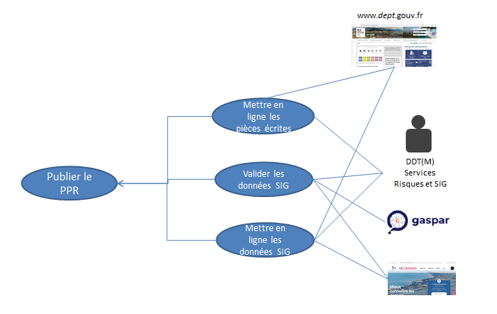
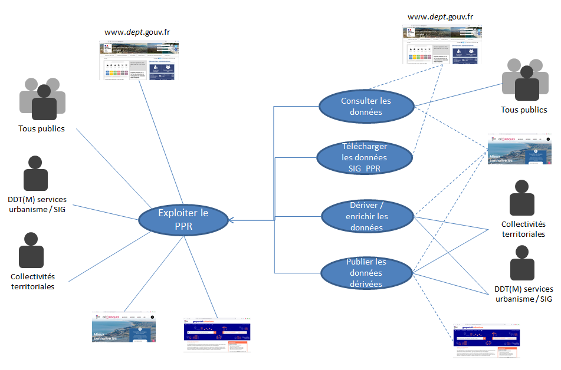
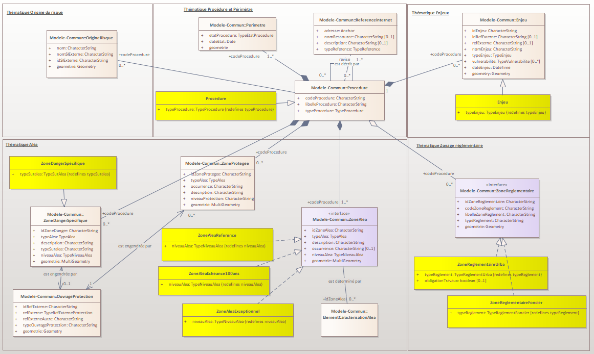
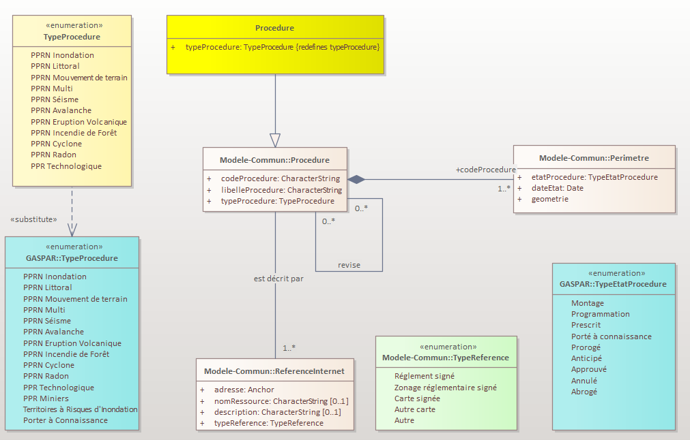
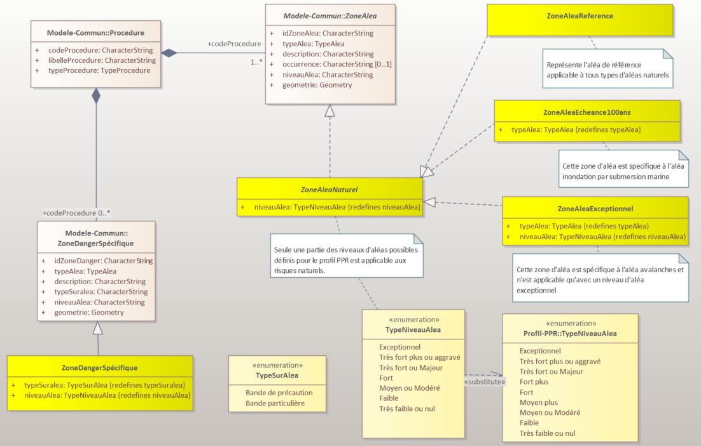
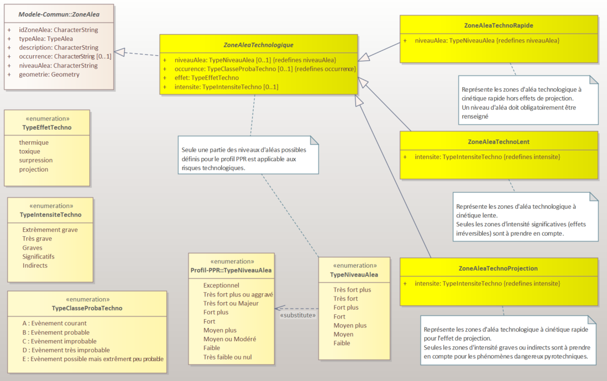
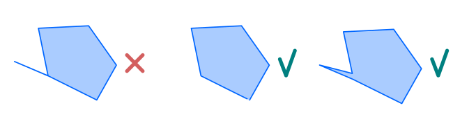
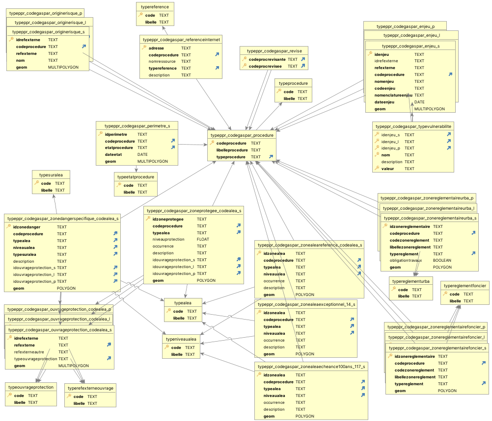
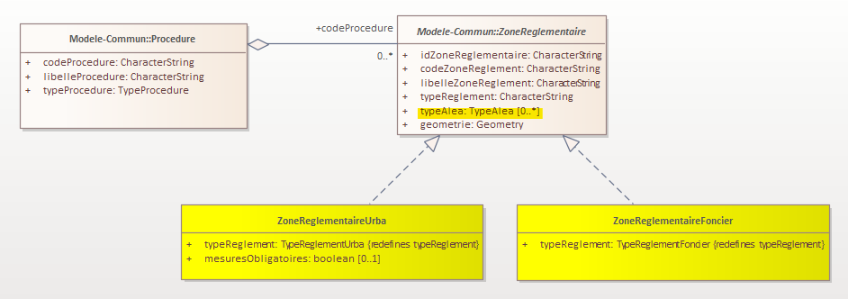
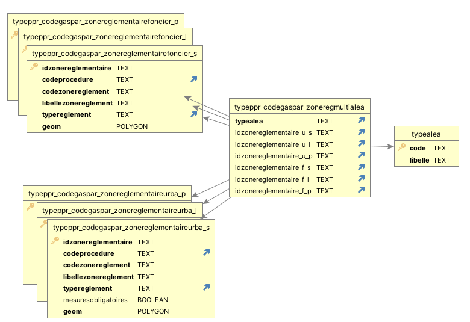

| | |
|-|-|
| |  |

 Conseil national de l'information Géolocalisée

Géostandards Risques 
Plans de prévention des risques (PPR)

Groupe de travail refonte des Géostandards Risques

*Version 0.3 - xx septembre 2024*

#  Fiche analytique

| | |
|-|-|
| **Titre** | Géostandards Risques |
| **Sous-titre** | Profil applicatif Plans de Prévention des Risques |
| **Version du document** | *0.3 - xx septembre 2024 (date de publication)*  |
| **Résumé** | La famille des Géostandards Risques a pour objectif de standardiser les données numériques géographiques relatives aux procédures réglementaires de prévention des risques. Elle a été développée dans le but de moderniser et succéder aux standards COVADIS dédiés à cette thématique tels que les standards Plan de Prévention des Risques (PPR) Naturels, Technologiques et Miniers ou Directive Inondation (DI). Elle est constituée d'un document qui établit les concepts communs à ces géostandards et d'un ensemble de profils applicatifs qui les précisent et les implémentent dans le cas de procédures particulières. Ce document est le profil applicatif dédié aux Plans de Prévention des Risques (PPR) Naturels et Technologiques. |
| **Etendue d'application** | Territoire national français |
| **Résolution spatiale** | Entre le 1:2000 et le 1:25000 |
| **Statut du document** | ~~Projet~~ - ~~Appel à commentaires~~ - Proposé à la commission des Standards du CNIG - ~~Validé~~ |
| **Licence** | Le présent document est sous [Licence Ouverte (Open Licence) Etalab](https://www.etalab.gouv.fr/licence-ouverte-open-licence/) |
| **Diffusion** | A venir : PDF sur internet (site du CNIG) |
| **Formats disponibles** | [MS Word - DOCX](https://github.com/cnigfr/Geostandards-Risques/blob/main/standards/Geostandards-risques-ppr/diffusion/Geostandards-Risques-PPR-v0.2.docx) - [HTML/Markdown](https://github.com/cnigfr/Geostandards-Risques/blob/main/standards/Geostandards-risques-ppr/Document.md) |
| **Thèmes** | (INSPIRE) "Usage des sols", "Lieux de production et sites industriels", "Zones de gestion, de restriction ou de réglementation et unités de déclaration", "Zones de risque naturel" |
| **Mots-clés** | "Usage des sols" ; "prévention" ; "risque" ; "aléa" ; "aménagement" ; "urbanisme" ; "prescription" ; "servitude" |
| **Contact** | geostandards-risques-gt-cnig@framalistes.org |

#  Sommaire

> *A générer*

#  Préface

##  Historique du document

| Version | Date | Raison |
| - | - | - |
| 0.1 | 11/09/2023 | Première version pour relecture du Groupe de Travail |
| 0.2 | 29/04/2024 | Prise en compte de la relecture du Groupe de Travail. Version pour commentaires publics. Modifications : Application des définitions DGPR pour les risques, aléas et enjeux. Retrait des PPR Miniers du périmètre d'application du document. Prise en compte de l'aléa exceptionnel avalanches. Ajout des spécificités des risques technologiques industriels. Simplification du système de catégorisation des enjeux. Prise en compte du multirisques au niveau du zonage réglementaire. Ajout d'une annexe clarifiant la gestion des PPRN multirisques. Modifications éditoriales pour apporter plus de clarté : ajouts d'un schéma d'ensemble et mise en valeur des spécificités avec le modèle commun, ajout d'un schéma des tables d'implémentation et mise en valeur du caractère obligatoire ou non des éléments. Mise en annexes du code SQL et des nomenclatures d’enjeux. |
| 0.3 | xx/09/2024 | Version tenant compte des commentaires reçus, soumise au CNIG pour validation. |

##  Participation à l'écriture

Ce standard est le fruit des travaux du groupe de travail CNIG sur la refonte des Géostandards risques. Ce dernier rassemble les acteurs impliqués dans l’élaboration, la gestion et la diffusion des données de prévention des risques relatives à ces standards ainsi que des utilisateurs amenés à exploiter ces données. Il est animé par l’IGN pour le compte de la Direction Générale de la Prévention des Risques (DGPR). 

Ce standard a été rédigé par Gilles Cébélieu (IGN) et Alison Lenain (IGN) avec les contributions majeures et les relectures des membres du Groupe de travail listés ci-dessous.

| Nom |Affiliation 
| - | - |
| Besson Stanislas | DDT de l'Isère (38) |
| Bonnin Nicolas | MTECT / DGPR / DAGSI |
| Bouffier Jacques | MTECT / DGPR /SRNH / SdCAP / BRIL |
| Boudesseul Nicolas | DREAL Pays de la Loire |
| Chrétien Guillaume | DDTM de la Seine Maritime (76) |
| Coignon Bastien | MTECT / DGPR / SRNH / SdCAP / BRIL |
| Di Salvo Magali | DREAL Auvergne Rhone Alpes |
| Evain Yohann | Cerema |

> *Liste à compléter et actualiser*

#  Présentation du document

##  Objectif et raison d'être du standard

La famille des Géostandards Risques a pour objectif de standardiser les données numériques géographiques relatives aux procédures réglementaires de prévention des risques. Elle a été développée dans le but de moderniser et succéder aux standards COVADIS dédiés à cette thématique tels que les standards Plan de Prévention des Risques (PPR) Naturels, Technologiques et Miniers ou Directive Inondation (DI). 

Elle est constituée d'un document socle [CNIG_RISQUES_PPR:2024](https://github.com/cnigfr/Geostandards-Risques/blob/main/standards/Geostandards-risques-commun/Document.md) qui établit les concepts communs à ces géostandards et d'un ensemble de profils applicatifs qui les précisent et les implémentent dans le cas de procédures particulières. 

Ce document est le profil applicatif qui précise et implémente les concepts communs de [CNIG_RISQUES_PPR:2024](https://github.com/cnigfr/Geostandards-Risques/blob/main/standards/Geostandards-risques-commun/Document.md) pour décrire l'information géographique et sémantique liée aux Plans de Prévention des Risques (PPR) naturels prévisibles ou technologiques et au cadre réglementaire dans lequel ils s'inscrivent.

Il a vocation à se substituer et rendre obsolète la dernière version du standard COVADIS suivant :

* Plan de prévention des risques naturels ou technologiques PPRN – PPRT, version 1.0, corrigée du 31/12/2012. 

## À qui s'adresse ce document ?

Ce document s'adresse :

- aux services de l'État ou assimilés, chargés de produire les PPR, les maintenir et les diffuser ;
- aux utilisateurs des PPR, amenés à en prendre connaissance ou les exploiter : services de l'État, collectivités locales, professionnels, bureaux d'études, ou grand public.

##  Comment lire le document

Les parties [Préface](#préface), [Présentation du document](#présentation-du-document) et [Concepts Généraux](#concepts-généraux) donnent les éléments nécessaires à la compréhension du document. 

Les parties [Contenu et structure de la donnée](#contenu-et-structure-de-la-donnée) et [Systèmes de référence](#syst%C3%A8mes-de-r%C3%A9f%C3%A9rence) définissent les adaptations du modèle conceptuel commun et de son catalogue de données associé dans le cadre des plans de prévention des risques ainsi que les systèmes de référence de coordonnées applicables à ces procédures.

La partie [Qualité](#qualité) décrit les recommandations et exigences des qualité concernant le contenu des données des PPR et de leur structuration ainsi que la façon de rapporter leur évaluation dans les métadonnées.

La partie [Cycle de vie des données](#cycle-de-vie-des-données) expose les différents états d'une procédure PPR ainsi que les cycles de maintenance des données associées.

La partie [Règles de symbologie](#règles-de-symbologie) décrit les règles de représentation de certaines entités relatives aux PPR.

La partie [Livraison](#livraison) précise les modalités d'implémentation et d'échange des données PPR au format GeoPackage.

La partie [Métadonnées](#métadonnées) précise les valeurs ou les consignes de saisie des éléments de métadonnées relatifs aux PPR de façon à en permettre une description et un catalogage pertinents en conformité avec les exigences INSPIRE sur les métadonnées et leur déclinaison au niveau national.

L'[annexe A](#annexe-a---correspondances-avec-les-standards-covadis-ppr-n-et-t-et-pprm), informative, expose les correspondances entre le modèle de données de ce standard et celui des anciens standards COVADIS PPR de façon à aider à la conversion des données PPR existantes vers ce nouveau standard.

L'[annexe B](#annexe-b---correspondances-avec-le-standard-cnig-sup-pour-les-sup-pm1-et-pm3), informative, décrit les correspondances du modèle de données du Standard CNIG sur les Servitudes d'Utilité Publique (SUP) avec celui de ce standard de façon à aider à la production des catégories de SUP correspondant à des PPR.

##  Références

Cette partie cite les références documentaires et réglementaires sur lesquelles s'appuie ce standard.

### Références à d'autres documents

Ce document s’appuie ou nécessite la lecture des normes et documents référencées ci-dessous. 

| Acronyme | Titre | Auteur | Année |
|-|-|-|-|
| [CNIG_RISQUES_COMMUN:2024](https://github.com/cnigfr/Geostandards-Risques/tree/main/standards/Geostandards-risques-commun) | Géostandards Risques - Modèle commun | Conseil National de l'Information Géolocalisée (CNIG) | 2024 | 
| [Guide PPRN:2016](https://www.actu-environnement.com/media/pdf/guide-pprn.pdf) | Plans de prévention des risques naturels prévisibles (PPRN) - Guide général | Direction Générale de la Prévention des Risques (DGPR) - Cerema | 2016 |
| [Guide PPRI:2024](https://www.ecologie.gouv.fr/sites/default/files/documents/Guide%20PPRI%20debordement%20de%20cours%20d%27eau%202024.pdf) | Guide méthodologique pour l’élaboration des plans de prévention des risques d’inondation par débordement de cours d’eau (hors cours d’eau torrentiels) | DGPR - Cerema | 2021 |
| [Guide PPRRuis:2004](https://www.ecologie.gouv.fr/sites/default/files/Guide_m%C3%A9thodo_PPR%20Ruissellement_2004.pdf) | Guide Méthodologique PPR Ruissellement | Direction de la Prévention des Pollutions et des Risques (DPPR) | 2004 |
| [Guide PPRICet:2023](https://www.ecologie.gouv.fr/sites/default/files/GuidePPRicet_10082023.pdf) | Guide Méthodologique PPRi des cours d'eau torrentiels | DGPR | 2023 |
| [Guide PPRL:2014](https://www.ecologie.gouv.fr/sites/default/files/documents/Guide_m%C3%A9thodo_PPRL_%202014.pdf) | Guide méthodologique : Plan de prévention des risques littoraux | DGPR / SRNH | 2014 |
| [Guide PPRNAv:2015](https://www.ecologie.gouv.fr/sites/default/files/guide%20PPR%20avalanches-correctif%20f%C3%A9vrier%202022%281%29.pdf) | Guide Méthodologique PPRN Avalanches | ONF-RTM, DGPR | 2015 |
| [Guide PPRT:2007](https://www.ecologie.gouv.fr/sites/default/files/Guide_PPRT_tbd_complet.pdf) | Le plan de prévention des risques technologiques (PPRT) Guide méthodologique | Ministère de l'écologie, du développement et de l'aménagement durables (MEDAD) / Direction de la Prévention des Pollutions et des Risques (DPPR) - Direction Générale de l'Urbanisme de l'Habitat et de la Construction (DGUHC) | 2007 |
| [UNISDR:2009](https://reliefweb.int/attachments/a0ed6b9c-713e-349f-ae9f-d3d8ff336b1f/Rapport_complet.pdf) | Terminologie pour la Prévention des risques de catastrophe | Stratégie internationale de prévention des catastrophes des Nations Unies (UNISDR) | 2009 | 
| [INSPIRE NZ:2013](https://inspire.ec.europa.eu/documents/Data_Specifications/INSPIRE_DataSpecification_NZ_v3.0.pdf) | INSPIRE D2.8.III.12 Data Specification on Natural Risk Zones – Technical Guidelines | European Commission Joint Research Centre | 2013 |
| [OGC:GeoPackage 1.3.1](https://www.geopackage.org/spec131/) | OGC(R) GeoPackage Encoding Standard version 1.3.1 | Open Geospatial Consortium | 2021 |
| [OGC:SimpleFeature-1 1.2.1](https://portal.ogc.org/files/?artifact_id=25355) | OpenGIS Implementation Specification for Geographic information – Simple feature access – Part 1: Common architecture| Open Geospatial Consortium | 2011 |
| [OGC:SimpleFeature-2 (SQL Option) 1.2.1](https://portal.ogc.org/files/?artifact_id=25355) | OpenGIS Implementation Specification for Geographic information – Simple feature access – Part 2: SQL option| Open Geospatial Consortium | 2010 |
| [RFC:3986](https://datatracker.ietf.org/doc/html/rfc3986) | Uniform Resource Identifier (URI): Generic Syntax | Network Working Group, The Internet Society | 2005 |
| [ISO:639-2](https://www.loc.gov/standards/iso639-2/) | Codes for the representation of names of languages-- Part 2: alpha-3 code | Library of congress | 2011 |
| [INSPIRE MTD:2013](https://inspire.ec.europa.eu/sites/default/files/documents/metadata/md_ir_and_iso_20131029.pdf) | INSPIRE Metadata Implementing Rules: Technical Guidelines based on EN ISO 19115 and EN ISO 19119 | European Commission Joint Research Centre | 2013 |
| [REG_MESQGEO](https://data.geocatalogue.fr/ncl/mesuresQuaDoGeo) | Registre: mesuresQuaDoGeo - Mesures liées à la Qualité de Données Géographiques | CNIG | En continu |
| [CNIG:SUP:2023](http://cnig.gouv.fr/IMG/pdf/230822_standard_cnig_sup__v2016b_rev2023-08.pdf) | Prescriptions nationales pour la dématérialisation des documents d’urbanisme - SERVITUDES D'UTILITÉ PUBLIQUE - Standard CNIG v2016b (rev. août 2023) | CNIG - Cerema | 2023/08 |

###  Cadre réglementaire des Plans de Prévention des Risques

####  Cadre réglementaire des Plans de Prévention des Risques Naturels Prévisibles

La mise en œuvre des Plans de prévention des risques naturels prévisibles est définie dans le code de l'environnement par :

* les [articles L562-1 à L562-9](https://www.legifrance.gouv.fr/codes/section_lc/LEGITEXT000006074220/LEGISCTA000006159296/#LEGISCTA000006159296) pour la partie législative ;
* les [Articles R562-1 à R562-11-9](https://www.legifrance.gouv.fr/codes/section_lc/LEGITEXT000006074220/LEGISCTA000006177007/#LEGISCTA000006177007) pour la partie réglementaire.

Le [décret n°2019-715 du 5 juillet 2019 relatif aux plans de prévention des risques concernant les « aléas débordement de cours d’eau et submersion marine »](https://www.legifrance.gouv.fr/jorf/id/JORFTEXT000038730841), dit « décret PPRI », précise les modalités de détermination, de qualification et de cartographie de l'aléa de référence et du zonage réglementaire pour l’élaboration des PPRN portant sur les aléas débordement de cours d’eau (à l’exclusion des débordements de cours d’eau torrentiel) et submersion marine.

L'[article R214-119-1](https://www.legifrance.gouv.fr/codes/id/LEGIARTI000039001213/2019-08-31) précise la définition du niveau de protection d'une zone protégée par un système d'endiguement.

####  Cadre réglementaire des Plans de Prévention des Risques Technologiques

La mise en œuvre des Plans de prévention des risques technologiques est définie dans le code de l'environnement par :

* les [articles L515-15 à L515-26](https://www.legifrance.gouv.fr/codes/section_lc/LEGITEXT000006074220/LEGISCTA000006176606/#LEGISCTA000006176606) pour la partie législative ;
* les [articles R515-39 à R515-50](https://www.legifrance.gouv.fr/codes/section_lc/LEGITEXT000006074220/LEGISCTA000006188931/#LEGISCTA000006188931) pour la partie réglementaire.

L'[arrêté du 29 septembre 2005 dit PCIG](https://www.legifrance.gouv.fr/jorf/id/JORFTEXT000000245167) "relatif à l'évaluation et à la prise en compte de la probabilité d'occurrence, de la cinétique, de l'intensité des effets et de la gravité des conséquences des accidents potentiels dans les études de dangers des installations classées soumises à autorisation" définit les classes de probabilité de survenu des événements technologiques et une échelle d'appréciation de la gravité des conséquences humaines d'un accident à l'extérieur des installations. 

L'[arrêté du 10 avril 2007](https://www.legifrance.gouv.fr/loda/id/LEGITEXT000006056459) "fixant les règles relatives à l'évaluation des risques et à la prévention des accidents dans les établissements pyrotechniques" apporte des précisions sur les zones d'intensité relatives à l'effet de projection.

##  Compréhension du document

###  Termes spécifiques et définitions

| Terme | Définition|
|-|-|
| Risque | La définition de [CNIG_RISQUES_COMMUN:2024](https://github.com/cnigfr/Geostandards-Risques/tree/main/standards/Geostandards-risques-commun/Document.md#termes-spécifiques-et-définitions) s'applique.  |
| Aléa | La définition de [CNIG_RISQUES_COMMUN:2024](https://github.com/cnigfr/Geostandards-Risques/tree/main/standards/Geostandards-risques-commun/Document.md#termes-spécifiques-et-définitions) s'applique. |
| Aléa de référence | [Guide PPRN:2016](https://www.actu-environnement.com/media/pdf/guide-pprn.pdf) Phénomène naturel d'occurrence et d'intensité données servant de référence pour définir la réglementation du PPRN. |
| Opposable | La définition de [CNIG_RISQUES_COMMUN:2024](https://github.com/cnigfr/Geostandards-Risques/tree/main/standards/Geostandards-risques-commun/Document.md#termes-spécifiques-et-définitions) s'applique. |
| Enjeux | La définition de [CNIG_RISQUES_COMMUN:2024](https://github.com/cnigfr/Geostandards-Risques/tree/main/standards/Geostandards-risques-commun/Document.md#termes-spécifiques-et-définitions) s'applique. |
| Vulnérabilité | La définition de [CNIG_RISQUES_COMMUN:2024](https://github.com/cnigfr/Geostandards-Risques/tree/main/standards/Geostandards-risques-commun/Document.md#termes-spécifiques-et-définitions) s'applique. |
| Délaissement | Dans le contexte du "Droit de délaissement" : Le droit de délaissement est une procédure administrative. Elle permet au propriétaire d’un bien immobilier soumis à des prescriptions d’urbanisme l’empêchant d’en jouir, d’inciter le bénéficiaire de la servitude à acquérir le bien. |
| Expropriation | ([Service-Public.fr](https://www.service-public.fr/particuliers/vosdroits/N326)) L'expropriation est une procédure qui permet à une personne publique (État, collectivités territoriales...) de contraindre un particulier ou une personne morale (entreprise) à céder la propriété de son bien, moyennant le paiement d'une indemnité. |

###  Abréviations

| Sigle | Signification |
|-|-|
| BRGM | Bureau de recherches géologiques et minières |
| BRIL | Bureau des risques d'inondation et littoraux (DGPR) |
| BRIEC | Bureau des risques des industries de l’énergie et de la chimie (DGPR) |
| Cerema | Centre d’études et d’expertises sur les risques, l’environnement, la mobilité et l’aménagement |
| COVADIS | Commission de validation des données pour l'information spatialisée |
| CNIG | Comité national de l'information géolocalisée |
| DAGSI | Département des affaires générales et des systèmes d’information (DGPR) |
| DDT | Direction départementale des territoires  |
| DDTM | Direction départementale des territoires et de la mer  |
| DGPR | Direction générale de la prévention des risques |
| DREAL | Direction régionale de l'environnement, de l'aménagement et du logement |
| DEAL | Direction de l'environnement, de l'aménagement et du logement |
| ERP | Établissement recevant du public |
| ERRIAL | État des risques réglementés pour l’information des acquéreurs et des locataires |
| GASPAR | Base nationale de gestion assistée des procédures administratives relatives aux risques |
| ICPE | Installation classée pour la protection de l'environnement |
| IGN | Institut national de l'information géographique et forestière |
| MTECT | Ministère de la transition écologique et de la cohésion des territoires  |
| OGC | Open Geospatial Consortium |
| ONF | Office national des forêts |
| PPRN | Plan de prévention des risques naturels |
| PPRT | Plan de prévention des risques technologiques |
| RTM | Service de restauration des terrains en montagne de l'ONF |
| SIG | Système d'information géographique |
| SUP | Servitude d'utilité publique |
| WKT | Well-known text |
| URI | Uniform Resource Identifier |
| URL | Uniform Resource Locator |

#  Concepts généraux

##  Périmètre d'application

Le périmètre d'application des plans de prévention des risques couvert par ce standard concerne :

- la production par les services de l'État des jeux de données numériques relatives aux plans de prévention des risques conformément aux exigences réglementaires définies dans la partie [Cadre réglementaire des Plans de Prévention des Risques](#cadre-réglementaire-des-plans-de-prévention-des-risques) ;

- la mise à disposition de ces jeux de données sur internet de façon à permettre la connaissance du risque par le grand public et leur exploitation aval pour :
  - la mise en place des politiques d'urbanisme et l'aménagement des territoires par les collectivités territoriales en conformité avec la loi ;
  - l'anticipation de la gestion de crise, notamment pour l'élaboration des Plans Particuliers d'Intervention (PPI) par les services de l'État ;
  - la mise en œuvre de l'information des acquéreurs ou des locataires (IAL) ;
  - de manière générale, toute exploitation aval de ces données par des organismes privés ou publics pour des actions visant à développer la culture du risque.

Les données décrites et couvertes par ce standard ne couvent pas l'intégralité des informations d'un dossier de plan de prévention des risques. Il s'agit des données géographiques et sémantiques du PPR permettant d'en établir la partie cartographique et de faire le lien avec les autres éléments du dossier pouvant être mis en œuvre dans d'autres systèmes tels que GASPAR ou les sites des préfectures qui hébergent le dossier.

Les plans de prévention des risques peuvent être définis sur le territoire national où s’appliquent les dispositions du code de l’environnement relatives aux PPR, à savoir : 

- Le territoire européen de la France
- La France d'outre mer, plus précisément :
  - Guadeloupe
  - Saint-Martin
  - Martinique
  - Guyane
  - La Réunion
  - Mayotte
  - Saint-Pierre-et-Miquelon

Les types de risques couverts par les plans de prévention des risques sont ceux de la nomenclature GASPAR (Gestion assistée des procédures administratives relatives aux risques naturels et technologiques), décrite en [annexe B](#nomenclature-des-risques-et-de-leurs-codes-dans-gaspar) du modèle commun.

##  Les acteurs et rôles concernés 

Les acteurs concernés par les plans de prévention des risques sont :

| Nom du rôle | Caractéristiques |
|-|-|
| Producteur | La production des PPR est réalisée au niveau départemental par les Direction Départementales des Territoires (et de la Mer) (DDT(M)) et par les Directions (régionales) de l'environnement de l'aménagement et du logement (D(R)EAL) et autres services producteurs, sous l'autorité du préfet de département ou de région. |
| Diffuseur | La diffusion des PPR est assurée par les DDT(M) et les DEAL en outre-mer sur le site internet de leur préfecture de rattachement et aussi au niveau national sur la plateforme [Géorisques](https://www.georisques.gouv.fr/) opérée par le BRGM. |
| Utilisateur | Les utilisateurs des PPR sont multiples en fonction des utilisations évoquées dans la partie précédente : collectivités territoriales, grand public, services de l'état, organismes publics ou privés (notamment bureaux d'études, notaires, agences d'urbanismes, agences immobilières...) amenés à exploiter, dériver ou enrichir ces données. |  

##  Cas d'utilisation

Les cas d'utilisation illustrés ci-après mettent en œuvre la production, la publication et l'exploitation des PPR. Les acteurs qui y figurent peuvent être :
- des personnes ou entités effectivement à la manœuvre dans les actions ;
- des systèmes en place permettant la réalisation de ces actions.

### Cas d'utilisation Elaborer un PPR

Le cas d'utilisation "Elaborer un PPR" illustre à grand traits les étapes d'élaboration d'un PPR et les acteurs majeurs et systèmes impliqués. Les étapes présentées ne sont pas toutes concernées au même niveau par le périmètre du ce standard.

|Action du cas d'utilisation| Description|
|-|-|
|Prescrire, approuver, le PPR | Cette action, de la responsabilité du préfet de département, témoigne de l'aspect réglementaire et juridique des PPR. Elle ne concerne ce standard que dans la mesure où ce dernier permet de décrire l'état juridique du PPR, résultant de cette action. |
| Produire les données métier | Cette étape, menée sous la responsabilité du préfet, généralement par les DDT(M)s ou les D(R)EALs (en outre mer ou dans le cadre des PPR technologiques) est centrale dans l'élaboration du PPR, puisqu'elle permet d'en établir l'essence même : cartographier les aléas, les enjeux et établir le zonage réglementaire résultant. À ce stade ces données métiers peuvent être directement produites selon le formalisme du standard. |
| Produire les données SIG | Cette étape, menée sous la responsabilité du préfet, généralement par les DDT(M)s permet de produire les données numériques correspondant à la cartographie du PPR. Elle peut être une sous étape de la précédente si cette dernière à directement produit ces données numériquement ou peut y succéder s'il s'agit de les numériser. Dans tous les cas, elle est complètement dans le périmètre de ce standard qui permet de structurer cette information. |
| Produire les pièces écrites (du PPR)  |  Cette étape, menée sous la responsabilité du préfet, généralement par les DDT(M)s permet de produire les documents du dossier PPR, notamment les cartes qui peuvent être produites à partir des données SIG évoquées précédemment mais aussi le règlement et les arrêtés préfectoraux. Elle est concernée par le standard dans la mesure où ce dernier permet de faire référence à ces pièces écrites. |
| Gérer le suivi de la procédure | Cette étape, menée sous la responsabilité du préfet, généralement par les DDT(M)s, relate de l'utilisation de la base GASPAR (gestion assistée des procédures administratives relatives aux risques) pour l'enregistrement et le suivi du PPR au niveau national. Là aussi le standard PPR décrit des informations qui permettent de faire le lien avec les informations de cette base. |

La figure suivante illustre ces actions avec les interventions correspondantes des acteurs et systèmes principaux impliqués pour chacune d'elles.

**Figure xx : Cas d'utilisation : Elaborer un PPR**

### Cas d'utilisation Publier un PPR

Le cas d'utilisation "Publier un PPR" illustre les grandes étapes de la mise en ligne des données numériques d'un PPR. Ce cas d'utilisation est au cœur de la cible du Standard, même si ce dernier ne couvre que marginalement la publication des pièces écrite.

|Action du cas d'utilisation| Description|
|-|-|
| Mettre en ligne les pièces écrites (du PPR) | Cette action, menée sous la responsabilité des DDT(M)s, vise à mettre en ligne les pièces écrites du dossier PPR. Elle se fait en général sur le site internet de la préfecture du département de la DDT(M) concernée. Les données décrites par le standard permettent de mentionner le lien vers ces pièces écrites une fois publiées. |
| Valider les données SIG | Cette action permet de vérifier que les données SIG relatives au PPR sont conformes au modèle et aux exigences de ce standard. Elle est un préalable à leur publication. La mise en œuvre de cette action peut se faire sur le système de publication (ici, représenté par Géorisques). Des vérifications de cohérence avec le système GASPAR peuvent aussi être réalisées. |
| Mettre en ligne les données SIG | Cette action est aussi au cœur de la cible de ce standard. Elle permet de rendre les données de PPR accessibles aux différents types d'utilisateurs mentionnés précédemment et de nourrir le cas d'utilisation suivant. La publication peut se faire sur le site internet de la préfecture du département de la DDT(M) concernée, mais elle a vocation à se faire sur la plateforme nationale de diffusion qu'est Géorisques. |

La figure suivante illustre ces actions avec les interventions correspondantes des acteurs et systèmes principaux impliqués pour chacune d'elles.

**Figure xx : Cas d'utilisation : Publier un PPR**

### Cas d'utilisation Exploiter un PPR

Le cas d'utilisation "Exploiter un PPR" illustre des utilisations "type" des PPR une fois mis en ligne. Il n'a pas vocation à être exhaustif mais est représentatif des exploitations couvertes par ce standard. Ces utilisations types associées sont facilitées par la production et la diffusion de données PPR en conformité avec le Standard grâce à la connaissance de la structure des données et de sa qualité.

|Action du cas d'utilisation| Description|
|-|-|
| Consulter les données | Cette action est celle du grand public qui souhaite connaitre les risques sur un secteur. Elle est rendue possible par des interfaces de visualisation en ligne sur la plateforme nationale Géorisques ou éventuellement sur les sites web des préfectures qui mettent en œuvre de telles fonctionnalités. La consultation est aussi rendue possible grâce aux métadonnées qui vont permettre à l'utilisateur de retrouver et sélectionner la donnée qu'il souhaite consulter grâce à des mécanismes de catalogage. |
| Télécharger les données SIG PPR | Cette action va de pair avec la précédente et est rendue possible par les mêmes plateformes. Elle peut concerner le grand public (avec un profil plutôt initié) mais aussi les collectivités territoriales ou des organismes de type bureaux d'études qui ont besoin de télécharger les données pour les traiter ou les intégrer dans leur système d'information. |
| Dériver / enrichir les données | Cette action est aussi liée à la précédente. Elle est représentative des utilisations telles que la production des données SIG décrivant les Servitudes d'Utilité Publiques dérivées des PPR et mises en œuvre par les services de l'État ou l'utilisation des PPR dans le cadre de l'élaboration des plans locaux d'urbanisme par les collectivités territoriales. |
| Publier les données dérivées | La publication des données dérivées mentionnées ci-dessus n'est pas couverte par le standard mais elle fait partie de la chaine aval de diffusion des données PPR. Elle est aussi facilitée par l'obtention de données respectant les critères de qualité énoncés par le standard PPR. |

La figure suivante illustre ces actions avec les interventions correspondantes des acteurs et systèmes principaux impliqués pour chacune d'elles.

**Figure xx : Cas d'utilisation : Exploiter un PPR**

#  Contenu et structure de la donnée

Cette section précise l'utilisation et les spécialisations du modèle de données commun défini dans [CNIG_RISQUES_COMMUN:2024](https://github.com/cnigfr/Geostandards-Risques/tree/main/standards/Geostandards-risques-commun) dans le cadre des procédures de Plans de Prévention des Risques.

##  Modèle conceptuel de données

La figure suivante représente le modèle de données complet spécialisé dans le cadre des procédures de Plans de Prévention des Risques en faisant ressortir en jaune les spécificités par rapport au modèle commun. Pour plus de lisibilité, les énumérations et les types de données ne sont pas représentés sur ce diagramme. Ces éléments seront représentés dans les diagrammes spécifiques par thématique qui suivent.

**Fig. *xx* Diagramme UML complet des différentes thématiques.**

### Thématique Procédures et périmètres

Dans le cadre de l'élaboration des **plans de prévention des risques**, la thématique "Procédures et périmètres" regroupe les informations relatives au suivi administratif des procédures de prévention des risques et aux différents types de périmètres qui précèdent l'établissement du zonage réglementaire.

Dans ce contexte, les entités [Procedure](https://github.com/cnigfr/Geostandards-Risques/blob/main/standards/Geostandards-risques-commun/Document.md#classe-dobjets-procedure), [Perimetre](https://github.com/cnigfr/Geostandards-Risques/blob/main/standards/Geostandards-risques-commun/Document.md#classe-dobjets-perimetre), [ReferenceInternet](https://github.com/cnigfr/Geostandards-Risques/blob/main/standards/Geostandards-risques-commun/Document.md#classe-dobjets-referenceinternet) et [TypeReference](https://github.com/cnigfr/Geostandards-Risques/blob/main/standards/Geostandards-risques-commun/Document.md#enumeration-typereference) définies dans [CNIG_RISQUES_COMMUN:2024](https://github.com/cnigfr/Geostandards-Risques/tree/main/standards/Geostandards-risques-commun) s'appliquent. 

Une restriction sur l'énumération [TypeProcedure](#enumeration-typeprocedure) est précisée dans ce document pour n'intégrer que les valeurs relatives aux PPR.

Ce document définit un nouveau type de périmètre : [PerimetreEtude](#classe-dobjets-perimetreetude) qui est une spécialisation de la classe [Perimetre](https://github.com/cnigfr/Geostandards-Risques/blob/main/standards/Geostandards-risques-commun/Document.md#classe-dobjets-perimetre) permettant de distinguer le périmètre d'étude du PPR et le périmètre prescrit.

La figure suivante fait ressortir en jaune les modifications du modèle commun dans le cadre des PPR pour la thématique Procédures et périmètres.

**Fig. *xx* Modèle UML des classes relatives aux procédures et périmètres dans le cadre des PPR.**

### Thématique Aléas

L'implémentation des concepts de la thématique Aléas, notamment des zones d'aléas dépend de la nature du risque : naturel ou technologique. Deux classes abstraites [ZoneAleaNaturel](#classe-dobjets-zonealeanaturel) et [ZoneAleaTechnologique](#classe-dobjets-zonealeatechnologique) sont définies et rassemblent les propriétés communes aux différentes zones d'aléas qui vont les implémenter dans le cadre respectif des PPR Naturels et Technologiques. Les paragraphes qui suivent décrivent ces spécialisations dans les deux cas de figure. 

La qualification des niveaux d'aléas varie en fonction des types d'aléas. Elle est précisée dans les guides relatifs aux différents types de PPR. L'énumération [TypeNiveauAlea](#enumeration-typeniveaualea) définit les valeurs possibles pour qualifier ces niveaux dans le cadre des PPR. Des restrictions peuvent s'appliquer selon la nature du risque naturel ou technologique.

La figure suivante fait ressortir en jaune les modifications du modèle commun permettant ces spécialisations dans le cadre des PPR pour la thématique Aléas.

**Fig. *xx* Modèle UML des classes relatives aux aléas dans le cadre des PPR.**

#### Thématique Aléas dans le cadre des PPR Naturels

##### Implémentations des zones d'aléas dans le cadre des PPR Naturels

Dans le cadre de l'élaboration des **plans de prévention des risques naturels**, les zones d'aléa sont déterminées et qualifiées relativement à un **aléa de référence** dont les modalités sont relatives au type d'aléa. A ce titre, la classe [ZoneAleaNaturel](#classe-dobjets-zonealeanaturel) est spécialisée par la classe [ZoneAleaReference](#classe-dobjets-zonealeareference) permettant de représenter les zones d'aléas correspondant à cet aléa de référence.

Dans le cas particulier de l'aléa **inondation par submersion marine**, des zones d'**aléas à échéance 100 ans** doivent aussi être déterminées et qualifiées selon des modalités précisées par l'arrêté du ministre chargé de la prévention des risques majeurs ([Art. R562-11-5 du code de l'environnement](https://www.legifrance.gouv.fr/codes/section_lc/LEGITEXT000006074220/LEGISCTA000006177007/#LEGISCTA000006177007)). A ce titre, la classe [ZoneAleaNaturel](#classe-dobjets-zonealeanaturel) est spécialisée par la classe [ZoneAleaEcheance100ans](#classe-dobjets-zonealeaecheance100ans) permettant de représenter les zones d'aléas correspondant à l'aléa à échéance 100 ans. L'implémentation de cette classe n'est obligatoire que dans le cadre de l'aléa submersion marine.

Dans le cas particulier des **PPR Avalanches**, des zones d'aléa correspondant à un **aléa de référence exceptionnel** peuvent être définies selon les modalités précisées dans [Guide PPRNAv:2015](https://www.ecologie.gouv.fr/sites/default/files/guide%20PPR%20avalanches-correctif%20f%C3%A9vrier%202022%281%29.pdf) caractérisés par une période de retour exceptionnellement grande, voire inconnue. La classe [ZoneAleaExceptionnel](#classe-dobjets-zonealeaexceptionnel) spécialise la classe [ZoneAleaNaturel](#classe-dobjets-zonealeanaturel) pour mettre en œuvre ces zones d'aléa exceptionnels.

##### Définition des zones de danger spécifiques pour l'aléa inondation

La classe [ZoneDangerSpecifique](#classe-dobjets-zonedangerspecifique) est aussi spécialisée pour permettre de caractériser ces zones de danger spécifiques dans le cadre de l'aléa inondation en quatre types précisés par l'énumération [TypeSurAlea](#enumeration-typesuralea) : les **bandes de précaution** à l'arrière des systèmes d'endiguement, les **bandes particulières** soumises aux chocs mécaniques des vagues et/ou aux projections des matériaux telles que définies dans le [Guide PPRL:2014](https://www.ecologie.gouv.fr/sites/default/files/documents/Guide_m%C3%A9thodo_PPRL_%202014.pdf).

La figure suivante fait ressortir en jaune les modifications du modèle commun dans le cadre des PPR Naturels pour la thématique Aléas.

**Fig. *xx* Modèle UML des classes relatives aux aléas dans le cadre des PPR Naturels.**

#### Thématique Aléas dans le cadre des PPR Technologiques

Dans le cadre de l'élaboration des **plans de prévention des risques technologiques**, les zones d'aléas portent des caractéristiques spécifiques par rapport à la classe [ZoneAlea](#classe-dobjets-zonealea) du modèle commun qui sont décrites par la classe abstraite [ZoneAleaTechnologique](#classe-dobjets-zonealeatechnologique). Il s'agit notamment de l'intensité dont les valeurs possibles sont définies par l'énumération [TypeIntensiteTechno](#enumeration-typeinstensitetechno). Par ailleurs des restrictions s'appliquent sur les niveaux d'aléas possibles de l'énumération [TypeNiveauAlea](#enumeration-typeniveaualea) et l'occurrence peut-être caractérisée par des classes de probabilité d'occurrence mentionnées dans le [Guide PPRT:2007](https://www.ecologie.gouv.fr/sites/default/files/Guide_PPRT_tbd_complet.pdf) reprises dans ce standard par l'énumération [TypeClasseProbaTechno](#enumeration-typeeclasseprobatechno). Des restrictions s'appliquent également sur les valeurs possibles du champ typeAlea pour ces zones qui sont limitées à celles correspondant aux risques industriels.

Trois types de zones d'aléas peuvent être représentées dans les PPR Technologiques sur la base de ces caractéristiques :

- Les zones d'aléas à cinétique rapide hors effets de projection représentées par la classe [ZoneAleaTechnoRapide](#classe-dobjets-zonealeatechnorapide) qui sont qualifiées obligatoirement par un niveau d'aléa ;
- Les zones d'aléas à cinétique lente représentées par la classe [ZoneAleaTechnoLent](#classe-dobjets-zonealeatechnolent) qui doivent être qualifiées obligatoirement par leur intensité ;
- Les zones d'aléas technologiques par effet de projection représentées par la classe [ZoneAleaTechnoProjection](#classe-dobjets-zonealeatechnoprojection) qui doivent être qualifiées obligatoirement par leur intensité.

La figure suivante fait ressortir en jaune les modifications du modèle commun dans le cadre des PPR Technologiques pour la thématique Aléas.

**Fig. *xx* Modèle UML des classes relatives aux aléas dans le cadre des PPR Technologiques.**

### Thématique Origine du Risque

Les entités définies dans le modèle commun s'appliquent pour PPR.

### Thématique Enjeux

Dans le cadre de l'élaboration des *plans de prévention des risques*, l'analyse des enjeux est réalisée afin de pouvoir établir le zonage réglementaire. A cette fin, la collecte des enjeux est réalisée au moment de l'élaboration du PPR dont la date est renseignée par l'intermédiaire du champ "dateEnjeu"  de la classe [Enjeu](#classe-dobjets-enjeu) définie dans le modèle commun.

Selon les types de PPR et les guides d'élaboration qui leur sont associés, les nomenclatures de ces enjeux varient autour d'une répartition partagée en trois catégories : enjeux incontournables, enjeux complémentaires et autres éléments de contexte (ou enjeux connexes). Le modèle commun de ce standard permet d'associer à chaque objet de la classe [Enjeu](../Geostandards-risques-commun/Document.md#classe-dobjets-enjeu) une ou plusieurs typologies issues de nomenclatures différentes à l'aide du champ "typeEnjeu" de type [TypeEnjeu](../Geostandards-risques-commun/Document.md#type-de-données-typeenjeu).

Le profil applicatif PPR décline les différentes nomenclatures définies dans les guides d'élaboration en fonction du type de PPR sous forme d'énumérations, qu'il conviendra d'adopter selon le type de PPR qui est mis en œuvre :

- Liste de codes [NomenclatureEnjeuPPRN](#liste-de-codes-nomenclatureenjeupprn) issue du [Guide PPRN:2016](https://www.actu-environnement.com/media/pdf/guide-pprn.pdf) et du [Guide PPRL:2014](https://www.ecologie.gouv.fr/sites/default/files/documents/Guide_m%C3%A9thodo_PPRL_%202014.pdf) ;
- Liste de codes [NomenclatureEnjeuPPRT](#liste-de-codes-nomenclatureenjeupprt) issue du [Guide PPRT:2007](https://www.ecologie.gouv.fr/sites/default/files/Guide_PPRT_tbd_complet.pdf) ;

Par ailleurs, l'annexe D de l'ancien standard COVADIS PPR naturels ou technologiques définissait à titre informatif une nomenclature détaillée des enjeux. Cette nomenclature est reprise ici sous le nom de [NomenclatureEnjeuCOVADIS](#liste-de-codes-nomenclatureenjeucovadis), toujours à titre informatif, de façon à faciliter la conversion des anciens PPR COVADIS s'appuyant sur cette nomenclature sans avoir à refaire une classification des enjeux selon une nouvelle nomenclature mais aussi, pour les nouveaux PPR, de préciser, si besoin, la catégorie de certains enjeux.

Les enjeux rapportés dans les anciens standards PPR ne portaient pas d'information relative à la vulnérabilité autre que celle pouvant être intrinsèquement relatée par la classification. 

**Fig. *xx* Modèle UML des classes relatives aux enjeux dans le cadre des PPR.**

### Thématique Zonage réglementaire

Dans le cadre de l'élaboration des *plans de prévention des risques*, un zonage réglementaire est déterminé selon le [cadre réglementaire du type de PPR](#cadre-réglementaire-des-plans-de-prévention-des-risques). 

Pour représenter ce zonage, la classe ZoneReglementaire est spécialisée par deux classes qui décrivent deux types de zonages :

* La classe [ZoneReglementaireUrba](#classe-dobjets-zonereglementaireurba) permet de définir les zones sur lesquelles s'applique un règlement spécifique en matière d'urbanisme.
* La classe [ZoneReglementaireFoncier](#classe-dobjets-zonereglementairefoncier) permet de définir les zones sur lesquelles des mesures réglementaires foncières spécifiques s'appliquent.
 
Pour chacun de ces types de zonages une liste de valeurs possibles est établie pour caractériser la nature de la réglementation qui s'applique. Ces listes sont définies par les énumérations suivantes :

* [TypeReglementUrba](#enumeration-typereglementurba) pour caractériser les zones décrites par la classe [ZoneReglementaireUrba](#classe-dobjets-zonereglementaireurba) ;
* [TypeReglementFoncier](#enumeration-typereglementfoncier) pour caractériser les zones décrites par la classe [ZoneReglementaireFoncier](#classe-dobjets-zonereglementairefoncier) ;

**Fig. *xx* Modèle UML des classes relatives au zonage réglementaire dans le cadre des PPR.**

##  Catalogue d'objets

### Thématique Procédures et périmètres

#### Classe d'objets *PerimetreEtude*

**Nom de la classe** : PerimetreEtude

**Titre** : Périmètre d'étude

**Définition** : La classe Périmètre d'étude permet de représenter le périmètre d'étude du PPR défini par l'[article R562-2 du code de l'environnement](https://www.legifrance.gouv.fr/codes/article_lc/LEGIARTI000038743797). Elle a les même propriétés que la classe [Perimetre](https://github.com/cnigfr/Geostandards-Risques/blob/main/standards/Geostandards-risques-commun/Document.md#classe-dobjets-perimetre) définie dans le modèle commun, mais sa géométrie peut être différente. Lorsque cette classe est renseignée, elle permet de distinguer les zones hors aléa (situées à l'intérieur de ce périmètre) des zones non étudiées (à l'extérieur).

**Modélisation géométrique** : Cf. modélisation géométrique de la classe [Perimetre](https://github.com/cnigfr/Geostandards-Risques/blob/main/standards/Geostandards-risques-commun/Document.md#classe-dobjets-perimetre).

**Propriétés** : Cf. propriétés héritées de la classe [Perimetre](https://github.com/cnigfr/Geostandards-Risques/blob/main/standards/Geostandards-risques-commun/Document.md#classe-dobjets-perimetre) définie dans le modèle commun. 

#### Enumeration *TypeProcedure*

Le tableau suivant liste les différents types de procédures de prévention des risques pouvant être décrites dans le cadre des PPR. Il s'agit d'une restriction par rapport à l'énumération définie dans le modèle commun.

Cette section précise l'utilisation et les spécialisations du modèle de données commun défini dans [CNIG_RISQUES_COMMUN:2024](https://github.com/cnigfr/Geostandards-Risques/tree/main/standards/Geostandards-risques-commun) dans le cadre des procédures de Plans de Prévention des Risques.

| Libellé | Description |
|-|-|
| Plan de Prévention des Risques Naturels Inondation | La description de [CNIG_RISQUES_COMMUN:2024](https://github.com/cnigfr/Geostandards-Risques/tree/main/standards/Geostandards-risques-commun#énumeration-typeprocedure) s'applique |
| Plan de Prévention des Risques Naturels Littoral | La description de [CNIG_RISQUES_COMMUN:2024](https://github.com/cnigfr/Geostandards-Risques/tree/main/standards/Geostandards-risques-commun#énumeration-typeprocedure) |
| Plan de Prévention des Risques Naturels Mouvement de Terrain | La description de [CNIG_RISQUES_COMMUN:2024](https://github.com/cnigfr/Geostandards-Risques/tree/main/standards/Geostandards-risques-commun#énumeration-typeprocedure) |
| Plan de Prévention des Risques Naturels Multirisques | La description de [CNIG_RISQUES_COMMUN:2024](https://github.com/cnigfr/Geostandards-Risques/tree/main/standards/Geostandards-risques-commun#énumeration-typeprocedure) |
| Plan de Prévention des Risques Naturels Séisme | La description de [CNIG_RISQUES_COMMUN:2024](https://github.com/cnigfr/Geostandards-Risques/tree/main/standards/Geostandards-risques-commun#énumeration-typeprocedure) |
| Plan de Prévention des Risques Naturels Avalanches | La description de [CNIG_RISQUES_COMMUN:2024](https://github.com/cnigfr/Geostandards-Risques/tree/main/standards/Geostandards-risques-commun#énumeration-typeprocedure) |
| Plan de Prévention des Risques Naturels Eruption volcanique | La description de [CNIG_RISQUES_COMMUN:2024](https://github.com/cnigfr/Geostandards-Risques/tree/main/standards/Geostandards-risques-commun#énumeration-typeprocedure) |
| Plan de Prévention des Risques Naturels Incendie de forêt | La description de [CNIG_RISQUES_COMMUN:2024](https://github.com/cnigfr/Geostandards-Risques/tree/main/standards/Geostandards-risques-commun#énumeration-typeprocedure) |
| Plan de Prévention des Risques Naturels Cyclone | La description de [CNIG_RISQUES_COMMUN:2024](https://github.com/cnigfr/Geostandards-Risques/tree/main/standards/Geostandards-risques-commun#énumeration-typeprocedure) |
| Plan de Prévention des Risques Naturels Radon | La description de [CNIG_RISQUES_COMMUN:2024](https://github.com/cnigfr/Geostandards-Risques/tree/main/standards/Geostandards-risques-commun#énumeration-typeprocedure) |
| Plan de Prévention des Risques Technologiques | La description de [CNIG_RISQUES_COMMUN:2024](https://github.com/cnigfr/Geostandards-Risques/tree/main/standards/Geostandards-risques-commun#énumeration-typeprocedure) |

### Thématique Aléas

#### Classe d'objets *ZoneAleaNaturel*

**Nom de la classe** : ZoneAleaNaturel

**Titre** : Zone d'aléa naturel

**Définition** : La classe Zone d'aléa naturel est une classe abstraite rassemblant les propriétés communes aux zones géographiques soumises à des aléas de type naturels et d'en préciser le type d'aléa, son niveau, et sa probabilité d'occurrence. Elle a les mêmes propriétés que la classe [ZoneAlea](#classe-dobjets-zonealea). Selon les cas, elle est spécialisée par les classes [ZoneAleaReference](#classe-dobjets-zonealeareference), [ZoneAleaEcheance100ans](#classe-dobjets-zonealeaecheance100ans) ou [ZoneAleaExceptionnel](#classe-dobjets-zonealeaexceptinnel).

**Modélisation géométrique** : Cf. modélisation géométrique de la classe [ZoneAlea](#classe-dobjets-zonealea).

**Propriétés** : Cf. propriétés héritées de la classe [ZoneAlea](#classe-dobjets-zonealea) définie dans le modèle commun. On indique ici seulement les propriétés dont les caractéristiques sont modifiées pour cette classe. 

| Nom de la propriété | Définition | Type | Valeurs possibles | Contraintes |
|-|-|-|-|-|
| typeAlea | Type de l'aléa associé à la zone d'aléa, selon la nomenclature définie dans GASPAR et reprise par l'énumération [TypeAlea](#enumeration-typealea) du modèle commun | Énumération [TypeAlea](#enumeration-typealea) | Pour les zones d'aléa naturel, cette propriété prendra des valeurs correspondant aux sous-catégories du 'Risque naturel' | 1..1 |
| occurrence | Période de retour de l'aléa naturel exprimée en nombre d'années | Integer | Toute valeur entière positive | la valeur nulle ('0') indique que la période de retour est inconnue. |
| niveauAlea | Caractérisation du niveau de l'aléa selon les valeurs de l'énumération [TypeNiveauAlea](#enumeration-typeniveaualea). Les règles de détermination d'un niveau d'aléa dépend du type d'aléa concerné et sont spécifiées dans des guides ad hoc dont il doit être fait mention dans les métadonnées accompagnant le jeu de données de prévention des risques. | Énumération [TypeNiveauAlea](#enumeration-typeniveaualea) | Celles de l'énumération | 1..1 |

#### Classe d'objets *ZoneAleaReference*

**Nom de la classe** : ZoneAleaReference

**Titre** : Zone d'aléa de référence

**Définition** : La classe Zone d'aléa de référence permet de décrire des zones géographiques soumises à des aléas de type naturels déterminées à partir de l'**aléa de référence** et d'en préciser le type d'aléa, son niveau, et sa probabilité d'occurrence. Elle a les mêmes propriétés que la classe [ZoneAleaNaturel](#classe-dobjets-zonealeanaturel).

**Modélisation géométrique** : Cf. modélisation géométrique de la classe [ZoneAleaNaturel](#classe-dobjets-zonealeanaturel).

**Propriétés** : Cf. propriétés héritées de la classe [ZoneAleaNaturel](#classe-dobjets-zonealeanaturel).

#### Classe d'objets *ZoneAleaEcheance100ans*

**Nom de la classe** : ZoneAleaEcheance100ans

**Titre** : Zone d'aléa à échéance 100 ans.

**Définition** : La classe Zone d'aléa à échéance 100 ans permet de décrire des zones géographiques d'**aléa de submersion marine à échéance 100 ans** déterminées selon les modalités du [Guide PPRI:2024](https://www.ecologie.gouv.fr/sites/default/files/documents/Guide%20PPRI%20debordement%20de%20cours%20d%27eau%202024.pdf). Elle a les mêmes propriétés que la classe [ZoneAleaNaturel](#classe-dobjets-zonealeanaturel) mais impose des restrictions pour les valeurs de certaines propriétés précisées ci-dessous

**Modélisation géométrique** : Cf. modélisation géométrique de la classe [ZoneAleaNaturel](#classe-dobjets-zonealeanaturel).

**Propriétés** : Cf. propriétés héritées de la classe [ZoneAleaNaturel](#classe-dobjets-zonealeanaturel). On indique ici seulement les propriétés dont les caractéristiques sont modifiées pour cette classe. 

| Nom de la propriété | Définition | Type | Valeurs possibles | Contraintes |
|-|-|-|-|-|
| typeAlea | Type de l'aléa associé à la zone d'aléa, selon la nomenclature définie dans GASPAR et reprise par l'énumération [TypeAlea](#enumeration-typealea) du modèle commun | Énumération [TypeAlea](#enumeration-typealea) | Pour l'aléa à échéance 100 ans, cette propriété prendra la valeur correspondant à l'aléa submersion marine. | 1..1 |

#### Classe d'objets *ZoneAleaExceptionnel*

**Nom de la classe** : ZoneAleaExceptionnel

**Titre** : Zone d'aléa de référence Exceptionnel

**Définition** : La classe Zone d'aléa de référence exceptionnel ans permet de décrire des zones géographiques correspondant à l'aléa de référence exceptionnel (AE) pour les PPR avalanches tel qu'il est décrit dans le [Guide PPRNAv:2015](https://www.ecologie.gouv.fr/sites/default/files/guide%20PPR%20avalanches-correctif%20f%C3%A9vrier%202022%281%29.pdf). Cette classe a les mêmes propriétés que la classe [ZoneAleaNaturel](#classe-dobjets-zonealeanaturel) mais impose des restrictions pour les valeurs de certaines propriétés précisées ci-dessous.

**Modélisation géométrique** : Cf. modélisation géométrique de la classe [ZoneAleaNaturel](#classe-dobjets-zonealeanaturel).

**Propriétés** : Cf. propriétés héritées de la classe [ZoneAleaNaturel](#classe-dobjets-zonealeanaturel) définie dans le modèle commun. On indique ici seulement les propriétés dont les caractéristiques sont modifiées pour cette classe. 

| Nom de la propriété | Définition | Type | Valeurs possibles | Contraintes |
|-|-|-|-|-|
| typeAlea | Type de l'aléa associé à la zone d'aléa, selon la nomenclature définie dans GASPAR et reprise par l'énumération [TypeAlea](#enumeration-typealea) du modèle commun | Énumération [TypeAlea](#enumeration-typealea) | Pour l'aléa de référence exceptionnel, cette propriété prendra la valeur correspondant à l'aléa avalanches. | 1..1 |
| niveauAlea | Caractérisation du niveau de l'aléa selon les valeurs de l'énumération [TypeNiveauAlea](#enumeration-typeniveaualea). | Énumération [TypeNiveauAlea](#enumeration-typeniveaualea) | Il se peut que la connaissance du niveau d'aléa de l'aléa exceptionnel ne soit pas possible. Dans ce cas, il peut ne pas être renseigné | 0..1 |

#### Classe d'objets *ZoneDangerSpecifique*

**Nom de la classe** : ZoneDangerSpecifique

**Titre** : Zone de danger spécifique 

**Définition** : La classe Zone de danger spécifique permet de représenter des zones de danger particulières superposables aux zones d'aléas dans le cadre des PPRI, ces zones de danger particulières peuvent être de deux types : les **bandes de précaution** à l'arrière des systèmes d'endiguement et les **bandes particulières** liées aux chocs mécaniques des vagues eti/ou projection des matériaux telles que définies dans le [Décret PPRI:2019](https://www.ecologie.gouv.fr/sites/default/files/Modalit%C3%A9s%20d%E2%80%99application%20du%20d%C3%A9cret%20PPRi%20%E2%80%93%20Novembre%202019.pdf), ces deux types de bandes particulières pouvant aussi être différenciés. Elles sont aussi caractérisées par le type d'aléa ([TypeAlea](#enumeration-typealea)) et son niveau ([TypeNiveauAlea](#enumeration-typeniveaualea)) et rattachées à une procédure donnée. Elles peuvent être aussi liées à un ouvrage de protection ([OuvrageProtecteur](#classe-dobjets-ouvrageprotecteur)), notamment lorsqu'il s'agit d'une bande de protection.

**Modélisation géométrique** : Polygone simple de façon à éviter des objets avec un géométrie trop lourde et difficiles à manipuler en SIG.

**Propriétés** : 

| Nom de la propriété | Définition | Type | Valeurs possibles | Contraintes |
|-|-|-|-|-|
| idZoneDanger | Identifiant unique d'un objet zone de danger spécifique | CharacterString | Deux objets de la classe ZoneDangerSpecifique ne peuvent pas avoir la même valeur pour cette propriété | 1..1 | 
| codeProcedure | Identifiant de la procédure pour laquelle la zone de danger spécifique a été calculée. Ce champ permet de faire le lien avec l'objet correspondant de la classe [Procedure](#classe-dobjets-procedure) | CharacterString | La valeur de ce champ doit aussi exister comme valeur de la propriété codeProcedure d'un objet de la classe [Procedure](#classe-dobjets-procedure) | 1..1 |
| typeAlea | Type de l'aléa associé à la zone de danger spécifique, selon la nomenclature définie dans GASPAR et reprise par l'énumération [TypeAlea](#enumeration-typealea) | Énumération [TypeAlea](#enumeration-typealea) | Celles de l'énumération | 1..1 |
| niveauAlea | Caractérisation du niveau de l'aléa selon la classification définie dans GASPAR et reprise par l'énumération [TypeNiveauAlea](#enumeration-typeniveaualea). D'après le [Décret PPRI:2019](https://www.ecologie.gouv.fr/sites/default/files/Modalit%C3%A9s%20d%E2%80%99application%20du%20d%C3%A9cret%20PPRi%20%E2%80%93%20Novembre%202019.pdf) : pour les bandes de précautions, le niveau d'aléa est systématiquement "Très fort". Pour les bandes particulières, il est classé en zone d’aléa de référence modéré à très fort, en fonction de l’intensité du phénomène | Énumération [TypeNiveauAlea](#enumeration-typeniveaualea) | Celles de l'énumération | 1..1 |
| typeSuralea | Ce champ permet d'indiquer le type de zone de danger spécifique. | Énumération [TypeSuralea](#enumeration-typesuralea) | Celles de l'énumération | 0..1 |
| description | Description textuelle de la zone de danger spécifique | CharacterString | Saisie libre | 0..1 |

#### Classe d'objets *ZoneAleaTechnologique*

**Nom de la classe** : ZoneAleaTechnologique

**Titre** : Zone d'aléa technologique

**Définition** : La classe Zone d'aléa technologique est une classe abstraite rassemblant les propriétés communes aux zones géographiques soumises à des aléas de type technologique. Elle a les mêmes propriétés que la classe [ZoneAlea](#classe-dobjets-zonealea), elle en précise la définition du niveau d'aléa, de son occurrence et rajoute une propriété relatives à son intensité. Selon les cas, elle est spécialisée par les classes [ZoneAleaTechnoRapide](#classe-dobjets-zonealeatechnorapide), [ZoneAleaTechnoLent](#classe-dobjets-zonealeatechnolent) ou [ZoneAleaTechnoProjection](#classe-dobjets-zonealeatechnoprojection).

**Modélisation géométrique** : Cf. modélisation géométrique de la classe [ZoneAlea](#classe-dobjets-zonealea).

**Propriétés** : Cf. propriétés héritées de la classe [ZoneAlea](#classe-dobjets-zonealea) définie dans le modèle commun. On indique ici seulement les propriétés dont les caractéristiques sont modifiées pour cette classe. 

| Nom de la propriété | Définition | Type | Valeurs possibles | Contraintes |
|-|-|-|-|-|
| typeAlea | Type de l'aléa associé à la zone d'aléa, selon la nomenclature définie dans GASPAR et reprise par l'énumération [TypeAlea](#enumeration-typealea) du modèle commun | Énumération [TypeAlea](#enumeration-typealea) | Pour les zones d'aléa technologique, cette propriété prendra des valeurs correspondant aux sous-catégories du 'Risque industriel' | 1..1 |
| niveauAlea | Caractérisation du niveau de l'aléa selon les valeurs de l'énumération [TypeNiveauAlea](#enumeration-typeniveaualea). Les règles de détermination d'un niveau d'aléa dépendent du type d'aléa concerné et sont spécifiées dans des guides ad hoc dont il doit être fait mention dans les métadonnées accompagnant le jeu de données de prévention des risques. | Énumération [TypeNiveauAlea](#enumeration-typeniveaualea) | Celles de l'énumération | 0..1 |
| occurrence | Probabilité de survenue de l'aléa. Pour les risques technologiques elle est caractérisée à l'aide de classes de probabilité dont les valeurs sont définies par l'énumération [TypeClasseProbaTechno](#enumeration-typeclasseprobatechno) | Énumération [TypeClasseProbaTechno](#enumeration-typeclasseprobatechno) | Celles de l'énumération | 0..1 |
| intensite | Caractérisation du niveau d'intensité des effets pour le phénomène dangereux représenté. | Enumeration [TypeIntensiteTechno](#enumeration-typeintensitetechno) | Celles de l'énumération | 0..1 |

#### Classe d'objets *ZoneAleaTechnoRapide*

**Nom de la classe** : ZoneAleaTechnoRapide

**Titre** : Zone d'aléa technologique à cinétique rapide

**Définition** : Cette classe permet de représenter les zones d'aléas à cinétique rapide, hors effets de projection, telles que définies dans le [Guide PPRT:2007](https://www.ecologie.gouv.fr/sites/default/files/Guide_PPRT_tbd_complet.pdf). Elle spécialise la classe [ZoneAleaTechnologique](#classe-dobjets-zonealeatechnologique), en rendant obligatoire le renseignement du niveau d'aléa.

**Modélisation géométrique** : Cf. modélisation géométrique de la classe [ZoneAleaTechnologique](#classe-dobjets-zonealeatechnologique).

**Propriétés** : Cf. propriétés héritées de la classe [ZoneAleaTechnologique](#classe-dobjets-zonealeatechnologique). On indique ici seulement les propriétés dont les caractéristiques sont modifiées pour cette classe. 

| Nom de la propriété | Définition | Type | Valeurs possibles | Contraintes |
|-|-|-|-|-|
| niveauAlea | Caractérisation du niveau de l'aléa selon les valeurs de l'énumération [TypeNiveauAlea](#enumeration-typeniveaualea). Les règles de détermination d'un niveau d'aléa dépendent du type d'aléa concerné et sont spécifiées dans des guides ad hoc dont il doit être fait mention dans les métadonnées accompagnant le jeu de données de prévention des risques. | Énumération [TypeNiveauAlea](#enumeration-typeniveaualea) | Celles de l'énumération | 1..1 |

#### Classe d'objets *ZoneAleaTechnoLent*

**Nom de la classe** : ZoneAleaTechnoLent

**Titre** : Zone d'aléa technologique à cinétique lente

**Définition** : Cette classe permet de représenter les zones d'aléas à cinétique lente, telles que définies dans le [Guide PPRT:2007](https://www.ecologie.gouv.fr/sites/default/files/Guide_PPRT_tbd_complet.pdf). Elle spécialise la classe [ZoneAleaTechnologique](#classe-dobjets-zonealeatechnologique), en rendant obligatoire le renseignement de la propriété "intensite".

**Modélisation géométrique** : Cf. modélisation géométrique de la classe [ZoneAleaTechnologique](#classe-dobjets-zonealeatechnologique).

**Propriétés** : Cf. propriétés héritées de la classe [ZoneAleaTechnologique](#classe-dobjets-zonealeatechnologique). On indique ici seulement les propriétés dont les caractéristiques sont modifiées pour cette classe. 

| Nom de la propriété | Définition | Type | Valeurs possibles | Contraintes |
|-|-|-|-|-|
| intensite | Caractérisation du niveau d'intensité des effets pour le phénomène dangereux représenté. | Enumeration [TypeIntensiteTechno](#enumeration-typeintensitetechno). Selon le [Guide PPRT:2007](https://www.ecologie.gouv.fr/sites/default/files/Guide_PPRT_tbd_complet.pdf), seules les zones d'intensité significatives sont à prendre en compte pour ce type d'aléas. | Celles de l'énumération | 1..1 |

#### Classe d'objets *ZoneAleaTechnoProjection*

**Nom de la classe** : ZoneAleaTechnoProjection

**Titre** : Zone d'aléa technologique à cinétique rapide pour l'effet de projection

**Définition** : Cette classe permet de représenter les zones d'aléas à cinétique rapide dans le cas des effets de projection, telles que définies dans le [Guide PPRT:2007](https://www.ecologie.gouv.fr/sites/default/files/Guide_PPRT_tbd_complet.pdf). Elle spécialise la classe [ZoneAleaTechnologique](#classe-dobjets-zonealeatechnologique) en rendant obligatoire la saisie de l'intensité.

**Modélisation géométrique** : Cf. modélisation géométrique de la classe [ZoneAleaTechnologique](#classe-dobjets-zonealeatechnologique).

**Propriétés** : Cf. propriétés héritées de la classe [ZoneAleaTechnologique](#classe-dobjets-zonealeatechnologique). On indique ici seulement les propriétés dont les caractéristiques sont modifiées pour cette classe. 

| Nom de la propriété | Définition | Type | Valeurs possibles | Contraintes |
|-|-|-|-|-|
| intensite | Caractérisation du niveau d'intensité des effets pour le phénomène dangereux représenté. | Enumeration [TypeIntensiteTechno](#enumeration-typeintensitetechno). Selon le [Guide PPRT:2007](https://www.ecologie.gouv.fr/sites/default/files/Guide_PPRT_tbd_complet.pdf), seules les zones d'intensité "graves" ou "indirects" sont à prendre en compte pour ce type de zones d'aléas. | Celles de l'énumération | 1..1 |

#### Enumeration *TypeNiveauAlea*

Le tableau suivant liste les valeurs possibles et communes pour caractériser l'intensité des aléas dans les procédures de plans de prévention des risques. Elles représentent une gradation sur une échelle croissante d'intensité. Les règles de détermination du niveau ainsi que leur appellation varient en fonction de la zone et du type d'aléa et sont précisées dans les guides dédiés. Il précise leur application selon le type de PPR et les correspondances avec certaines appellations spécifiques à des types de PPR particuliers.

| Code | Libellé niveau | Type PPR applicable |
|-|-|-|
| 00 | Très faible ou nul | PPR Avalanches ou PPR Incendies de forêt | 
| 01 | Faible | Tous PPR |
| 02 | Moyen ou Modéré | Tous PPR. Le terme "Modéré" est appliqué dans certains PPRN  |
| 03 | Moyen plus | PPRT |
| 04 | Fort | Tous PPR |
| 05 | Fort plus | PPRT |
| 06 | Très fort ou Majeur | Tous PPRN et PPRT. Le terme "Majeur" peut-être utilisé pour les PPR Mouvement de terrain |
| 07 | Très fort plus ou aggravé | PPRT (Très fort plus) ou PPR Inondation de cours d'eau torrentiel (Très fort Aggravé)|
| 99 | Autre | Tous PPRN, à appliquer exceptionnellement pour des types de niveaux d'aléas spécifiques : zone inondable historique ou zone d'aggravation potentielle de glissement de terrain. |  

#### Enumeration *TypeSurAlea*

Le tableau suivant liste les valeurs possibles permettant de caractériser les zones de danger spécifiques. 

| Libellé zone | Description |
|-|-|
| Bande de précaution | Bande de précaution située à l'arrière d'un système d'endiguement, telle que définie dans l'[article R562-11-4 du code de l'environnement](https://www.legifrance.gouv.fr/codes/article_lc/LEGIARTI000038733753) |
| Bande particulière | Il s'agit de zones soumises aux chocs mécaniques des vagues ou à des projections de matériaux telles que définies dans le [Guide PPRL:2014](https://www.ecologie.gouv.fr/sites/default/files/documents/Guide_m%C3%A9thodo_PPRL_%202014.pdf) |
| Bande particulière chocs de vagues | Il s'agit de zones soumises aux chocs mécaniques des vagues (uniquement) telles que définies dans le [Guide PPRL:2014](https://www.ecologie.gouv.fr/sites/default/files/documents/Guide_m%C3%A9thodo_PPRL_%202014.pdf) |
| Bande particulière projection de matériaux | Il s'agit de zones soumises à des projections de matériaux (uniquement) telles que définies dans le [Guide PPRL:2014](https://www.ecologie.gouv.fr/sites/default/files/documents/Guide_m%C3%A9thodo_PPRL_%202014.pdf) |
| Autre | Si le type de zone de danger spécifique ne fait pas partie des valeurs précédentes. |

#### Enumeration *TypeIntensiteTechno*

Le tableau suivant liste les valeurs possibles pour caractériser l'intensité de l'aléa technologique relativement aux conséquences potentielles qu'elle présente pour les personnes et pour les biens.

| Libellé intensité | Description (conséquences sur les personnes) |
|-|-|
| Extrêmement grave (Z1) | Effets létaux dans plus de 50% des cas. |
| Très grave (Z2) | Effets létaux significatifs |
| Grave (Z3)  | Seuil des effets létaux|
| Significatif (Z4) | Seuil des effets irréversibles |
| Indirect (Z5) | Seuil des effets indirects (par bris de vitre) |

#### Enumeration *TypeClasseProbaTechno*

Le tableau suivant liste les valeurs possibles et pour caractériser la probabilité d'occurrence de l'aléa technologique. Elle reprend pour cela les classe de probabilités définies dans l'[arrêté PCIG du 29 septembre 2005](https://www.legifrance.gouv.fr/jorf/id/JORFTEXT000000245167)

| Libellé état | Description |
|-|-|
| A : Evènement courant | Représente un événement qui s’est produit sur le site considéré et/ou peut se produire à plusieurs reprises pendant la durée de vie de l’installation malgré d’éventuelles mesures correctives. |
| B : Evènement probable | Représente un événement qui s’est produit et/ou peut se produire pendant la durée de vie de l’installation.  |
| C : Evènement improbable | Un évènement similaire déjà rencontré dans le secteur d’activité ou dans ce type d’organisation au niveau mondial, sans que les éventuelles corrections intervenues depuis apportent une garantie de réduction significative de sa probabilité.  |
| D : Evènement très improbable | Représente un événement qui s’est déjà produit dans ce secteur d’activité mais a fait l’objet de mesures correctives réduisant significativement sa probabilité. |
| E : Evènement possible mais extrêmement peu probable | Représente un événement qui n’est pas impossible au vu des connaissances actuelles, mais non rencontré au niveau mondial sur un très grand nombre d’années - installations. |

### Thématique Origine du Risque

Les entités définies dans le modèle commun s'appliquent pour PPR.

### Thématique Enjeux

#### Liste de codes NomenclatureEnjeuPPRN

**Nom de la liste de codes** : NomenclatureEnjeuPPRN

**Titre** : Nomenclature Enjeux PPR Naturels Prévisibles

**Définition** : La liste de codes "NomenclatureEnjeuPPRN" expose les classifications des enjeux définies par [Guide PPRN:2016](https://www.actu-environnement.com/media/pdf/guide-pprn.pdf) et [Guide PPRL:2014](https://www.ecologie.gouv.fr/sites/default/files/Guide%20PPRL%20-%20version%20finale%20mai%202014.pdf). La liste des codes est détaillée en annexe [NomenclatureEnjeuPPRN](#nomenclatureenjeupprn). 

#### Liste de codes NomenclatureEnjeuPPRT

**Nom de la liste de codes** : NomenclatureEnjeuPPRT

**Titre** : Nomenclature des Enjeux PPR Technologiques

**Définition** : La liste de codes "NomenclatureEnjeuPPRT" expose la classification des enjeux définie par [Guide PPRT:2007](https://www.ecologie.gouv.fr/sites/default/files/Guide_PPRT_tbd_complet.pdf). La liste des codes est détaillée en annexe [NomenclatureEnjeuPPRT](#nomenclatureenjeupprt).

#### Liste de codes NomenclatureEnjeuCOVADIS

**Nom de la liste de codes** : NomenclatureEnjeuCOVADIS

**Définition** : La liste de codes "NomenclatureEnjeuCOVADIS" expose la classification des enjeux définie dans l'ancien standard COVADIS. Elle est reprise ici de manière à permettre de conserver les classifications des enjeux effectuées pour les PPR antérieurs au présent standard. Elle est détaillée en annexe [NomenclatureEnjeuCOVADIS](#nomenclatureenjeucovadis).

### Thématique Zonage réglementaire

#### Classe d'objets ZoneReglementaireUrba

**Nom de la classe** : ZoneReglementaireUrba

**Titre** : Zones réglementaires en matière d'urbanisme

**Définition** : La classe ZoneReglementaireUrba définit les zones sur lesquelles s'applique un règlement particulier dans le cadre des Plans de Prévention des Risques en matière d'Urbanisme. Elle spécialise la classe ZoneReglementaire et précise les valeurs possibles pour l'attribut typeReglement à l'aide de l'énumération [TypeReglementUrba](#enumeration-typereglementurba). 

**Modélisation géométrique** : Les zones réglementaires peuvent être représentées par toutes les primitives simples classiques : Polygone, Ligne, Point.

**Propriétés** : La classe hérite des propriétés définies pour la classe [ZoneReglementaire](#classe-dobjets-zonereglementaire). Les propriétés ci-dessous sont celles qui s'ajoutent ou sont modifiées.

| Nom de la propriété | Définition | Type | Valeurs possibles | Contraintes |
|-|-|-|-|-|
| typeReglement | Nature du règlement en matière d'urbanisme s'appliquant sur la zone. | [TypeReglementUrba](#enumeration-typereglementurba) | Les valeurs possibles de l'énumération | 1..1 |
| typeAlea | Type(s) d'aléa(s) étant à l'origine de la zone réglementaire. Ce champ est à utiliser dans le cadre des PPR Multirisques, ce qui permet de différencier les zonages en fonction des aléas d'origine | Énumération [TypeAlea](#enumeration-typealea) | Celles de l'énumération. | 0..\* |
| existeMesuresObligatoires | Indique si l'application de certaines mesures pour réduire la vulnérabilité du foncier sur la zone est rendue obligatoire. | Booléen | Oui ou non. Si la valeur n'est pas renseignée, alors la nature obligatoire est inconnue. | 0..1 |

#### Classe d'objets ZoneReglementaireFoncier

**Nom de la classe** : ZoneReglementaireFoncier

**Titre** : Zones réglementaires de type foncier

**Définition** : La classe ZoneReglementaireFoncier définit les zones sur lesquelles s'applique un règlement particulier dans le cadre des Plans de Prévention des Risques en matière de mesures foncières. Elle spécialise la classe ZoneReglementaire et précise les valeurs possibles pour l'attribut typeReglement à l'aide de l'énumération [TypeReglementFoncier](#enumeration-typereglementfoncier). 

**Modélisation géométrique** : Les zones réglementaires peuvent être représentées par toutes les primitives simples classiques : polygone, Ligne, Point.

**Propriétés** : La classe hérite des propriétés définies pour la classe [ZoneReglementaire](#classe-dobjets-zonereglementaire). Les propriétés ci-dessous sont celles qui s'ajoutent ou sont modifiées.

| Nom de la propriété | Définition | Type | Valeurs possibles | Contraintes |
|-|-|-|-|-|
| typeReglement | Nature de la mesure foncière qui peut s'appliquer sur la zone. | [TypeReglementFoncier](#enumeration-typereglementfoncier) | Les valeurs possibles de l'énumération | 1..1 |
| typeAlea | Type(s) d'aléa(s) étant à l'origine de la zone réglementaire. Ce champ est à utiliser dans le cadre des PPR Multirisques, ce qui permet de différencier les zonages en fonction des aléas d'origine | Énumération [TypeAlea](#enumeration-typealea) | Celles de l'énumération. | 0..\* |

#### Enumeration *TypeReglementUrba*

Le tableau suivant liste les différents types de réglementations possibles pouvant s'appliquer en matière d'urbanisme.

| Libellé | Description |
|-|-|
| Prescriptions hors zone d'aléa | Réglementation appliquant des prescriptions à une zone non directement exposée à l'aléa pour ne pas aggraver le risque sur d'autres secteurs ou créer de nouveaux risques. Ce type de réglementation n'existe pas dans les PPRT |
| Prescriptions | Réglementation faisant prévaloir le principe d'autorisation assorti de l'obligation de respect de prescriptions. |
| Interdiction | Réglementation faisant prévaloir le principe d'interdiction mais où certaines constructions peuvent être autorisées sous réserve du respect de prescriptions strictes |
| Interdiction stricte | Réglementation imposant une interdiction stricte. |
| Recommandations | Réglementation appliquant des recommandations (non obligatoires) en terme d'aménagement pour les projets futurs uniquement. |
| Zones grisées | Les zones grisées sont définies dans le contexte des PPRT et représentent l'emprise foncière des installations objet du PPRT qui correspondent à une zone d'interdiction de tout bâtiment ou activité ou usage non liés aux installations. Ces interdictions ne sont  pas motivées par l’aléa mais sont destinées à enclencher une révision du PPRT si l’exploitant venait à se séparer de tout ou partie de son terrain. | 
| Zones d'aléa exceptionnel (AE) | Zones couvertes par l'[aléa de référence exceptionnel](#classe-dobjets-zonealeaexceptionnel) pour les avalanches pour lesquelles des mesures de prescriptions urbanistiques spécifiques peuvent s'appliquer visant notamment les équipements nécessaires à l’organisation d’évacuation et plus généralement à la gestion des situations dangereuses. |

#### Enumeration *TypeReglementFoncier*

Le tableau suivant liste les différents types de réglementations foncières possibles.

| Libellé | Description |
|-|-|
| Délaissement possible | Réglementation autorisant la collectivité compétente en matière d'urbanisme à prendre un arrêté instaurant la possibilité de mettre en œuvre des mesures de délaissement. |
| Expropriation possible | Réglementation autorisant la collectivité compétente en matière d'urbanisme ou le préfet à initier une procédure d'expropriation pour cause d'utilité publique. |

#  Systèmes de référence

Les clauses du [modèle commun](../Geostandards-risques-commun/Document.md#systèmes-de-référence) s'appliquent aux PPR avec les restrictions et précisions énoncées ci-après.

## Systèmes de référence spatiaux

Le tableau suivant présente la restriction des systèmes de référence légaux à utiliser dans le cadre des PPR dans la mesure où les données décrites dans les PPR ne comprennent pas de composant verticale et la précision planimétrique des PPR ne nécessite pas sur le territoire métropolitain l'utilisation des projections coniques conformes 9 zones.

__Note__ : les acronymes IGN utilisés dans ce tableau sont les identifiants des systèmes de référence dans le [registre IGN-F](https://geodesie.ign.fr/index.php?page=documentation#titre3). Une colonne a été rajoutée pour indiquer l'identifiant de la projection correspondant dans le [registre EPSG](https://epsg.org/home.html).

| Zone géographique | Système géodésique (acronyme IGN) | Système de référence terrestre associé | Projection (acronyme IGN)| Code EPSG |
|-|-|-|-|-|
| France métropolitaine | Réseau géodésique français 1993 (RGF93) | ETRS89 | Lambert-93 (RGF93LAMB93) | EPSG:2154 |
| Guadeloupe, Martinique, Saint-Martin | Réseau géodésique des Antilles françaises 2009 (RGAF09) | ITRS | Universal transverse Mercator fuseau 20 nord (RGAF09UTM20) | EPSG:5490 |
| Guyane | Réseau géodésique français de Guyane 1995 (RGFG95) | ITRS | Universal transverse Mercator fuseau 22 nord (RGFG95UTM22) | EPSG:2972 |
| La Réunion | Réseau géodésique de La Réunion 1992 (RGR92) | ITRS | Universal transverse Mercator fuseau 40 sud (RGR92UTM40S) | EPSG:2975 |
| Mayotte | Réseau géodésique de Mayotte 2004 (RGM04) | ITRS | Universal transverse Mercator fuseau 38 sud (RGM04UTM38S) | EPSG:4471 |
| Saint-Pierre-et-Miquelon | Réseau géodésique de St-Pierre-et-Miquelon 2006 (RGSPM06) | ITRS | Universal transverse Mercator fuseau 21 nord (RGSPM06U21) | EPSG:4467 |

#  Qualité

Cette partie contient les recommandations et exigences de qualité concernant le contenu des données des PPR et de leur structuration.

##  Enjeux

Il est important pour les futurs producteurs et utilisateurs d’évaluer la capacité des données à pouvoir répondre à leurs attentes et besoins. Cette capacité est souvent dépendante de la qualité des données. La méconnaissance de leur qualité freine la mise à disposition de ressources (le fournisseur ayant peur d’exposer une donnée imparfaite), mais également la réutilisation des données (le ré-utilisateur potentiel n’ayant pas les moyens de vérifier que la ressource dispose d’une qualité suffisante pour l’usage souhaité).

L’objectif est que le producteur puisse certifier la précision de la donnée afin de pouvoir la publier, puis que l’utilisateur en ait connaissance, qualifie et utilise la donnée en conséquence. La communication de ces informations de qualité se fait par l'intermédiaire des métadonnées et de leurs éléments dédiés.

##  Référence normative

La référence internationale est la norme [ISO 19157](https://www.iso.org/fr/standard/78900.html) sur la qualité des données géographiques.

Les éléments relatés ci-après s'appuient sur la déclinaison de cette norme au niveau national issue des travaux du [groupe de travail CNIG sur la qualité des données géographiques](http://cnig.gouv.fr/ressource-quadogeo-a23521.html), notamment :
- le [registre national des mesures pour la qualification des données géographiques sur le Géocatalogue](https://data.geocatalogue.fr/ncl/mesuresQuaDoGeo) ;
- la série de fiches méthodologiques du Cerema : [Qualifier les données géographiques - Un décryptage de la norme ISO 19157](https://www.cerema.fr/fr/actualites/serie-fiches-cerema-qualifier-donnees-geographiques).

## Élément de qualité

Ce qui suit décrit les objectifs de qualité visés pour les données des Plans de Prévention des Risques avec pour chacun d'eux, la mesure correspondante à reporter dans les métadonnées lorsque l'élément de qualité a été évalué, ou, dans certains cas, l'élément de métadonnées qui porte directement cette information.

### Dimensions géométriques 

Les composantes géométriques des données des PPR sont levées en 2 dimensions. 

### Référentiels de numérisation 

Les PPR sont généralement élaborés à partir de plans topographiques ayant une échelle variant entre le 1:25000 et le 1:5000. Les référentiels de numérisation correspondant sont les suivants :  
- SCAN 25, carte IGN au 1 :25 000
- BD Ortho IGN
- Plans cadastraux informatisés (selon les versions et dates d'élaboration des PPR) :
  - BD Parcellaire ou Parcellaire Express IGN
  - PCI Vecteur ou Image DGFiP
- BD Topo IGN

**Élément de mesure ou de métadonnées :**

Le(s) référentiel(s) utilisé(s) doi(ven)t être mentionné(s) à l'aide de l'élément [Généalogie](#généalogie) des métadonnées qui est aussi décrit dans le registre national des mesures [REG_MESQGEO](https://data.geocatalogue.fr/ncl/mesuresQuaDoGeo/_genealogie).

 

### Précision géométrique 

Du fait de l'échelle de référence des PPR, la précision géométrique visée pour le positionnement planimétrique est de l'ordre du mètre.

**Éléments de mesure ou de métadonnées :**

La précision géométrique d'un PPR peut être relatée dans les métadonnées à l'aide de la mesure d'[erreur horizontale relative](https://data.geocatalogue.fr/ncl/mesuresQuaDoGeo/_ErrHorizontaleRelative) décrite dans le registre national des mesures [REG_MESQGEO](https://data.geocatalogue.fr/ncl/mesuresQuaDoGeo).

### Validité des géométries 

Afin de pouvoir être exploitées correctement par les systèmes informatiques avals que ce soit pour diffusion ou en utilisation directe dans un SIG, les géométries des PPR doivent respecter les règles standard dérivées des normes  [OGC:SimpleFeature-1 1.2.1](https://portal.ogc.org/files/?artifact_id=25355) et [OGC:SimpleFeature-2 (SQL Option) 1.2.1](https://portal.ogc.org/files/?artifact_id=25354). Ce sont les modèles de géométrie communément adoptés par les SIG, par PostGIS et par le format GeoPackage utilisé pour la livraison.

Concrètement, il s'agit d'éviter les saisies de géométries qui ne seraient pas conformes avec la façon dont elles sont définies. Les sources d’invalidité concernent principalement les polygones, géométries complexes qui définissent des aires et requièrent une bonne structuration. Ce sont les suivantes :

- les polygones non fermés ;
- les polygones de surface nulle (polygones plats) ;
- les nœuds trop proches ou dupliqués ;
- Les arcs pendants ;

- Les contours qui s'intersectent (polygones en papillon) ;

- Les contours qui se touchent eux-mêmes ou les contours d’un même polygone qui se touchent entre eux sauf en tangence en un point unique.

Note : Les méthodes de détection et de correction de ces invalidités sont bien connues et implémentées. Elles sont documentées dans des ouvrages tels que le [Guide CPII : jeux de données SIG – vérification et correction des géométries](https://www.geoinformations.developpement-durable.gouv.fr/fichier/pdf/verification_et_correction_de_geometrie_v3_0_cle5fcd75.pdf?arg=177834719&cle=830634f7888fc808498f0c41704664611af04021&file=pdf%252Fverification_et_correction_de_geometrie_v3_0_cle5fcd75.pdf).

**Éléments de mesure ou de métadonnées :**

Les invalidités de géométries d'un PPR peuvent être relatées de manière statistique dans les métadonnées à l'aide des mesures suivantes définies dans le registre national des mesures [REG_MESQGEO](https://data.geocatalogue.fr/ncl/mesuresQuaDoGeo) :

- [Nombre de micro-surfaces non valides](https://data.geocatalogue.fr/ncl/mesuresQuaDoGeo/_nbMicroSurfErr) ;
- [Nombre d’erreurs de chevauchement](https://data.geocatalogue.fr/ncl/mesuresQuaDoGeo/_nbChevauchErr) ;
- [Nombre d’erreurs d’auto-intersections non valides](https://data.geocatalogue.fr/ncl/mesuresQuaDoGeo/_nbBoucle).

### Complexité des géométries 

La complexité des géométries doit être maitrisée, notamment dans le domaine des risques naturels où certaines surfaces d'aléas générées à partir de données d'observation très résolues peuvent devenir inexploitables par les outils informatiques du fait de leurs volumes.

Pour contrôler cela, ce standard reprend les indicateurs définis dans le cadre de la validation des Servitudes d'Utilité Publiques (SUP) du Géoportail de l'Urbanisme et des seuils à ne pas dépasser pour une géométrie de type multi-polygone pour chacun de ces indicateurs :

Indicateur | Seuil d'avertissement | Seuil de rejet |
|-|-|-|
| Nombre de sommets | > 50 000 | > 200 000 |
| Nombre de points par périmètre | > 1 point tous les 10m | > 10 points tous les 10m |
| Nombre d'anneaux | > 500 | > 1 000 |
| Nombre de parties | > 500 | > 1 000 |

A noter que la livraison en GeoPackage décrite dans ce document impose une implémentation en primitives simples pour les tables dérivées des classes suivantes : 

- [ZoneAleaReference](#table-typeppr_codegasparcomplet_zonealeareference_codealea_s)
- [ZoneAleaEcheance100ans](#table-typeppr_codegasparcomplet_zonealeaecheance100ans_codealea_s)
- [ZoneAleaExceptionnel](#table-typeppr_codegasparcomplet_zonealeaexceptionnel_codealea_s)
- [ZoneProtegee](#table-typeppr_codegasparcomplet_zoneprotegee_codealea_s)
- [ZoneDangerSpecifique](#table-typeppr_codegasparcomplet_zonedangerspecifique_codealea_s)
- [ZoneReglementaireUrba](#tables-typeppr_codegasparcomplet_zonereglementaireurba_slp)
- [ZoneReglementaireFoncier](#tables-typeppr_codegasparcomplet_zonereglementairefoncier_slp)

Les autres tables dont les données (dont la géométrie) peuvent être issues de référentiels externes n'ont pas cette limitation. Mais devront cependant respecter ces indicateurs.
 

D'autres indicateurs sont définis ici éviter les micro-géométries qui n'auraient pas de sens au regard de l'échelle de référence des PPR :

Indicateur | Seuil de rejet |
|-|-|
| Périmètre d'un polygone | < 1m |
| Longueur d'un linéaire | < 1m |
| Aire d'un polygone | < 25m² (carré d'1mm de côté sur un plan au 1:5000)  |

**Exigence** 
Une géométrie dont l'indicateur dépasse le seuil de rejet sera considérée comme non valide au regard de ce standard.

**Élément de mesure ou de métadonnées :**

Il n'existe pas de définition de ces mesures dans le registre national des mesures [REG_MESQGEO](https://data.geocatalogue.fr/ncl/mesuresQuaDoGeo). On pourra cependant les relater dans les métadonnées avec les intitulés suivants :

- "Nombre de géométries dépassant le seuil d'avertissement"
- "Nombre de géométries dépassant le seul de rejet"

Ou, plus dans le détail des indicateurs (laissé à l'appréciation du producteur de données) :

- "Nombre de géométries dont le nombre de sommets dépasse le seuil d'avertissement"
- etc.

### Cohérence topologique 

Certaines contraintes topologiques peuvent s'appliquer selon les classes d'objet des PPR :

- Pour le **zonage réglementaire**, le [Guide PPRN:2016](https://www.actu-environnement.com/media/pdf/guide-pprn.pdf) précise que le zonage réglementaire doit être subdivisé en zones correspondant à une réglementation homogène. De ce fait les objets des tables implémentant le zonage réglementaire (de nature foncière ou d'urbanisme) ne doivent pas se recouvrir entre eux.

- Pour les **zones d'aléas relatives à un même risque**, il ne doit pas avoir de superposition entre les objets ayant une valeur de niveau d'aléa différente.

**Élément de mesure ou de métadonnées :**

Les invalidités topologiques d'un PPR relatives aux règles énoncées ci-dessus peuvent être relatées de manière statistique dans les métadonnées à l'aide des mesures suivantes définies dans le registre national des mesures [REG_MESQGEO](https://data.geocatalogue.fr/ncl/mesuresQuaDoGeo) :

- [Nombre d’erreurs de chevauchement](https://data.geocatalogue.fr/ncl/mesuresQuaDoGeo/_nbChevauchErr) ;

### Conformité au standard 

La conformité des données PPR au présent standard est un objectif. Il conviendra d'indiquer dans les métadonnées l'évaluation de cette conformité.

**Élément de mesure ou de métadonnées :**

Les éléments de métadonnées [relatifs à la conformité](#eléments-de-métadonnées-relatifs-à-la-conformité) permettent d'indiquer de manière globale si les données sont conformes, non conformes ou si la conformité n'a pas été évaluée.

Par ailleurs le registre national des mesures [REG_MESQGEO](https://data.geocatalogue.fr/ncl/mesuresQuaDoGeo) permet de mentionner des éléments de conformité statistiques plus précis à l'aide des mesures suivantes :

- [Non-conformité aux règles du schéma conceptuel](https://data.geocatalogue.fr/ncl/mesuresQuaDoGeo/_nonConfConceptuelle) ;
- [Taux de conformité au domaine de valeurs](https://data.geocatalogue.fr/ncl/mesuresQuaDoGeo/_txConfDomVal) ;
- [Taux de valeurs d’attributs correctes](https://data.geocatalogue.fr/ncl/mesuresQuaDoGeo/_tauxValAttOk) ;
- [Taux d’erreur de formatage](https://data.geocatalogue.fr/ncl/mesuresQuaDoGeo/_tauxErrFormat) ;

#  Cycle de vie des données 

## Les différents états d'une procédure de Plan de Prévention des risques

Les données relatives aux plans de prévention des risques sont constituées, numérisées et publiées pendant la durée de vie de la procédure administrative. Les différentes étapes sont exposées en détail dans chacun des guides relatifs aux différents types de PPR ([Guide PPRN:2016](https://www.actu-environnement.com/media/pdf/guide-pprn.pdf), [Guide PPRL:2014](https://www.ecologie.gouv.fr/sites/default/files/Guide%20PPRL%20-%20version%20finale%20mai%202014.pdf) et [Guide PPRT:2007](https://www.ecologie.gouv.fr/sites/default/files/Guide_PPRT_tbd_complet.pdf). On peut les résumer ici en quatre états majeurs qui sont reflétés par les différents [états d'une procédure GASPAR](../Geostandards-risques-commun/Document.md#etats-dune-procédure-gaspar) et qui correspondent aussi à des états juridiques différents pour le PPR :

- un état "Programmation et montage" pendant lequel l'opportunité de prescrire un PPR est à l'étude et correspond à une phase de recueil de données et d'évaluation. Les données décrites par ce standard peuvent servir à la saisie de certains éléments mais elles ne sont pas publiées à ce stade ; 

- un état "Prescrit", formalisé par un arrêté de prescription signé par le préfet où le périmètre du PPR est défini mais le zonage réglementaire non encore complètement établi. Cet état a des conséquences réglementaires et les données du PPR décrites par ce standard peuvent être saisies et publiées (au moins partiellement) ;

- un état "Opposable", lorsque le PPR complet, avec le zonage réglementaire, est approuvé par le préfet. Les données du PPR décrites par ce standard doivent être publiées. À ce stade le PPR vaut Servitude d'Utilité Publique (SUP) et les données peuvent être dérivées dans le format décrit par le Standard dédié à ce type de données (cf. [Annexe B](#annexe-b---correspondances-avec-le-standard-cnig-sup-pour-les-sup-pm1-et-pm3) sur les règles de conversion entre les deux standards) ;

- un état "Caduque" lorsque le PPR n'est plus opposable : dé-prescrit, abrogé, ou rendu obsolète par une version révisée du PPR.

##  Maintenance

Les données PPR ne font pas l'objet de mise à jour systématique. Les données d'un PPR respectent logiquement le même cycle de vie que le document PPR dont l'élaboration, la modification et la révision relèvent d'une procédure administrative prescrite par le préfet. La mise à jour de ces données n'intervient qu'à l'issue d'une procédure de révision ou de modification du PPR.

#  Recommandations de symbologie

Cette partie reprend et adapte pour ce standard les recommandations de représentation des entités décrivant les niveaux d'aléas et les types de zonages réglementaires énoncées dans les anciens standards COVADIS PPR Naturels et Technologiques, en accord avec les guides d'élaboration qui leur sont dédiés. 

Il s'agit de recommandations à appliquer pour une représentation synthétique et uniforme des PPR à un niveau départemental ou national (échelle <= 1:50000). Pour les représentations à l'échelle d'un PPR particulier (entre 1:5000 et 1:25000), ces recommandations restent pertinentes mais des règles particulières et spécifiques au règlement du PPR ou au type d'aléa peuvent s'appliquer.

## Représentation des zones d'aléas

### Représentations des niveaux d'aléas

Le tableau suivant présente les couleurs, en code RVB (Rouge Vert Bleu), à appliquer pour une représentation des différents niveaux d'aléas de l'énumération [TypeNiveauAlea](#enumeration-typeniveaualea) en fonction du type de PPR. Il s'applique aux différentes zones d'aléas des PPRN et aux zones d'aléas technologiques rapides des PPRT.

Ces couleurs sont à appliquer à une trame hachurée transparente et un contour de même couleur.

| Niveau d'aléa | PPRN | PPRT ([ZoneAleaTechnoRapide](#classe-dobjets-zonealeatechnorapide))| 
|-|-|-|
| Faible | R143 V188 B143  | R143 V188 B143   |
| Moyen ou Modéré | R135 V206 B250  | R135 V206 B250  |
| Moyen plus | N.A. | R176 V196 B222   | 
| Fort | R245 V222 B179  | R245 V222 B179  | 
| Fort plus | N.A. | R238 V221 B130  | 
| Très fort ou Majeur| R233 V150 B122  | R233 V150 B122  | 
| Très fort plus ou aggravé |  R240 V128 B128   | R240 V128 B128  | 

Dans le cadre des PPRN, étant donné le caractère exceptionnel et particulier des zones d'aléas à niveau d'aléa "Autre", la représentation de ces dernières est laissée à la discrétion du producteur.

### Représentation de la zone d'aléa exceptionnel avalanche

Dans le cadre de l'aléa avalanche, il est recommandé d'appliquer aux zones d'aléa exceptionnel un contour jaune (R255 V255 B000).   (Cf. [Note ARE DGPR:2022](https://www.georisques.gouv.fr/sites/default/files/2022-09/note_ARE_janvier_2022_version_finale.pdf))  

### Représentation des zones d'aléas technologiques à cinetique lente ou à effet de projection

Le tableau suivant précise, dans le cadre des PPRT, les recommandations de représentations des zones d'aléa à cinétique lente et celles à cinétique rapide dans le cas particulier des effets de projection. Elles sont reprises du [Guide PPRT:2007](https://www.ecologie.gouv.fr/sites/default/files/Guide_PPRT_tbd_complet.pdf).

| Type Zone Alea Technologique  | Représentation | 
|-|-|
| [ZoneAleaTechnoLent](#classe-dobjets-zonealeatechnolent). Courbe enveloppe des effets irréversibles (zone "Z4") |  | 
| [ZoneAleaTechnoProjection](#classe-dobjets-zonealeatechnoprojection) Courbe enveloppe des effets graves de projection (zone "Z3") |  | 
| [ZoneAleaTechnoProjection](#classe-dobjets-zonealeatechnoprojection) Courbe enveloppe des effets indirects de projection (zone "Z5") |  | 

## Représentation des types de réglementations standardisés

Les tableaux suivants présentent les couleurs (en code RVB) préconisées à appliquer pour une représentation des réglementations standardisées en fonction du type de PPR et du type de réglementation (en matière d'urbanisme ou foncière). 

Ces couleurs sont à appliquer à une trame pleine transparente et un contour épais de même couleur.

### Représentation des types de réglementations en matière d'urbanisme

| Type de réglementation | PPRN | PPRT | 
|-|-|-|
| Prescriptions hors zone d'aléa | R137 V217 B231  | R137 V217 B231  | 
| Prescriptions | R0 V0 B255  | R0 V0 B255  | 
| Interdiction | R255 V96 B96  | R255 V96 B96  | 
| Interdiction stricte | R224 V0 B0  | R224 V0 B0  | 
| Recommandations | R178 V223 B138  | R178 V223 B138  | 
| Zone grises | N.A. | R188 V188 B188  | 
| Zones d'aléa exceptionnel (AE) |  | N.A. | 

### Représentation des types de réglementations foncières

| Type de réglementation | PPRN et PPRT | 
|-|-|
| Délaissement possible | R201 V147 B255  | 
| Expropriation possible | R154 V53 B155  | 

#  Livraison

Le format de livraison des données des plans de prévention des risques est le format GeoPackage. La partie [Livraison en GeoPackage](#livraison_en_geopackage) en précise les modalités.

Une livraison au format Shapefile est néanmoins possible pour des raisons de compatibilité avec le système Geo-IDE qui est encore utilisé pour le partage de données PPR et ne supporte pas actuellement l'import de données GeoPackage. Elle s'appuie sur la même structure de tables que celle décrite dans la partie [dictionnaire des tables](#dictionnaire-des-tables) de la livraison en GeoPackage ; les spécificités liées au format Shapefile comme le nom court des champs sont indiquées dans une colonne spécifique pour chaque table.

##  Livraison en GeoPackage

###  Généralités sur GeoPackage

GeoPackage est un format standard défini par l'[OGC](https://www.ogc.org/) (Open Geospatial Consortium). C'est un format ouvert, indépendant de toute plateforme et autodescriptif pour échanger de l'information géographique. Il s'appuie sur le format de fichier de base de données [SQLite](https://sqlite.org/fileformat2.html) pour décrire des tables de données et de métadonnées pour lesquelles il définit un ensemble de conventions. 

Les données échangées peuvent être de type vecteur, raster ou simplement attributaires (sans géométries) et aussi des extensions qui permettent d'ajouter des fonctionnalités supplémentaires au format de base.

Ce format est largement adopté par les outils SIG libres et commerciaux, ce qui a contribué à son adoption par le groupe de travail sur la refonte des géostandards risques comme format de livraison.

###  Versions de GeoPackage supportées

À la date de rédaction de ce document, la version la plus récente du standard GeoPackage est la 1.3.1 (2021). Les versions précédentes 1.3, 1.2.1, 1.2 et 1.1 sont encore maintenues et reposent toutes sur la version 3 du format SQLite. Elles sont toutes compatibles avec les exigences définies dans les clauses suivantes pour la livraison des données de ce standard.

**Exigence** 
Les livraisons des données de plan de préventions des risques seront faites au format GeoPackage dans les versions supérieures ou égales à 1.1.

###  Contenu de la livraison

Le modèle physique implémenté avec GeoPackage est un modèle de données relationnel à l'instar de SQLite sur lequel il s'appuie. De ce fait, l'implémentation des données proposées pour la livraison se fera sous forme de tables comme décrit dans les paragraphes qui suivent : 
- les tables intrinsèques au format GeoPackage ;
- les tables implémentant les données décrites dans ce standard.

**Exigence**
La granularité d'une livraison est celle d'une procédure associée à un plan de prévention des risques (un code de procédure). Autrement dit une livraison comprend l'ensemble des tables associées à une procédure identifiée dans GASPAR par son code procédure.

Des gabarits au format GeoPackage implémentant la stucture des tables décrites par ce standard sont diponibles sur le [dépot github des geostandards risques](https://github.com/cnigfr/Geostandards-Risques/tree/v1.0-cnig/standards/Geostandards-risques-ppr/gabarits).

####  Nom du fichier de livraison

Afin de normaliser et d'identifier les fichiers de livraisons entre eux, le nommage de fichiers de livraison s'appuiera sur le type de PPR, l'identifiant de la procédure associée dans GASPAR et l'extension de fichier associée au format GeoPackage.

**Exigence**
La livraison d'un plan de prévention des risques au format GeoPackage se fera sous la forme d'un seul et unique fichier comprenant les données et les métadonnées.

Le nom du fichier est composé en lettres minuscules selon le modèle suivant :

>  `[TypePPR]_[CodeGASPARComplet].gpkg`

La liste des valeurs possibles pour `TypePPR` est déterminée dans la [table des types de procédures GASPAR](../Geostandards-risques-commun/Document.md#types-de-procédures-gaspar). La nomenclature des identifiants des procédures GASPAR est expliquée [ici](../Geostandards-risques-commun/Document.md#nomenclature-des-identifiants-dans-gaspar)

A titre d'exemple, le fichier de livraison du PPRN du Bassin de la Scie aura pour nom : `pprn-i_76ddtm20120001`

####  Tables intrinsèques à GeoPackage

Le format GeoPackage définit un certain nombre de tables "système" qui lui permettent d'organiser les données de façon structurée et efficace et dont le caractère obligatoire ou non de leur implémentation dépend du type de données échangées et de l'utilisation qui peut en être faite. Le schéma qui suit, issu du standard GeoPackage version 1.3.1, illustre la structure des tables intrinsèques à ce format.

**Fig. *xx* Structure des tables GeoPackage**

Les tables `gpkg_contents`, `gpkg_geometry_columns` et `gpkg_spatial_ref_sys` permettent de décrire les tables de données métier du GeoPackage et d'en gérer l'aspect géographique.

Les tables `gpkg_metadata` et `gpkg_metadata_reference` permettent d'associer des informations de métadonnées relatives aux données métiers du GeoPackage à différent niveau de granularité. L'implémentation des éléments de métadonnées décrits au paragraphe [Métadonnées](#métadonnées) peut être ainsi être embarquée dans le fichier GeoPackage.

La structure et le contenu de ces tables sont définis dans les paragraphes qui suivent.

##### Table gpkg_contents

La table `gpkg_contents` est la table dictionnaire des tables de données (hors tables "systèmes") présentes dans la livraison. Elle liste l'ensemble de ces tables en indiquant pour chacune : 

- son nom (`table_name`) ;
- son type de données (`data_type`), à savoir vecteur (`features`), raster (`tiles`) ou sémantique (`attributes`) ;
- un identifiant optionnel (`identifier`) ;
- sa description optionnelle (`description`) ;
- la date de dernière modification (`last_change`) ;
- l'emprise géographique de la table (si elle est de type vecteur ou raster) : `min_x`, `min_y`, `max_x`, `max_y` ;
- l'identifiant du système de coordonnées pour la géométrie s'il y en a une (`srs_id`) indiqué dans la table [`gpkg_spatial_ref_sys.srs_id`](#table-gpkg_spatial_ref_sys).

La présence de cette table dans un fichier GeoPackage est obligatoire.

Sa structure est définie dans [les spécifications du format GeoPackage](https://www.geopackage.org/spec131/#_contents). 

**Exigence**
La livraison en GeoPackage d'un Plan de Prévention des Risques doit contenir une table `gpkg_contents` conforme à la structure du format GeoPackage qui liste l'ensemble des tables du standard présentes dans la livraison.

##### Table gpkg_geometry_columns

La table `gpkg_geometry_columns` est une table définie dans [les spécifications du format GeoPackage](https://www.geopackage.org/spec131/#_gpkg_geometry_columns) qui identifie les colonnes portant la géométrie ainsi que leur type dans les tables de données de type `features` du GeoPackage.

Pour chacune d'elle, elle permet de préciser :

- son nom (`table_name`) ;
- le nom de la colonne portant la géométrie pour cette table (`column_name`) ;
- le type de géométrie porté par cette colonne (`geometry_type_name`) ;
- l'identifiant du système de coordonnées pour cette géométrie (`srs_id`) indiqué dans la table [`gpkg_spatial_ref_sys.srs_id`](#table-gpkg_spatial_ref_sys) ;
- une valeur entière indiquant si la géométrie peut comporter une composante altimétrique (`z`) ;
- une valeur entière indiquant si la géométrie peut comporter une composante temporelle (`m`).

**Exigence**
La livraison en GeoPackage d'un Plan de Prévention des Risques doit contenir une table `gpkg_geometry_columns` conforme à la structure du format GeoPackage qui liste l'ensemble des tables du standard de type `features` présentes dans la livraison.

**Exigence**
Toutes les tables de la livraison listées dans la table `gpkg_geometry_columns` n'ont pas de composante altimétrique ni temporelle. Les valeurs de `z` et `m` pour ces tables sont égales à `0`.

##### Table gpkg_spatial_ref_sys

La table `gpkg_spatial_ref_sys` est une table définie dans [les spécifications du format GeoPackage](https://www.geopackage.org/spec131/##spatial_ref_sys_data_table_definition) qui liste l'ensemble des systèmes de coordonnées et leurs définitions sur lesquels s'appuient les géométries des tables de données de type `features` du GeoPackage.

Pour chacun des systèmes de coordonnées déclarés, elle permet de préciser :

- un nom lisible par un humain (`srs_name`) ;
- un identifiant unique pour de ce système de coordonnées (clef primaire) dans le GeoPackage (`srs_id`) ;
- le nom de l'organisation qui définit ce système de coordonnées (`organization`) ;
- l'identifiant numérique de ce système de coordonnées pour cette organisation (`organization_coordsys_id`) ;
- la définition au format WKT de ce système de coordonnées (`definition`) ;
- Une description textuelle lisible par un être humain de ce système de coordonnées (`description`).

La présence de cette table dans un fichier GeoPackage est obligatoire.

**Exigence**
La livraison en GeoPackage d'un Plan de Prévention des Risques doit contenir une table `gpkg_spatial_ref_sys` conforme à la structure du format GeoPackage qui contient les systèmes de coordonnées utilisés pour les géométries des tables de type `features` présentes dans la livraison. Ces systèmes de coordonnées doivent correspondre à un de ceux décrits dans la section [Systèmes de référence](#systèmes-de-référence).

##### Table gpkg_metadata

La table `gpkg_metadata` est une table définie dans [les spécifications du format GeoPackage](https://www.geopackage.org/spec131/#metadata_table_table_definition) qui permet d'associer un ensemble d'éléments de métadonnées à différents éléments du fichier GeoPackage.

Pour chaque ensemble d'éléments de métadonnées elle permet de préciser :

- un identifiant unique (clef primaire) de cet ensemble d'éléments (`id`) ;
- le niveau hiérarchique de cet ensemble d'éléments (`md_scope`) ;
- l'URI correspondant au formalisme de métadonnées utilisé pour ces éléments  (`md_standard_uri`) ;
- le type MIME correspondant à l'encodage de ces ensemble d'éléments de métadonnées (`mime_type`) ;
- l'implémentation de cet ensemble d'éléments de métadonnées (`metadata`).

La présence de cette table dans un fichier GeoPackage est facultative. 

**Exigence**
La livraison en GeoPackage d'un Plan de Prévention des Risques doit contenir une table `gpkg_metadata` conforme à la structure du format GeoPackage et qui contient à minima une ligne correspondant aux éléments de métadonnées du jeu de données constituant la livraison telle que décrite dans la partie [Métadonnées de la livraison](#métadonnées-de-la-livraison).

##### Table gpkg_metadata_reference

La table `gpkg_metadata_reference` est une table définie dans [les spécifications du format GeoPackage](https://www.geopackage.org/spec131/#metadata_reference_table_table_definition) qui permet de lier les éléments de métadonnées présents dans la table `gpkg_metadata` avec les données de la livraison qu'ils décrivent en fonction de leur niveau de granularité (ou domaine d'application) et d'établir une hiérarchie entre eux.

Pour chacun de ces éléments, elle permet de préciser :

- le domaine d'application de l'ensemble des éléments de métadonnées (`reference_scope`) ;
- éventuellement le nom de la table qui est référencée par ces métadonnées (`table_name`) ;
- éventuellement le nom de la colonne de la table mentionnée précédemment qui est référencée par ces métadonnées (`column_name`) ;
- éventuellement la valeur de l'identifiant d'un objet (ligne) de la table mentionnée précédemment qui est référencée par ces métadonnées (`row_id_value`) ;
- le moment d'écriture de cet élément (`timestamp`) ;
- l'identifiant de l'ensemble des éléments de métadonnées dans la table `gpkg_metadata` (clef étrangère) auquel s'applique cet élément (`md_file_id`) ;
- l'identifiant de l'ensemble des éléments de métadonnées parent (clef étrangère) dans la table `gpkg_metadata` (`md_file_id`).

La présence de cette table dans un fichier GeoPackage est facultative. Elle devient obligatoire si une table `gpkg_metadata` est présente.

**Exigence**
La livraison en GeoPackage d'un Plan de Prévention des Risques doit contenir une table `gpkg_metadata_reference` conforme à la structure du format GeoPackage et qui contient à minima une ligne correspondant aux éléments de métadonnées du jeu de données constituant la livraison telle que décrite dans la partie [Métadonnées de la livraison](#métadonnées-de-la-livraison).

####  Tables du Standard

La livraison en GeoPackage implique une implémentation du modèle conceptuel (classes et relations) défini par ce standard en modèle relationnel, sous forme de tables. Cette partie décrit l'ensemble des tables de ce standard dérivées du modèle conceptuel qui peuvent faire partie de la livraison en s'appuyant sur le formalisme et les types définis par le format GeoPackage.

##### Nomenclature des tables

Les noms des tables intègrent des éléments d'identification du PPR (type et code GASPAR de la procédure) et sont écrits intégralement en minuscules ce qui permet de ne pas avoir à mettre ces noms entre côtes lorsqu'on les manipule dans des systèmes comme PostgreSQL.

Le format GeoPackage ne permet d'avoir qu'un seul type de géométrie par table. De ce fait, pour les tables avec géométrie, le nom sera suffixé par son type de géométrie :
- `s` pour une géométrie surfacique ;
- `l` pour une géométrie linéaire ;
- `p` pour une géométrie ponctuelle.

Dans le cas des tables d'aléas, il est convenu de ne représenter qu'un seul aléa par table. De ce fait, les tables représentant des aléas porteront dans leur nom le code d'alea de la [nomenclature risque définie dans GASPAR](../Geostandards-risques-commun/Document.md#nomenclature-des-risques-et-de-leurs-codes-dans-gaspar) qui sera indiqué avant le suffixe d'identification du type de géométrie.

Le nom d'une table du standard suit donc le modèle suivant (en minuscules) :

>  `[TypePPR]_[CodeGASPARComplet]_[nom table]_[code aléa si table d'alea]_[type de geometrie].gpkg`

Les valeurs possibles pour `[TypePPR]` sont : 

- `pprn` pour les PPR naturels prévisible ;
- `pprt` pour les PPR technologiques.

À titre d'exemples :

- la table perimetre du PPRN-I du Bassin versant de la Scie aura pour nom : `pprn_76ddtm20120001_perimetre_s` ;
- la table zonealeareference du PPRN du Bassin versant de la Scie pour l'aléa "Inondation par submersion marine" (code "117") aura pour nom : `pprn_76ddtm20120001_zonealeareference_117_s`.

**Exigence** 
Les tables du standard présentes dans la livraison GeoPackage doivent respecter la nomenclature énoncée ci-dessus.

##### Schéma physique des tables

La figure suivante représente l'ensemble des tables du standard pouvant faire partie de la livraison à l'exception des tables intrinsèques à GeoPackage. Les champs en gras sont les champs dont le renseignement est obligatoire lorsque la table est présente dans la livraison.

**Fig. xx Diagramme complet des tables du standard**

##### Dictionnaire des tables

Le tableau suivant liste l'ensemble des tables du standard pouvant faire partie de la livraison en précisant :

- le caractère obligatoire (O), conditionnel (C) ou facultatif (F) de la présence de la table dans la livraison ;
- le nom de la table : valeur de `table_name` dans la table `gpkg_contents` (livraison GeoPackage) ou nom du fichier shapefile correspondant (livraison Shapefile) ;
- le type de la table selon la nomenclature de GeoPackage (valeur de `data_type` dans la table `gpkg_contents`) ;
- le type de Géométrie de la table dans la nomenclature de GeoPackage (valeur de `geometry_type_name` dans la table `gpkg_geometry_columns`). Les types de Géométries possibles sont précisés dans [les spécifications du format GeoPackage](https://www.geopackage.org/spec131/#geometry_types) ;
- Les références aux entités du modèle conceptuel implémentées par la table.

| Obl. | Nom de la table | Type de table (GPKG) | Type de géométrie (GPKG) | Entité(s) du modèle conceptuel implémentée(s) |
|-|-|-|-|-|
| O | `[TypePPR]_[CodeGASPARComplet]_procedure` | `attributes` | N.A. | Classe [Procedure](../Geostandards-risques-commun/Document.md#classe-dobjets-procedure) |
| F | `[TypePPR]_[CodeGASPARComplet]_revise` | `attributes` | N.A. | Association [Revise](../Geostandards-risques-commun/Document.md#associations-de-la-classe-procedure) de la classe [Procedure](../Geostandards-risques-commun/Document.md#classe-dobjets-procedure) |
| O | `[TypePPR]_[CodeGASPARComplet]_perimetre_s` | `features` | `MULTIPOLYGON` | Classe [Perimetre](../Geostandards-risques-commun/Document.md#classe-dobjets-perimetre) |
| F | `[TypePPR]_[CodeGASPARComplet]_perimetreetude_s` | `features` | `MULTIPOLYGON` | Classe [PerimetreEtude](#classe-dobjets-perimetreetude) |
| O | `[TypePPR]_[CodeGASPARComplet]_referenceinternet` | `attributes` | N.A. | Classe [ReferenceInternet](../Geostandards-risques-commun/Document.md#classe-dobjets-referenceinternet) |
| F | `[TypePPR]_[CodeGASPARComplet]_zonealeareference_[CodeAlea]_s` (NB: [CodeAlea]==1xx) | `features` | `POLYGON` | Classe [ZoneAleaReference](#classe-dobjets-zonealeareference) |
| F | `[TypePPR]_[CodeGASPARComplet]_zonealeaecheance100ans_[CodeAlea]_s` (NB: [CodeAlea]==117) | `features` | `POLYGON` | Classe [ZoneAleaEcheance100ans](#classe-dobjets-zonealeaecheance100ans) |
| F | `[TypePPR]_[CodeGASPARComplet]_zonealeaexceptionnel_[CodeAlea]_s` (NB: [CodeAlea]==14) | `features` | `POLYGON` | Classe [ZoneAleaExceptionnel](#classe-dobjets-zonealeaexceptionnel) |
| F | `[TypePPR]_[CodeGASPARComplet]_zonealeatechnorapide_[CodeAlea]_s` (NB: [CodeAlea]==21x) | `features` | `POLYGON` | Classe [ZoneAleaTechnoRapide](#classe-dobjets-zonealeatechnorapide) |
| F | `[TypePPR]_[CodeGASPARComplet]_zonealeatechnolent_[CodeAlea]_s` (NB: [CodeAlea]==21x) | `features` | `POLYGON` | Classe [ZoneAleaTechnoLent](#classe-dobjets-zonealeatechnolent) |
| F | `[TypePPR]_[CodeGASPARComplet]_zonealeatechnoprojection_[CodeAlea]_s` (NB: [CodeAlea]==214) | `features` | `POLYGON` | Classe [ZoneAleaTechnoProjection](#classe-dobjets-zonealeatechnoprojection) |
| F | `[TypePPR]_[CodeGASPARComplet]_zoneprotegee_[CodeAlea]_s` | `features` | `POLYGON` | Classe [ZoneProtegee](../Geostandards-risques-commun/Document.md#classe-dobjets-zoneprotegee) |
| F | `[TypePPR]_[CodeGASPARComplet]_zonedangerspecifique_[CodeAlea]_s` | `features` | `POLYGON` | Classe [ZoneDangerSpecifique](../Geostandards-risques-commun/Document.md#classe-dobjets-zonedangerspecifique) |
| F | `[TypePPR]_[CodeGASPARComplet]_ouvrageprotecteur_[CodeAlea]_s` | `features` | `MULTIPOLYGON` | Classe [OuvrageProtecteur](../Geostandards-risques-commun/Document.md#classe-dobjets-ouvrageprotecteur) |
| F | `[TypePPR]_[CodeGASPARComplet]_ouvrageprotecteur_[CodeAlea]_l` | `features` | `MULTILINESTRING` | Classe [OuvrageProtecteur](../Geostandards-risques-commun/Document.md#classe-dobjets-ouvrageprotecteur) |
| F | `[TypePPR]_[CodeGASPARComplet]_ouvrageprotecteur_[CodeAlea]_p` | `features` | `MULTIPOINT` | Classe [OuvrageProtecteur](../Geostandards-risques-commun/Document.md#classe-dobjets-ouvrageprotecteur) |
| F | `[TypePPR]_[CodeGASPARComplet]_originerisque_s` | `features` | `MULTIPOLYGON` | Classe [OrigineRisque](../Geostandards-risques-commun/Document.md#classe-dobjets-originerisque) |
| F | `[TypePPR]_[CodeGASPARComplet]_originerisque_l` | `features` | `MULTILINESTRING` | Classe [OrigineRisque](../Geostandards-risques-commun/Document.md#classe-dobjets-originerisque) |
| F | `[TypePPR]_[CodeGASPARComplet]_originerisque_p` | `features` | `MULTIPOINT` | Classe [OrigineRisque](../Geostandards-risques-commun/Document.md#classe-dobjets-originerisque) |
| C | `[TypePPR]_[CodeGASPARComplet]_enjeu_s` | `features` | `MULTIPOLYGON` | Classe [Enjeu](../Geostandards-risques-commun/Document.md#classe-dobjets-enjeu) |
| C | `[TypePPR]_[CodeGASPARComplet]_enjeu_l` | `features` | `MULTILINESTRING` | Classe [Enjeu](../Geostandards-risques-commun/Document.md#classe-dobjets-enjeu) |
| C | `[TypePPR]_[CodeGASPARComplet]_enjeu_p` | `features` | `MULTIPOINT` | Classe [Enjeu](../Geostandards-risques-commun/Document.md#classe-dobjets-enjeu) |
| F | `[TypePPR]_[CodeGASPARComplet]_typevulnerabilite` | `attributes` | N.A. | Type de données [TypeVulnerabilite](../Geostandards-risques-commun/Document.md#type-de-données-typevulnerabilite) |
| C | `[TypePPR]_[CodeGASPARComplet]_zonereglementaireurba_s` | `features` | `POLYGON` | Classe [ZoneReglementaireUrba](#classe-dobjets-zonereglementaireurba) |
| C | `[TypePPR]_[CodeGASPARComplet]_zonereglementaireurba_l` | `features` | `LINESTRING` | Classe [ZoneReglementaireUrba](#classe-dobjets-zonereglementaireurba) |
| C | `[TypePPR]_[CodeGASPARComplet]_zonereglementaireurba_p` | `features` | `POINT` | Classe [ZoneReglementaireUrba](#classe-dobjets-zonereglementaireurba) |
| C | `[TypePPR]_[CodeGASPARComplet]_zonereglementairefoncier_s` | `features` | `POLYGON` | Classe [ZoneReglementaireFoncier](#classe-dobjets-zonereglementaireurba) |
| C | `[TypePPR]_[CodeGASPARComplet]_zonereglementairefoncier_l` | `features` | `LINESTRING` | Classe [ZoneReglementaireFoncier](#classe-dobjets-zonereglementairefoncier) |
| C | `[TypePPR]_[CodeGASPARComplet]_zonereglementairefoncier_p` | `features` | `POINT` | Classe [ZoneReglementaireFoncier](#classe-dobjets-zonereglementairefoncier) |
| C | `[TypePPR]_[CodeGASPARComplet]_zoneregmultialea` | `attributes` | N.A. | Implementation de l'attribut multiple typeAlea des classes [ZoneReglementaireFoncier](#classe-dobjets-zonereglementairefoncier) et [ZoneReglementaireUrba](#classe-dobjets-zonereglementaireurba) |
| F | `typeprocedure` | `attributes` | N.A. | Enumeration [TypeProcedure](../Geostandards-risques-commun/Document.md#enumeration-typeprocedure) |
| F | `typeetatprocedure` | `attributes` | N.A. | Enumeration [TypeEtatProcedure](../Geostandards-risques-commun/Document.md#enumeration-typeetatprocedure) |
| F | `typereference` | `attributes` | N.A. | Enumeration [TypeReference](../Geostandards-risques-commun/Document.md#enumeration-typereference) |
| F | `typealea` | `attributes` | N.A. | Enumeration [TypeAlea](../Geostandards-risques-commun/Document.md#enumeration-typealea) |
| F | `typeniveaualea` | `attributes` | N.A. | Enumeration [TypeNiveauAlea](../Geostandards-risques-commun/Document.md#enumeration-typeniveaualea) |
| F | `typesuralea` | `attributes` | N.A. | Enumeration [TypeSurAlea](../Geostandards-risques-commun/Document.md#enumeration-typesuralea) |
| F | `typerefexterneouvrage` | `attributes` | N.A. | Enumeration [TypeRefExterneOuvrage](../Geostandards-risques-commun/Document.md#enumeration-typerefexterneouvrage) |
| F | `typeouvrageprotecteur` | `attributes` | N.A. | Enumeration [TypeOuvrageProtecteur](../Geostandards-risques-commun/Document.md#enumeration-typeouvrageprotecteur) |
| F | `typereglementurba` | `attributes` | N.A. | Enumeration [TypeReglementUrba](#enumeration-typereglementurba) |
| F | `typereglementfoncier` | `attributes` | N.A. | Enumeration [TypeReglementFoncier](#enumeration-typereglementfoncier) |
| F | `typeintensitetechno` | `attributes` | N.A. | Enumeration [TypeIntensiteTechno](#enumeration-typeintensitetechno) |
| F | `typeclasseprobatechno` | `attributes` | N.A. | Enumeration [TypeClasseProbaTechno](#enumeration-typeclasseprobatechno) |

**Exigence** 
Les tables du standard présentes dans la livraison GeoPackage doivent être déclarées dans la table `gpkg_contents` avec le type de table indiqué dans le tableau précédent.

**Exigence** 
Les tables du standard présentes dans la livraison GeoPackage ayant pour type `features` doivent être déclarées dans la table `gpkg_geometry_columns` avec le type de géométrie indiqué dans le tableau précédent.

Les paragraphes qui suivent précisent pour chacune de ces tables :
- les noms des colonnes. Les noms **en gras** désignent les colonnes à valeur nulle interdite ;
- les noms courts des colonnes dans le cas d'une livraison en Shapefile ;
- le type des colonnes selon la [nomenclature GeoPackage](https://www.geopackage.org/spec131/#table_column_data_types) ;
- les éventuelles restrictions sur les valeurs possibles pour chaque colonne ;
- les éventuelles précisions par rapport à la définition des propriétés correspondantes du modèle conceptuel ;

**Exigence** 
Les tables du standard présentes dans la livraison GeoPackage ou Shapefile doivent respecter les structures déclarées pour chacune d'elles dans les clauses suivantes.

##### Table `[TypePPR]_[CodeGASPARComplet]_procedure`

La table `[TypePPR]_[CodeGASPARComplet]_procedure` implémente la classe [Procedure](../Geostandards-risques-commun/Document.md#classe-dobjets-procedure) définie dans le modèle commun. Elle a la structure suivante :

| Nom colonne | Nom court | Type GPKG | Valeurs | Définition |
|-|-|-|-|-|
| **`codeprocedure`** | **`idproc`** | TEXT(18) | **Clef primaire** | Code identifiant de la procédure dans GASPAR |
| **`libelleprocedure`** | **`libproc`** | TEXT | Pas de restriction | Nom de la procédure lisible par un être humain. | 
| **`typeprocedure`** | **`typproc`** | TEXT(10) | **Clef étrangère**. Valeurs à prendre parmi les valeurs de `code` de la table d'énumération [typeprocedure](#table-dénumération-typeprocedure) | Type de procédure selon la classification dans le système GASPAR |

##### Table `[TypePPR]_[CodeGASPARComplet]_revise`

La table `[TypePPR]_[CodeGASPARComplet]_revise` implémente l'associtation [Revise](../Geostandards-risques-commun/Document.md#associations-de-la-classe-procedure) de la classe [Procedure](../Geostandards-risques-commun/Document.md#classe-dobjets-procedure)  définie dans le modèle commun. Elle a la structure suivante :

| Nom colonne | Type GPKG | Valeurs | Définition |
|-|-|-|-|
| **`codeprocrevisante`** | TEXT(18) | La valeur de `codeprocrevisante` ou de `codeprocrevisee` doit être une valeur de `codeprocedure` de la table [typeppr_codegaspar_procedure](#table-typeppr_codegasparcomplet_procedure) | Code identifiant de la procédure révisante dans GASPAR |
| **`codeprocrevisee`** | TEXT(18) | La valeur de `codeprocrevisante` ou de `codeprocrevisee` doit être une valeur de `codeprocedure` de la table [typeppr_codegaspar_procedure](#table-typeppr_codegasparcomplet_procedure) | Code identifiant de la procédure révisée dans GASPAR | 

##### Table `[TypePPR]_[CodeGASPARComplet]_perimetre_s`

La table `[TypePPR]_[CodeGASPARComplet]_perimetre_s` implémente la classe [Perimetre](../Geostandards-risques-commun/Document.md#classe-dobjets-perimetre) définie dans le modèle commun. Elle a la structure suivante :

| Nom colonne | Type GPKG | Valeurs | Définition |
|-|-|-|-|
| **`idperimetre`** | TEXT(15) | **Clef primaire** | Identifiant de l'objet périmètre. |
| **`codeprocedure`** | TEXT(18) | **Clef étrangère**. La valeur de ce champ doit aussi exister comme valeur de la colonne `codeprocedure` de la table [typeppr_codegaspar_procedure](#table-typeppr_codegasparcomplet_procedure) | Identifiant de la procédure décrite par le périmètre. Ce champ permet de faire le lien avec l'objet correspondant de la table [typeppr_codegaspar_procedure](#table-typeppr_codegasparcomplet_procedure) |
| **`etatprocedure`** | TEXT(10) | Valeurs à prendre parmi les valeurs de `code` de la table [typeetatprocedure](#table-dénumération-typeetatprocedure) | Etat d'avancement de la procédure référencée par `codeprocedure` sur le périmètre. |
| **`dateetat`** | DATE | Date au format ISO-8601 sous la forme d'une chaine de caractères `AAAA-MM-JJ` | Date à partir de laquelle l'état d'avancement de la procédure sur ce périmètre est effectif. |
| **`geom`** | MULTIPOLYGON | (Multi)polygone du périmètre |  |

##### Table `[TypePPR]_[CodeGASPARComplet]_perimetreetude_s`

La table `[TypePPR]_[CodeGASPARComplet]_perimetreetude_s` implémente la classe [PerimetreEtude](#classe-dobjets-perimetreetude). Elle a la structure suivante :

| Nom colonne | Type GPKG | Valeurs | Définition |
|-|-|-|-|
| **`idperimetre`** | TEXT(15) | **Clef primaire** | Identifiant de l'objet périmètre étude. |
| **`codeprocedure`** | TEXT(18) | **Clef étrangère**. La valeur de ce champ doit aussi exister comme valeur de la colonne `codeprocedure` de la table [typeppr_codegaspar_procedure](#table-typeppr_codegasparcomplet_procedure) | Identifiant de la procédure décrite par le périmètre. Ce champ permet de faire le lien avec l'objet correspondant de la table [typeppr_codegaspar_procedure](#table-typeppr_codegasparcomplet_procedure) |
| **`etatprocedure`** | TEXT(10) | Valeurs à prendre parmi les valeurs de `code` de la table [typeetatprocedure](#table-dénumération-typeetatprocedure) | Etat d'avancement de la procédure référencée par `codeprocedure` sur le périmètre. |
| **`dateetat`** | DATE | Date au format ISO-8601 sous la forme d'une chaine de caractères `AAAA-MM-JJ` | Date à partir de laquelle l'état d'avancement de la procédure sur ce périmètre est effectif. |
| **`geom`** | MULTIPOLYGON | (Multi)polygone du périmètre |  |

##### Table `[TypePPR]_[CodeGASPARComplet]_referenceinternet`

La table `[TypePPR]_[CodeGASPARComplet]_referenceinternet` implémente la classe [ReferenceInternet](../Geostandards-risques-commun/Document.md#classe-dobjets-referenceinternet) définie dans le modèle commun. Elle a la structure suivante :

| Nom colonne | Type GPKG | Valeurs | Définition |
|-|-|-|-|
| **`adresse`** | TEXT | **Clef primaire**. La valeur de ce champ doit respecter le formalisme d'une URL ([RFC:3986]) | Identifiant de l'objet referenceinternet. |
| **`codeprocedure`** | TEXT(18) | **Clef étrangère**. La valeur de ce champ doit aussi exister comme valeur de la colonne `codeprocedure` de la table [typeppr_codegaspar_procedure](#table-typeppr_codegasparcomplet_procedure) | Identifiant de la procédure objet de la référence internet. Ce champ permet de faire le lien avec l'objet correspondant de la table [typeppr_codegaspar_procedure](#table-typeppr_codegasparcomplet_procedure) |
| `nomressource` | TEXT | Saisie libre | Nom de la ressource référencée sur Internet |
| **`typereference`** | TEXT(2) | **Clef étrangère**. Valeurs à prendre parmi les valeurs de `code` de la table [typereference](#table-dénumération-typereference) | Catégorisation de la ressource référencée sur Internet. Ce champ permet d'indiquer le type de document référencé en fonction des procédures. |
| `description` | TEXT | Saisie libre | Description de la ressource internet. |

##### Table `[TypePPR]_[CodeGASPARComplet]_zonealeareference_[CodeAlea]_s`

La table `[TypePPR]_[CodeGASPARComplet]_zonealeareference_[CodeAlea]_s` implémente la classe [ZoneAleaReference](#classe-dobjets-zonealeareference) définie dans ce profil applicatif. Elle a la structure suivante :

| Nom colonne | Type GPKG | Valeurs | Définition |
|-|-|-|-|
| **`idzonealea`** | TEXT(15) | **Clef primaire** | Identifiant de l'objet zonealeareference. |
| **`codeprocedure`** | TEXT(18) | **Clef étrangère**. La valeur de ce champ doit aussi exister comme valeur de la colonne `codeprocedure` de la table [typeppr_codegaspar_procedure](#table-typeppr_codegasparcomplet_procedure) | Identifiant de la procédure associée à la zone d'aléa. Ce champ permet de faire le lien avec l'objet correspondant de la table [typeppr_codegaspar_procedure](#table-typeppr_codegasparcomplet_procedure) |
| **`typealea`** | TEXT(3) | **Clef étrangère**. Valeurs à prendre parmi les valeurs de `code` de la table [typealea](#table-dénumération-typealea) | Type de l'aléa associé à la zone d'aléa, selon la nomenclature définie dans GASPAR. |
| **`niveaualea`** | TEXT(2) | **Clef étrangère**. Valeurs à prendre parmi les valeurs de `code` de la table [typeniveaualea](#table-dénumération-typeniveaualea) | Caractérisation du niveau de l'aléa. |
| `occurrence` | INTEGER | Nombre entier positif | Période de retour de l'aléa, exprimée en nombre d'années. |
| `description` | TEXT | Saisie libre | Description textuelle de la zone d'aléa. |
| **`geom`** | POLYGON | Polygone de la zone |  |

##### Table `[TypePPR]_[CodeGASPARComplet]_zonealeaecheance100ans_[CodeAlea]_s`

La table `[TypePPR]_[CodeGASPARComplet]_zonealeaecheance100ans_[CodeAlea]_s` implémente la classe [ZoneAleaEcheance100ans](#classe-dobjets-ZoneAleaEcheance100ans) définie dans ce profil applicatif. Elle a la structure suivante :

| Nom colonne | Type GPKG | Valeurs | Définition |
|-|-|-|-|
| **`idzonealea`** | TEXT(15) | **Clef primaire** | Identifiant de l'objet zonealeaecheance100ans. |
| **`codeprocedure`** | TEXT(18) | **Clef étrangère**. La valeur de ce champ doit aussi exister comme valeur de la colonne `codeprocedure` de la table [typeppr_codegaspar_procedure](#table-typeppr_codegasparcomplet_procedure) | Identifiant de la procédure associée à la zone d'aléa. Ce champ permet de faire le lien avec l'objet correspondant de la table [typeppr_codegaspar_procedure](#table-typeppr_codegasparcomplet_procedure) |
| **`typealea`** | TEXT(3) | **Clef étrangère**. Valeurs à prendre parmi les valeurs de `code` de la table [typealea](#table-dénumération-typealea). Ici la valeur est toujours `117` (aléa submersion marine) | Type de l'aléa associé à la zone d'aléa, selon la nomenclature définie dans GASPAR. |
| **`niveaualea`** | TEXT(2) | **Clef étrangère**. Valeurs à prendre parmi les valeurs de `code` de la table [typeniveaualea](#table-dénumération-typeniveaualea) | Caractérisation du niveau de l'aléa. |
| `occurrence` | INTEGER | Nombre entier positif | Période de retour de l'aléa, exprimée en nombre d'années. |
| `description` | TEXT | Saisie libre | Description textuelle de la zone d'aléa. |
| **`geom`** | POLYGON | Polygone de la zone |  |

##### Table `[TypePPR]_[CodeGASPARComplet]_zonealeaexceptionnel_[CodeAlea]_s`

La table `[TypePPR]_[CodeGASPARComplet]_zonealeaexceptionnel_[CodeAlea]_s` implémente la classe [ZoneAleaExceptionnel](#classe-dobjets-zonealeaexceptionnel) définie dans ce profil applicatif. Elle a la structure suivante :

| Nom colonne | Type GPKG | Valeurs | Définition |
|-|-|-|-|
| **`idzonealea`** | TEXT(15) | **Clef primaire** | Identifiant de l'objet zonealeaexceptionnel. |
| **`codeprocedure`** | TEXT(18) | **Clef étrangère**. La valeur de ce champ doit aussi exister comme valeur de la colonne `codeprocedure` de la table [typeppr_codegaspar_procedure](#table-typeppr_codegasparcomplet_procedure) | Identifiant de la procédure associée à la zone d'aléa. Ce champ permet de faire le lien avec l'objet correspondant de la table [typeppr_codegaspar_procedure](#table-typeppr_codegasparcomplet_procedure) |
| **`typealea`** | TEXT(3) | **Clef étrangère**. Valeurs à prendre parmi les valeurs de `code` de la table [typealea](#table-dénumération-typealea). Ici la valeur est toujours `14` (aléa avalanches) | Type de l'aléa associé à la zone d'aléa, selon la nomenclature définie dans GASPAR. |
| **`niveaualea`** | TEXT(2) | **Clef étrangère**. Valeurs à prendre parmi les valeurs de `code` de la table [typeniveaualea](#table-dénumération-typeniveaualea). | Caractérisation du niveau de l'aléa. |
| `occurrence` | INTEGER | Nombre entier positif ou nul (occurrence inconnue) | Période de retour de l'aléa, exprimée en nombre d'années. |
| `description` | TEXT | Saisie libre | Description textuelle de la zone d'aléa. |
| **`geom`** | POLYGON | Polygone de la zone |  |

##### Table `[TypePPR]_[CodeGASPARComplet]_zonealeatechnorapide_[CodeAlea]_s`

La table `[TypePPR]_[CodeGASPARComplet]_zonealeatechnorapide_[CodeAlea]_s` implémente la classe [ZoneAleaTechnoRapide](#classe-dobjets-zonealeatechnorapide) définie dans ce profil applicatif. Elle a la structure suivante :

| Nom colonne | Type GPKG | Valeurs | Définition |
|-|-|-|-|
| **`idzonealea`** | TEXT(15) | **Clef primaire** | Identifiant de l'objet zonealeatechnorapide. |
| **`codeprocedure`** | TEXT(18) | **Clef étrangère**. La valeur de ce champ doit aussi exister comme valeur de la colonne `codeprocedure` de la table [typeppr_codegaspar_procedure](#table-typeppr_codegasparcomplet_procedure) | Identifiant de la procédure associée à la zone d'aléa. Ce champ permet de faire le lien avec l'objet correspondant de la table [typeppr_codegaspar_procedure](#table-typeppr_codegasparcomplet_procedure) |
| **`typealea`** | TEXT(3) | **Clef étrangère**. Valeurs à prendre parmi les valeurs de `code` de la table [typealea](#table-dénumération-typealea). Ici la valeur correspond à un alea insdustriel (`21x`) | Type de l'aléa associé à la zone d'aléa, selon la nomenclature définie dans GASPAR. |
| **`niveaualea`** | TEXT(2) | **Clef étrangère**. Valeurs à prendre parmi les valeurs de `code` de la table [typeniveaualea](#table-dénumération-typeniveaualea). | Caractérisation du niveau de l'aléa. |
| `occurrence` | TEXT(1) |  **Clef étrangère**. Valeurs à prendre parmi les valeurs de `code` de la table [typeclasseprobatechno](#table-dénumération-typeclasseprobatechno). | Occurrence de survenue de l'aléa. Selon les classes de probabilité des risques industriels. |
| `description` | TEXT | Saisie libre | Description textuelle de la zone d'aléa. |
| `intensite` | TEXT(2) |  **Clef étrangère**. Valeurs à prendre parmi les valeurs de `code` de la table [typeintensitetechno](#table-dénumération-typeintensitetechno). | Caractérisation du niveau d'intensité des effets pour le phénomène dangereux représenté. |
| **`geom`** | POLYGON | Polygone de la zone |  |

##### Table `[TypePPR]_[CodeGASPARComplet]_zonealeatechnolent_[CodeAlea]_s`

La table `[TypePPR]_[CodeGASPARComplet]_zonealeatechnolent_[CodeAlea]_s` implémente la classe [ZoneAleaTechnoLent](#classe-dobjets-zonealeatechnolent) définie dans ce profil applicatif. Elle a la structure suivante :

| Nom colonne | Type GPKG | Valeurs | Définition |
|-|-|-|-|
| **`idzonealea`** | TEXT(15) | **Clef primaire** | Identifiant de l'objet zonealeatechnolent. |
| **`codeprocedure`** | TEXT(18) | **Clef étrangère**. La valeur de ce champ doit aussi exister comme valeur de la colonne `codeprocedure` de la table [typeppr_codegaspar_procedure](#table-typeppr_codegasparcomplet_procedure) | Identifiant de la procédure associée à la zone d'aléa. Ce champ permet de faire le lien avec l'objet correspondant de la table [typeppr_codegaspar_procedure](#table-typeppr_codegasparcomplet_procedure) |
| **`typealea`** | TEXT(3) | **Clef étrangère**. Valeurs à prendre parmi les valeurs de `code` de la table [typealea](#table-dénumération-typealea). Ici la valeur correspond à un alea insdustriel (`21x`) | Type de l'aléa associé à la zone d'aléa, selon la nomenclature définie dans GASPAR. |
| `niveaualea` | TEXT(2) | **Clef étrangère**. Valeurs à prendre parmi les valeurs de `code` de la table [typeniveaualea](#table-dénumération-typeniveaualea). | Caractérisation du niveau de l'aléa. |
| `occurrence` | TEXT(1) |  **Clef étrangère**. Valeurs à prendre parmi les valeurs de `code` de la table [typeclasseprobatechno](#table-dénumération-typeclasseprobatechno). | Occurrence de survenue de l'aléa. Selon les classes de probabilité des risques industriels. |
| `description` | TEXT | Saisie libre | Description textuelle de la zone d'aléa. |
| **`intensite`** | TEXT(2) |  **Clef étrangère**. Valeurs à prendre parmi les valeurs de `code` de la table [typeintensitetechno](#table-dénumération-typeintensitetechno). | Caractérisation du niveau d'intensité des effets pour le phénomène dangereux représenté. |
| **`geom`** | POLYGON | Polygone de la zone |  |

##### Table `[TypePPR]_[CodeGASPARComplet]_zonealeatechnoprojection_[CodeAlea]_s`

La table `[TypePPR]_[CodeGASPARComplet]_zonealeatechnoprojection_[CodeAlea]_s` implémente la classe [ZoneAleaTechnoProjection](#classe-dobjets-zonealeatechnoprojection) définie dans ce profil applicatif. Elle a la structure suivante :

| Nom colonne | Type GPKG | Valeurs | Définition |
|-|-|-|-|
| **`idzonealea`** | TEXT(15) | **Clef primaire** | Identifiant de l'objet zonealeatechnoprojection. |
| **`codeprocedure`** | TEXT(18) | **Clef étrangère**. La valeur de ce champ doit aussi exister comme valeur de la colonne `codeprocedure` de la table [typeppr_codegaspar_procedure](#table-typeppr_codegasparcomplet_procedure) | Identifiant de la procédure associée à la zone d'aléa. Ce champ permet de faire le lien avec l'objet correspondant de la table [typeppr_codegaspar_procedure](#table-typeppr_codegasparcomplet_procedure) |
| **`typealea`** | TEXT(3) | **Clef étrangère**. Valeurs à prendre parmi les valeurs de `code` de la table [typealea](#table-dénumération-typealea). Ici la valeur correspond à un alea insdustriel (`21x`) | Type de l'aléa associé à la zone d'aléa, selon la nomenclature définie dans GASPAR. |
| `niveaualea` | TEXT(2) | **Clef étrangère**. Valeurs à prendre parmi les valeurs de `code` de la table [typeniveaualea](#table-dénumération-typeniveaualea). | Caractérisation du niveau de l'aléa. |
| `occurrence` | TEXT(1) |  **Clef étrangère**. Valeurs à prendre parmi les valeurs de `code` de la table [typeclasseprobatechno](#table-dénumération-typeclasseprobatechno). | Occurrence de survenue de l'aléa. Selon les classes de probabilité des risques industriels. |
| `description` | TEXT | Saisie libre | Description textuelle de la zone d'aléa. |
| **`intensite`** | TEXT(2) |  **Clef étrangère**. Valeurs à prendre parmi les valeurs de `code` de la table [typeintensitetechno](#table-dénumération-typeintensitetechno). | Caractérisation du niveau d'intensité des effets pour le phénomène dangereux représenté. |
| **`geom`** | POLYGON | Polygone de la zone |  |

##### Table `[TypePPR]_[CodeGASPARComplet]_zoneprotegee_[CodeAlea]_s`

La table `[TypePPR]_[CodeGASPARComplet]_zoneprotegee_[CodeAlea]_s` implémente la classe [ZoneProtegee](../Geostandards-risques-commun/Document.md#classe-dobjets-zoneprotegee) définie dans le modèle commun. Elle a la structure suivante :

| Nom colonne | Type GPKG | Valeurs | Définition |
|-|-|-|-|
| **`idzoneprotegee`** | TEXT(15) | **Clef primaire** | Identifiant de l'objet zoneprotegee. |
| **`codeprocedure`** | TEXT(18) | **Clef étrangère**. La valeur de ce champ doit aussi exister comme valeur de la colonne `codeprocedure` de la table [typeppr_codegaspar_procedure](#table-typeppr_codegasparcomplet_procedure) | Identifiant de la procédure associée à la zone protégée. Ce champ permet de faire le lien avec l'objet correspondant de la table [typeppr_codegaspar_procedure](#table-typeppr_codegasparcomplet_procedure) |
| **`typealea`** | TEXT(3) | **Clef étrangère**. Valeurs à prendre parmi les valeurs de `code` de la table [typealea](#table-dénumération-typealea) | Type de l'aléa associé à la zone protégée, selon la nomenclature définie dans GASPAR. |
| `niveauprotection` | TEXT | Domaine de valeurs en fonction du type zone. | Niveau de protection de la zone. Par exemple pour une zone protégée par un système d'endiguement, il s'agit de la hauteur maximale que peut atteindre l'eau sans que cette zone soit inondée en raison du débordement, du contournement ou de la rupture des ouvrages de protection quand l'inondation provient directement du cours d'eau ou de la mer. |
| `occurrence` | TEXT | Saisie libre éventuellement contrainte par le type d'aléa | Occurrence de survenue de l'aléa correspondant au niveau de protection de l'ouvrage. |
| `description` | TEXT | Saisie libre | Description textuelle de la zone protégée. |
| `idouvrageprotecteur_s` | TEXT(50) | **Clef étrangère**. La valeur de ce champ, si elle est renseignée doit aussi exister comme valeur de la colonne `idrefexterne` de la table [typeppr_codegaspar_ouvrageprotecteur_codealea_s](tables-typeppr_codegasparcomplet_ouvrageprotecteur_codealea_s) | Lien vers l'ouvrage de protection surfacique qui engendre la zone protégée. |
| `idouvrageprotecteur_l` | TEXT(50) | **Clef étrangère**. La valeur de ce champ, si elle est renseignée doit aussi exister comme valeur de la colonne `idrefexterne` de la table [typeppr_codegaspar_ouvrageprotecteur_codealea_l](tables-typeppr_codegasparcomplet_ouvrageprotecteur_codealea_l) | Lien vers l'ouvrage de protection linéaire qui engendre la zone protégée. |
| `idouvrageprotecteur_p` | TEXT(50) | **Clef étrangère**. La valeur de ce champ, si elle est renseignée doit aussi exister comme valeur de la colonne `idrefexterne` de la table [typeppr_codegaspar_ouvrageprotecteur_codealea_p](tables-typeppr_codegasparcomplet_ouvrageprotecteur_codealea_p) | Lien vers l'ouvrage de protection ponctuel qui engendre la zone protégée. |
| **`geom`** | POLYGON | Polygone de la zone |  |

##### Table `[TypePPR]_[CodeGASPARComplet]_zonedangerspecifique_[CodeAlea]_s`

La table `[TypePPR]_[CodeGASPARComplet]_zonedangerspecifique_[CodeAlea]_s` implémente la classe [ZoneDangerSpecifique](../Geostandards-risques-commun/Document.md#classe-dobjets-zonedangerspecifique)  définie dans le modèle commun. Elle a la structure suivante :

| Nom colonne | Type GPKG | Valeurs | Définition |
|-|-|-|-|
| **`idzonedanger`** | TEXT(15) | **Clef primaire** | Identifiant de l'objet zonedangerspecifique. |
| **`codeprocedure`** | TEXT(18) | **Clef étrangère**. La valeur de ce champ doit aussi exister comme valeur de la colonne `codeprocedure` de la table [typeppr_codegaspar_procedure](#table-typeppr_codegasparcomplet_procedure) | Identifiant de la procédure associée à la zone de danger spécifique. Ce champ permet de faire le lien avec l'objet correspondant de la table [typeppr_codegaspar_procedure](#table-typeppr_codegasparcomplet_procedure) |
| **`typealea`** | TEXT(3) | **Clef étrangère**. Valeurs à prendre parmi les valeurs de `code` de la table [typealea](#table-dénumération-typealea) | Type de l'aléa associé à la zone protégée, selon la nomenclature définie dans GASPAR. |
| **`niveaualea`** | TEXT(2) | **Clef étrangère**. Valeurs à prendre parmi les valeurs de `code` de la table [typeniveaualea](#table-dénumération-typeniveaualea) | Caractérisation du niveau de l'aléa. |
| **`typesuralea`** | TEXT(2) | **Clef étrangère**. Valeurs à prendre parmi les valeurs de `code` de la table [typesuralea](#table-dénumération-typesuralea) | Type de de zone de danger spécifique. |
| `description` | TEXT | Saisie libre | Description textuelle de la zone protégée. |
| `idouvrageprotecteur_s` | TEXT(50) | **Clef étrangère**. La valeur de ce champ, si elle est renseignée doit aussi exister comme valeur de la colonne `idrefexterne` de la table [typeppr_codegaspar_ouvrageprotecteur_codealea_s](tables-typeppr_codegasparcomplet_ouvrageprotecteur_codealea_s) | Lien vers l'ouvrage de protection surfacique qui engendre la zone de danger. |
| `idouvrageprotecteur_l` | TEXT(50) | **Clef étrangère**. La valeur de ce champ, si elle est renseignée doit aussi exister comme valeur de la colonne `idrefexterne` de la table [typeppr_codegaspar_ouvrageprotecteur_codealea_l](tables-typeppr_codegasparcomplet_ouvrageprotecteur_codealea_l) | Lien vers l'ouvrage de protection linéaire qui engendre la zone de danger. |
| `idouvrageprotecteur_p` | TEXT(50) | **Clef étrangère**. La valeur de ce champ, si elle est renseignée doit aussi exister comme valeur de la colonne `idrefexterne` de la table [typeppr_codegaspar_ouvrageprotecteur_codealea_p](tables-typeppr_codegasparcomplet_ouvrageprotecteur_codealea_p) | Lien vers l'ouvrage de protection ponctuel qui engendre la zone de danger. |
| **`geom`** | POLYGON | Polygone de la zone |  |

##### Tables `[TypePPR]_[CodeGASPARComplet]_ouvrageprotecteur_[CodeAlea]_s|l|p`

Les tables `[TypePPR]_[CodeGASPARComplet]_ouvrageprotecteur_[CodeAlea]_s|l|p` implémentent la classe [OuvrageProtecteur](../Geostandards-risques-commun/Document.md#classe-dobjets-ouvrageprotecteur) définie dans le modèle commun. Elles ont la structure suivante :

| Nom colonne | Type GPKG | Valeurs | Définition |
|-|-|-|-|
| **`idrefexterne`** | TEXT(50) | **Clef primaire** | Identifiant de l'ouvrage de protection dans le référentiel externe d'où il est extrait. |
| **`refexterne`** | TEXT(2) | **Clef étrangère**. Valeurs à prendre parmi les valeurs de `code` de la table [typerefexterneouvrage](#table-dénumération-typerefexterneouvrage) | Référentiel externe d'où est extrait l'objet. |
| `refexterneautre` | TEXT | Saisie libre. La valeur doit désigner de manière non ambiguë un nom et une version du référentiel utilisé. Saisie obligatoire si la valeur "autre" est renseignée pour refexterne. | Nom du référentiel externe d'où est extrait l'ouvrage si la valeur autre (code '99') a été renseignée pour le champ `refexterne`. |
| `typeouvrageprotecteur` | TEXT(2) | **Clef étrangère**. Valeurs à prendre parmi les valeurs de `code` de la table [typeouvrageprotecteur](#table-dénumération-typeouvrageprotecteur) | Désignation du type d'ouvrage que représente cet objet. | 
| `roleprotection` | BOOLEAN | 0 (non) ou 1 (oui) | Indique si l'ouvrage a été construit et est entretenu pour se prémunir du scénario de référence de l'aléa. |
| `occurrence` | TEXT |  Saisie libre éventuellement contrainte par le type d'aléa | Occurrence de survenue de l'aléa correspondant au niveau de protection de l'ouvrage. |
| **`geom`** | MULTIPOLYGON ou MULTILINESTRING ou MULTIPOINT | Géométrie surfacique, linéaire ou ponctuelle de l'ouvrage|  |

##### Tables `[TypePPR]_[CodeGASPARComplet]_originerisque_s|l|p`

Les tables `[TypePPR]_[CodeGASPARComplet]_originerisque_s|l|p` implémentent la classe [OrigineRisque](../Geostandards-risques-commun/Document.md#classe-dobjets-originerisque) définie dans le modèle commun. Elles ont la structure suivante :

| Nom colonne | Type GPKG | Valeurs | Définition |
|-|-|-|-|
| **`idrefexterne`** | TEXT(50) | **Clef primaire** | Identifiant de l'objet origine du risque dans le référentiel externe d'où il est extrait. |
| **`codeprocedure`** | TEXT(18) | **Clef étrangère**. La valeur de ce champ doit aussi exister comme valeur de la colonne `codeprocedure` de la table [typeppr_codegaspar_procedure](#table-typeppr_codegasparcomplet_procedure) | Identifiant de la procédure associée à l'objet origine du risque. Ce champ permet de faire le lien avec l'objet correspondant de la table [typeppr_codegaspar_procedure](#table-typeppr_codegasparcomplet_procedure) |
| **`refexterne`** | TEXT | Saisie libre. | Référentiel externe d'où est extrait l'objet. |
| **`nom`** | TEXT |  Saisie libre. | Nom de l'objet origine du risque. | 
| **`geom`** | MULTIPOLYGON ou MULTILINESTRING ou MULTIPOINT | Géométrie surfacique, linéaire ou ponctuelle de l'objet origine du risque |  |

##### Tables `[TypePPR]_[CodeGASPARComplet]_enjeu_s|l|p`

Les tables `[TypePPR]_[CodeGASPARComplet]_enjeu_s|l|p` implémentent la classe [Enjeu](../Geostandards-risques-commun/Document.md#classe-dobjets-enjeu) définie dans le modèle commun. Elles ont la structure suivante :

| Nom colonne | Type GPKG | Valeurs | Définition |
|-|-|-|-|
| **`idenjeu`** | TEXT(15) | **Clef primaire** | Identifiant de l'objet enjeu. |
| `idrefexterne` | TEXT(50) | Saisie optionnelle (uniquement si l'enjeu est extrait d'un référentiel externe) | Identifiant de l'objet d'enjeu dans le référentiel externe d'où il est extrait. |
| `refexterne` | TEXT | Saisie libre. | Référentiel externe d'où est extrait l'objet. |
| **`codeprocedure`** | TEXT(18) | **Clef étrangère**. La valeur de ce champ doit aussi exister comme valeur de la colonne `codeprocedure` de la table [typeppr_codegaspar_procedure](#table-typeppr_codegasparcomplet_procedure) | Identifiant de la procédure associée à la collecte de cet objet enjeu. Ce champ permet de faire le lien avec l'objet correspondant de la table [typeppr_codegaspar_procedure](#table-typeppr_codegasparcomplet_procedure) |
| **`nomenjeu`** | TEXT | Saisie libre. | Nom de l'objet d'enjeu. |
| **`codeenjeu`** | TEXT | Les valeurs sont contraintes selon les valeurs possibles définies dans la nomenclature (désignée par `nomenclatureenjeu`) à laquelle appartient le code. | Désignation du type d'enjeu dans la nomenclature référencée par la colonne `nomenclatureenjeu`. |
| **`nomenclatureenjeu`** | TEXT | La référence à la nomenclature doit permettre d'identifier sans ambiguïté cette dernière (par exemple l'URI d'un registre) | Référence à une nomenclature établie définissant des types d'enjeux. |
| **`dateenjeu`** | DATE | Date au format ISO-8601 sous la forme d'une chaine de caractères `AAAA-MM-JJ` | Date de collecte de l'objet enjeu. |
| **`geom`** | MULTIPOLYGON ou MULTILINESTRING ou MULTIPOINT | Géométrie surfacique, linéaire ou ponctuelle de l'objet enjeu. |  |

##### Table `[TypePPR]_[CodeGASPARComplet]_typevulnerabilite`

La table `[TypePPR]_[CodeGASPARComplet]_typevulnerabilite` implémente le type de données [TypeVulnerabilite](../Geostandards-risques-commun/Document.md#type-de-données-typevulnerabilite) défini dans le modèle commun. Elle a la structure suivante :

| Nom colonne | Type GPKG | Valeurs | Définition |
|-|-|-|-|
| `idenjeu` | TEXT(15) | **Clef étrangère**. La valeur de ce champ doit aussi exister comme valeur de la colonne `idenjeu` de la table [typeppr_codegaspar_enjeu_slp](#tables-typeppr_codegasparcomplet_enjeu_slp) | Identifiant de l'objet enjeu classifié par ce type de vulnérabilité. Ce champ permet de faire le lien avec l'objet correspondant de la table [typeppr_codegaspar_enjeu_slp](#tables-typeppr_codegasparcomplet_enjeu_slp). |
| **`nom`** | TEXT | Saisie libre pouvant être contrainte par les types de vulnérabilité que l'on veut relater. | Nom de la vulnérabilité relatée pour l'enjeu. |
| `description` | TEXT | Saisie libre pouvant être contrainte par les types de vulnérabilité que l'on veut relater. | Description de la vulnérabilité relatée pour l'enjeu. |
| **`valeur`** | TEXT | Saisie libre. Le format texte autorise la saisie de n'importe quel type de valeur | Valeur de la vulnérabilité. |

##### Tables `[TypePPR]_[CodeGASPARComplet]_zonereglementaireurba_s|l|p`

Les tables `[TypePPR]_[CodeGASPARComplet]_zonereglementaireurba_s|l|p` implémentent la classe [ZoneReglementaireUrba](#classe-dobjets-zonereglementaireurba) définie dans ce profil applicatif. Elles ont la structure suivante :

| Nom colonne | Type GPKG | Valeurs | Définition |
|-|-|-|-|
| **`idzonereglementaire`** | TEXT(15) | **Clef primaire** | Identifiant de l'objet zonereglementaire. |
| **`codeprocedure`** | TEXT(18) | **Clef étrangère**. La valeur de ce champ doit aussi exister comme valeur de la colonne `codeprocedure` de la table [typeppr_codegaspar_procedure](#table-typeppr_codegasparcomplet_procedure) | Identifiant de la procédure associée au zonage réglementaire urba. Ce champ permet de faire le lien avec l'objet correspondant de la table [typeppr_codegaspar_procedure](#table-typeppr_codegasparcomplet_procedure) |
| **`codezonereglement`** | TEXT | Saisie libre en fonction de la codification définie par le règlement associé au zonage et à la procédure. |  Code attribué à la zone dans le cadre du règlement qui s'applique.|
| **`libellezonereglement`** | TEXT | Saisie libre en fonction de la codification définie par le règlement associé au zonage et à la procédure. | Libellé correspondant au code de la zone dans le cadre du règlement qui s'applique. |
| **`typereglement`** | TEXT(2) | **Clef étrangère**. Valeurs à prendre parmi les valeurs de `code` de la table [typereglementurba](#table-dénumération-typereglementurba) | Nature du règlement en matière d'urbanisme s'appliquant sur la zone. |
| `existemesuresobligatoires` | BOOLEAN | Saisie optionnelle. Si la valeur n'est pas renseignée, alors la nature obligatoire est inconnue. | Indique si l'application de certaines mesures pour réduire la vulnérabilité du foncier sur la zone est rendue obligatoire. |
| **`geom`** | POLYGON ou LINESTRING ou POINT | Géométrie surfacique, linéaire ou ponctuelle de l'objet de zonage réglementaire. |  |

##### Tables `[TypePPR]_[CodeGASPARComplet]_zonereglementairefoncier_s|l|p`

Les tables `[TypePPR]_[CodeGASPARComplet]_zonereglementairefoncier_s|l|p` implémentent la classe [ZoneReglementaireFoncier](#classe-dobjets-zonereglementairefoncier) définie dans ce profil applicatif. Elles ont la structure suivante :

| Nom colonne | Type GPKG | Valeurs | Définition |
|-|-|-|-|
| **`idzonereglementaire`** | TEXT(15) | **Clef primaire** | Identifiant de l'objet zonereglementaire. |
| **`codeprocedure`** | TEXT(18) | **Clef étrangère**. La valeur de ce champ doit aussi exister comme valeur de la colonne `codeprocedure` de la table [typeppr_codegaspar_procedure](#table-typeppr_codegasparcomplet_procedure) | Identifiant de la procédure associée au zonage réglementaire foncier. Ce champ permet de faire le lien avec l'objet correspondant de la table [typeppr_codegaspar_procedure](#table-typeppr_codegasparcomplet_procedure) |
| **`codezonereglement`** | TEXT | Saisie libre en fonction de la codification définie par le règlement associé au zonage et à la procédure. |  Code attribué à la zone dans le cadre du règlement qui s'applique.|
| **`libellezonereglement`** | TEXT | Saisie libre en fonction de la codification définie par le règlement associé au zonage et à la procédure. | Libellé correspondant au code de la zone dans le cadre du règlement qui s'applique. |
| **`typereglement`** | TEXT(2) | **Clef étrangère**. Valeurs à prendre parmi les valeurs de `code` de la table [typereglementfoncier](#table-dénumération-typereglementfoncier) | Nature de la mesure foncière s'appliquant sur la zone. |
| **`geom`** | POLYGON ou LINESTRING ou POINT | Géométrie surfacique, linéaire ou ponctuelle de l'objet de zonage réglementaire. |  |

##### Table `[TypePPR]_[CodeGASPARComplet]_zoneregmultialea`

La table `[TypePPR]_[CodeGASPARComplet]_zoneregmultialea` implémente l'attribut à valeurs multiples typeAlea des classes [ZoneReglementaireUrba](#classe-dobjets-zonereglementaireurba) et [ZoneReglementaireFoncier](#classe-dobjets-zonereglementairefoncier) définies dans ce profil applicatif. Elle a la structure suivante :

| Nom colonne | Type GPKG | Valeurs | Définition |
|-|-|-|-|
| **`typealea`** | TEXT(3) | **Clef étrangère**. Valeurs à prendre parmi les valeurs de `code` de la table [typealea](#table-dénumération-typealea) | Type de l'aléa associé à la zone réglementaire. |
| `idzonereglementaire_u_s` | TEXT(15) | **Clef étrangère** | Identifiant de l'objet zonereglementaire dans la table `[TypePPR]_[CodeGASPARComplet]_zonereglementaireurba_s` auquel se rattache le type d'alea. |
| `idzonereglementaire_u_l` | TEXT(15) | **Clef étrangère** | Identifiant de l'objet zonereglementaire dans la table `[TypePPR]_[CodeGASPARComplet]_zonereglementaireurba_l` auquel se rattache le type d'alea. |
| `idzonereglementaire_u_p` | TEXT(15) | **Clef étrangère** | Identifiant de l'objet zonereglementaire dans la table `[TypePPR]_[CodeGASPARComplet]_zonereglementaireurba_p` auquel se rattache le type d'alea. |
| `idzonereglementaire_f_s` | TEXT(15) | **Clef étrangère** | Identifiant de l'objet zonereglementaire dans la table `[TypePPR]_[CodeGASPARComplet]_zonereglementairefoncier_s` auquel se rattache le type d'alea. |
| `idzonereglementaire_f_l` | TEXT(15) | **Clef étrangère** | Identifiant de l'objet zonereglementaire dans la table `[TypePPR]_[CodeGASPARComplet]_zonereglementairefoncier_l` auquel se rattache le type d'alea. |
| `idzonereglementaire_f_p` | TEXT(15) | **Clef étrangère** | Identifiant de l'objet zonereglementaire dans la table `[TypePPR]_[CodeGASPARComplet]_zonereglementairefoncier_p` auquel se rattache le type d'alea. |

A noter que pour une ligne de la table seule une des colonnes `idzonereglementaire_u_l`, `idzonereglementaire_u_p`, `idzonereglementaire_f_s`, `idzonereglementaire_f_l` ou `idzonereglementaire_f_p` doit être renseignée.

##### Table d'énumération `typeprocedure`

La table d'énumération `typeprocedure` implémente l'énumération [TypeProcedure](../Geostandards-risques-commun/Document.md#enumeration-typeprocedure) définie dans le modèle commun.

Elle a la structure et le contenu suivants :

| `code` TEXT(10) | `libelle` TEXT(80) |
|-|-|
| PPRN | Plan de Prévention des Risques Naturels |
| PPRN-I | Plan de Prévention des Risques Naturels Inondation |
| PPRN-L | Plan de Prévention des Risques Naturels Littoral |
| PPRN-Mvt | Plan de Prévention des Risques Naturels Mouvement de Terrain |
| PPRN-Multi | Plan de Prévention des Risques Naturels Multirisques |
| PPRN-S | Plan de Prévention des Risques Naturels Séisme |
| PPRN-Av | Plan de Prévention des Risques Naturels Avalanches |
| PPRN-Ev | Plan de Prévention des Risques Naturels Eruption volcanique |
| PPRN-If | Plan de Prévention des Risques Naturels Incendie de forêt |
| PPRN-Cy | Plan de Prévention des Risques Naturels Cyclone |
| PPRN-Rad | Plan de Prévention des Risques Naturels Radon |
| PPRT | Plan de Prévention des Risques Technologiques |

##### Table d'énumération `typeetatprocedure`

La table `typeetatprocedure` implémente l'énumération [TypeEtatProcedure](../Geostandards-risques-commun/Document.md#enumeration-typeetatprocedure) définie dans le modèle commun.

Elle a la structure et le contenu suivants :

| `code` TEXT(10) | `libelle` TEXT(25) |
|-|-|
| DEB_PRG | Programmation |
| DEB_MTG | Montage |
| PRECRIT | Prescrit |
| PAC | Porté à connaissance |
| PROROGE | Prorogé |
| ANTICIPE | Anticipé |
| APPROUVE | Approuvé |
| ANNULE | Annulé |
| ABROGE | Abrogé |

##### Table d'énumération `typereference`

La table `typereference` implémente l'énumération [TypeReference](../Geostandards-risques-commun/Document.md#enumeration-typereference) définie dans le modèle commun.

Elle a la structure et le contenu suivants :

| `code` TEXT(2) | `libelle` TEXT(50) |
|-|-|
| 01 | Règlement non approuvé |
| 02 | Règlement approuvé |
| 03 | Zonage réglementaire non approuvé |
| 04 | Zonage réglementaire approuvé |
| 05 | Cartes approuvées |
| 06 | Autres cartes |
| 99 | Autres |

##### Table d'énumération `typealea`

La table `typealea` implémente l'énumération [TypeAlea](https://github.com/cnigfr/Geostandards-Risques/blob/main/standards/Geostandards-risques-commun/Document.md#enumeration-typealea) définie dans le modèle commun

Elle a la structure et le contenu suivants :

| `code` TEXT(3) | `libelle` TEXT(150) |
|-|-|
| 112 |  Risque Naturel ; Inondation ; Par une crue à débordement lent de cours d'eau |
| 113 |  Risque Naturel ; Inondation ; Par une crue torrentielle ou à montée rapide de cours d'eau |
| 114 |  Risque Naturel ; Inondation ; Par ruissellement et coulée de boue |
| 115 |  Risque Naturel ; Inondation ; Par lave torrentielle (torrent et talweg)  |
| 116 |  Risque Naturel ; Inondation ; Par remontées de nappes naturelles |
| 117 |  Risque Naturel ; Inondation ; Par submersion marine |
| 121 | Risque Naturel ; Mouvement de terrain ; Affaissement et effondrements d'origine anthropique (anciennes carrières souterraines, hors mines) |
| 122 | Risque Naturel ; Mouvement de terrain ; Affaissement et effondrements d'origine naturelle (cavités souterraines) |
| 123 | Risque Naturel ; Mouvement de terrain ; Eboulement ou chutes de pierres et de blocs |
| 124 | Risque Naturel ; Mouvement de terrain ; Glissement de terrain |
| 125 | Risque Naturel ; Mouvement de terrain ; Avancée dunaire |
| 126 | Risque Naturel ; Mouvement de terrain ; Recul du trait de côte et de falaises |
| 127 | Risque Naturel ; Mouvement de terrain ; Tassement différentiels |
| 13 |  Risque Naturel ; Séisme |
| 14 |  Risque Naturel ; Avalanche |
| 15 |  Risque Naturel ; Eruption volcanique |
| 16 |  Risque Naturel ; Feu de forêt |
| 171 | Risque Naturel ; Phénomène lié à l'atmosphère ; Cyclone / Ouragan |
| 172 | Risque Naturel ; Phénomène lié à l'atmosphère ; Tempête et grains (vent) |
| 174 | Risque Naturel ; Phénomène lié à l'atmosphère ; Foudre |
| 175 | Risque Naturel ; Phénomène lié à l'atmosphère ; Grêle | 
| 176 | Risque Naturel ; Phénomène lié à l'atmosphère ; Neige et pluies verglaçantes |
| 18 | Risque Naturel ; Radon |
| 211	| Risque technologique ; Risque Industriel ; Effet thermique |
| 212	| Risque technologique ; Risque Industriel ; Effet de surpression | 
| 213	| Risque technologique ; Risque Industriel ; Effet toxique  |
| 214	| Risque technologique ; Risque Industriel ; Effet de projection |
| 22	| Risque technologique ; Nucléaire |
| 23	| Risque technologique ; Rupture de barrage |
| 24	| Risque technologique ; Transport de marchandises dangereuses |
| 25	| Risque technologique ; Engins de guerre |
| 311	| Risque minier ; Affaissement minier ; Effondrements généralisés | 
| 312	| Risque minier ; Affaissement minier ; Effondrements localisés | 
| 313	| Risque minier ; Affaissement minier ; Affaissements progressifs | 
| 314	| Risque minier ; Affaissement minier ; Tassements | 
| 315	| Risque minier ; Affaissement minier ; Glissements ou mouvements de pente | 
| 316	| Risque minier ; Affaissement minier ; Coulées | 
| 317	| Risque minier ; Affaissement minier ; Ecroulements rocheux | 
| 321	| Risque minier ; Inondations de terrains miniers ; Pollution des eaux souterraines et de surface |
| 322	| Risque minier ; Inondations de terrains miniers ; Pollution des sédiments et des sols |
| 33 | Risque minier ; Emissions en surface de gaz de mine |
| 34 | Risque minier ; Echauffement des terrains de dépôts |

##### Table d'énumération `typeniveaualea`

La table `typeniveaualea` implémente l'énumération [TypeNiveauAlea](../Geostandards-risques-commun/Document.md#enumeration-typeniveaualea) définie dans le modèle commun.

Elle a la structure et le contenu suivants :

| `code` TEXT(2) | `libelle` TEXT(30) |
|-|-|
| 00 | Très faible ou nul |
| 01 | Faible |
| 02 | Moyen ou Modéré |
| 03 | Moyen plus |
| 04 | Fort |
| 05 | Fort plus |
| 06 | Très fort ou Majeur |
| 07 | Très fort plus ou aggravé |
| 99 | Autre |

##### Table d'énumération `typesuralea`

La table `typesuralea` implémente l'énumération [TypeSurAlea](#enumeration-typesuralea) définie dans le modèle conceptuel.

Elle a la structure et le contenu suivants :

| `code` TEXT(2) | `libelle` TEXT(50) |
|-|-|
| 01 | Bande de précaution | 
| 02 | Bande particulière |
| 03 | Bande particulière chocs de vagues |
| 04 | Bande particulière projection de matériaux |
| 99 | Autre |

##### Table d'énumération `typeouvrageprotecteur`

La table `typeouvrageprotecteur` implémente l'énumération [TypeOuvrageProtecteur](../Geostandards-risques-commun/Document.md#enumeration-typeouvrageprotecteur) définie dans le modèle commun.

Elle a la structure et le contenu suivants :

| `code` TEXT(3) | `libelle` TEXT(100) |
|-|-|
| 1   | Ouvrage ou installation pouvant influencer les inondations | 
| 11  | Ouvrage de protection contre les inondations |
| 111 | Ouvrage appartenant à un systeme d'endiguement | 
| 112 | Amenagement hydraulique | 
| 119 | Autre ouvrage de protection contre les inondations | 
| 12  | Ouvrage ou installation influencant les ecoulements sans fonction de protection | 
| 2   | Ouvrage ou installation pouvant influencer les mouvements de terrain | 
| 3   | Ouvrage ou installation pouvant influencer les chutes de blocs | 
| 4   | Ouvrage ou installation pouvant influencer les avalanches | 
| 999 | Autre ouvrage ou installation pouvant influencer les aléas | 

##### Table d'énumération `typerefexterneouvrage`

La table `typerefexterneouvrage` implémente l'énumération [TypeRefExterneOuvrage](../Geostandards-risques-commun/Document.md#enumeration-typerefexterneouvrage) définie dans le modèle commun.

Elle a la structure et le contenu suivants :

| `code` TEXT(2) | `libelle` TEXT(50) |
|-|-|
| 01 | ROE | 
| 02 | SIOUH II | 
| 99 | autre |

##### Table d'énumération `typereglementurba`

La table `typereglementurba` implémente l'énumération [TypeReglementUrba](#enumeration-typereglementurba) définie dans ce profil applicatif.

Elle a la structure et le contenu suivants :

| `code` TEXT(2) | `libelle` TEXT(40) |
|-|-|
| 01 | Prescriptions hors zone d'aléa |
| 02 | Prescriptions |
| 03 | Interdiction |
| 04 | Interdiction stricte |
| 05 | Recommandations |
| 06 | Zones grisées |
| 07 | Zones d'aléa exceptionnel (AE) |

##### Table d'énumération `typereglementfoncier`

La table `typereglementfoncier` implémente l'énumération [TypeReglementFoncier](#enumeration-typereglementfoncier) définie dans ce profil applicatif.

Elle a la structure et le contenu suivants :

| `code` TEXT(2) | `libelle` TEXT(30) |
|-|-|
| 01 | Délaissement possible |
| 02 | Expropriation possible |

##### Table d'énumération `typeintensitetechno`

La table `typeintensitetechno` implémente l'énumération [TypeIntensiteTechno](#enumeration-typeintensitetechno) définie dans ce profil applicatif.

Elle a la structure et le contenu suivants :

| `code` TEXT(2) | `libelle` TEXT(50) |
|-|-|
| Z1 | Extrêmement grave |
| Z2 | Très grave |
| Z3 | Grave |
| Z4 | Significatif |
| Z5 | Indirect |

##### Table d'énumération `typeclasseprobatechno`

La table `typeclasseprobatechno` implémente l'énumération [TypeClasseProbaTechno](#enumeration-typeclasseprobatechno) définie dans ce profil applicatif.

Elle a la structure et le contenu suivants :

| `code` TEXT(2) | `libelle` TEXT(50) |
|-|-|
| A | Evènement courant |
| B | Evènement probable |
| C | Evènement improbable |
| D | Evènement très improbable |
| E | Evènement possible mais extrêment peu probable |

##### Table d'énumération `typeenjeupprn`

La table `typeenjeupprn` implémente l'énumération [NomenclatureEnjeuPPRN](#nomenclatureenjeupprn) définie en annexe D de ce profil applicatif.

Elle a la structure et le contenu suivants :

| `code` TEXT(6) | `libelle` TEXT(100) |
|-|-|
| 010000 | Espaces urbanisés |
| 010100 | Centres urbains |
| 010200 | Espaces urbanisés hors centres urbains |
| 020000 | Espaces non urbanisés | 
| 030000 | Espaces spécifiques au type d’aléa étudié |
| 030100 | Espaces spécifiques d'activités |
| 030101 | Ports, zones d’activités portuaires et d’activités balnéaires |
| 030102 | Campings et hôtellerie de plein air |
| 030103 | Zones d'activités agricoles spécifiques |
| 030200 | Espaces participants à la limitation des aléas |
| 030201 | Zones d’expansion des crues |
| 030202 | Zones d’atterrissement |
| 030203 | Zones d’interfaces habitat-forêt |
| 030204 | Zones de maintien d’une forêt |
| 040000 | Projets d'aménagement futurs du territoire |
| 050000 | Zone d'habitat |
| 050100 | Zone d'habitat individuel |
| 050200 | Zone d'habitat collectif |
| 060100 | Zone d'activité |
| 060101 | Zone d'industrie |
| 060102 | Service |
| 060103 | Artisanat |
| 070000 | Infrastructures et équipements particuliers |
| 070100 | Etablissements sensibles ou difficilement évacuables |
| 070200 | Equipements stratégiques pour la gestion de crise |
| 070300 | Equipements collectifs de type ERP ou espaces publics ouverts |
| 070400 | Campings et hôtellerie de plein air |
| 070500 | Infrastructures de transport |
| 070600 | Réseaux et équipements sensibles |
| 080000 | Enjeux patrimoniaux, culturels et environnementaux |
| 999999 | Autre enjeu : nature à préciser  

##### Table d'énumération `typeenjeupprt`

La table `typeenjeupprt` implémente l'énumération [NomenclatureEnjeuPPRT](#nomenclatureenjeupprt) définie en annexe D de ce profil applicatif.

Elle a la structure et le contenu suivants :

| `code` TEXT(6) | `libelle` TEXT(100) |
|-|-|
| 010000 | Urbanisation existante |
| 010100 | Habitats |
| 010200 | Activités |
| 010300 | Etablissements à l’origine du risque |
| 010400 | Espaces non urbanisés |
| 010500 | Espaces agricoles |
| 020000 | Etablissements recevant du public (ERP) |
| 020100 | Services de secours |
| 020200 | Bâtiments d’enseignement |
| 020300 | Bâtiments de services publics |
| 020400 | Bâtiments et équipements de loisirs |
| 020500 | Bâtiments de soins |
| 020600 | Grands centres commerciaux |
| 020700 | Petits commerces et services aux particuliers |
| 020800 | Bâtiments religieux |
| 030000 | Infrastructures de transports |
| 030100 | Routes |
| 030101 | Grandes voies structurantes |
| 030102 | Autres voies structurantes |
| 030103 | Voies de dessertes |
| 030200 | Voies ferrées |
| 030300 | Voies navigables  |
| 030400 | Itinéraires et stationnements de TMD (Transport de Matières Dangereuses) |
| 030500 | Aéroports |
| 030600 | Gares (routières, ferroviaires, portuaires) |
| 030700 | Modes doux de déplacement (piétons, vélos)  |
| 030800 | Transports collectifs (bus, métros, etc.)  |
| 040000 | Espaces publics ouverts |
| 040100 | Espaces à usage permanent |
| 040200 | Espaces à usage périodique ou occasionnel |
| 050000 | Ouvrages et équipements d’intérêt général |
| 050100 | Poste EDF |
| 050200 | Central téléphonique |
| 050300 | Poste de détente GDF |
| 050400 | Antenne de téléphonie mobile |
| 050500 | Point de captage d’eau |
| 050600 | Château d’eau, réservoir |
| 060000 | Projets de développement de la commune |
| 070000 | Enjeux environnementaux et patrimoniaux |
| 999999 | Autre enjeu : nature à préciser |

##### Table d'énumération `typeenjeucovadis`

La table `typeenjeucovadis` implémente l'énumération [NomenclatureEnjeuCovadis](#nomenclatureenjeucovadis) définie en annexe D de ce profil applicatif.

Elle a la structure et le contenu suivants :

| `code` TEXT(6) | `libelle` TEXT(100) |
|-|-|
|0100|Espace urbanisé|
|0101|Espace urbanisé - habitat dense|
|0102|Espace urbanisé - habitat peu dense|
|0103|Espace urbanisé - habitat diffus|
|0104|Espace urbanisé - projet d'urbanisation future|
|0105|Espace urbanisé - réserve foncière|
|0200|Établissement recevant du public (ERP) |
|0201c|ERP J : Structures d'accueil pour personnes âgées et handicapées|
|0202c|ERP L : Salles à usage d'audition, de conférences, de réunions, de spectacles|
|0203c|ERP M : Magasins de vente, centres commerciaux|
|0204c|ERP N : Restaurants et débits de boissons|
|0205c|ERP O : Hôtels et pensions de famille|
|0206c|ERP P : Salles de danse et salles de jeux|
|0207c|ERP R : Établissements d'enseignement, colonies de vacances|
|0208c|ERP S : Bibliothèques, centres de documentation et de consultation d'archives|
|0209c|ERP T : Salles d'expositions|
|0210c|ERP U : Établissements de soins|
|0211c|ERP V : Établissements de culte|
|0212c|ERP W : Administrations, banques, bureaux|
|0213c|ERP X : Établissements sportifs couverts|
|0214c|ERP Y : Musées|
|0215c|ERP PA : Établissements de plein air|
|0216c|ERP CST : Chapiteaux, tentes et structures|
|0217c|ERP CG : Structures gonflables|
|0218c|ERP OA : Hôtels, restaurants d'altitude|
|0219c|ERP REF : Refuges de montagne|
|0220c|ERP PS : Parcs de stationnement couverts|
|0221c|ERP GA : Gares accessibles au public|
|0222c|ERP EF : Établissements flottants|
|0300|Espace économique|
|0301|Espace économique - zone d'activité industrielle|
|0302|Espace économique - zone d'activité commerciale|
|0303|Espace économique - zone d'activité future|
|0304|Espace économique - zone agricole, ostréicole, mytiliculture, élevage, pisciculture|
|0305|Espace économique - zone de camping, mobil-home|
|0306|Espace économique - zone aéroportuaire, portuaire|
|0307|Espace économique - carrière, gravière|
|0308|Établissement employeur|
|0400|Espace ouvert recevant du public|
|0401|Espace ouvert recevant du public - sport|
|0402|Espace ouvert recevant du public - tourisme|
|0403|Espace ouvert recevant du public - parking|
|0404|Espace ouvert recevant du public - parc d'exposition, foires, rassemblements divers|
|0405|Espace ouvert recevant du public - cimetière|
|0500|Infrastructure de transport de personnes ou de marchandise|
|0501|Infrastructure linéaire - route, voie ferrée, canal|
|0502|Infrastructure linéaire en projet|
|0503|Infrastructure linéaire - ligne de bus|
|0504|Infrastructure linéaire - piste cyclable, voie verte|
|0505|Infrastructure linéaire - ligne électrique|
|0506|Infrastructure surfacique - gare, aéroport, aérodrome, port|
|0507|Infrastructure ponctuelle - gare, arrêt, stationnement TMD|
|0600|Ouvrage ou équipement d'intérêt général|
|0601|Ouvrage ou équipement d'intérêt général - zone, station de captage|
|0602|Ouvrage ou équipement d'intérêt général - station de pompage|
|0603|Ouvrage ou équipement d'intérêt général - réservoir, château d'eau|
|0604|Ouvrage ou équipement d'intérêt général - canalisation eau|
|0605|Ouvrage ou équipement d'intérêt général - poste de relèvement|
|0606|Ouvrage ou équipement d'intérêt général - station de traitement, de lagunage|
|0607|Ouvrage ou équipement d'intérêt général - barrage, vanne, écluse|
|0608|Ouvrage ou équipement d'intérêt général - poste de transformation EDF|
|0609|Ouvrage ou équipement d'intérêt général - canalisation matière dangereuse|
|0610|Ouvrage ou équipement d'intérêt général - téléphonique, relai, antenne|
|0611|Ouvrage ou équipement d'intérêt général - caserne de pompier|
|0612|Ouvrage ou équipement d'intérêt général - poste de détente gaz|
|0613|Ouvrage ou équipement d'intérêt général - station hydrocarbure|
|0614|Ouvrage ou équipement d'intérêt général - décharge, usine d'incinération|
|0700|Enjeu environnemental ou patrimonial|
|0701|Zone naturelle protégée|
|0702|Monument inscrit ou classé au répertoire des monuments historiques|
|0703|Parc naturel national, régional|
|0704|Zone d'expansion des crues pour les inondations|
|0705|Zone naturelle de mouvements de terrain|
|9999|Autre enjeu : nature à préciser|

#### Métadonnées de la livraison

Cette partie traite de l'intégration des métadonnées décrivant un PPR dans une livraison GeoPackage. Le contenu de ces métadonnées est défini dans la partie [Éléments de métadonnées](#eléments-de-métadonnées).

Parmi les trois niveaux de granularité de métadonnées décrivant les PPR, seuls les niveaux "dataset" (métadonnées d'un PPR particulier et éventuellement métadonnées spécifiques d'une ou plusieurs tables) sont concernés par la livraison en GeoPackage. Le niveau "series" correspondant aux métadonnées générales des PPR est exclu.

##### Métadonnées du PPR

Les éléments de métadonnées du PPR objet de la livraison en GeoPackage sont à renseigner par une ligne dans la table `gpkg_metadata` et une ligne dans la table `gpkg_metadata_reference` de la manière suivante.

- Dans la table `gpkg_metadata` :

|`id`|`md_scope`| `md_standard_uri` | `mime_type` | `metadata`|
|-|-|-|-|-|
| 1 (*automatique*) | `dataset` | `http://www.isotc211.org/2005/gmd` | `text/xml` | *Contenu des métadonnées implémenté en XML selon la norme ISO 19115* |

- Dans la table `gpkg_metadata_reference` :

| `reference_scope` | `table_name` | `column_name` | `row_id_value` | `timestamp` | `md_file_id` | `md_parent_id` |
|-|-|-|-|-|-|-|
| 'geopackage' | NULL | NULL | NULL | *date des métadonnées* | 1 *(identifiant des métadonnées dans la table `gpkg_metadata`)* | NULL |

##### Métadonnées des tables du PPR

Il est possible de rajouter d'autres ensembles d'éléments de métadonnées relatifs à des thématiques particulières (ici des tables de la livraison). Pour chacun de ces éléments, il faut créer une ligne dans les tables `gpkg_metadata` et `gpkg_metadata_reference` de la manière suivante, par exemple pour la table "pprn_76ddtm20120001_zonealeareference_112_s" :

- Dans la table `gpkg_metadata` :

|`id`|`md_scope`| `md_standard_uri` | `mime_type` | `metadata`|
|-|-|-|-|-|
| `2` (*automatique*) | `dataset` | `http://www.isotc211.org/2005/gmd` | `text/xml` | *Contenu des métadonnées implémenté en XML selon la norme ISO 19115* |

- Dans la table `gpkg_metadata_reference` :

| `reference_scope` | `table_name` | `column_name` | `row_id_value` | `timestamp` | `md_file_id` | `md_parent_id` |
|-|-|-|-|-|-|-|
| `table` | `pprn_76ddtm20120001_zonealeareference_112_s` | NULL | NULL | *date des métadonnées* | `2` *(identifiant des métadonnées dans la table `gpkg_metadata`)* | `1` *(identifiant de la métadonnée du PPR)* |

#  Métadonnées

##  Généralités

Chaque jeu de données doit obligatoirement être accompagné de ses métadonnées conformes INSPIRE afin de mettre en évidence les informations essentielles contenues, et ainsi permettre la réutilisation des données avec l'aide d'outils de catalogage.

###  Références

Les éléments de métadonnées et les consignes générales qui les accompagnent sont issus du [Guide de saisie des éléments de métadonnées de données » v2.0, 2019](http://cnig.gouv.fr/IMG/pdf/guide-de-saisie-des-elements-de-metadonnees-inspire-v2.0-1.pdf) qui établit les recommandations nationales en ce qui concerne les Métadonnées INSPIRE pour les séries et ensemble de séries.

D'autre références sont aussi d'utilité pour l'élaboration et la validation des métadonnées :

- le ["Guide Identificateurs de Ressource Uniques v1.0.1 de février 2016"](http://cnig.ign.fr/wp-content/uploads/2016/02/GuideIRU-corrig%C3%A9-v2.pdf) ;
- le guide technique européen pour l’implémentation des métadonnées de données et de services INSPIRE [(INSPIRE_MTD:2013)](http://cnig.ign.fr/wp-content/uploads/2015/01/MD_IR_and_ISO_20131029.pdf) ;
- [Validateur européen](https://inspire.ec.europa.eu/validator/home/index.html).

###  Périmètre INSPIRE

Les données des plans de prévention des risques sont référencées par INSPIRE. 

Les catégories thématiques INSPIRE sont les suivantes (ANNEXE III) :

- "Zones à risque naturel" pour les PPR Naturels ;
- "Lieux de production et sites industriels" pour les PPR Technologiques ;
- "Zones de gestion, de restriction ou de réglementation et unités de déclaration" ;
- "Usage des sols".

##  Éléments de métadonnées

Cette partie précise, en les répartissant par groupes thématiques, les éléments de métadonnées à renseigner pour accompagner les données de prévention des risques conformément à la directive INSPIRE et à plusieurs niveaux de granularité :

- les métadonnées décrivant les plans de prévention des risques en général : un seul fichier de métadonnées (niveau "series" - "ensemble de séries de données géographiques") ;
- les métadonnées décrivant un PPR en particulier avec ses caractéristiques propres : un fichier de métadonnées par PPR (niveau "dataset" - "série de données") ;
- le cas échéant, les métadonnées accompagnant une thématique particulière (par exemple le zonage réglementaire) d'un PPR donné : un fichier de métadonnées décrivant une table d'un PPR (niveau "dataset" - "série de données").

Pour chaque élément de données il est indiqué :

- son nom ;
- sa description dans le guide de saisie des métadonnées INSPIRE ;
- le caractère obligatoire ou non de sa saisie ;
- la localisation XPath de l'élément dans la structure XML du fichier de métadonnées correspondant implémentant la norme ISO 19115 ;
- les "valeurs" ou les *consignes de saisie des valeurs* pour l'élément à chacun des niveaux de granularité.

### Consignes de nommage du fichier de métadonnées

Les règles suivantes sont à appliquer pour nommer le fichier de métadonnées : 

| Niveau de granularité | Nom du fichier  | 
|-|-|
| Métadonnées générales | `MTD_geostandard-ppr.xml` |
| Métadonnées d'un PPR | *Réutiliser le même formalisme que le nom de fichier de la livraison en GeoPackage, préfixé par "MTD"* : "MTD_[TypePPR]_[codegasparcomplet]". *Exemple pour la Métadonnée du PPRN-I du Bassin Versant de la Scie* : "MTD_pprn-i_76ddtm20120001.xml" |
| Métadonnées d'une thématique  | *Réutiliser le même formalisme que le nom de table concernée de la livraison en GeoPackage, préfixé par "MTD"* : "MTD_[TypePPR]_[codegasparcomplet]". *Exemple pour le fichier de Métadonnées de la table zonealeareference_112 du PPRN-I du Bassin Versant de la Scie* : "MTD_pprn-i_76ddtm20120001_zonealeareference_112.xml" |

### Éléments de métadonnées relatifs à l'identification des données

#### Intitulé de la ressource

- Description : L’intitulé contient le titre de la donnée avec une indication de la zone géographique. Il ne contient pas de millésime. 
- Obligation : Saisie obligatoire
- XPath ISO 19115 : `identificationInfo[1]/*/citation/*/title`

| Niveau de granularité | "Valeur" ou *consigne de saisie*  | 
|-|-|
| Métadonnées générales | "Ensemble des Plans de Préventions des Risques sur le territoire français" |
| Métadonnées d'un PPR | "Plan de Prévention des Risques *Naturels (ou Technologiques)* de *nom de la localisation géographique du PPR*". Exemple : "Plan de Prévention des Risques Naturels du bassin versant  de la Scie" |
| Métadonnées d'un PPR | *Reprise du de la valeur du champ `libelleProcedure` de la classe `Procedure`*. Exemple : "Plan de Prévention des Risques Naturels du bassin versant  de la Scie" |
| Métadonnées d'une thématique | "Table *nom de la table* du *Reprise du libelle utilisé pour la métadonnée du PPR*" |

#### Résumé de la ressource

- Description : Le résumé doit décrire la ressource de façon compréhensible avec une définition commune et une indication géographique
- Obligation : Saisie obligatoire
- XPath ISO 19115 : `identificationInfo[1]/*/abstract`

| Niveau de granularité | Valeur ou consigne de saisie  |
|-|-|
| Métadonnées générales | *Reprise de la description utilisée pour le standard COVADIS :* "Les plans de prévention des risques (PPR) ont été institués par la loi du 2 février 1995 relative au renforcement de la protection de l'environnement. Ils constituent l'instrument essentiel de l'État en matière de prévention des risques. Leur objectif est le contrôle du développement dans les zones exposées à un risque majeur. Les PPR sont approuvés par les préfets et généralement réalisés par les directions départementales des territoires (DDT). Ces plans réglementent l'occupation du sol ou son usage par des interdictions de construire ou des prescriptions sur les bâtiments existants ou futurs (dispositions constructives, travaux de réduction de la vulnérabilité, restrictions d'usage ou de pratiques agricoles...). Ces plans peuvent être en cours d'élaboration (prescrit), appliqués par anticipation ou approuvés. Le dossier de PPR contient une note de présentation, un plan de zonage réglementaire et un règlement. Peuvent être joints d'autres documents graphiques utiles à la compréhension de la démarche (aléas, enjeux...). Chaque PPR est repéré par un polygone qui correspond à l'ensemble de communes concernées du périmètre de prescription lorsqu'il est à l'état prescrit ; et l'enveloppe des zones réglementées lorsqu'il est à l'état approuvé." |
| Métadonnées d'un PPR | *Reprendre la valeur de l'intitulé de la ressource et y rajouter : son état, la date de son état et les types d'aléas couverts.* Exemple : "Plan de Prévention des Risques Naturels du bassin versant  de la Scie, Etat : Approuvé, Année : 2020, Risques couverts : 'Risque Naturel ; Inondation ; Par une crue à débordement lent de cours d'eau', 'Risque Naturel ; Inondation ; Par ruissellement et coulée de boue', 'Risque Naturel ; Inondation ; Par submersion marine' |
| Métadonnées d'une thématique (alea) | *Reprise des descriptions COVADIS pour chaque type de table :* "Zone exposée à un ou plusieurs aléas représentés sur la carte des aléas utilisée pour l'analyse du risque du PPR. La carte d'aléas est le résultat de l'étude des aléas dont l'objectif est d'évaluer l'intensité de chaque aléa en tout point de la zone d'étude. La méthode d'évaluation est spécifique à chaque type d'aléa. Elle conduit à délimiter un ensemble de zones sur le périmètre d'étude constituant un zonage gradué en fonction du niveau de l'aléa. L'attribution d'un niveau d'aléa en un point donné du territoire prend en compte la probabilité d'occurrence du phénomène dangereux et son degré d'intensité."  |
| Métadonnées d'une thématique (Enjeu) | *Reprise des descriptions COVADIS pour chaque type de table* : "De manière générale, les enjeux sont les personnes, biens, activités, éléments de patrimoine culturel ou environnemental, menacés par un aléa et susceptibles d'être affectés ou endommagés par celui-ci. La sensibilité d'un enjeu à un aléa est nommée 'vulnérabilité'. Cette classe d'objet regroupe tous les enjeux qui ont été pris en compte dans l'étude du PPR. Un enjeu est un objet daté dont la prise en compte est en fonction de l'objet du PPR et de sa vulnérabilité aux aléas étudiés. Un enjeu de PPR peut donc être pris en compte (ou pas) selon le ou les types d'aléa traités. Ces éléments constituent le socle de connaissance de l'occupation du sol nécessaire à l'élaboration du PPR, dans la zone d'étude ou à proximité de celle-ci, à la date de l'analyse des enjeux. Les données d'enjeux représentent une photographie (figée et non exhaustive) des biens et des personnes exposés aux aléas au moment de l'élaboration du plan de prévention des risques. Ces données ne sont pas mises à jour après l'approbation du PPR. En pratique elles ne sont plus utilisées : les enjeux sont recalculés en tant que de besoin avec des sources de données à jour." |
| Métadonnées d'une thématique (Origine risque) | *Reprise des descriptions COVADIS pour chaque type de table* : "L'origine du risque caractérise l'entité du monde réel qui, par sa présence, représente un risque potentiel. Cette origine peut être caractérisée par un nom et, dans certains cas, un objet géographique localisant l'entité réelle à l'origine du risque. La localisation de l'entité et la connaissance du phénomène dangereux servent à définir les bassins de risques, les zones exposées aux risques qui fondent le PPR. Pour les PPRN, cette entité peut par exemple correspondre à un cours d'eau, une zone géologiquement instable. Pour les PPRT cette entité peut par exemple correspondre à une ICPE." |
| Métadonnées d'une thématique (Zonage réglementaire) | *Reprise des descriptions COVADIS pour chaque type de table* : "Ce jeu de données décrit les zones réglementées du plan une fois approuvé. Les règlements des PPR distinguent généralement les 'zones d'interdiction de construire', dites 'zones rouges', lorsque le niveau d'aléa est fort et que la règle générale est l'interdiction de construire ; les 'zones soumises à prescriptions', dites 'zones bleues' lorsque le niveau d'aléa est moyen et que les projets sont soumis à des prescriptions adaptées au type d'enjeu et les zones non directement exposées aux risques mais soumises à interdictions ou prescriptions". |

#### Type de la ressource

- Description : Pour l'ensemble des lots concernés par ces consignes, le champ est à remplir avec la valeur : `dataset`. Certaines interfaces de saisie proposent « jeu de données ». Les métadonnées générales ("ensemble de séries de données") sont à remplir avec la valeur `series`.
- Obligation : Saisie obligatoire
- XPath ISO 19115 : `hierarchyLevel`

| Niveau de granularité | Valeur ou consigne de saisie  |
|-|-|
| Métadonnées générales | `series` |
| Métadonnées d'un PPR | `dataset` |
| Métadonnées d'une thématique | `dataset` |

#### Localisateur de la ressource

- Description : Le localisateur est un lien vers un site permettant de décrire plus finement la ressource mais pouvant également permettre le téléchargement ou l’accès aux données ressources. Le localisateur est de préférence une URL (qui peut être résolue). Il peut y avoir plusieurs liens mais au moins un des liens doit être un accès public.

- Obligation : Saisie obligatoire
- XPath ISO 19115 : `transferOptions/*/onLine/*/linkage/URL`

| Niveau de granularité | Valeur ou consigne de saisie |
|-|-|
| Métadonnées générales | *Indiquer le lien vers la page de téléchargement des PPR ou les consignes d'accès aux PPR sur Géorisques* |
| Métadonnées d'un PPR | *Indiquer le lien d'accès au PPR sur le site de la Préfecture concernée et/ou sur Géorisques (visualisation et/ou téléchargement)*. Exemple : "https://www.seine-maritime.gouv.fr/Publications/Information-des-acquereurs-et-locataires-sur-les-risques-majeurs/Recherche-par-Plan-de-Prévention-des-Risques-PPR", "https://carto2.geo-ide.din.developpement-durable.gouv.fr/frontoffice/?map=8c8106b2-3cfa-45c9-aa53-7d2cc45d45c8" |
| Métadonnées d'une thématique | *Même consigne que le PPR et lien plus précis sis possibilité d'accéder à la donnée de la thématique.* |

#### Identificateur de ressource unique 

- Description : L’identificateur de ressource unique identifie la ressource elle-même (série de données ou service)
- Obligation : Saisie obligatoire
- XPath ISO 19115 : `identificationInfo[1]/*/citation/*/identifier/*/code`

| Niveau de granularité | Valeur ou consigne de saisie  |
|-|-|
| Métadonnées générales | "https://geostandards.gouv.fr/risques/ppr" |
| Métadonnées d'un PPR | "https://geostandards.gouv.fr/risques/ppr/*typeppr*/*codegasparcomplet*". Exemple : "https://geostandards.gouv.fr/risques/ppr/pprn-i/76DDTM20120001" |
| Métadonnées d'une thématique | "https://geostandards.gouv.fr/risques/ppr/*typeppr*/*codegasparcomplet*/*nomthematique*". Exemple (pour la table d'aléa référence 112) : "https://geostandards.gouv.fr/risques/ppr/pprn-i/76DDTM20120001/zonealeareference_112" |

#### Langue de la ressource

- Description : Le champ est à remplir avec le code à trois lettres de la langue de la ressource.
Les documents d'urbanisme en France doivent obligatoirement être rédigés en français, le champ est à remplir avec la valeur : `fre`
Ce code à trois lettres, conforme aux prescriptions de saisie de métadonnées INSPIRE, provient de la liste normalisée de [[ISO:639-2]](http://www.loc.gov/standards/iso639-2/php/code_list.php)

- Obligation : Saisie obligatoire
- XPath ISO 19115 : `identificationInfo[1]/*/language`

| Niveau de granularité | Valeur ou consigne de saisie  |
|-|-|
| Métadonnées générales | `fre` |
| Métadonnées d'un PPR | `fre` |
| Métadonnées d'une thématique | `fre` |

#### Encodage

- Description : Le champ est à remplir avec les valeurs suivantes :
  - format d'échange (format de distribution) ;
  - version de format. Si le numéro de version n’est pas connu, la valeur par défaut sera « inconnue ».

- Obligation : Saisie obligatoire
- XPath ISO 19115 : `distributionInfo/*/distributionFormat/*/name` et `distributionInfo/*/distributionFormat/*/version`
`

| Niveau de granularité | Valeur ou consigne de saisie  |
|-|-|
| Métadonnées générales | *Pour la livraison Géopackage* : "GeoPackage", versions : "1.1", "1.2", "1.2.1", "1.3", "1.3.1"  |
| Métadonnées d'un PPR | *Pour la livraison Géopackage* : "GeoPackage", version : *la version utilisée*  |
| Métadonnées d'une thématique | *Pour la livraison Géopackage* : "GeoPackage", version : *la version utilisée* |

#### Encodage des caractères

- Description : Il s’agit de l’encodage des caractères utilisés dans le lot de données
- Obligation : Saisie obligatoire
- XPath ISO 19115 : `identificationInfo[1]/*/characterSet`

| Niveau de granularité | Valeur ou consigne de saisie  |
|-|-|
| Métadonnées générales | `utf8` |
| Métadonnées d'un PPR | `utf8` |
| Métadonnées d'une thématique | `utf8` |

#### Type de représentation géographique

- Description : Pour l'ensemble des lots concernés par ces consignes, le champ est à remplir avec la valeur : vector (traduction de « vecteur »)
- Obligation : Saisie obligatoire
- XPath ISO 19115 : `identificationInfo[1]/*/spatialRepresentationType`

| Niveau de granularité | Valeur ou consigne de saisie  |
|-|-|
| Métadonnées générales | `vector` |
| Métadonnées d'un PPR | `vector` |
| Métadonnées d'une thématique | `vector` |

### Éléments de métadonnées relatifs à la classification des données et services géographiques

#### Catégorie thématique

- Description : Le champ est à remplir avec la valeur suivante : theme (traduction de « ... ») (liste : https://inspire.ec.europa.eu/metadata-codelist/TopicCategory  )
- Obligation : Saisie obligatoire
- XPath ISO 19115 : `identificationInfo[1]/*/topicCategory`

| Niveau de granularité | Valeur ou consigne de saisie  |
|-|-|
| Métadonnées générales | `planningCadastre` (*Catégorie ISO correspondante des thématiques INSPIRE : "Zones de gestion, de restriction ou de réglementation et unités de déclaration" et "Usage des sols"*), `geoscientificInformation` (*Catégorie ISO correspondante de la thématique INSPIRE : "Zones à risque naturel"), `structure` (*Catégorie ISO correspondante de la thématique INSPIRE : "Lieux de production et sites industriels" pour les PPRT*)|
| Métadonnées d'un PPR | `planningCadastre` et `geoscientificInformation`,  et `structure` (si PPRT)|
| Métadonnées d'une thématique | `planningCadastre` et `geoscientificInformation`,  et `structure` (si PPRT) |

### Éléments de métadonnées relatifs aux mots-clés 

#### Mots clés obligatoire : Thème INSPIRE

- Description : Le champ est à remplir avec la désignation du thème INSPIRE dans le Thésaurus GEMET (recommandation nationale : il est recommandé de ne rattacher une ressource qu’à un seul thème INSPIRE)
- Obligation : Saisie obligatoire
- XPath ISO 19115 : `identificationInfo[1]/*/descriptiveKeywords/*/keyword` et `identificationInfo[1]/*/descriptiveKeywords/*/thesaurusName`

| Niveau de granularité | Valeur ou consigne de saisie  |
|-|-|
| Métadonnées générales | `Lieux de production et sites industriels` (PPRT), `Usage des sols`, `Zones à risque naturel` (PPRN), `Zones de gestion, de restriction ou de réglementation et unités de déclaration`  |
| Métadonnées d'un PPR | *Pour les PPRN* : `Zones à risque naturel`, *Pour les PPRT* : `Lieux de production et sites industriels` |
| Métadonnées d'une thématique | *Cf. ligne précédente.* |

#### Mots clés complémentaires

- Description : Il est conseillé de fournir des mots-clés complémentaires. Ces mots-clés peuvent être  associés à des vocabulaires contrôlés définissant ces mots-clés.
- Obligation : Saisie recommandée
- XPath ISO 19115 : `identificationInfo[1]/*/descriptiveKeywords/*/keyword` et `identificationInfo[1]/*/descriptiveKeywords/*/thesaurusName`

| Niveau de granularité | Valeur ou consigne de saisie  |
|-|-|
| Métadonnées générales | "Usage des sols" ; "prévention" ; "risque" ; "aléa" ; "aménagement" ; "urbanisme" ; "prescription" ; "servitude" |
| Métadonnées d'un PPR | *Cf. ligne précédente.*  |
| Métadonnées d'une thématique | *Cf. ligne précédente.*  |

### Éléments de métadonnées relatifs à la situation géographique 

#### Rectangle de délimitation géographique

- Description : Pour l'ensemble des lots concernés, le rectangle de délimitation est défini par les longitudes est et ouest et les latitudes sud et nord en degrés décimaux, avec une précision d’au moins deux chiffres après la virgule. Les coordonnées sont exprimées en WGS84
- Obligation : Saisie obligatoire
- XPath ISO 19115 : `identificationInfo[1]/*/extent/*/geographicElement/*/westBoundLongitude`, `identificationInfo[1]/*/extent/*/geographicElement/*/eastBoundLongitude`, `identificationInfo[1]/*/extent/*/geographicElement/*/southBoundLatitude` et `identificationInfo[1]/*/extent/*/geographicElement/*/northBoundLatiTude`

| Niveau de granularité | Valeur ou consigne de saisie  |
|-|-|
| Métadonnées générales | *Emprise des territoires concernés* : *ouest* : "-63,66" ; *est* : "58,24", *sud* : "-24,72", *nord* : "51,56" |
| Métadonnées d'un PPR | *Emprise globale du PPR concerné* |
| Métadonnées d'une thématique | *Emprise des tables de la thématique du PPR concerné* |

#### Référentiel de coordonnées

- Description : Pour l'ensemble des lots concernés par ces consignes, le champ est à remplir avec le système de coordonnées des données, avec utilisation du code EPSG ou du registre IGN-F.
- Obligation : Saisie obligatoire
- XPath ISO 19115 : `referenceSystemInfo/*/referenceSystemIdentifier/*/code`

| Niveau de granularité | Valeur ou consigne de saisie  |
|-|-|
| Métadonnées générales | *Indiquer la liste des codes EPSG des systèmes de coordonnées du paragraphe [Systèmes de référence spatiaux](#systèmes-de-référence-spatiaux)* |
| Métadonnées d'un PPR | *Indiquer le code EPSG du système de coordonnées du territoire PPR* |
| Métadonnées d'une thématique | *Cf. ligne précédente.*  |

### Éléments de métadonnées relatifs aux références temporelles

#### Dates de référence

- Description : Le champ Date est à remplir avec la valeur de la date de dernière actualisation du lot de données. Le champ Type de date est à remplir avec la valeur « création » lors de la première constitution du lot, puis la valeur « révision » pour les versions ultérieures.
- Obligation : Saisie obligatoire
- XPath ISO 19115 : `identificationInfo[1]/*/citation/*/date[./*/dateType/*/text()='revision']/*/date`

| Niveau de granularité | Valeur ou consigne de saisie |
|-|-|
| Métadonnées générales | *Indiquer la date de 'révision' du nouveau Standard PPR* |
| Métadonnées d'un PPR | *Indiquer la date de création ou révision des données du PPR* |
| Métadonnées d'une thématique | *Cf. ligne précédente.*  |

### Éléments de métadonnées relatifs à la généalogie et résolution spatiale

#### Généalogie

- Description : Le champ est à remplir avec un texte faisant état de l’historique du traitement et/ou de la qualité générale de la série de données géographiques, on mentionnera les éléments suivants :
  - le référentiel source de la géométrie ;
  - la version du standard de référence ;
  - le numéro de version du lot et sa durée de vie ;
  - etc.
- Obligation : Saisie obligatoire
- XPath ISO 19115 : `dataQualityInfo/*/lineage/*/statement` Note : L’élément "scope>level" doit être fixé à `dataset` dans le cas d’une série, `series` pour un ensemble de séries.

| Niveau de granularité | Valeur ou consigne de saisie  |
|-|-|
| Métadonnées générales | *Reprise et adaptation des éléments généraux COVADIS* : "Trois généalogies sont possibles pour obtenir la série de données constitutive d'un PPR : (1) L'élaboration du PPR est intervenue a posteriori de la publication du présent standard. Le maître d'œuvre du PPR a pu tenir compte des spécifications techniques du standard PPR dès le lancement de la procédure. (2) L'élaboration du PPR et la publication du présent standard sont concomitants. Les données géographiques ont dû faire l'objet d'une standardisation « à chaud » en cours de procédure, profitant de la connaissance de toutes les parties prenantes du dossier. (3) La publication du standard est intervenue après l'adoption de la procédure PPR ou la publication au format COVADIS. Le maître d'œuvre responsable de la gestion du PPR a décidé de reprendre le dossier pour produire les données au format CNIG. Cette production peut comporter de la reprise de données géographiques préexistantes comme un part de numérisation.  |
| Métadonnées d'un PPR | *Indiquer les étapes de constitution du jeu de données PPR, les traitements effectués, les éventuelles validations reçues, ainsi que les référentiels sources utilisés. Si le PPR a fait l'objet d'une conversion du format COVADIS vers ce nouveau Standard, reprendre les éléments de Généalogie de l'ancien PPR et rajouter la mention de la conversion de format et les éventuels traitements effectués depuis.* |
| Métadonnées d'une thématique | *Cf. ligne précédente.* |

#### Résolution spatiale

- Description : Le champ est à remplir avec la valeur entière correspondant au dénominateur de l’échelle. Ce dénominateur est celui de l’échelle du plan de référence pour la production du document numérique ou la plus petite échelle (le plus grand dénominateur) des différents plans ayant servi à la production des documents numériques
- Obligation : Saisie obligatoire
- XPath ISO 19115 : `identificationInfo[1]/*/spatialResolution/*/equivalentScale/*/denominator`

| Niveau de granularité | Valeur ou consigne de saisie  |
|-|-|
| Métadonnées générales | `5000` *(NB :  le standard COVADIS indiquait 25000, mais le [Guide PPRN:2016](https://www.actu-environnement.com/media/pdf/guide-pprn.pdf) indique la valeur de 1:5000 comme échelle de référence)* |
| Métadonnées d'un PPR | valeur à prendre entre `2000` et `25000` selon le PPR|
| Métadonnées d'une thématique | valeur à prendre entre `2000` et `25000` selon le PPR et la table concernée |

### Éléments de métadonnées relatifs aux mesures de qualité complémentaires

Pour chaque mesure de la qualité (cf. Partie [Qualité des données](#qualité)), faire apparaître les champs suivants :

#### Identifiant de la mesure

- Description : On indique l’URI de la mesure dans le Registre des mesures liées à la Qualité de Données Géographiques
- Obligation : Saisie obligatoire
- XPath ISO 19115 : `dataQualityInfo/*/report/*/measureIdentification/*/code`

| Niveau de granularité | Valeur ou consigne de saisie  |
|-|-|
| Métadonnées générales | Non applicable au niveau des métadonnées générales |
| Métadonnées d'un PPR | *Utiliser les identifiants de mesure indiqués dans la partie [Qualité des données](#qualité) pour les mesures qui pourraient être disponibles pour le jeu de données PPR.* |
| Métadonnées d'une thématique | *Cf. Ligne précédente.* |

#### Résultat

- Description : Il s'agit du résultat de la mesure qualité effectuée sur le jeu de données. Le champ est à remplir avec les sous éléments suivants :
  - Type de valeur : Type du résultat (Integer pour un résultat numérique, Double pour un nombre flottant et String pour une chaîne de caractère)
  - Unité de mesure : Unité de mesure du résultat (`Unity` pour un nombre sans unités, `meter` pour un résultat en mètres, `percent` pour un pourcentage)
  - Valeur : Valeur du résultat (Par exemple pour un taux d’exhaustivité de 85,5%, la valeur sera 85,5)
- Obligation : Saisie obligatoire
- XPath ISO 19115 : `dataQualityInfo/*/report/*/result/*/valueType`, `dataQualityInfo/*/report/*/result/*/valueUnit` et `dataQualityInfo/*/report/*/result/*/value`

| Niveau de granularité | Valeur ou consigne de saisie  |
|-|-|
| Métadonnées générales | Non applicable au niveau des métadonnées générales |
| Métadonnées d'un PPR | *Indiquer la valeur de la mesure en fonction du type de mesure relaté* |
| Métadonnées d'une thématique | *Cf. Ligne précédente.* |

### Éléments de métadonnées relatifs à la conformité

#### Spécification

- Description : On indique la conformité au standard CNIG et au format. Le champ est à remplir avec les éléments suivants :
  - titre : référence à ce standard sous la forme : "CNIG Géostandards Risques - Profil applicatif PPR" ;
  - date : date de validation du standard sous la forme AAAA-MM-JJ ;
  - type de date : publication ;
  - titre : référence du format sous la forme : format ;
  - date : version du format ;
  - type de date : publication.
- Obligation : Saisie obligatoire
- XPath ISO 19115 : `dataQualityInfo/*/report/*/result/*/specification`

| Niveau de granularité | Valeur ou consigne de saisie  |
|-|-|
| Métadonnées générales | *Non applicable au niveau général* |
| Métadonnées d'un PPR | Faire référence à ce Standard et à la version du format GeoPackage utilisée pour la livraison en GeoPackage |
| Métadonnées d'une thématique | *Cf. ligne précédente.*  |

#### Degré

- Description : Il s'agit du degré de conformité des données avec les spécifications. Pour l’ensemble des lots concernés par ces consignes, le champ est à remplir avec les valeurs : `true` (en cas de conformité) ou `false` (en cas de non-conformité). La balise est laissée vide en cas de non évaluation de la conformité.  Le degré est considéré comme « non évalué » si le champ n’est pas présent.
- Obligation : Saisie optionnelle
- XPath ISO 19115 : `dataQualityInfo/*/report/*/result/*/pass`

| Niveau de granularité | Valeur ou consigne de saisie  |
|-|-|
| Métadonnées générales | *Non applicable au niveau général* |
| Métadonnées d'un PPR | *A indiquer en fonction des validations effectuées* |
| Métadonnées d'une thématique | *Cf. ligne précédente.*  |

### Éléments de métadonnées relatifs aux contraintes en matière d’accès et d’utilisation

#### Conditions applicables à l’accès et à l’utilisation

- Description : Le champ est à remplir avec les mentions concernant :
  - les contraintes légales ;
  - les contraintes de sécurité ;
  - les contraintes d'usage.
- Obligation : Saisie obligatoire
- XPath ISO 19115 : 
  - Condition d’accès et d’utilisation : `identificationInfo[1]/*/resourceConstraints/*/useLimitation`
  - Restriction d’accès public : `identificationInfo[1]/*/resourceConstraints/*/accessConstraints=’otherRestrictions’` et `identificationInfo[1]/*/resourceConstraints/*/otherConstraints`
`

| Niveau de granularité | Valeur ou consigne de saisie  |
|-|-|
| Métadonnées générales | Contraintes d'usage : "Licence ouverte v2.0", Contraintes d'accès : "Pas de restriction d'accès public" |
| Métadonnées d'un PPR | *Cf. ligne précédente.*  |
| Métadonnées d'une thématique | *Cf. ligne précédente.*  |

### Éléments de métadonnées relatifs à l'organisation responsable de la ressource

#### Organisation responsable de la ressource

- Description : Le champ est à remplir avec :
  - l’organisme propriétaire de la donnée, une adresse mail générique de contact : Il doit s’agir d’une adresse mail institutionnelle, en aucun cas nominative. A défaut d’adresse mail, indiquer l’URL du formulaire de contact de l’organisme propriétaire de la donnée. ;
  - le rôle de cet organisme : `owner` (traduction de « propriétaire »).

- Obligation : Saisie obligatoire
- XPath ISO 19115 : `identificationInfo[1]/*/pointOfContact/*/organisationName`, `identificationInfo[1]/*/pointOfContact/*/contactInfo/*/address/*/electronicMailAddress` et `identificationInfo[1]/*/pointOfContact/*/role`

| Niveau de granularité | Valeur ou consigne de saisie  |
|-|-|
| Métadonnées générales | *Mentionner la Direction Générale de la Prévention des Risques* |
| Métadonnées d'un PPR | *Mentionner la Direction Départementale des Territoires et la Mer responsable de la production du PPR*  |
| Métadonnées d'une thématique | *Cf. ligne précédente.* |

### Éléments de métadonnées relatifs aux métadonnées concernant les métadonnées

#### FileIdentifier

- Description : Le champ fileIdentifier est utilisé par tous les catalogues de métadonnées (en particulier par le Géocatalogue) comme identifiant de la fiche de métadonnées et est donc requis pour que la métadonnée soit déposée in fine sur le Géocatalogue. Il doit être unique quelque-soit l’outil utilisé pour produire la fiche de métadonnées et peut prendre l’une des deux formes suivantes :
  - identique aux [règles de nommage du fichier de métadonnées](#consignes-de-nommage-du-fichier-de-métadonnées) (sans l’extension .xml) ;
  - UUID aléatoirement généré par certaines plates-formes.

- Obligation : Saisie recommandée
- XPath ISO 19115 : `fileIdentifier`

| Niveau de granularité | Valeur ou consigne de saisie  |
|-|-|
| Métadonnées générales | `MTD-Geostandard-PPR` |
| Métadonnées d'un PPR | *Réutiliser le même formalisme que le nom de fichier de la livraison en GeoPackage, préfixé par "MTD"* : "MTD_[TypePPR]_[codegasparcomplet]". Exemple pour la Métadonnée du PPRN-I du Bassin Versant de la Scie : "MTD_pprn-i_76ddtm20120001" |
| Métadonnées d'une thématique | *Réutiliser le nom de la table associée à la thématique préfixé par "MTD"* |

#### Point de contact pour la métadonnée

- Description : Le champ est à remplir avec le nom de l’organisation :
  - l’organisme de contact (même s’il est identique à l'organisme responsable de la ressource) ;
  - une adresse mail générique de contact : Il doit s’agir d’une adresse mail institutionnelle non nominative. A défaut d’adresse mail, indiquer l’URL du formulaire de contact de l’organisme propriétaire de la donnée ;
  - la nature de cette adresse : `pointOfcontact` (traduction de « Point de contact »).
- Obligation : Saisie obligatoire 
- XPath ISO 19115 : `contact*/organisationName`, `contact/*/address/*/electronicMailAddress` et `contact/*/role`

| Niveau de granularité | Valeur ou consigne de saisie  |
|-|-|
| Métadonnées générales | *Mentionner la Direction Générale de la Prévention des Risques* |
| Métadonnées d'un PPR | *Mentionner la Direction Départementale des Territoires et la Mer responsable de la production du PPR*  |
| Métadonnées d'une thématique | *Cf. ligne précédente.* |

#### Date des métadonnées

- Description : Date à laquelle l’enregistrement des métadonnées a été fait ou révisé. Elle est exprimée sous la forme AAAA-MM-JJ
- Obligation : Saisie obligatoire
- XPath ISO 19115 : `dateStamp`

| Niveau de granularité | Valeur ou consigne de saisie  |
|-|-|
| Métadonnées générales | *Indiquer la date de 'révision' du fichier de métadonnées ou du nouveau Standard* |
| Métadonnées d'un PPR | *Indiquer la date de création ou de révision du fichier de métadonnées* |
| Métadonnées d'une thématique | *Cf. ligne précédente.*  |

#### Langue des métadonnées

- Description : Langue des métadonnées. Cet élément prend la valeur `fre` pour "français" 
- Obligation : Saisie obligatoire
- XPath ISO 19115 : `language`

| Niveau de granularité | Valeur ou consigne de saisie  |
|-|-|
| Métadonnées générales | `fre` |
| Métadonnées d'un PPR | `fre` |
| Métadonnées d'une thématique | `fre` |

# ANNEXE A - Correspondances avec les standards COVADIS PPR (N et T)

Les règles de passage ci-dessous détaillent la façon dont les objets des classes du nouveau standard sont créés et renseignés à partir des objets provenant des classes du modèle de conceptuel de données de l'ancien standard COVADIS PPRN (DocumentPPR, PerimetrePPR, ZonePPR, ZoneAleaPPR, EnjeuPPR et OrigineRisque).

Ces classes sont implémentées de la manière suivante dans le jeu de données Shapefile conformément au standard PPR (Naturels et Technologiques) COVADIS :

| Classe modèle Covadis | Table(s) Shapefile |
|-|-|
| DocumentPPR | N\_DOCUMENT\_PPR\[NT\]\_S\_\[DDD\] |
| PerimetrePPR | N\_PERIMETRE\_PPR\[NT\]\_\[AAAANNNN\]\_S\_\[DDD\] |
| ZonePPR | N\_ZONE\_REG\_PPR\[NT\]\_\[AAAANNNN\]\_S\_\[DDD\], N\_ZONE\_REG\_PPR\[NT\]\_\[AAAANNNN\]\_L\_\[DDD\], N\_ZONE\_REG\_PPR[NT]\_[AAAANNNN]\_P\_[DDD] |
| ZoneAleaPPR | N\_ZONE\_ALEA\_PPR[NT]\_[AAAANNNN]\_S\_[DDD] |
| EnjeuPPR | N\_ENJEU\_PPR[NT]\_[AAAANNNN]\_S\_[DDD], N\_ENJEU\_PPR[NT]\_[AAAANNNN]\_L\_[DDD], N\_ENJEU\_PPR[NT]\_[AAAANNNN]\_P\_[DDD] |
| OrigineRisque | N\_ORIG\_RISQ\_PPR[NT]\_[AAAANNNN]\_S\_[DDD], N\_ORIG\_RISQ\_PPR[NT]\_[AAAANNNN]\_L\_[DDD], N\_ORIG\_RISQ\_PPR[NT]\_[AAAANNNN]\_P\_[DDD] |

Où :

* [DDD] représente le département (par exemple pour la Seine Maritime : "076") ;
* [AAAANNNN] représente les 8 derniers caractères de l'identifiant GASPAR du PPRN (Par exemple : "20120001") ;
* [NT] représente le type de PPR représenté "N" pour Naturel ou "T" pour Technologique ;
* le caractère \_S\_, \_L\_ ou \_P\_ représente la primitive géométrique associée à la classe shapefile (surfacique, linéaire ou ponctuel).

## Génération des noms des tables de la livraison GeoPackage

À l'exception des tables d'énumération, les tables de la livraison GeoPackage de ce standard suivent la [nomenclature suivante](#nomenclature-des-tables) :

`[TypePPR]_[CodeGASPARComplet]_[nom table]_[code aléa si table d'aléa]_[type de géometrie]`

Le tableau suivant indique comment composer les parties du nom d'une table GeoPackage à partir des informations du jeu de données PPR COVADIS à traduire :

| Partie du nom | Information source |
|-|-|
| [TypePPR] | La valeur à renseigner est obtenue en convertissant en minuscules la partie `PPRN` (PPR Naturel) ou `PPRT` (PPR Technologique) du nom des tables du jeu de données COVADIS. |
| [CodeGASPARComplet] | La valeur à renseigner est obtenue en récupérant la valeur de l'attribut  `ID_GASPAR` de n'importe quelle table du jeu de données COVADIS. |
| [nom table] |  Le nom de la table est à renseigner au cas par cas en fonction des paragraphes qui suivent |
| [code aléa si table d'alea] | Le code aléa est à remplir pour les tables de la thématique Aléas. La récupération de la valeur à renseigner sera détaillée dans les paragraphes dédiés à ces tables. |
| [type de geometrie] | La valeur à renseigner (`s`, `l` ou `p`) est déduite de la partie `_S_`, `_L_` ou `_P_` de la table COVADIS d'origine 

## Remplissage des objets de la classe Procedure

Les objets de la classe Procedure sont créés à partir de ceux de la classe DocumentPPR avec une correspondance exacte : un objet de la classe DocumentPPR génère un objet de la classe Procedure. 

Cette classe est implémentée par la table [\[TypePPR\]\_\[CodeGASPARComplet\]\_procedure](#table-typeppr_codegasparcomplet_procedure). Ses attributs sont renseignés selon les correspondances suivantes :

|Nom Attribut|Exemple de valeur|Table COVADIS| Nom attribut COVADIS |
|-|-|-|-|
|`codeprocedure`|"76DDTM20120001"| N\_DOCUMENT\_PPR[NT]\_S\_[DDD]| ID\_GASPAR |
|`libelleprocedure`|"Plan de Prévention des Risques Naturels du bassin versant  de la Scie"|N\_DOCUMENT\_PPR[NT]\_S\_[DDD]|NOM |
|`typeprocedure`| "PPRN-I" (Valeur à prendre parmi celles de l'énumération [TypeProcedure](#table-dénumération-typeprocedure))|N.A.|N.A.|

## Remplissage des objets de la classe ReferenceInternet

La classe ReferenceInternet n'existait pas dans l'ancien standard, elle a été créée pour les besoins du nouveau standard. La génération de ses objets est effectuée à partir des objets de l'ancienne classe DocumentPPR avec une correspondance exacte : un objet de la classe DocumentPPR génère un objet de la classe ReferenceInternet. 

Cette classe est implémentée par la table [\[TypePPR\]\_\[CodeGASPARComplet\]\_referenceinternet](#table-typeppr_codegasparcomplet_referenceinternet). Ses attributs sont renseignés selon les correspondances suivantes :

|Nom Attribut|Exemple de valeur|Table COVADIS| Nom attribut COVADIS|
|-|-|-|-|
|`codeprocedure`|"76DDTM20120001"| N\_DOCUMENT\_PPR[NT]\_S\_[DDD]| ID\_GASPAR|
|`adresse`| "http://www.seine-maritime.gouv.fr/Publications/Information-des-acquereurs-et-locataires-sur-les-risques-majeurs/Recherche-par-Plan-de-Prévention-des-Risques-PPR/PPRN-Bassin-versant-de-la-SCIE" | N\_DOCUMENT\_PPR[NT]\_S\_[DDD] | SITE\_WEB |
|`nomressource` |  "PPRN Bassin Versant de la SCIE" |N.A.|N.A.|
|`description`| "Site internet de la préfecture de la Seine-Maritime" |N.A.|N.A.|
|`typereference`| Valeur à prendre parmi celles de code de la table [typereference](#table-dénumération-typereference) | N.A.|N.A.|

## Remplissage des objets de la classe Perimetre

Les objets de la classe Perimetre sont créés à partir ceux de la classe PerimetrePPR dont l'attribut `type` a la valeur "Périmètre prescrit" (01) avec une correspondance exacte : un objet de la classe PerimetrePPR génère un objet de classe Perimetre.

A noter que dans l'ancien standard, l'avancement de la procédure était porté par la classe DocumentPPR (attribut "etat") et non le périmètre. Pour la traduction des données de l'ancien standard, la valeur de l'attribut "etat" de l'objet DocumentPPR rattaché au perimetre sera donc utilisée pour les périmètres générés pour le nouveau standard.

La classe Perimetre est implémentée par la table [\[TypePPR\]\_\[CodeGASPARComplet\]\_perimetre_s](#table-typeppr_codegasparcomplet_perimetre_s). Ses attributs sont renseignés selon les correspondances suivantes :

|Nom Attribut|Exemple de valeur|Table COVADIS| Nom attribut COVADIS |
|-|-|-|-|
|`idperimetre` | "1" | N.A. | N.A. (pas de correspondance pour l'identification du périmètre) |
|`codeprocedure`| "76DDTM20120001" | N\_PERIMETRE\_PPR[NT]\_[AAAANNNN]\_S\_[DDD] | idGASPAR (ID\_GASPAR)|
|`etatprocedure` |"APPROUVE" si ETAT= "Approuvé" (02); PRECRIT si ETAT="Prescrit" (01); ABROGE si ETAT ="Abrogé" (03); ANTICIPE si ETAT = "Anticipe" (04)" |N\_DOCUMENT\_PPR[NT]\_S\_[DDD] | ETAT |
|`dateetat`|"2020-05-09"|N\_DOCUMENT\_PPR[NT]\_S\_[DDD] | DATEAPPRO, si ETAT="Approuvé", DATEFINVAL si ETAT="Abrogé". Pas de correspondance pour les autres valeurs d'ETAT. |

## Remplissage des objets de la classe PerimetreEtude

Les objets de la classe PerimetreEtude sont créés à partir ceux de la classe PerimetrePPR dont l'attribut `type` a la valeur "Périmètre d'étude" (03) avec une correspondance exacte : un objet de la classe PerimetrePPR génère un objet de classe Perimetre.

A noter que dans l'ancien standard, l'avancement de la procédure était porté par la classe DocumentPPR (attribut "etat") et non le périmètre. Pour la traduction des données de l'ancien standard, la valeur de l'attribut "etat" de l'objet DocumentPPR rattaché au perimetre sera donc utilisée pour les périmètres générés pour le nouveau standard.

La classe Perimetre est implémentée par la table [\[TypePPR\]\_\[CodeGASPARComplet\]\_perimetre_s](#table-typeppr_codegasparcomplet_perimetre_s). Ses attributs sont renseignés selon les correspondances suivantes :

|Nom Attribut|Exemple de valeur|Table COVADIS| Nom attribut COVADIS |
|-|-|-|-|
|`idperimetre` | "1" | N.A. | N.A. (pas de correspondance pour l'identification du périmètre) |
|`codeprocedure`| "76DDTM20120001" | N\_PERIMETRE\_PPR[NT]\_[AAAANNNN]\_S\_[DDD] | idGASPAR (ID\_GASPAR)|
|`etatprocedure` |"APPROUVE" si ETAT= "Approuvé" (02); PRECRIT si ETAT="Prescrit" (01); ABROGE si ETAT ="Abrogé" (03); ANTICIPE si ETAT = "Anticipe" (04)" |N\_DOCUMENT\_PPR[NT]\_S\_[DDD] | ETAT |
|`dateetat`|"2020-05-09"|N\_DOCUMENT\_PPR[NT]\_S\_[DDD] |DATEAPPRO, si ETAT="Approuvé", DATEFINVAL si ETAT="Abrogé". Pas de correspondance pour les autres valeurs d'ETAT. |

## Remplissage des objets de la classe ZoneAlea

La classe Zone d'aléa permet de décrire des zones géographiques soumises à des aléas et d'en préciser le type d'aléa, son niveau, et sa probabilité d'occurrence. 

Dans le cadre du profil applicatif PPR des nouveaux standards, elle est spécialisée par des classes spécifiques en fonction du type de zone d'aléa que l'on veut renseigner : 
- ZoneAleaReference, ZoneAleaEcheance100ans et ZoneAleaExceptionnel pour les zones d'aléa naturels
- ZoneAleaTechnoRapide, ZoneAleaTechnoLent et ZoneAleaTechnoProjection pour les zones d'aléas liées aux risques industriels. 

Ce sont ces classes qui seront remplies à partir des objets de la classe ZoneAleaPPR de l'ancien standard.

### Remplissage des objets de la classe ZoneAleaReference

L'ancien standard ne définissait qu'une classe pour les zones d'aléas. Par défaut, on considère que les objets de la classe ZoneAleaPPR décrivent l'aléa de référence dans le cadre des PPR Naturels.  Dans ce cas, un objet de l'ancienne classe ZoneAleaPPR sera converti en un objet de la classe ZoneAleaReference. Les exceptions seront précisées pour chacune des classes du nouveau standard.

La classe ZoneAleaReference est implémentée par la table [\[TypePPR\]\_\[CodeGASPARComplet\]\_zonealeareference\_\[CodeAlea\]\_s](#table-typeppr_codegasparcomplet_zonealeareference_codealea_s). Ses attributs sont renseignés selon les correspondances suivantes :

|Nom Attribut|Exemple de valeur|Table COVADIS| Nom attribut COVADIS |
|-|-|-|-|
|`idZoneAlea`|"20120001R000003"|N\_ZONE\_ALEA\_PPRN\_[AAAANNNN]\_S\_[DDD]|ID\_ZONE|
|`codeprocedure`|76DDTM20120001|N\_ZONE\_ALEA\_PPRN\_[AAAANNNN]\_S\_[DDD]|ID\_GASPAR|
|`typealea`|"112" (valeur à prendre parmi les codes de l'énumération [typealea](#table-dénumération-typealea)|N\_ZONE\_ALEA\_PPRN\_[AAAANNNN]\_S\_[DDD]|CODERISQUE|
|`niveaualea`|"06" (valeur à prendre parmi les codes de l'énumération [typeniveaualea](#table-dénumération-typeniveaualea)) |N\_ZONE\_ALEA\_PPRN\_[AAAANNNN]\_S\_[DDD]|NIVALEA\_STD|
|`occurrence`| 30 |N.A.|N.A. (Pas de correspondance pour l'occurrence)|
|`description`|Inondation - Par submersion marine|N\_ZONE\_ALEA\_PPRN\_[AAAANNNN]\_S\_[DDD]|DESCRIPT|

**Cas particulier des PPR multirisques**

Le standard COVADIS permet de décrire des zones d'aléas "multirisques", c'est à dire des zones sur lesquelles plusieurs types d'aléas s'appliquent avec pour chacun d'eux un niveau d'aléa particulier. Ces zones d'aléas sont identifiées dans la table N\_ZONE\_ALEA\_PPRN\_[AAAANNNN]\_S\_[DDD] par un CODERISQUE égal à 999999, la description des risques particuliers associés à ces zones étant gérées dans une table N\_MULTIALEA\_PPRN\_[AAAANNNN]\_[DDD]. 

Le nouveau standard ne reprend pas ce mécanisme de zones multirisques : toutes les zones d'aléas qui y sont décrites sont mono risques. La transcription des zones d'aléa multirisques dans le nouveau standard nécessitera donc de créer une zone d'aléa par risque avec la géométrie de la zone multirisques et les propriétés des objets de la table MULTIALEA selon les règles de passage suivantes :

|Nom Attribut|Exemple de valeur|Table COVADIS| Nom attribut COVADIS |
|-|-|-|-|
|`idzonealea`|"20120001R000003"| N.A. | N.A. |
|`codeprocedure`|76DDTM20120001|N\_ZONE\_ALEA\_PPRN\_[AAAANNNN]\_S\_[DDD]|ID\_GASPAR|
|`typealea`|"127" (valeur à prendre parmi les codes de l'énumération [typealea](#table-dénumération-typealea)|N\_MULTIALEA\_PPRN\_[AAAANNNN]\_[DDD]|CODERISQUE|
|`niveaualea`|"01" (valeur à prendre parmi les codes de l'énumération [typeniveaualea](#table-dénumération-typeniveaualea)) |N\_MULTIALEA\_PPRN\_[AAAANNNN]\_[DDD]|NIVALEA\_STD|
|`occurrence`| 30 |N.A.|N.A. (Pas de correspondance pour l'occurrence)|
|`description`|"Mouvement de terrain - Tassements différentiels"|N\_MULTIALEA\_PPRN\_[AAAANNNN]\_[DDD]|NOMRISQUE|

### Remplissage des objets de la classe ZoneAleaEcheance100ans

L'ancien Standard COVADIS PPR n'identifie pas en tant que telles les zones d'aléas relatives à l'aléa à échéance 100 ans. Cette table ne sera donc générée lors de la transposition d'un ancien PPR vers le nouveau modèle que s'il est indiqué que les objets de la classe ZoneAleaPPR décrivent en particulier cet aléa. 

Cette classe est implémentée par la table [\[TypePPR\]\_\[CodeGASPARComplet\]\_zonealeaecheance100ans\_\[CodeAlea\]\_s](#table-typeppr_codegasparcomplet_zonealeaecheance100ans_codealea_s). Ses attributs sont renseignés selon les mêmes correspondances que pour ZoneAleaReference. La valeur de typealea vaudra systématiquement "117" (aléa submersion marine)

### Remplissage des objets de la classe ZoneAleaExceptionnel

L'ancien Standard COVADIS PPR n'identifie pas en tant que telles les zones d'aléas relatives à l'aléa exceptionnel pour le risque avalanche. Cette table ne sera donc générée lors de la transposition d'un ancien PPR vers le nouveau modèle que s'il est indiqué que les objets de la classe ZoneAleaPPR décrivent en particulier cet aléa. 

Cette classe est implémentée par la table [\[TypePPR\]\_\[CodeGASPARComplet\]\_zonealeaexceptionnel\_\[CodeAlea\]\_s](#table-typeppr_codegasparcomplet_zonealeaexceptionnel_codealea_s). Ses attributs sont renseignés selon les mêmes correspondances que pour ZoneAleaReference. La valeur de `typealea` vaudra systématiquement "14" (aléa avalanches). 

### Remplissage des objets de la classe ZoneAleaTechnoRapide

L'ancien standard ne définissait qu'une classe pour les zones d'aléas, que le PPR soit Naturel ou technologique. Dans le cas où la zone d'aléa décrit un risque technologique industriel (coderisque de type "21xxxx") les objets de la table ZONE\_ALEA\_PPRT correspondants peuvent être convertis en objets de la table ZoneAleaTechnoRapide si des éléments permettent de les identifier comme des zones d'aléa à cinétique rapide.

La classe ZoneAleaTechnoRapide est implémentée par la table [\[TypePPR\]\_\[CodeGASPARComplet\]\_zonealeatechnorapide\_\[CodeAlea\]\_s](#table-typeppr_codegasparcomplet_zonealeatechnorapide_codealea_s). Ses attributs sont renseignés selon les correspondances suivantes :

|Nom Attribut|Exemple de valeur|Table COVADIS| Nom attribut COVADIS |
|-|-|-|-|
|`idzonealea`|"20120001R000003"|N\_ZONE\_ALEA\_PPRT\_[AAAANNNN]\_S\_[DDD]|ID\_ZONE|
|`codeprocedure`|76DDTM20120001|N\_ZONE\_ALEA\_PPRT\_[AAAANNNN]\_S\_[DDD]|ID\_GASPAR|
|`typealea`|"211" (valeur à prendre parmi les codes de l'énumération [typealea](#table-dénumération-typealea)|N\_ZONE\_ALEA\_PPRT\_[AAAANNNN]\_S\_[DDD]|CODERISQUE|
|`niveaualea`|"06" (valeur à prendre parmi les codes de l'énumération [typeniveaualea](#table-dénumération-typeniveaualea)) |N\_ZONE\_ALEA\_PPRT\_[AAAANNNN]\_S\_[DDD]|NIVALEA\_STD|
|`occurrence`| - |N.A.|N.A. (Pas de correspondance pour l'occurrence)|
|`intensite`| - |N.A.|N.A. (Pas de correspondance pour l'intensité)|
|`description`| - |N\_ZONE\_ALEA\_PPRT\_[AAAANNNN]\_S\_[DDD]|DESCRIPT|

### Remplissage des objets de la classe ZoneAleaTechnoLent

L'ancien standard ne définissait qu'une classe pour les zones d'aléas, que le PPR soit Naturel ou technologique. Dans le cas où la zone d'aléa décrit un risque technologique industriel (coderisque de type "21xxxx") les objets de la table ZONE\_ALEA\_PPRT correspondants peuvent être convertis en objets de la table ZoneAleaTechnoLent si des éléments permettent de les identifier comme des zones d'aléa à cinétique lente.

La classe ZoneAleaTechnoLent est implémentée par la table [\[TypePPR\]\_\[CodeGASPARComplet\]\_zonealeatechnolent\_\[CodeAlea\]\_s](#table-typeppr_codegasparcomplet_zonealeatechnolent_codealea_s). Ses attributs sont les mêmes que ceux de la table ZoneAleaTechnoRapide et les règles de passage identiques s'appliquent.

A noter que certains attributs obligatoires dans le nouveau standard tel que "intensite" ne pourront être renseignés automatiquement à partir de champs de l'ancien standard. Une reprise manuelle de cette table devra être réalisée afin de compléter ces éléments et rendre les informations de la table conformes aux exigences du nouveau standard.

### Remplissage des objets de la classe ZoneAleaTechnoProjection

L'ancien standard ne définissait qu'une classe pour les zones d'aléas, que le PPR soit Naturel ou technologique. Dans le cas où la zone d'aléa décrit un risque technologique industriel (coderisque de type "21xxxx") les objets de la table ZONE\_ALEA\_PPRT correspondants peuvent être convertis en objets de la table ZoneAleaTechnoProjection si des éléments permettent de les identifier comme des zones d'aléa à cinétique rapide à effet de projection.

La classe ZoneAleaTechnoProjection est implémentée par la table [\[TypePPR\]\_\[CodeGASPARComplet\]\_zonealeatechnoprojection\_\[CodeAlea\]\_s](#table-typeppr_codegasparcomplet_zonealeatechnoprojection_codealea_s). Ses attributs sont les mêmes que ceux de la table ZoneAleaTechnoRapide et les règles de passage identiques s'appliquent.

A noter que certains attributs obligatoires dans le nouveau standard tel que "intensite" ne pourront être renseignés automatiquement à partir de champs de l'ancien standard. Une reprise manuelle de cette table devra être réalisée afin de compléter ces éléments et rendre les informations de la table conformes aux exigences du nouveau standard.

## Remplissage des objets de la classe ZoneProtegee

La classe Zone Protégée permet de décrire les zones protégées par un ouvrage de protection (OuvrageProtecteur) lorsque le niveau de protection de ce dernier est au moins égal à l'aléa de référence. Ces zones sont superposables aux zones d'aléas. Elles sont caractérisées par le type d'aléa (TypeAlea), un niveau de protection et une période de retour relatifs à l'ouvrage de protection.

Dans l'ancien standard PPR, les zones protégées n'étaient pas représentées. Cette table ne sera donc pas générée lors de la transposition d'un ancien PPR vers le nouveau modèle. 

## Remplissage des objets de la classe ZoneDangerSpecifique

L'ancien Standard COVADIS PPR n'identifie pas en tant que telles les zones de danger spécifiques. Cependant, certains objets de la classe ZoneAleaPPR peuvent représenter de telles zones avec une indication en ce sens dans le champ "description" de la table. Lorsque c'est le cas, ces objets particuliers de la classe ZoneAleaPPR permettront de générer les objets de la classe ZoneDangerSpecifique. 

Cette classe est implémentée par la table [\[TypePPR\]\_\[CodeGASPARComplet\]\_zonedangerspecifique\_\[CodeAlea\]\_s](#table-typeppr_codegasparcomplet_zonedangerspecifique_codealea_s). Ses attributs sont renseignés selon les correspondances suivantes :

|Nom Attribut|Exemple de valeur|Table COVADIS| Nom attribut COVADIS|
|-|-|-|-|
|`idzonedanger`|"20120001R000002"|N\_ZONE\_ALEA\_PPR[NT]\_[AAAANNNN]\_S\_[DDD]|ID\_ZONE|
|`codeprocedure`|"76DDTM20120001"|N\_ZONE\_ALEA\_PPR[NT]\_[AAAANNNN]\_S\_[DDD]|ID\_GASPAR|
|`typealea`|"117" (valeur à prendre parmi les codes de l'énumération [typealea](#table-dénumération-typealea)|N\_ZONE\_ALEA\_PPR[NT]\_[AAAANNNN]\_S\_[DDD]|CODERISQUE|
|`niveaualea`|"06" (valeur à prendre parmi les codes de l'énumération [typeniveaualea](#table-dénumération-typeniveaualea)) |N\_ZONE\_ALEA\_PPR[NT]\_[AAAANNNN]\_S\_[DDD]|NIVALEA\_STD|
|`description`|"Secteur soumis aux chocs de vagues et de projection"|N\_ZONE\_ALEA\_PPR[NT]\_[AAAANNNN]\_S\_[DDD]|DESCRIPT|
|`typeSuralea`| "02" (Bande particulière) |N.A.|N.A.|

## Remplissage des objets de la classe ZoneReglementaire

Dans le cadre du profil applicatif PPR des nouveaux standards, la classe ZoneReglementaire est spécialisée par des classes spécifiques en fonction du type de règlement que l'on veut renseigner : ZoneReglementaireUrba ou ZoneRegelementaireFoncier. Ce sont ces classes qui seront remplies à partir des objets de la classe ZonePPR de l'ancien standard. 

### Remplissage des objets de la classe ZoneReglementaireUrba

L'ancien standard ne définissait qu'une classe pour les zones réglementaires. Les objets de la classe ZoneReglementaireUrba seront créés à partir des objets de la classe ZonePPR dont l'attribut typeReglementStandardise porte une valeur représentant une réglementation en matière d'urbanisme, à savoir : 'Interdiction stricte", "Interdiction", "Prescriptions" ou "Prescriptions hors zone d'aléa".

La propriété "existemesuresobligatoires" ne pourra pas être renseignée automatiquement car l'information n'était pas indiquée dans l'ancien Standard. Elle pourra être laissée non renseignée, signifiant ainsi que l'existence ou non d'obligation d'application de mesures de réduction de la vulnérabilité est inconnue sur la zone.

Les attributs de la table [\[TypePPR\]\_\[CodeGASPARComplet\]\_zonereglementaireurba\_\[slp\]](#tables-typeppr_codegasparcomplet_zonereglementaireurba_slp) qui implémente la classe ZoneReglementaireUrba sont renseignés selon les correspondances suivantes :

|Nom Attribut|Exemple de valeur|Table COVADIS| Nom attribut COVADIS |
|-|-|-|-|
|`idzonereglementaire`|"18"|N\_ZONE\_REG\_PPR[NT]\_[AAAANNNN]\_L\_[DDD]|ID\_ZONE|
|`codeprocedure`|"76DDTM20120001"|N\_ZONE\_REG\_PPR[NT]\_[AAAANNNN]\_L\_[DDD]|ID\_GASPAR|
|`codezonereglement`|"Bir"|N\_ZONE\_REG\_PPR[NT]\_[AAAANNNN]\_L\_[DDD]|CODEZONE|
|`libellezonereglement`|"prescription - Inondation par remontée de nappe"|N\_ZONE\_REG\_PPR[NT]\_[AAAANNNN]\_L\_[DDD]|NOM|
|`typereglement`|"04" (valeur à prendre parmi les codes de l'énumération [typereglementurba](#table-dénumération-typereglementurba))|N\_ZONE\_REG\_PPR[NT]\_[AAAANNNN]\_L\_[DDD]|TYPEREG|
| `existemesuresobligatoires`| NULL | N.A. | N.A. (Pas de correspondance avec le standard COVADIS)|  

### Remplissage des objets de la classe ZoneReglementaireFoncier

L'ancien standard ne définissait qu'une classe pour les zones réglementaires. Les objets de la classe ZoneReglementaireUrba seront créés à partir des objets de la classe ZonePPR dont l'attribut typeReglementStandardise porte une valeur représentant une réglementation en matière d'urbanisme, à savoir : "Délaissement possible" ou "Expropriation possible".

Les attributs de la table [\[TypePPR\]\_\[CodeGASPARComplet\]\_zonereglementairefoncier\_\[slp\]](#tables-typeppr_codegasparcomplet_zonereglementairefoncier_slp) qui implémente la classe ZoneReglementaireFoncier sont renseignés selon les correspondances suivantes :

|Nom Attribut|Exemple de valeur|Table COVADIS| Nom attribut COVADIS |
|-|-|-|-|
|`idzonereglementaire`|"9"|N\_ZONE\_REG\_PPR[NT]\_[AAAANNNN]\_L\_[DDD]|ID\_ZONE|
|`codeprocedure`|"76DDTM20120001"|N\_ZONE\_REG\_PPR[NT]\_[AAAANNNN]\_L\_[DDD]|ID\_GASPAR|
|`codezonereglement`|"Ex5"|N\_ZONE\_REG\_PPR[NT]\_[AAAANNNN]\_L\_[DDD]|CODEZONE|
|`libellezonereglement`|"Secteur d'expropriation possible - Ex5"|N\_ZONE\_REG\_PPR[NT]\_[AAAANNNN]\_L\_[DDD]|NOM|
|`typereglement`|"02" (valeur à prendre parmi les codes de l'énumération [typereglementfoncier](#table-dénumération-typereglementfoncier))|N\_ZONE\_REG\_PPR[NT]\_[AAAANNNN]\_L\_[DDD]|TYPEREG|

### Remplissage des objets de la table zoneregmultialea

Le nouveau standard introduit la possibilité d'associer des types d'aléas aux zones réglementaires dans le cas des PPR Multirisques. Cela s'implémente à l'aide d'une table [\[TypePPR\]\_\[CodeGASPARComplet\]\_zoneregmultialea](#tables-typeppr_codegasparcomplet_zoneregmultialea) qui fait le lien entre les objets des tables du zonage réglementaire et la classification des aléa.

Dans le cadre de la transformation d'un PPR Multirisques COVADIS vers le nouveau standard, cette table ne pourra pas être générée à partir du fichier COVADIS qui ne porte pas cette information.

## Remplissage des objets de la classe Enjeu 

Le Standard COVADIS définit une classe EnjeuPPR, permettant d'identifier de tels objets avec les caractéristiques suivantes : un rattachement à la procédure GASPAR ("ID_GASPAR"), une description ("DESCRIPT"), un code correspondant à la classification de l'enjeu selon une nomenclature "COVADIS" définie dans le Standard ("CATEGORIE") et l'année d'identification de l'enjeu ("IDENTANNEE").

Les objets de la classe Enjeu seront créés à partir de ceux de la classe COVADIS EnjeuPPR, un objet de cette dernière générant un objet de la classe Enjeu du nouveau Standard. Dans le contexte d'une transformation d'un PPR COVADIS existant on utilisera systématiquement la nomenclature COVADIS pour classer les nouveaux objets d'enjeux créés.

La classe Enjeu est implémentée par les tables [\[TypePPR\]\_\[CodeGASPARComplet\]\_enjeu\_\[slp\]](#tables-typeppr_codegasparcomplet_enjeu_slp) en fonction du type de géométrie des enjeux représentés. Les règles correspondantes avec le standard COAVDIS pour les propriétés sont les suivantes :

| Nom Attribut|Exemple de valeur|Table COVADIS| Nom attribut COVADIS |
|-|-|-|-|
| `idenjeu` | "14066" | EnjeuPPR | N.A. (Pas de correspondance dans le standard COVADIS)  | 
| `codeprocedure` | "76DDTM20120001" | N\_ENJEU\_PPR[NT]\_[AAAANNNN]\_[SLP]\_[DDD] | ID_GASPAR |
| `idrefexterne` | -  | N.A. | N.A. (cette information n'est pas renseignée dans le standard COVADIS) |
| `refexterne` | - | N.A. | N.A. (cette information n'est pas renseignée dans le standard COVADIS) | 
| `nomenjeu` | "Zone d'habitat peu dense"  | N\_ENJEU\_PPR[NT]\_[AAAANNNN]\_[SLP]\_[DDD] | DESCRIPT |
| `codeenjeu` | "0102" | N\_ENJEU\_PPR[NT]\_[AAAANNNN]\_[SLP]\_[DDD] | CATEGORIE |
| `nomenclatureenjeu` | "NomenclatureEnjeuCOVADIS" | N.A. | N.A. (Les catégories d'Enjeu sont systématiquement rattachées à la nomenclature des Enjeux COVADIS dans le cas de la conversion du standard COVADIS vers le nouveau standard). |
| `dateenjeu` | 2020 |  N\_ENJEU\_PPR[NT]\_[AAAANNNN]\_[SLP]\_[DDD] | IDENTANNEE |

## Remplissage des objets de la classe OrigineRisque

Le Standard COVADIS définit une classe équivalente OrigineRisque avec les caractéristiques suivantes : un nom ("NOM"), le nom du système d'information ou de la base de données externe qui gère l'objet à l'origine du risque ("NOM_SI_EXT") et l'identifiant à utiliser pour faire référence à l'objet du SI externe correspondant l'entité à l'origine du risque ("ID_SI_EXT").

Les objets de la classe OrigineRisque seront créés à partir de ceux de la classe COVADIS OrigineRisque, un objet de cette dernière générant un objet de la classe OrigineRisque du nouveau Standard. Les règles de correspondances pour les propriétés des tables [\[TypePPR\]\_\[CodeGASPARComplet\]\_originerisque\_\[slp\]](#tables-typeppr_codegasparcomplet_originerisque_slp) qui l'implémentent selon le type de géométrie des objets représentés sont les suivantes :

| Nom Attribut|Exemple de valeur|Table COVADIS| Nom attribut COVADIS |
|-|-|-|-|
| `codeprocedure` | "76DDTM20120001" | N\_ORIG\_RISQ\_PPR[NT]\_[AAAANNNN]\_[SLP]\_[DDD] | ID_GASPAR |
| `nom` | "La Scie" | N\_ORIG\_RISQ\_PPR[NT]\_[AAAANNNN]\_[SLP]\_[DDD] | NOM |
| `idrefexterne` | "12345" | N\_ORIG\_RISQ\_PPR[NT]\_[AAAANNNN]\_[SLP]\_[DDD] |  ID_SI_EXT |
| `refexterne` | "BD Topo" | N\_ORIG\_RISQ\_PPR[NT]\_[AAAANNNN]\_[SLP]\_[DDD] | NOM_SI_EXT | 

# ANNEXE B - Correspondances avec le Standard CNIG SUP pour les SUP PM1 et PM3

## Généralités sur le Standard CNIG SUP

Le standard [CNIG:SUP:2023](http://cnig.gouv.fr/IMG/pdf/230822_standard_cnig_sup__v2016b_rev2023-08.pdf) "Prescriptions nationales pour la dématérialisation des documents d’urbanisme - SERVITUDES D'UTILITÉ PUBLIQUE" définit les spécifications des données de Servitude d'Utilité Publique (SUP) affectant l'utilisation du sol, au niveau conceptuel et physique (implémentation) en vue de leur intégration dans le Géoportail de l'Urbanisme.

Les SUP sont des limitations administratives au droit de propriété et peuvent être instituées au bénéfice de personnes publiques, concessionnaires de services ou de travaux publics, ou bien de personnes privées exerçant une activité d’intérêt général. Elles sont réparties selon une [nomenclature nationale](https://www.geoinformations.developpement-durable.gouv.fr/fichier/pdf/tableau_liste_sup_code_alpha-numerique_et_base_legale_maj_04_07_23_cle1cb13e.pdf?arg=177836311&cle=344e2d37ea33c4b35357c6be9d7f0d1c5ce702ac&file=pdf%2Ftableau_liste_sup_code_alpha-numerique_et_base_legale_maj_04_07_23_cle1cb13e.pdf)  comprenant en premier niveau : les servitudes relatives à la conservation du patrimoine, l’utilisation des ressources et équipements, la défense nationale, ou bien encore la salubrité et la sécurité publiques. Parmi les catégories relatives à la sécurité publique, deux sous-catégories de SUP sont issues des PPR : la catégorie "PM1", représentant les PPR Naturels et Miniers, et la catégorie "PM3", pour les SUP relatives aux PPR Technologiques.

Des travaux de mise en correspondance du modèle des standards COVADIS PPR avec le modèle du standard CNIG SUP ont été réalisés par l'IGN pour la DGPR afin de faciliter la réalisation et la publication de ces deux catégories de SUP dans le Géoportail de l'Urbanisme et leur prise en compte dans l'application de réalisation des risques pour l'information des acquéreurs et des locataires ([ERRIAL](https://errial.georisques.gouv.fr/#/)).

Cette annexe reprend et adapte ces mises en correspondances au modèle de ce nouveau standard PPR.

## Génération des données du Standard SUP

### Principe général

Le modèle du standard [CNIG:SUP:2023](http://cnig.gouv.fr/IMG/pdf/230822_standard_cnig_sup__v2016b_rev2023-08.pdf) définit cinq classes d'objets :

- ActeServitude : décrit la ou les décision(s), généralement de nature réglementaire ou administrative, qui crée(nt) la servitude ;
- Servitude : décrit la Servitude d'Utilité Publique ;
- GenerateurServitude : décrit le ou les générateur(s), entité(s) géographique(s) qui indui(sen)t la Servitude d'Utilité Publique ;
- AssietteServitude : La ou les zone(s) géographique(s) à l'intérieur de laquelle ou desquelles s'applique la servitude ;
- Gestionnaire : l'organisme gestionnaire ou organisme ressource de la servitude.

Dans le cas d'une SUP issue d'un PPR, le principe de création des objets du modèle SUP est le suivant :

- un objet ActeServitude correspondant à l'arrêté préfectoral de création du PPR ;
- un objet Servitude correspondant à la servitude ;
- un objet GenerateurServitude correspondant au périmètre du PPR ;
- un objet AssietteServitude correspondant à l'enveloppe agrégée du zonage réglementaire ;
- un objet Gestionnaire correspondant à la DDTM responsable de la mise en œuvre du PPR.

### Nommage des objets

Le paragraphe $4.1.3 du standard [CNIG:SUP:2023](http://cnig.gouv.fr/IMG/pdf/230822_standard_cnig_sup__v2016b_rev2023-08.pdf) définit une règle de nommage des objets implémentant les SUP qui repose sur le modèle [préfixe]\_[radical]\_[suffixe] où :

- le [préfixe] est déterminé la catégorie de la SUP : `PM1` ou `PM3` pour les PPR ;
- le [suffixe] est détermine par la classe d'implémentation de la SUP et sa cardinalité. La règle générale est la suivante, mais elle peut varier selon la cardinalité :
  - `gen` pour les tables représentant les générateurs ;
  - `act` pour les tables représentant les actes ;
  - `sup` pour la table représentant la servitude ;
  - `ass` pour les tables représentant les assiettes ;
- le [radical] porte le nom abrégé de la SUP :
  - Dans le cadre des PPR, le radical sera formé de la concaténation du type de PPR et de l'identifiant du PPR dans le système GASPAR (valeurs des propriétés `typeProcedure` et `codeProcedure` de la classe [Procedure](../Geostandards-risques-commun/Document.md#classe-dobjets-procedure)).

### Correspondances

Les parties qui suivent indiquent, pour chaque table du standard SUP, les correspondances avec les informations du profil applicatif PPR des Géostandards Risques. 

Dans les tableaux présentés, les informations contenues dans les colonnes "Attribut SUP", "Définition" et "Liste de valeurs autorisées ou format imposé" sont extraites du standard SUP CNIG v2016b. Les **champs en gras** sont obligatoires.

La colonne "Information correspondante Géostandard PPR" indique, lorsque c'est possible, où l'information peut être trouvée dans le Géostandard Risques : classe, propriété, ou éléments de métadonnées.

Enfin, la dernière colonne illustre un exemple d’implémentation du standard pour une SUP PM1.

#### Correspondances pour la table Gestionnaire

La table Gestionnaire permet de décrire l'organisme gestionnaire ou organisme ressource de la servitude.

Attribut SUP|Définition|Liste de valeurs autorisées ou format imposé|Information correspondante Géostandard PPR|Exemple de remplissage spécifique aux PM1/PM3
|-|-|-|-|-|
**IdGest**|Identifiant du gestionnaire|Code SIREN (9 caractères)||Code SIREN de la DDT (ex. 123456789) |
**nomGest**|Nom de l’organisme gestionnaire||Élément de métadonnées "[Organisation responsable de la ressource](#organisation-responsable-de-la-ressource)" (`organisationName`)|Nom de la DDT (ex. DDT 69 - Rhône)
nomCorres|Correspondant à contacter chez le gestionnaire (ne pas faire figurer d’informations nominatives)|||Nom du service en charge de ce sujet à la DDT (ex. Service risques)
numTel|Numéro de téléphone du point de contact chez le service gestionnaire|||Numéro téléphone du service contact (ex. 0102030405)
courriel|Adresse électronique du point de contact chez le service gestionnaire||Élément de métadonnées "[Organisation responsable de la ressource](#organisation-responsable-de-la-ressource)" (`contactInfo/*/address/*/electronicMailAddress`)|Courriel générique du service contact (ex. servicerisque@ddt-rhone.gouv.fr)
adresse|Adresse de l’organisme servant aux envois postaux|||Adresse postale de la DDT (ex. Service Risques – DDT 69, 13 rue du Rhône 69007 Lyon)

#### Correspondances pour la table Acte

La table Acte permet de décrire la décision, généralement de nature réglementaire ou administrative, qui crée la servitude.

Attribut SUP|Description|Liste de valeurs autorisées ou format imposé|Information correspondante Géostandard PPR|Exemple de remplissage spécifique aux PM1/PM3
|-|-|-|-|-|
**IdActe**|Identifiant de l’acte|Voir §5.2.6 du standard [idSup]-[numéro incrémental]||PM1-130010325-65-1
**nomActe**|Nom abrégé de l’acte, respectant les règles de nommage des SUP|Voir §4.1.3 du standard `[cat]_[radical]_[dateDecis]_act`|Cf. le [paragraphe sur le nommage des objets](#nommage-des-objets) pour la détermination de [cat] et [radical]  |PM1_PPR-I-34DDTM20120133_20160531_act
**reference**|Référence de l’acte ayant créé ou modifié la servitude (numéro d’enregistrement dans le journal officiel, numéro d’arrêté préfectoral...)|Si inconnue, indiquer « inconnu »||DDTM34-2016-05-07291
**typeActe**|Description de la nature de l’acte|Voir énumération « natureActe » §4.3.7 du standard||Arrêté préfectoral
**fichier**|Nom ou référence du fichier contenant l’acte instituant la servitude. Ce fichier contient le cas échéant les plans annexés à l’acte|Voir §5.3.4 du standard `[cat]_[radical]_{dateDecis}_act.pdf`|Cf. le [paragraphe sur le nommage des objets](#nommage-des-objets) pour la détermination de [cat] et [radical]|PM1_PPR-I_AUTIGNAC_20160531_act.pdf
**decision**|Nature de la décision prise dans l’acte : l’autorité compétente prend une décision qui crée ou modifie l’état de la servitude|Voir énumération « decision » §4.3.7 du standard. Valeur par défaut : Création|Utiliser la valeur "Creation" pour un premier PPR, "Modification" pour une révision du PPR|Création
**dateDecis**|Date à laquelle la décision a été prise. Il s’agit de la date de signature de l’acte.|AAAAMMJJ|Propriété `dateEtat` de la classe [Perimetre](../Geostandards-risques-commun/Document.md#classe-dobjets-perimetre) |20160531
datePub|Date de parution au Journal Officiel ou de publicité dans la presse|AAAAMMJJ||
aPlan|Existence d’un ou plusieurs plans annexés à l’acte|T (oui) ou F (non)||T

#### Correspondances pour la table Servitude

Attribut SUP|Définition|Liste de valeurs autorisées ou format imposé|Information correspondante Géostandard PPR|Exemple de remplissage spécifique aux PM1/PM3
|-|-|-|-|-|
**IdSup**|Identifiant de la SUP|Voir §5.2.3 du standard. [cat]-[idGest]-[numéro incrémental] ||PM1-130008568-86
**IdGest**|Identifiant du gestionnaire de la SUP|Code SIREN (9 caractères)||130008568
**nomSup**|Nom abrégé de la servitude, respectant les règles de nommage des SUP|Voir §4.1.3 du standard : `[cat]_[radical]_sup`| Cf. le [paragraphe sur le nommage des objets](#nommage-des-objets) pour la détermination de [cat] et [radical] |PM1_PPR-I-AUTIGNAC_sup
nomSupLitt|Nom littéral de la servitude, figurant dans l’acte l’ayant instaurée||Propriété `libelleProcedure` de la classe "[Procedure](../Geostandards-risques-commun/Document.md#classe-dobjets-procedure)"|AUTIGNAC
**categorie**|Catégorie de la servitude|PM1 ou PM3|PM1 si le type de procédure est un PPR Naturel ou Minier, PM3 si c'est un PPR Technologique|PM1
idIntGest|Identifiant créé et entretenu par l’organisme gestionnaire de la servitude|Valeur vide possible si identifiant inexistant|Propriété `codeProcedure` de la classe "[Procedure](../Geostandards-risques-commun/Document.md#classe-dobjets-procedure)"|34DDTM20120133
descriptio|Description détaillée de la servitude|Voir §4.1.5 du standard||
**dateMaj**|Date de la dernière modification apportée à la servitude|Par défaut, égale à la date de l’acte de création|Propriété `dateEtat` de la classe [Perimetre](../Geostandards-risques-commun/Document.md#classe-dobjets-perimetre)|20160531
**echNum**|Dénominateur de l’échelle à laquelle a été numérisée la servitude|Entier, selon l’échelle du référentiel (5000, 10000 etc)| Élément de métadonnées ["Résolution spatiale"](#résolution-spatiale)|10000
**valideGest**|Validation des données numérisées de la servitude par le gestionnaire|T (oui) ou F (non). Valeur par défaut : F|Indiquer systématiquement 'T' (Oui) |T
obsValidat|Observation relative à la validation de la servitude formulée par le gestionnaire|||
**modeProd**|Mode d’obtention de la SUP|Voir énumération « modeProd » §4.3.7 du standard|Indiquer systématiquement "Reconstitution"|Reconstitution
quiProd|Organisme ayant numérisé la SUP|Valeur vide interdite si modeProd vaut « numerisation »|Élément de métadonnées "[Organisation responsable de la ressource](#organisation-responsable-de-la-ressource)" (`organisationName`)|DDTM34
docSource|Document graphique ayant été numérisé|Valeur vide interdite si modeProd vaut « numerisation »||

#### Correspondances pour la table Generateur

Attribut SUP|Définition|Liste de valeurs autorisées ou format imposé|Information correspondante Géostandard PPR|Exemple de remplissage 
|-|-|-|-|-|
**(geom)**|Géométrie de l’objet générateur, à l’origine de la servitude|Surfacique|Géométrie de l'objet de la classe  "[Perimetre](../Geostandards-risques-commun/Document.md#classe-dobjets-perimetre)" dont la valeur de la propriété `etatProcedure` est la plus avancée|MultiPolygon(…)
**IdGen**|Identifiant du générateur|Voir §5.2.4 du standard. [idSup]-[numéro incrémental]||PM1-130008568-86-1
**IdSup**|Identifiant de la SUP|Voir §5.2.3 du standard. [cat]-[idGest]-[numéro incrémental]||PM1-130008568-86
**nomGen**|Nom abrégé du générateur, respectant les règles de nommage des SUP|Voir §4.1.3 du standard : `[cat]_[radical]_gen`|Cf. le [paragraphe sur le nommage des objets](#nommage-des-objets) pour la détermination de [cat] et [radical]|PM1_PPR-I_AUTIGNAC_gen
**typeGen**|Nature de l’entité génératrice|Valeur imposée par le §5.4 du standard : « Périmètre règlementé des PPR »||Périmètre règlementé des PPR 
modeGenere|Description du moyen utilisé pour obtenir la géométrie du générateur|Voir énumération « modeGenere » §4.3.7 du standard|Dans le cas des PPR, la valeur "Duplication" est à utiliser|Duplication
srcGeoGen|Type de carte, référentiel géographique utilisé comme source de référencement pour la géométrie|Valeur vide interdite si modeGenere vaut "Digitalisation" ou « liste de coordonnées »|Le cas échéant cette information peut être renseignée dans l'élément de métadonnée "[Généalogie](#généalogie)"|BD Parcellaire|
dateSrcGen|Date d’actualité du référentiel utilisé|Valeur vide interdite si srcGeoGen est renseigné, format AAAAMMJJ|Le cas échéant cette information peut être renseignée dans l'élément de métadonnée "[Généalogie](#généalogie)"|20150101
refBDExt|Nom du référentiel ou de la source de données externes d’où provient la géométrie|Valeur vide interdite si modeGenere vaut "Duplication"|Utiliser l'élément de métadonnées générales "[Intitulé de la ressource](##intitulé-de-la-ressource)" pour faire référence à l'ensemble des PPR| "Ensemble des Plans de Préventions des Risques sur le territoire français"
idBDExt|Identifiant référençant l’objet correspondant dans le référentiel externe|Valeur vide interdite si refBDExt renseigné|Valeur de l'identifiant `idperimetre` de la table "[Perimetre](#table-typeppr_codegasparcomplet_perimetre_s)"| 12345678
**ID_GASPAR**|Identifiant GASPAR du PPR|Cf. [Nomenclature des identifiants dans GASPAR](../Geostandards-risques-commun/Document.md#nomenclature-des-identifiants-dans-gaspar)|Propriété `codeProcedure` de la classe [Perimetre](../Geostandards-risques-commun/Document.md#classe-dobjets-perimetre)|34DDTM20120133
**CODE_ALEA**|Identifiant GASPAR de l’aléa|Voir liste de codes de valeurs possibles §5.5.1, en cas de PPR multirisques, utiliser la valeur 99|2 premiers caractères de la propriété `typeAlea` des classes décrivant les zones d'aléa du PPR. Par exemple : [ZoneAleaReference](#classe-dobjets-zonealeareference)|11

#### Correspondances pour la table Assiette

Attribut SUP|Définition|Liste de valeurs autorisées ou format imposé|Information correspondante Géostandard PPR|Exemple de remplissage 
|-|-|-|-|-|
**(geom)**|Géométrie de l’objet assiette, sur laquelle s’applique la servitude|Surfacique|La géométrie est l'enveloppe agrégée des objets du Zonage réglementaire : Classes [ZoneReglementaireUrba](#classe-dobjets-zonereglementaireurba) et [ZoneReglementaireFoncier](#classe-dobjets-zonereglementairefoncier)|MultiPolygon(…)
**IdAss**|Identifiant de l’assiette|Voir §5.2.5 du standard. [idGen]-[numéro incrémental]||PM1-130008568-86-1-1
**IdGen**|Identifiant du générateur de l’assiette|Voir §5.2.4 du standard. [idSup]-[numéro incrémental]||PM1-130008568-86-1
**nomAss**|Nom abrégé de l’assiette, respectant les règles de nommage des SUP|Voir §4.1.3 du standard : `[cat]_[radical]_ass`|Cf. le [paragraphe sur le nommage des objets](#nommage-des-objets) pour la détermination de [cat] et [radical]|PM1_PPR-I_AUTIGNAC_ass
**typeAss**|Nature de l’assiette selon sa vocation principale et la catégorie de SUP|Valeur imposée par le §5.4 du standard : "Enveloppe des zonages règlementaires"||Enveloppe des zonages règlementaires
**modeGeoAss**|Description de la méthode utilisée pour générer la géométrie de l’assiette|Voir énumération « modeGeoAss » §4.3.7 du standard|Utiliser la valeur "Calculée" (il s'agit d'une géométrie calculée à partir de la géométrie d'autres objets) | Calculée
paramCalc|Valeur du paramètre ayant permis de calculer l’assiette lorsque celle-ci correspond à un objet tampon|Entier en m, Valeur vide interdite si modeGeoAss vaut « Zone tampon »|Non Applicable| vide
srcGeoAss|Type de carte, référentiel géographique utilisé comme source de référencement pour la géométrie|Valeur vide interdite si modeGeoAss vaut « digitalisation » ou « liste de coordonnées »|Le cas échéant cette information peut être renseignée dans l'élément de métadonnée "[Généalogie](#généalogie)"|BD Parcellaire
dateSrcAss|Date d’actualité du référentiel utilisé|Valeur vide interdite si srcGeoGen est renseigné ou si modeGeoAss vaut « Liste de parcelles », format AAAAMMJJ|Le cas échéant cette information peut être renseignée dans l'élément de métadonnée "[Généalogie](#généalogie)"|20150101

#### Correspondances pour la table Servitude-acte

Il s'agit de la table de lien entre la table Servitude et la table Acte. Les valeurs correspondent à celles définies pour les identifiants des objets de ces deux tables.

Attribut SUP|Définition|Liste de valeurs autorisées ou format imposé|Information correspondante Géostandard PPR|Exemple de remplissage spécifique aux PM1/PM3
|-|-|-|-|-|
**IdSup**|Identifiant de la SUP|Voir §5.2.3 du standard. [cat]-[idGest]-[numéro incrémental]||PM1-130010325-65
**IdActe**|Identifiant de l’acte|Voir §5.2.6 du standard. [idSup]-[numéro incrémental]||PM1-130010325-65-1

# ANNEXE C - PPRN Multirisques

Les Plans de prévention des risques naturels peuvent être définis relativement à plusieurs types d'aléas, et considérés à ce titre comme "Multirisques". Cette annexe expose la façon dont de tels PPR sont implémentés avec ce standard.

## Identification d'un PPRN Multirisques

Un PPRN est considéré comme multirisques lorsqu'il est défini relativement à plusieurs types d'aléas ET qu'au moins deux de ces types d'aléas diffèrent au niveau 2 de la hiérarchie de la [nomenclature des risques définie par GASPAR](https://github.com/cnigfr/Geostandards-Risques/blob/main/standards/Geostandards-risques-commun/Document.md#nomenclature-des-risques-et-de-leurs-codes-dans-gaspar). 

Par exemple :

- un PPR établi relativement à des aléas "Risque naturel inondation" (code risque GASPAR : 11x) et "Risque naturel avalanche" (code risque GASPAR : 14) EST considéré comme multirisques ;
- un PPR établi relativement uniquement à des aléas "Risque naturel inondation par submersion marine" (code risque GASPAR : 117) et "Risque naturel inondation par une crue à débordement lent de cours d'eau" (code risque GASPAR : 112) N'est PAS considéré comme multirisques.

Les PPRN multirisques sont identifiés en tant que tels au niveau de la table `typeppr_codegaspar_procedure` à l'aide de l'attribut `typeprocedure` qui doit prendre dans ce cas la valeur `PPRN-Multi` correspondant aux "Plans de Prévention des Risques Naturels Multirisques".

## Identification des zones d'aléas multirisques

A la différence du standard COVADIS PPR, cette nouvelle version du standard n'identifie pas de zones multi aléas en tant que telles : les tables de zones d'aléas sont par définition mono-aléas et portent chacune dans leur nom le code de l'aléa qu'elles implémentent. De ce fait, un PPRN Multirisques comportera plusieurs tables d'aléas dédiées chacune à un alea d'un même type.

Cette implémentation permet d'obtenir aisément les délimitations des zones spécifiques à chacun des aléas en calculant l'enveloppe de chaque table.

## Périmètre(s) des PPRN Multirisques

La table `typeppr_codegaspar_perimetre_s` ne porte pas d'information sur le ou les aléas traités. Le ou les périmètres décrits par cette table concernent l'ensemble des aléas traités par le PPR s'il est multirisques. 

## Zonage réglementaire des PPRN Multirisques

Afin d'indiquer quels sont les aléas qui ont engendré quelles zones réglementaires dans un PPR multirisques, cette nouvelle version du standard introduit un nouveau champ multiple "typeAlea" au niveau des zones réglementaires.

**Fig. *xx* Modèle UML des zones réglementaires multirisques**

Ce champ multiple est implémenté par une table `zoneregmultialea` qui fait l'association entre les tables de zonage règlementaire urbain et foncier et la table implémentant la nomenclature des risques de GASPAR `typealea`. Il est de ce fait possible de faire des sélections du zonage réglementaire en fonction du type d'aléa.

**Fig. *xx* Implémentation des tables de zones réglementaires multirisques**

# ANNEXE D - Nomenclatures détaillées des enjeux

Cette annexe rassemble les définitions complètes des différentes nomenclatures d'enjeux [décrites dans ce standard](#thématique-enjeux-1). Elle a été créée pour des raisons de lisibilité du document.

## NomenclatureEnjeuPPRN

La liste de codes "NomenclatureEnjeuPPRN" expose et fusionne les classifications des enjeux définies par [Guide PPRN:2016](https://www.actu-environnement.com/media/pdf/guide-pprn.pdf) et [Guide PPRL:2014](https://www.ecologie.gouv.fr/sites/default/files/Guide%20PPRL%20-%20version%20finale%20mai%202014.pdf). Il s'agit d'une classification hiérarchique qui s'appuie sur les trois grandes catégories d'enjeux définies dans le guide : les enjeux incontournables, les enjeux complémentaires et les autres éléments de contexte. 

La colonne "Chemin" propose une codification hiérarchique du type d'enjeu permettant de l'identifier de manière unique sous forme d'une URI en le préfixant avec un nom de domaine commun lié à la nomenclature. Par exemple, dans le système de publication de registres du Géocatalogue : "https://data.geocatalogue.fr/ncl/NomenclatureEnjeuPPRN"+*Chemin*.

La colonne "Code" propose une implémentation numérique sur 6 chiffres de cette hiérarchie en affectant deux chiffres pour encoder un niveau de la hiérarchie.

### Enjeux incontournables

| Code | Chemin | Libellé | Libellé Parent | Définition |
|-|-|-|-|-|
| 010000 | /zoneUrba | Zones urbanisées | -  | La définition de ces zones se fait par référence à la [circulaire 96-32 du ministère de l'équipement](https://dtrf.cerema.fr/pdf/pj/Dtrf/0000/Dtrf-0000327/TO327.pdf) qui précise que le caractère urbanisé ou non d’un espace doit s’apprécier en fonction de la réalité physique constatée et non en fonction d’un zonage opéré par un plan local d’urbanisme, ce qui conduit à exclure les zones dites urbanisables. Elles correpondent aux "espaces urbanisés" mentionnés dans le [Guide PPRN:2016](https://www.actu-environnement.com/media/pdf/guide-pprn.pdf)|
| 010100 | /zoneUrba/centreUrbain | Centres urbains | Zones urbanisées | Au sein des zones urbanisées, le centre urbain est une entité particulière qui peut donner lieu à un zonage et une réglementation spécifiques. La définition des centres urbains est faite par référence à la [Circulaire du 24 avril 1996 relative aux dispositions applicables au bâti et ouvrages existants en zones inondables](https://www.legifrance.gouv.fr/jorf/id/JORFTEXT000000546346) qui indique qu'ils se caractérisent par leur histoire, par une occupation du sol de fait importante, une continuité bâtie et la mixité des usages entre logements, commerces et services. |
| 010200 | /zoneUrba/horsCentreUrbain | Zones urbanisées hors centres urbains | Zones urbanisées | Cette sous-catégorie de zones urbanisées permet d'identifier en tant que telles les zones urbanisées **en dehors des centres urbains** au sens de l'[article R562-11-6 du code de l'environnement](https://www.legifrance.gouv.fr/codes/article_lc/LEGIARTI000038733757) |
| 020000 | /zonesNonUrba | Zones non urbanisées | - | Zones se définissant par opposition aux Zones urbanisés et correspondant aux **zones non urbanisées** évoquées dans l'[article R562-11-6 du code de l'environnement](https://www.legifrance.gouv.fr/codes/article_lc/LEGIARTI000038733757) | 
| 030000 | /espaceSpecifique | Espaces spécifiques au type d’aléa étudié | - | Espaces naturels, agricoles, forestiers ou autres pouvant jouer un rôle dans la dynamique des phénomènes ou support d'activités spécifiques et particulièrement vulnérables aux aléas étudiés. Les catégories suivantes permettent d'en identifier certains |
| 030100 | /espaceSpecifique/activite | Espaces spécifiques d'activités | Espaces spécifiques au type d’aléa étudié | Espace d'activités spécifiques particulièrement vulnérables aux aléas étudiés. Les catégories suivantes permettent d'en identifier certains |
| 030101 | /espaceSpecifique/activite/portuaireBalneaire | Ports, zones d’activités portuaires et d’activités balnéaires | Espaces spécifiques d'activités | Enjeu incontournable dans le cadre des PPRLs : les ports, zones d’activités portuaires et d’activités balnéaires |
| 030102 | /espaceSpecifique/activite/campings | Campings et hôtellerie de plein air | Espaces spécifiques d'activités | Enjeu incontournable dans le cadre des PPRLs : campings et hôtellerie de plein air |
| 030103 | /espaceSpecifique/activite/activiteAgricoles | Zones d'activités agricoles spécifiques | Espaces spécifiques d'activités | Activités agricoles identifiées comme enjeux incontournables. Par exemple dans le cadre des PPRLs : les élevages sur prés salés et les marais salants |
| 030200 | /espaceSpecifique/limitationAlea | Espaces participants à la limitation des aléas | Espaces spécifiques au type d’aléa étudié | Espaces naturels, agricoles ou forestiers pouvant jouer un rôle dans la dynamique des phénomènes. |
| 030201 | /espaceSpecifique/limitationAlea/expansionCrues | Zones d’expansion des crues | Espaces participants à la limitation des aléas | Zones d’expansion des crues pour les inondations |
| 030202 | /espaceSpecifique/limitationAlea/atterrisement | Zones d’atterrissement | Espaces participants à la limitation des aléas | Zones d'atterrissement pour les crues torrentielles. |
| 030203 | /espaceSpecifique/limitationAlea/interfaceHabitatForet | Zones d’interfaces habitat-forêt | Espaces participants à la limitation des aléas | Zones d’interfaces habitat-forêt pour les incendies de forêt ou le maintien d’une forêt pour retenir un manteau neigeux ou des chutes de blocs. |
| 030204 | /espaceSpecifique/limitationAlea/maintienForet | Zones de maintien d’une forêt | Espaces participants à la limitation des aléas | Zone de maintien d’une forêt pour retenir un manteau neigeux ou des chutes de blocs. |
| 040000 | /projetCollectivite | Projets d'aménagement futurs du territoire | - | Enjeux incontournables - Les projets d’aménagement doivent être recensés et discutés avec les collectivités, afin de vérifier leur cohérence vis-à-vis de l’exposition possible aux risques. |

### Enjeux complémentaires

| Code | Chemin | Libellé | Libellé Parent | Définition |
|-|-|-|-|-|
| 050000 | /habitat | Zone d'habitat | -  | Zone de typologie de bâti homogène destinée à l'habitat |
| 050100 | /habitat/individuel | Zone d'habitat individuel | Zone d'habitat | Zone de typologie de bâti homogène destinée à l'habitat individuel (pavillons) |
| 050200 | /habitat/collectif | Zone d'habitat collectif |  zone d'habitat | Zone de typologie de bâti homogène destinée à l'habitat collectif (immeubles d'habitations)  |
| 060100 | /activite | Zone d'activité | - | Zone de typologie de bâti homogène destinée à l'activité professionnelle |
| 060101 | /activite/industrie | Zone d'industrie | Zone d'activité | Zone de typologie de bâti homogène destinée à l'industrie |
| 060102 | /activite/service | Service | Zone d'activité | Zone de typologie de bâti homogène destinée au service |
| 060103 | /activite/artisanat | Artisanat | Zone d'activité | Zone de typologie de bâti homogène destinée à l'artisanat |
| 070000 | /equipementParticulier | Infrastructures et équipements particuliers | - | Eléments faisant l'objet d'une vulnérabilité propre et de prescription spécifique |
| 070100 | /equipementParticulier/sensibleCrise | Etablissements sensibles ou difficilement évacuables | Infrastructures et équipements particuliers | Par exemple : crèches, écoles, hôpitaux, maisons de retraite, centres pénitentiaires. Cette catégorie peut être affinée à l'aide de la nomenclature COVADIS |
| 070200 | /equipementParticulier/gestionCrise | Equipements stratégiques pour la gestion de crise | Infrastructures et équipements particuliers | Par exemple : PC de crises, centres de secours, ERP pouvant servir d'hébergement, centraux téléphoniques, centrales électriques, gendarmerie, police, services techniques...  Cette catégorie peut être affinée à l'aide de la nomenclature COVADIS |
| 070300 | /equipementParticulier/collectifsPublicsOuverts | Equipements collectifs de type ERP ou espaces publics ouverts | Infrastructures et équipements particuliers | Equipements regroupant ponctuellement ou périodiquement en un point donné du territoire un nombre important de personnes. Cette catégorie peut être affinée à l'aide de la nomenclature COVADIS |
| 070400 | /equipementParticulier/campings | Campings et hôtellerie de plein air | Infrastructures et équipements particuliers | Campings et hôtellerie de plein air |
| 070500 | /equipementParticulier/transports | Infrastructures de transport | Infrastructures et équipements particuliers | Infrastructures de transport pouvant assurer l'accès des secours ou l'évacuation des personnes. Cette catégorie peut être affinée à l'aide de la nomenclature COVADIS |
| 070600 | /equipementParticulier/reseauxSensibles | Réseaux et équipements sensibles | Infrastructures et équipements particuliers | Réseaux électriques et téléphoniques aériens, réseaux enterrés d’eau et de gaz, stations de traitement des eaux usées, installations d’alimentation en eau potable... |
| 080000 | /patrimoineEnvironement | Enjeux patrimoniaux, culturels et environnementaux | - | Par exemple des secteurs sauvegardés, des monuments historiques qui sont soumis à des réglementations particulières avec lesquelles il faudra veiller à définir des mesures cohérentes.|

### Autre enjeu

| Code | Chemin | Libellé | Libellé Parent | Définition | 
|-|-|-|-|-|
| 999999 | /autre | Autre | - | Autre enjeu non catégorisé |

## NomenclatureEnjeuPPRT

La liste de codes "NomenclatureEnjeuPPRT" expose la classification des enjeux définie par [Guide PPRT:2007](https://www.ecologie.gouv.fr/sites/default/files/Guide_PPRT_tbd_complet.pdf). Il s'agit d'une classification hiérarchique qui s'appuie sur les trois grandes catégories d'enjeux définies dans le guide : les enjeux incontournables, les enjeux complémentaires et les enjeux connexes disponibles. Il est aussi indiqué à titre informatif le type d'éléments de vulnérabilité qui peut être rattachée à un objet Enjeu selon certaines de ces classifications.

Dans le cadre des PPRT, les enjeux complémentaires cités dans [Guide PPRT:2007](https://www.ecologie.gouv.fr/sites/default/files/Guide_PPRT_tbd_complet.pdf) correspondent à des caractéristiques complémentaires des enjeux incontournables. A ce titre, ils sont déclinés en éléments de vulnérabilités associés et non pas comme classe d'enjeux à part entière.

La colonne "Chemin" propose une codification hiérarchique du type d'enjeu permettant de l'identifier de manière unique sous forme d'une URI en le préfixant avec un nom de domaine commun lié à la nomenclature. Par exemple, dans le système de publication de registres du Géocatalogue : "https://data.geocatalogue.fr/ncl/NomenclatureEnjeuPPRN"+*Chemin*.

La colonne "Code" propose une implémentation numérique sur 6 chiffres de cette hiérarchie en affectant deux chiffres pour encoder un niveau de la hiérarchie.

### Enjeux incontournables

| Code | Chemin | Libellé | Libellé Parent | Définition | Exemple de vulnérabilité associée |
|-|-|-|-|-|-|
| 010000 | /urbaExistante | Urbanisation existante | -  | Caractérisation des types d'occupation des sols selon des ensembles homogènes. Cette caractérisation est définie par les sous-catégories qui suivent. | |
| 010100 | /urbaExistante/habitat | Habitats | Urbanisation existante | Zones d'habitation individuelles, collectives.  | Nombre d'habitants |
| 010200 | /urbaExistante/activite | Activités | Urbanisation existante | Activités (industrielles, etc.) | Nombre d'emplois |
| 010300 | /urbaExistante/origineRisque | Etablissements à l’origine du risque | Urbanisation existante | Etablissements à l’origine du risque | |
| 010400 | /urbaExistante/espaceNonUrba | Espaces non urbanisés | Urbanisation existante | Espaces non urbanisés | |
| 010500 | /urbaExistante/agricole | Espaces agricoles | Urbanisation existante | Espaces agricoles | |
| 020000 | /erp | Etablissements recevant du public (ERP) | - | Établissements recevant du public, à caractère public ou privé, dédiés le plus souvent à un usage permanent. Les sous-catégories qui suivent permettent d'en préciser le type. Elles peuvent aussi être affinées à l'aide de la nomenclature COVADIS. | Classification des ERP selon leur capacité d'accueil. Cf. [Art. R. 143-19 du code de la construction et de l’habitat (CCH)](https://www.legifrance.gouv.fr/codes/article_lc/LEGIARTI000043818977#:~:text=Version%20en%20vigueur%20depuis%20le%2001%20juillet%202021,-Cr%C3%A9%C3%A9%20par%20D%C3%A9cret&text=L%27effectif%20du%20public%20est,l%27ensemble%20de%20ces%20indications.) |
| 020100 | /erp/secours | Services de secours | Etablissements recevant du public (ERP) | Caserne de pompiers, bâtiment de la sécurité civile, gendarmerie, commissariat de police, etc. | |
| 020200 | /erp/enseignement | Bâtiments d’enseignement | Etablissements recevant du public (ERP) | École, collège, lycée, université, grandes écoles, etc. | |
| 020300 | /erp/servicePublic | Bâtiments de services publics | Etablissements recevant du public (ERP) | Mairie, poste, bâtiment administratif des ministères et des collectivités locales, etc. | |
| 020400 | /erp/loisirs | Bâtiments et équipements de loisirs | Etablissements recevant du public (ERP) | Stade (lieu de pratiques sportives en extérieur), piscine, gymnase, lieu de concert et de spectacle, bibliothèque, cinéma, etc. | |
| 020500 | /erp/soins | Bâtiments de soins | Etablissements recevant du public (ERP)  | Hôpital, clinique, maison de retraite, etc. | |
| 020600 | /erp/centreCommerce | Grands centres commerciaux | Etablissements recevant du public (ERP)  | Grande surface commerciale, etc. | |
| 020700 | /erp/petitCommerce | Petits commerces et services aux particuliers | Etablissements recevant du public (ERP)  | Tous les petits commerces hors grandes surfaces commerciales et services aux particuliers type médecin, vétérinaire, etc. | |
| 020800 | /erp/religieux | Bâtiments religieux | Etablissements recevant du public (ERP) | Église, mosquée, synagogue, temple, autres lieux de culte, etc. | |
| 030000 | /infraTransport | Infrastructures de transports | - | Infrastructures de transports (routier, fluvial, maritime, ferroviaire et aérien) exposées aux risques, pouvant être utilisées pour acheminer les secours et évacuer les populations exposées ou en lien les installations à l'origine du PPRT. Les sous-catégories qui suivent permettent de classifier ces infrastructures. | Traffic connu pour chaque infrastructure |
| 030100 | /infraTransport/routes | Routes | Infrastructures de transports | Routes. Celles-ci peuvent être distinguées en trois sous-catégories, énoncées ci-après. | |
| 030101 | /infraTransport/routes/grandeVoiesStruct | Grandes voies structurantes | Routes | Grandes voies structurantes | |
| 030102 | /infraTransport/routes/autresVoiesStruct | Autres voies structurantes | Routes | Autres voies structurantes | |
| 030103 | /infraTransport/routes/dessertes | Voies de dessertes | Routes | Voies de desserte | |
| 030200 | /infraTransport/voiesFerrees | Voies ferrées | Infrastructures de transports | Voies ferrées | |
| 030300 | /infraTransport/voiesNavigables | Voies navigables  | Infrastructures de transports | Voies navigables | |
| 030400 | /infraTransport/itiTMD | Itinéraires et stationnements de TMD (Transport de Matières Dangereuses) | Infrastructures de transports | Itinéraires et stationnements de TMD (Transport de Matières Dangereuses) | |
| 030500 | /infraTransport/aeroports | Aéroports | Infrastructures de transports | Aéroports | |
| 030600 | /infraTransport/gares | Gares (routières, ferroviaires, portuaires) | Infrastructures de transports | Gares (routières, ferroviaires, portuaires)  | |
| 030700 | /infraTransport/transportsDoux | Modes doux de déplacement (piétons, vélos)  | Infrastructures de transports | Modes doux de déplacement (piétons, vélos) | |
| 030800 | /infraTransport/collectif | Transports collectifs (bus, métros, etc.)  | Infrastructures de transports | Transports collectifs (bus, métros, etc.) | |
| 040000 | /espacesPublicsOuverts | Espaces publics ouverts | - | Localisation des espaces publics ouverts utilisés de façon temporaire ou permanente et susceptibles de rassembler un nombre important de personnes. A répartir dans les sous-catégories ci-dessous | Nombre de personnes pouvant être rassemblées |
| 040100 | /espacesPublicsOuverts/permanents | Espaces à usage permanent | Espaces publics ouverts | Equipements recevant du public à caractère public ou privé (stades, parkings construits, parcs urbains, terrains de camping, etc.) | |
| 040200 | /espacesPublicsOuverts/occasionnel | Espaces à usage périodique ou occasionnel | Espaces publics ouverts | Voies et places publiques utilisées pour les marchés hebdomadaires, les ventes de voitures, les brocantes, les manifestations (foires, expositions, rassemblements musicaux, défilés), etc. | |
| 050000 | /ouvrageInteretGeneral | Ouvrages et équipements d’intérêt général | - | Cette catégorie rassemble les ouvrages et équipements d’intérêt général pouvant avoir un effet indirect sur la sécurité des personnes. Les sous-catégories suivantes identifient certains de ces types d'ouvrages | |
| 050100 | /ouvrageInteretGeneral/posteElectrique | Poste EDF | Ouvrages et équipements d’intérêt général | Poste EDF | |
| 050200 | /ouvrageInteretGeneral/centralTelephone | Central téléphonique | Ouvrages et équipements d’intérêt général | Central téléphonique | |
| 050300 | /ouvrageInteretGeneral/posteDetenteGaz | Poste de détente GDF | Ouvrages et équipements d’intérêt général | Poste de détente GDF | |
| 050400 | /ouvrageInteretGeneral/antenneTelMobile | Antenne de téléphonie mobile | Ouvrages et équipements d’intérêt général | Antenne de téléphonie mobile | |
| 050500 | /ouvrageInteretGeneral/captageEau | Point de captage d’eau | Ouvrages et équipements d’intérêt général | Point de captage d’eau | |
| 050600 | /ouvrageInteretGeneral/reservoirEau | Château d’eau, réservoir | Ouvrages et équipements d’intérêt général | Château d’eau, réservoir | |

### Éléments connexes disponibles

| Code | Chemin | Libellé | Libellé Parent | Définition | Exemple de vulnérabilité associée |
|-|-|-|-|-|-|
| 060000 | /projetCollectivite | Projets de développement de la commune | - |Éléments connexes disponibles - Projets de développement de la commune | - |
| 070000 | /patrimoineEnvironement | Enjeux environnementaux et patrimoniaux | - | Éléments connexes disponibles - zones de réglementation particulières pouvant affecter les éléments d'occupation du sol. Par exemple : Zone de Protection Particulière en Architecture Urbanisme et Patrimoine (ZPPAUP) ou Plan de Sauvegarde et de Mise en Valeur (PSMV) | - |

### Autre enjeu

| Code | Chemin | Libellé | Libellé Parent | Définition | Exemple de vulnérabilité associée |
|-|-|-|-|-|-|
| 999999 | /autre | Autre | - | Autre enjeu non catégorisé | - |

## NomenclatureEnjeuCOVADIS

La liste de codes "NomenclatureEnjeuCOVADIS" expose la classification des enjeux définie dans l'ancien standard COVADIS. Elle est reprise ici de manière à permettre de conserver les classifications des enjeux effectuées pour les PPR antérieurs au présent standard. Elle est présentée par grandes catégories (correspondant aux deux premiers caractères du code) standardisées par la COVADIS, affinées chacune en sous-catégories (sur quatre à cinq caractères) comme proposé de façon non normative en annexe dans le standard COVADIS.

### Espace urbanisé (01) et sous-catégories

| Code | Libellé |
|-|-|
|0100|Espace urbanisé|
|0101|Espace urbanisé - habitat dense|
|0102|Espace urbanisé - habitat peu dense|
|0103|Espace urbanisé - habitat diffus|
|0104|Espace urbanisé - projet d'urbanisation future|
|0105|Espace urbanisé - réserve foncière|

### ERP (02) et sous-catégories

| Code | Libellé |
|-|-|
|0200|Établissement recevant du public (ERP) |
|0201c|ERP J : Structures d'accueil pour personnes âgées et handicapées|
|0202c|ERP L : Salles à usage d'audition, de conférences, de réunions, de spectacles|
|0203c|ERP M : Magasins de vente, centres commerciaux|
|0204c|ERP N : Restaurants et débits de boissons|
|0205c|ERP O : Hôtels et pensions de famille|
|0206c|ERP P : Salles de danse et salles de jeux|
|0207c|ERP R : Établissements d'enseignement, colonies de vacances|
|0208c|ERP S : Bibliothèques, centres de documentation et de consultation d'archives|
|0209c|ERP T : Salles d'expositions|
|0210c|ERP U : Établissements de soins|
|0211c|ERP V : Établissements de culte|
|0212c|ERP W : Administrations, banques, bureaux|
|0213c|ERP X : Établissements sportifs couverts|
|0214c|ERP Y : Musées|
|0215c|ERP PA : Établissements de plein air|
|0216c|ERP CST : Chapiteaux, tentes et structures|
|0217c|ERP CG : Structures gonflables|
|0218c|ERP OA : Hôtels, restaurants d'altitude|
|0219c|ERP REF : Refuges de montagne|
|0220c|ERP PS : Parcs de stationnement couverts|
|0221c|ERP GA : Gares accessibles au public|
|0222c|ERP EF : Établissements flottants|

### Espace économique (03) et sous-catégories

| Code | Libellé |
|-|-|
|0300|Espace économique|
|0301|Espace économique - zone d'activité industrielle|
|0302|Espace économique - zone d'activité commerciale|
|0303|Espace économique - zone d'activité future|
|0304|Espace économique - zone agricole, ostréicole, mytiliculture, élevage, pisciculture|
|0305|Espace économique - zone de camping, mobil-home|
|0306|Espace économique - zone aéroportuaire, portuaire|
|0307|Espace économique - carrière, gravière|
|0308|Établissement employeur|

### Espace ouvert recevant du public (04) et sous-catégories

| Code | Libellé |
|-|-|
|0400|Espace ouvert recevant du public|
|0401|Espace ouvert recevant du public - sport|
|0402|Espace ouvert recevant du public - tourisme|
|0403|Espace ouvert recevant du public - parking|
|0404|Espace ouvert recevant du public - parc d'exposition, foires, rassemblements divers|
|0405|Espace ouvert recevant du public - cimetière|

### Infrastructure de transport de personnes ou de marchandise (05) et sous-catégories

| Code | Libellé |
|-|-|
|0500|Infrastructure de transport de personnes ou de marchandise|
|0501|Infrastructure linéaire - route, voie ferrée, canal|
|0502|Infrastructure linéaire en projet|
|0503|Infrastructure linéaire - ligne de bus|
|0504|Infrastructure linéaire - piste cyclable, voie verte|
|0505|Infrastructure linéaire - ligne électrique|
|0506|Infrastructure surfacique - gare, aéroport, aérodrome, port|
|0507|Infrastructure ponctuelle - gare, arrêt, stationnement TMD|

### Ouvrage ou équipement d'intérêt général (06) et sous-catégories

| Code | Libellé |
|-|-|
|0600|Ouvrage ou équipement d'intérêt général|
|0601|Ouvrage ou équipement d'intérêt général - zone, station de captage|
|0602|Ouvrage ou équipement d'intérêt général - station de pompage|
|0603|Ouvrage ou équipement d'intérêt général - réservoir, château d'eau|
|0604|Ouvrage ou équipement d'intérêt général - canalisation eau|
|0605|Ouvrage ou équipement d'intérêt général - poste de relèvement|
|0606|Ouvrage ou équipement d'intérêt général - station de traitement, de lagunage|
|0607|Ouvrage ou équipement d'intérêt général - barrage, vanne, écluse|
|0608|Ouvrage ou équipement d'intérêt général - poste de transformation EDF|
|0609|Ouvrage ou équipement d'intérêt général - canalisation matière dangereuse|
|0610|Ouvrage ou équipement d'intérêt général - téléphonique, relai, antenne|
|0611|Ouvrage ou équipement d'intérêt général - caserne de pompier|
|0612|Ouvrage ou équipement d'intérêt général - poste de détente gaz|
|0613|Ouvrage ou équipement d'intérêt général - station hydrocarbure|
|0614|Ouvrage ou équipement d'intérêt général - décharge, usine d'incinération|

### Enjeu environnemental ou patrimonial (07) et sous-catégories

| Code | Libellé |
|-|-|
|0700|Enjeu environnemental ou patrimonial|
|0701|Zone naturelle protégée|
|0702|Monument inscrit ou classé au répertoire des monuments historiques|
|0703|Parc naturel national, régional|
|0704|Zone d'expansion des crues pour les inondations|
|0705|Zone naturelle de mouvements de terrain|

### Autre enjeu

| Code | Libellé |
|-|-|
|9999|Autre enjeu : nature à préciser|

